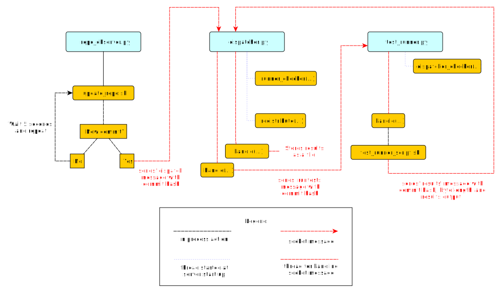

What is a Continuous Integration System?
========================================

When developing software, we want to be able to verify that our new features or bugfixes are safe and work as expected. We do this by running tests against our code. Sometimes, developers will run tests locally to verify that their changes are safe, but developer smay not have the time to test their code on every system their software runs in, and when more and more tests get added, the amount of time to run them locally increases, and it becomes increasingly inefficient. Because of this, continuous integration systems have been created.

Continuous Integration (CI) systems are dedicated systems used to test new code. Upon a commit to the code repository, it is the responsibility of the continuous integration system to verify that this commit will not break any tests. To do this, the system must be able to fetch the new changes, run the tests and report its results. Like any other system, it should also be failure resistant. This means if any part of the system fails, it should be able to recover and continue from that point. This test system should also handle load well, so that we can get test results in a reasonable about of time in the event that commits are being made faster than the tests can be run. We can achieve this by distributing and parallelizing the testing effort. This project will demonstrate a small-scale, distributed continuous integration system. It is a bare-bones system, but is designed for extensibility.

Project Limitations
===================

This project uses Git as the code repository that needs to be tested. Only standard source code management calls will be used, so if you are unfamiliar with Git but are familiar with other version control systems like svn or Mercurial, you can still follow along.

This project also assumes you are using a POSIX system.

Due to the limitations of code length and unittest, I simplified test
discovery. We will *only* run tests that are in a directory named "tests" within
the repository.

Continusous integration systems monitor a master repository which is usually hosted on a webserver, and not local to the CI's filesystems. For the cases of our example, we will use a local repository instead of a remote repository.

Continuous integration systems need not run periodically. You can also have them run every few commits, or per-commit. For our example case, I am simplifying this to just being periodically. This means that if this is set up to check for changes in 5 minute periods, it will run tests against the most recent commit made after the 5 minute period. It won't test every commit made within that period of time, only the most recent one.

This CI system is designed to check periodically for changes in a repository. In real-world CI systems, you can also have the repository observer get notified by a hosted repository. Github, for example, provides 'post-commit hooks' which send out notifications to a URL. Following this model, the repository observer would be called by the webserver hosted at that URL to respond to that notification. Since this is complex to model locally, we're using an observer model, where the repository observer will check for changes instead of being notified.

CI systems also have a reporter aspect to them, where the test runner reports its results to a reporter component that gathers results and makes them available for people to see like on a webpage. For simplicity, this project gathers the test results and stores them as files in the filesystem local to the dispatcher process.

Introduction
============

This basic continuous integration (CI) system has 3 components: a listener or watcher for changes in the repository, a test job dispatcher, and a test runner. The first component is used to observe the repository. When it notices that a commit has been made, then it must notify the job dispatcher. The job dispatcher then finds a test runner and gives it the commit number to test.  In this project, each of these components is its own process, and can be run on separate machines if you wish. In real world systems, they are run in a distributed environment so we can have failover redundancy (ie: we can fallback to a standby machine if one of the machines a process was running on because defunct).

Each of these processes will run locally, and you must kick them off individually. Since the processes need to communicate with each other, the dispatcher and the test runner will run locally listening on distinct local ports.

Files in This Project
---------------------

This project contains python files for each of these components: the repository observer (repo_observer.py), the test job dispatcher (dispatcher.py), and the test runner (test_runner.py). Each of these three processes communicate with each other using sockets, and since the code used to transmit information is shared by all of them, there is a helpers.py file that contains it, so each process imports the 'communicate' function from here instead of having it duplicated in the file.

There are also bash script files used by these processes. These script files are used to execute bash and git commands in an easier way than constantly using python's operating system-level modules like 'os' and 'subprocess'.

Lastly, there is a 'tests' directory, which contains two example tests the CI system will run. One test will pass, and the other will fail.

Initial Setup
--------------

Continuous integration systems run tests whenever a commit is made to a repository. We will need to set up the repository our CI system will monitor.
Let's call this test_repo::

  mkdir test_repo
  git init

This will be our 'master repository'. This is where developers check in their code,
and so our CI should pull this repository and check for commits, then run
tests. The thing that checks for new commits is the repository observer.

The repository observer works by checking commits, so we need at least one commit in
the master repository. Let’s commit our example tests so we have some tests to run.

Copy the tests/ folder from this code base to test_repo and commit it::

  cp -r /this/directory/tests /path/to/test_repo/
  cd /path/to/test_repo
  git add tests/
  git commit -m”add tests”

So now you have a commit in the master repository.

The repo observer will need its own clone of the code, so it can detect when a new commit is made. Let's create a clone of our master repository, and call it test repo_clone_obs::

  git clone /path/to/test_repo test_repo_clone_obs

The test runner will also need its own clone of the code, so it can checkout the repository at a given commit and run the tests. Let's create another clone of our master repository, and call it test_repo_clone_runner::

  git clone /path/to/test_repo test_repo_clone_runner

The Components
==============

The Repository Observer (repo_observer.py)
------------------------------------------

The repository observer must know which repository to observe. To do this, we previously created a clone of our repository at /path/to/test_repo_clone_obs. The repository will use this clone to detect changes. In order for the repository observer to use this clone, when we invoke the repo_observer.py file, we must pass it this path. The repository observer will use this clone to pull from the main repository, and on each commit, will notify the dispatcher.

The repository observer must communicate with the dispatcher, and to do so, it must know its server address and port. When you start the repository observer, you can pass in the dispatcher's server address using the '--dispatcher-server' command line argument. If you do not pass it in, it will assume the default address of 'localhost:8888'. 

Once the repository observer file is invoked, the poll() function is called. This function parses the command line arguments, and then kicks off an infinite while loop. The while loop is used to periodically check the repository for changes. The first thing it does is call the 'update_repo.sh' Bash file. Bash is used because we need to check file existence, create files, and use git, and using a shell script is the most direct and easy way to achieve this. Alternatively, python's 'os' built-in module can be used for using the filesystem and GitPython from PyPI can be used for git access, and these will be operating system independent, but are more roundabout.

The 'update_repo.sh' file is used to identify any new commits and let the repository observer know. It does this by noting what commit hash we are currently aware of, then pulls the repository, and checks the latest commit hash. If they match, no changes are made, so the repository observer doesn't need to do anything, but if there is a difference in the commit hash, then we know a new commit has been made. In this case, 'update_repo.sh' will create a file called .commit_hash with the latest commit hash stored in it.

A step-by-step breakdown of update_repo.sh is as follows. First, the script sources the run_or_fail.sh file, which provides the run_or_fail helper method used by all our shell scripts. This method is used to run the given command, or fail with the given error message. Next, the script tries to remove a file named .commit_hash. Since 'updaterepo.sh' is called infinitely by the repo_observer.py file, if we previously had a new commit, then .commit_hash file was created, but holds a commit we already tested. Threefore we want to remove that file, and create a new one only if a new commit is found. After it removes the file if it existed, it verifies that the repository we are observing exists, and then resets it to the most recent commit, in case anything caused it to get out of sync. It then calls 'git log' and parses the output, looking for the most recent commit hash. Then it pulls the repository, getting any recent changes, then gets the most recent commit hash. Lastly, if the commit hash doesn't match the previous hash, then we know we have new commits to check, so the script stores the latest commit hash in a .commit_hash file.

When 'update_repo.sh' file finishes running in 'repo_observer.py', the repository observer checks for the existence of the .commit_hash file. If it doesn't exist, then the repository observer will sleep for 5 seconds and repeat the process. If the file does exist, then we know we have a new commit, and we need to notify the dispatcher so it can kick off the tests. The repository will try to communicate with the dispatcher server by checking its status first by connecting to it and sending a 'status' request, to make sure there are no problems with the dispatcher server and to make sure it is ready for instruction. If it responds with 'OK', then the repository observer opens the .commit_hash file, reads the latest commit hash and sends that hash to the dispatcher, using a 'dispatch:<commit hash>' request. It will then sleep for 5 seconds and repeat the process.

The repository observer will repeat this process forever, until you kill the process via a KeyboardInterrupt (ctrl+C or cmd+C), or by sending it a kill signal.

The Dispatcher (dispatcher.py)
------------------------------------------

When the dispatcher.py file is invoked, you have the option of passing in a --host or a --port which will let this server listen on a custom address. By default, it will run on localhost, port 8888.

The dispatcher is a separate service used to delegate testing tasks. It listens on a port for requests from test runners and from the repository observer. It allows test runners to register themselves, and when given a commit hash from the repository observer, it will dispatch a test runner against the new commit. It also gracefully handles any problems with the test runners and will redistribute the commit hash to a new test runner if anything goes wrong.

When dispatch.py is executed, the 'serve' function is called. This starts the dispatcher server, and two other threads. One thread runs the 'runner_checker' function, and other thread runs the 'redistribute' function. The 'runner_checker' function is used to periodically ping each registered test runner to make sure they are still responsive. If they become unresponsive, then that runner will be removed from the pool, and its commit hash will be dispatched to the next available runner. It will log the commit hash in the 'pending_commits' variable. The 'redistribute' function is used to dispatch any of those commit hashes logged in 'pending commits'. When 'redistribute' runs, it checks if there are any commit hashes in 'pending_commits'. If so, it calls the 'dispatch_tests' function with the commit hash. The 'dispatch_tests' function is used to find an available test runner from the pool of registered runners. If one is available, it will send a 'runtest' message to it with the commit hash. If none are currently available, it will wait 2 seconds and repeat this process. Once dispatched, it logs which commit hash is being tested by which test runner in the 'dispatched_commits' variable. If this commit hash is in the 'pending_commits' variable, then it will remove it from this list, since it was successfully re-dispatched.

The dispatcher server uses the SocketServer module. The default TCPServer provided by SocketServer cannot handle the case where the dispatcher is talking to one connection, say from a test runner, and then a new connection comes in, say from the repository observer. If this happens, the reponsitory observer will have to wait for the first connection to complete before it will be serviced. This is not ideal for our case, since the dispatcher server must be able to directly and swiftly communicate with all test runners and the repository observer.

In order for the dispatcher server to handle simultaneous connections, it uses the ThreadingTCPServer custom class, which adds threading ability to the default SocketServer. This means that anytime the dispatcher receives a connection request, it spins off a new thread just for that connection. This allows the dispatcher to handle multiple requests at the same time.

The dispatcher server works by defining handlers for each request. This is defined by the DispatcherHandler class, which inherits from SocketServer's BaseRequestHandler. This base class just needs us to define the 'handle' function, which will be invoked whenever a connection is requested. The 'handle' function defined in DispatcherHandler is our custom handler, and it will be called on each connection. It looks at the incoming connection request (self.request holds the request information), and parses out what command is being requested of it. It handles four commands: 'status', 'register', 'dispatch', and 'results':

- 'status' is used to check if the dispatcher server is up and running.

- 'register' is used by a test runner to register itself with the dispatcher. The format of this command is register:<host>:<port>. The dispatcher then records the test runner's address so it can communicate with it later when it needs to give it a commit hash to run tests against.

- 'dispatch' is used by the repository observer to dispatch a test runner against a commit. The format of this command is dispatch:<commit hash>. The dispatcher parses out the commit hash from this message and sends it to the test runner. 

- 'results' is used by a test runner when it has finished a test run and needs to report its results. The format of this command is results:<commit hash>:<length of results data in bytes>:<results>. The <commit hash> is used to identify which commit hash the tests were run against. The <length of results data in bytes> is used to figure out how big a buffer is needed to read the results data into. Lastly, <results> holds the actual result output.

In order for the dispatcher to do anything useful, it needs to have at least one test runner registered. When 'register' is called, it stores the runner's information in a list (the 'runners' object attached to the ThreadingTCPServer object).

When 'dispatch' is called, if the dispatcher has test runners registered with it, it will send back an 'OK' response, and will call the 'dispatch_tests' function. 

When 'results' is called, the dispatcher parses out the commit hash and the test results from the message, and stores the test results in a file within the 'test_results' folder, using the commit hash as the filename.

The Test Runner (test_runner.py)
------------------------------------------
The test runner is responsible for running tests against a given commit hash and reporting back the results. When invoking the test_runner.py file, you must point it to a clone of the repository, so it may use this clone to run tests against. In this case, you can use the previously created "/path/to/test_repo test_repo_clone_runner" clone as the argument. By default, the test_runner.py file will start its own server on localhost using a port between the range 8900-9000, and will try to connect to the dispatcher server at localhost:8888. You may pass it optional arguments to change these values. The '--host' and '--port' arguments are to designate a specific address to run the test runner server on, and the '--dispatcher-server' argument will have it connect to a different address than localhost:8888 to communicate with the dispatcher.

When the test_runner.py file is invoked, it calls the 'serve' function, which will start the test runner server and will also start a thread to run the 'dispatcher_checker' function. The 'dispatcher_checker' function pings the dispatcher server every 5 seconds to make sure it is accessible. If the dispatcher server becomes unresponsive, the test runner will shut down since it won't be able to do any meaningful work if there is no dispatcher to give it work or to report to.

The test runner server is a ThreadingTCPServer, like the dispatcher server. It requires threading because the dispatcher will be pinging it periodically to verify that the runner is still up while it is running tests. Instead of this design, it is possible to have the dispatcher server hold onto a connection with each test runner, but this would increase the dispatcher server's memory needs, and is vulnerable to network problems, like accidentally dropped connections. The test runner server responds to two messages:

- 'ping', which is used by the dispatcher server to verify that the runner is still active
- 'runtest', which accepts messages of the form 'runtest:<commit hash>', and is used to kick off tests on the given commit

When 'runtest' is called, the test runner will check to see if it is already running a test, and if so, it will return a 'BUSY' response to the dispatcher. If it is available, it will respond to the server with an 'OK' message, set its status as busy and will run its 'run_tests' function. This function calls the shell script 'test_runner_script.sh' which is used to update the repository to the given commit hash. Once the script returns, if it was successful at updating the repository, we run the tests using unittest, and gather the results in a file. When the tests are done running, the test runner reads in the results file and sends it in a 'results' message to the dispatcher. As soon as the 'run_tests' function is complete, the test runner will mark itself as no longer busy, so it can take on new test jobs.

Control Flow Diagram
--------------------

This is an overview diagram of this system. This diagram assumes that all three files (repo_observer.py, dispatcher.py and test_runner.py) are already running, and describes the actions each process takes when a new commit is made.

Points of Extensibility
=======================

The following are just a few suggestions on how you can improve this current system.

Smarter Test Runners
--------------------

If the test runner detects that the dispatcher is unresponsive, it stops running. This includes the case where the test runner was in the middle of running tests! It would be better if the test runner waits for a period of time (or indefinitely if you do not care for resource management) for the dispatcher to come back online. In this case, if the dispatcher goes down while the test runner is actively running a test, instead of shutting down, it will complete the test and wait for the dispatcher to come back online, and will report the results to it. This will ensure that we don't waste any effort the test runner makes, and ensures we will only run tests once per commit.

Real Reporting
--------------

In a real CI system, you would have the test results report to a reporter service, something that would gather the results, post them somewhere for people to review, and would notify a list of interested parties when a failure or other notable event occurs. You can extend this current simple CI system by creating a new process to get the reported results in lieu of the dispatcher gathering the results. This new process could be a webserver (or can connect to a webserver) which could post the results online for others to view, and may use a mail server to alert subscribers to any test failures.

Test Runner Manager
-------------------

Right now, you have to manually kick off the test_runner.py file to start a test runner. You can instead create a test runner manager process which will assess the current load of test requests from the dispatcher, and will scale the number of active test runners. This process will receive the 'runtest' messages and will start a test runner process for each request, and will kill unused processes when the load decreases.

