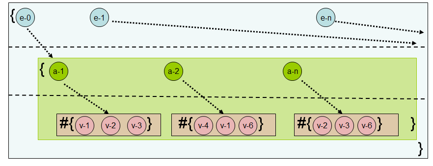
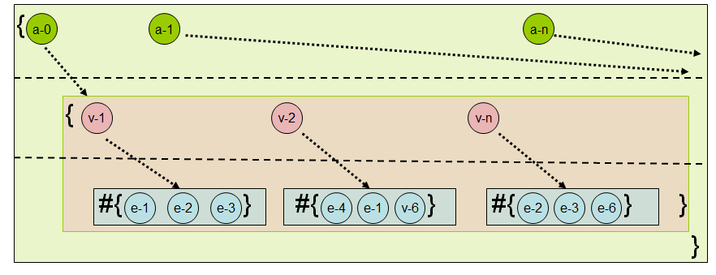

#Designing a database like an archaeologist

Software development is often viewed as a rigorous process, where the inputs are requirements and the output is the working product. However, software developers are people with their own perspectives and biases, which colors the outcome of their work. 

In this chapter, we will  explore how a change in a common perspective affects  the design and implementation of a well-studied type of software - - a database.

## Introduction 

Database systems are designed to store and query data. This is something that all information workers do; however, the systems themselves were  designed by computer scientists. As a result, modern database systems are highly influenced by what a computer scientist’s definition of data is, and what can be done with it. 

For example, most modern databases implement updates by overwriting old data with the new data instead of appending the new data and keeping the old. This mechanism, nicknamed "place oriented programming" by Rich Hickey [REF], saves storage space but makes it impossible to retrieve the entire history of a particular record.

 

The "overwrite-old-data" design decision reflects the computer scientist’s perspective that ‘history’ is less important than the price of its storage. 

If you were to ask an archaeologist's opinion regarding on how to handle this situation, and what they would expect to happen to old data when new data comes in, their answer would be "hopefully, it’s just buried underneath".

 (Disclaimer: my understanding of a typical archaeologist is based on a few visits to museums, reading several wikipedia articles and watching the entire Indiana Jones series).

### From Archaeology to databases

If you were to ask an archaeologist to design a database, what would the requirements look like? its a fair guess to assume that it would look a lot like an *excavation site:*

* All the data is found and cataloged at the site
* Artefacts found at the same layer are from the same period
* Going deeper means going back in time
* Going deeper in a specific place mean looking at the state of that place at older times

* Each artefact may have pieces of information attached, these pieces of information may originate from different periods.
	* For example, a wall may have roman symbols drawn on it at on one layer, and in a lower layer there may be greek symbols. Both these observations are recorded

Another way to explain this way of thinking is using the exemplary schematic visualization in  Figure 1, where:

* The entire circle is the excavation site
* Each ring is a layer (here numbered from 0 to 4) 
* Each slice is an artefect (entity Ids are ‘a’ through ‘e’
* Each artefect has a ‘color’ attribute (white means no update was made)
* Black arrows point from an attributed updated value to the attribute previous value (e.g., from c.color @t2 to c.color @t0)
* Light blue arrows are arbitrary relationships between entities (e.g., from ‘b’ to ‘d’

 

Figure 1

When translating the archaeology terms to CS language, we'd get that:
* An excavation site is a database
* An artefact is an entity
* Each entity may have several attributes
	* The set of attributes may change throughout time
* Each attribute, at a given time, has a specific value
	* The value may change throughout time

This may look very different than the kinds of databases you are used to working with. This design is sometimes referred to as "functional database", since it uses ideas from the domain of functional programming. The rest of the chapter describes how to implement such a database.

### A meta discussion detour

This project uses the Clojure programming language [ref w more details from below]. 

There are several qualities of Clojure that make it a good implementation language for a functional database, such as out-of-the-box immutability, higher order functions, and metaprogramming facilities. Ultimately, the reason Clojure was chosen is its emphasis on clean, rigorous design which few programming languages possess. 

## The building blocks

Let’s start by declaring the core constructs that make up our database. 

Defining each of these is done follows:

````clojure
(defrecord Database [layers top-id curr-time])
`````

A database consists of:

1. Layers of entities, each with its own unique timestamp (rings in Figure 1)
2. A top-id value which is used to generate unique ids
3. The time at which this database was last updated


````clojure
(defrecord Layer [storage VAET AVET VEAT EAVT])
````
Each layer consists of: 

1. Data store for its entities

2. Indices, which are used to quickly locate elements in the database. These indices and the meaning of their names is explained later in the chapter.

In our design, a single conceptual ‘database’ may consist of many *Database* instances, each of which represents a snapshot of the database at *curr-time*. A *Layer* may share the exact same entity with another *Layer* if the entity’s state hasn’t changed between the times they represent.

### Entities

Next, we define each of our records to be an *Entity*, which can be thought of as a row in a table (or a slice in Figure 1). An entity has an *id* and a list of *attributes*, it is defined by the *Entity* record and created using the *make-entity* function.

````clojure
(defrecord Entity [id attrs])

(defn make-entity
   ([] (make-entity :db/no-id-yet))
   ([id] (Entity.  id {})))
````
Note that if no id is given, the entity’s id is set to be *:db/no-id-yet*, which means that something else is responsible for assigning an id. We’ll see how that works later.

**Attributes**

An entity is built from attributes, where each has these fields: name, value, recent update timestamp and previous update timestamp. An attribute is defined by the *Attr* record.

In addition to these fields, each attribute keeps two metadata fields,to describe its  *type* and *cardinality*. 

The main usage of the *type* metadata is in the cases where an attribute acts as a reference to another entity. In that case, the *type* of the attribute is *:db/ref* and the value of the attribute is the referred entity id. Other than that, users are free to define their own types and leverage them to provide additional semantics for their data.

The *cardinality* metadata specifies whether the attribute represents single value or a set of values. Cardinality determines what operations the database will permit on this attribute.

Creating an attribute is done using the *make-attr* function 

````clojure
(defrecord Attr [name value ts prev-ts])

(defn make-attr
   ([name value type ; these ones are required
       & {:keys [cardinality] :or {cardinality :db/single}} ]
     {:pre [(contains? #{:db/single :db/multiple} cardinality)]}
    (with-meta (Attr. name value -1 -1) {:type type :cardinality cardinality})))
````
Few things to note about how the *make-attr* function handles the cardinality of an attribute:

* taking advantage of Clojure’s Design by Contract [ADD REF HERE] capabilities and sets preconditions to validate that the cardinality parameter is either *:db/single* or *:db/multiple* 
* leveraging Clojure’s descruturing mechanism to provide default value (which is *:db/single*)  

The creation interplay between an entity and its attributes is finalized once an attribute is added to an entity, using the *add-attr* function. This function adds the given attribute to a map that holds the attributes within an entity. That map, called :attrs, maps the attribute’s name to the attribute itself - thus allowing fast lookup of an attribute within an entity. Note that instead of using directly the attribute’s name, we first convert it into a keyword, to adhere to Clojure’s idiomatic usage of maps.

````clojure
(defn add-attr [ent attr]
   (let [attr-id (keyword (:name attr))]
      (assoc-in ent [:attrs attr-id] attr)))
```
### Storage

A crucial feature of a database is storing data. In this chapter, we resort to the simplest storage mechanism which is holding the data in memory. This is not a real storage, certainly not reliable and real databases use far better storage mechanisms, such as holding the data in local disks to cloud-based storage. Still, in order to have a sense of proper software and not an ad-hoc program, our database access the storage via predefined set of APIs, and thus eliminating the dependency on any specific storage mechanism.

The APIs for accessing the storage are defined in the *Storage* protocol, and include functions for:

* Reading an entity from the storage
* Writing an entity to the storage
* dropping an entity from the storage

````clojure
(defprotocol Storage
   (get-entity [storage e-id] )
   (write-entity [storage entity])
   (drop-entity [storage entity]))
````
In our database, as mentioned above, we’ll hold the data in memory, and use the following *InMemory* implementation of the *Storage* protocol:

````clojure
(defrecord InMemory [] Storage
   (get-entity [storage e-id] (e-id storage))
   (write-entity [storage entity] (assoc storage (:id entity) entity))
   (drop-entity [storage entity] (dissoc storage (:id entity))))
````
### Indices

After describing how data is represented and stored, we move on to discuss the system that manages the data - the database. To do so, we need to understand that above all, a database’s *raison d'être* is to leverage data. This means that on top of acting as a storage mechanism, a database must allow users to ask predefined questions as well as design and execute queries on their data, all this while still providing performance guarantees. 

The enabler of this performance requirement is the usage of an indexing system, and this is the focus of the next section.

#### The index structure

In our database, an index is a three leveled structure where each item in the top level points to a set of items in the second level, and each item in the second level points to a set of items in the third level. 

This is implemented as a map of maps, where the keys of the root map act as the first level, each such key points to a map whose keys act as the index’s second-level and the values are the index’s third level. Each element in the third level is a set, holding the leafs of the index (see Figure 2 and 3).

This structure gains the semantics of an index by having in each level a specific kind of item: either an entity-id, an attribute-name or an attribute value.

When we index a datom (a triplet of entity-id, attribute-name and value) we place each of the datom’s components in a specific level in the index structure. An index’s usage is derived from what kind of elements reside in which level. On top of that, and in order to reduce the mental burden inflicted by using the index, we also derive the index’s name from the order in which a datom components are distributed to levels.

For example, let’s look at at the index sketched in Figure 2. In that index, the first level map holds entity-ids (the blue-ish area) that are mapped the second level maps. These hold attribute-names (attributes of the entity at the first level). In that second level map (the green-ish area), each key (an attribute-name) is mapped to the value held by that attribute (the pink-ish area). 

This index is named EAVT, as the top level map holds (E) entity ids, the second level holds (A) attribute names, and the leaves hold (V) values. The (T) comes from the fact that each layer in the database has its own indices, hence the index itself is relevant for a specific (T) time. 



Figure 2

Figure 3 shows an index that would be called AVET since:

* First level map holds attribute-name
* Second level map holds the values (of the attributes)
* Third level set holds the entity-ids (of the entities whose attribute is at the first level) 



Figure 3

Note that a more correct naming of the indices would be TEAV and TAVE , but smurf-naming-convention (http://blog.codinghorror.com/new-programming-jargon/) should be avoided.

#### Index metadata

On top of having information about the data found in the database, an index should be accompanied with some metadata of its own, to allow proper management and usage of the index itself. 

This additional information is held as as a metadata of the index, using Clojure’s metadata handling functions (i.e., *meta* and *with-meta*) and two utility functions. 

There are two main aspects of index handling that are used:

* Structure: The structure of a datom is entity ⇒ attribute ⇒ value (called an ‘eav’ structure). However, an index may be structured differently (each index with its own specific structure). To allow transition between the two different structures (natural and index specific), each index holds two functions, one for each specific transition:

    * from the natural structure to the index specific, called *from-eav*, 
    * from the index specific to the natural structure called *to-eav*. 

These functions are read from the index using the utility functions *from-eav* and *to-eav*, both receive an index as an argument.

* What to index: index maintenance has its costs, therefore, when defining an index, the user also provides a predicate that receives an attribute and decides whether that attribute should be indexed by the defined index. This predicate is read from an index using the *usage-pred* function that receives the relevant index as an argument.  

````clojure
(defn make-index [from-eav to-eav usage-pred]
    (with-meta {} {:from-eav from-eav :to-eav to-eav :usage-pred usage-pred}))
 
 (defn from-eav [index] (:from-eav (meta index)))
 (defn to-eav [index] (:to-eav (meta index)))
 (defn usage-pred [index] (:usage-pred (meta index)))
````
In our database there are four indices - EAVT (as depicted in Figure 2), AVET (as can be seen in Figure 3), VEAT and VAET, these names are held as a vector of values returned from the *indices* function.

````clojure
(defn indices[] [:VAET :AVET :VEAT :EAVT])
````
For example, the result of indexing the following five entities can be seen in the table below (the color coding follows the color coding of Figure 2 and Figure 3)

1. <span style="background-color:lightblue">Julius Caesar</span> (also known as JC) <span style="background-color:lightgreen">lives in</span> <span style="background-color:pink">Rome</span> 
2. <span style="background-color:lightblue">Brutus</span> (also known as B) <span style="background-color:lightgreen">lives in</span> <span style="background-color:pink">Rome</span> 
3. <span style="background-color:lightblue">Cleopatra</span> (also known as Cleo) <span style="background-color:lightgreen">lives in</span> <span style="background-color:pink">Egypt</span>
4. <span style="background-color:lightblue">Rome</span>’s <span style="background-color:lightgreen">river</span> is the <span style="background-color:pink">Tiber</span>
5. <span style="background-color:lightblue">Egypt</span>’s <span style="background-color:lightgreen">river</span> is the <span style="background-color:pink">Nile</span>
 
<table>
  <tr>
    <td>EAVT index</td>
    <td>AVET index</td>
  </tr>
  <tr>
    <td><ul>
<li>
<span style="background-color:lightblue">JC</span> ⇒ {<span style="background-color:lightgreen">lives-in</span> ⇒ {<span style="background-color:pink">Rome</span>}}
</li>
<li>
<span style="background-color:lightblue">B</span>  ⇒ {<span style="background-color:lightgreen">lives-in</span> ⇒ {<span style="background-color:pink">Rome</span>}}
</li>
<li>
<span style="background-color:lightblue">Cleo</span> ⇒ {<span style="background-color:lightgreen">lives-in</span> ⇒ {<span style="background-color:pink">Egypt</span>}}
</li>
<li>
<span style="background-color:lightblue">Rome</span> ⇒ {<span style="background-color:lightgreen">river</span> ⇒ {<span style="background-color:pink">Tiber</span>}}
</li>
<li>
<span style="background-color:lightblue">Egypt</span> ⇒ {<span style="background-color:lightgreen">river</span> ⇒ {<span style="background-color:pink">Nile</span>}}
</li>
</ul></td>
<td><ul>
<li>
<span style="background-color:lightgreen">lives-in</span> ⇒ {<span style="background-color:pink">Rome</span> ⇒ {<span style="background-color:lightblue">JC, B</span>}}</br>
                         {<span style="background-color:pink">Egypt</span> ⇒ {<span style="background-color:lightblue">Cleo</span>}}
</li>
<li>
<span style="background-color:lightgreen">river</span> ⇒ {<span style="background-color:pink">Rome</span> ⇒ {<span style="background-color:lightblue">Tiber</span>}}</br>
{<span style="background-color:pink">Egypt</span> ⇒ {<span style="background-color:lightblue">Nile</span>}}
</li>
</ul></td>
  </tr>
  <tr>
    <td>VEAT index</td>
    <td>VAET index</td>
  </tr>
  <tr>
    <td><ul>
<li>
<span style="background-color:pink">Rome</span> ⇒ {<span style="background-color:lightblue">JC</span> ⇒ {<span style="background-color:lightgreen">lives-in</span>}}<br/>
{<span style="background-color:lightblue">B</span> ⇒ {<span style="background-color:lightgreen">lives-in</span>}}
</li>
<li>
<span style="background-color:pink">Egypt</span> ⇒ {<span style="background-color:lightblue">Cleo</span> ⇒ {<span style="background-color:lightgreen">lives-in</span>}}
</li>
<li>
<span style="background-color:pink">Tiber</span> ⇒ {<span style="background-color:lightblue">Rome</span> ⇒ {<span style="background-color:lightgreen">river</span>}}
</li>
<li>
<span style="background-color:pink">Nile</span> ⇒ {<span style="background-color:lightblue">Egypt</span> ⇒ {<span style="background-color:lightgreen">river</span>}}
</li></ul></td>
<td><ul>
<li>
<span style="background-color:pink">Rome</span> ⇒ {<span style="background-color:lightgreen">lives-in</span> ⇒ {<span style="background-color:lightblue">JC, B</span>}}
</li>
<li>
<span style="background-color:pink">Egypt</span> ⇒ {<span style="background-color:lightgreen">lives-in</span> ⇒ {<span style="background-color:lightblue">Cleo</span>}}</li>
<li>
<span style="background-color:pink">Tiber</span> ⇒ {<span style="background-color:lightgreen">river</span> ⇒ {<span style="background-color:lightblue">Rome</span>}}
</li>
<li>
<span style="background-color:pink">Nile</span> ⇒ {<span style="background-color:lightgreen">river</span> ⇒ {<span style="background-color:lightblue">Egypt</span>}}
</li></ul></td>
  </tr>
</table>
Table 2

### Database

The last structural building block that we need to understand is the place where all previously discussed elements come together -  the database itself. 

Constructing a database means to creating an initial empty layer with no data and a set of empty indices. as well as set its top-id to be 0 and its curr-time to be 0, as can be seen in the *make-db* function. 

In Clojure, all the collections are immutable, thus this structure has a crucial downside from a databasing point of view, which is its lack of ability to perform write operations. To have this capability we wrap this structure with an **atom**, which is one of Clojure’s reference types and provides atomic writes to the element it wraps.

````clojure
(defn ref? [attr] (= :db/ref (:type (meta attr))))

(defn always[& more] true)

(defn make-db []
   (atom 
       (Database. [(Layer.
                   (fdb.storage.InMemory.) ; storage
                   (make-index #(vector %3 %2 %1) #(vector %3 %2 %1) #(ref? %)); VAET                     
                   (make-index #(vector %2 %3 %1) #(vector %3 %1 %2) always); AVET                        
                   (make-index #(vector %3 %1 %2) #(vector %2 %3 %1) always); VEAT                       
                   (make-index #(vector %1 %2 %3) #(vector %1 %2 %3) always); EAVT
                  )] 0 0)))
````
Note that we use the *always* function for the AVET, VEAT and EAVT indices, and the *ref?* predicate for the VAET index. This is a result of the different usage scenario of the indices. We’ll explore this issue later when discussing the various querying operations of the database.

### Basic reads

The description of the database’s building blocks will not be complete without understanding how to get to the data elements found within the database. By "data elements" we mean either an entity, an entity’s attribute and an entity’s attribute’s value, as well as getting to a specific index. In order to “get to” an element, we need to provide the element’s identifier, as well as to specify from which time (or the layer) we want to fetch that information. 

The following functions do exactly that, and share some commonalities between them:

* Take the database as an argument: this is the manifestation of treating the database as a value - the ability to send it to a function and still rely on the results to be consistent.

* Take a set of arguments that identify an element: 
    * Entity is identified by an entity-id
    * Attribute is identified by the combination of an entity-id and attribute-name
    * Index is identified by its name

* Take an optional timestamp value to know from which time to fetched the needed element. This is an optional argument as it defaults to the current time. 

The functions *entity-at* and *ind-at* find the right layer and within it find the needed element (*entity-at* looks at the storage, *ind-at* goes directly to the right index). The function *attr-at* first calls *entity-at* and then reads the attribute from the entity and *value-of-at* calls *attr-at* and then reads the value from the attribute.

It is worth mentioning that while *entity-at*, *attr-at*, *value-of-at* and *ind-at* have a similar structure, and therefore are explained in this section, *ind-at* is to be used only by the database and not by the database users.

````clojure
(defn entity-at
   ([db ent-id] (entity-at db (:curr-time db) ent-id))
   ([db ts ent-id] (stored-entity (get-in db [:layers ts :storage]) ent-id)))

(defn attr-at
   ([db ent-id attr-name] (attr-at db ent-id attr-name (:curr-time db)))
   ([db ent-id attr-name ts] (get-in (entity-at db ts ent-id) [:attrs attr-name])))

(defn value-of-at
   ([db ent-id attr-name]  (:value (attr-at db ent-id attr-name)))
   ([db ent-id attr-name ts] (:value (attr-at db ent-id attr-name ts))))

(defn ind-at
   ([db kind] (ind-at db kind (:curr-time db)))
   ([db kind ts] (kind ((:layers db) ts))))
````
## Data behavior and life cycle

So far, our discussion focused on the static aspects of the database - its core constructs and the aggregation of them to a larger structure. It is time now to explore the dynamics of the database - how it is changed throughout time and how the data lifecycle (add => update => remove)  is reflected in it. 

In that regards, and as any archaeologist knows, a piece of data doesn’t actually have a real lifecycle. Once it is created, it exists forever and can only be hidden from the world by a new piece of data in a newer layer. Note for the term ‘hidden’, as it is crucial here. The piece of data has not disappeared and it is not gone, it can be revealed again when the layer it is part of gets exposed. Basically, updating data means adding a layer on top of it with something, and removing data is adding a layer on top of it with nothing. 

This means that when talking about data lifecycle, we really talk about the ongoing changes of the data, as it is exposed in different layers. 

If we go back to our schematic visualization of the database in Figure 1, data lifecycle is simply the way a slice changes by along its layers. 

### The bare necessities

To implement the defined data lifecycle, all we needed to do was to implement three functionalities: 

* adding an entity - an operation that starts with the *add-entity* function
* removing an entity - an operation that start with the *remove-entity* function
* updating an entity - an operation that starts with the *update-datom* function. This function is named that way as the update operation is done on a datom (the value of an attribute in an entity) and it is not an entire entity update.

Each of these functionalities, when executed, adds another layer to the database.

#### Adding an entity

The driving force of the entity adding process is the *add-entity* function. It  is responsible to do three things - prepare the entity for addition to the database, add it to the storage and update the indices with the relevant information from the entity.

Preparing an entity means providing it with an id (if it doesn’t have) and setting its timestamp field, these actions take place in the function *fix-new-entity* and it’s auxiliary functions *next-id*, *next-ts* and *update-creation-ts*. These helper functions are responsible for finding the next timestamp of the database and update the creation timestamp of a given entity (which is actually the timestamp field of each of the entity’s attributes), as well as find whether an entity needs to be assigned with an id field, if so set its id and prevent future use of that id.

````clojure
(defn- next-ts [db] (inc (:curr-time db)))

(defn- update-creation-ts [ent ts-val]
   (reduce #(assoc-in %1 [:attrs %2 :ts ] ts-val) ent (keys (:attrs ent))))

(defn- next-id [db ent]
   (let [top-id (:top-id db)
         ent-id (:id ent)
         increased-id (inc top-id)]
         (if (= ent-id :db/no-id-yet)
             [(keyword (str increased-id)) increased-id]
             [ent-id top-id])))

(defn- fix-new-entity [db ent]
   (let [[ent-id next-top-id] (next-id db ent)
         new-ts               (next-ts db)]
       [(update-creation-ts (assoc ent :id ent-id) new-ts) next-top-id]))
````
Adding the entity to the storage is simply a matter of locating the last layer in the database, and updating the storage found in that layer to create a new, updated layer.

Last but not least phase in adding an entity to the database is updating the indices. This means that:

1. For each of the indices (done by the combination of *reduce* and the *partial*-ed *add-entity-to-index* at the *add-entity* function)
2. Find the attributes that should be indexed (see the combination of *filter* with the index’s *usage-pred* that operates on the attributes in *add-entity-to-index*) 
3. build an index-path from the the entity’s id (see the combination of the *partial*-ed *update-entry-in-index* with *from-eav* at the *update-attr-in-index* function)
4. Add that path to the index (see the *update-entry-in-index* function)

````clojure
(defn- add-entity-to-index [ent layer ind-name]
   (let [ent-id (:id ent)
         index (ind-name layer)
         all-attrs  (vals (:attrs ent))
         relevant-attrs (filter #((usage-pred index) %) all-attrs)
         add-in-index-fn (fn [ind attr] 
                                 (update-attr-in-index ind ent-id (:name attr) (:value attr) :db/add))]
        (assoc layer ind-name  (reduce add-in-index-fn index relevant-attrs))))

(defn- update-attr-in-index [index ent-id attr-name target-val operation]
   (let [colled-target-val (collify target-val)
         update-entry-fn (fn [indx vl] 
                                 (update-entry-in-index indx ((from-eav index) ent-id attr-name vl) operation))]
     (reduce update-entry-fn index colled-target-val)))
     
(defn- update-entry-in-index [index path operation]
   (let [update-path (butlast path)
         update-value (last path)
         to-be-updated-set (get-in index update-path #{})]
     (assoc-in index update-path (conj to-be-updated-set update-value))))
````
All that work is now added as a new layer to the database that we started with, and all that’s left is to update the database’s timestamp and top-id field to prepare ourselves for future interactions. That last step is done at the last line of the function *add-entity*

````clojure
(defn add-entity [db ent]
   (let [[fixed-ent next-top-id] (fix-new-entity db ent)
         new-layer (update-in 
                            (last (:layers db)) [:storage] write-entity fixed-ent)
         add-fn (partial add-entity-to-index fixed-ent)
         new-layer (reduce add-fn new-layer  (indices))]
    (assoc db :layers (conj (:layers db) new-layer) :top-id next-top-id)))
````
Note that it is possible to add several entities in one function call, simply by calling the *add-entities* functions, that all it does is going over the given collection of entities and add them one by one to the database.

````clojure
(defn add-entities [db ents-seq] (reduce add-entity db ents-seq))
````
#### Removing an entity

When an entity is removed from the database, it means that a new layer is constructed, one that does not have any trace of that entity. 

When removing an entity’s trace, we do not need only to remove the entity, but also affect other entities that refer to it, as well as clear that referencing from the indexing system.

This entire cleanup process (or more correctly - a "construct without" process) is managed by the *remove-entity* function. In order not to tire the reader, we’ll skip the part where the entity itself is removed (this part is quite similar to the addition process described before), and we’ll focus on the reference removal part.

````clojure
(defn remove-entity [db ent-id]
   (let [ent (entity-at db ent-id)
         layer (remove-back-refs db ent-id (last (:layers db)))
         no-ref-layer (update-in layer [:VAET] dissoc ent-id)
         no-ent-layer (assoc no-ref-layer :storage 
                                   (drop-entity  
                                          (:storage no-ref-layer) ent))
         new-layer (reduce (partial remove-entity-from-index ent) 
                                 no-ent-layer (indices))]
     (assoc db :layers (conj  (:layers db) new-layer))))
````
The reference removal part is handled in the *remove-back-refs* function.

````clojure
(defn- remove-back-refs [db e-id layer]
   (let [refing-datoms (reffing-datoms-to e-id layer)
         remove-fn (fn[d [e a v]] (update-datom db e a v :db/remove))
         clean-db (reduce remove-fn db refing-datoms)]
     (last (:layers clean-db))))
````
It starts by locating the entities that refer to the removed entity, by calling *reffing-datoms-to* that returns a sequence of triplets, each containing the id of the referencing entity, the attribute name and the id of the removed entity.

````clojure
(defn- reffing-datoms-to [e-id layer]
   (let [vaet (:VAET layer)]
         (for [[attr-name reffing-set] (e-id vaet)
               reffing reffing-set]
              [reffing attr-name e-id])))
````
 When the *remove-back-refs* function gets the triplets sequence, it just calls the *update-datom* function (which will be explain in the next part) to update the referencing entity to not hold the id of the removed entity (at the found attribute).

The reference removal process ends with clearing-up the removed entity’s id from the VAET index (the index that holds the references) at the *remove-entity* function.

#### Updating an entity

At its essence, an update is the modification of an entity’s attribute’s value. The modification itself depends on the cardinality of the attribute: an attribute whose cardinality is *:db/multiple* (meaning that the attribute holds a set of values) allows adding or removing items to/from it, or replacing the entire set with a new set. An attribute whose cardinality is *:db/single* (meaning that the attribute holds a single value) allows only to replace the value by another one.  

Any modification of a value also needs to ripple throughout the database by modifying the various indices to reflect the change that occurred. 

At this point It is important to keep in mind that the meaning of modifying here is not overwriting, but rather adding an additional layer that holds the updated database state. That updated attribute’s value in the new layer should point to the pre-update value, so we could track the changes in an entity throughout time.

The update process is done at the function *update-datom*. It creates the new attribute and updates the relevant indices and ends with the creation of a new layer.

````clojure
(defn update-datom
   ([db ent-id attr-name new-val]
    (update-datom db ent-id attr-name new-val :db/reset-to ))
   ([db ent-id attr-name  new-val operation]
      (let [update-ts (next-ts db)
            layer (last (:layers db))
            attr (attr-at db ent-id attr-name)
            updated-attr (update-attr attr new-val update-ts operation)
            fully-updated-layer (update-layer layer ent-id attr 
                                                          updated-attr new-val operation)]
        (update-in db [:layers] conj fully-updated-layer))))
````
To update an attribute we first need to locate that attribute (using the call to *attr-at*), then send it to the function *update-attr* alongside all the information needed to make the update. 

````clojure
(defn- update-attr [attr new-val new-ts operation]
    {:pre  [(if (single? attr)
            (contains? #{:db/reset-to :db/remove} operation)
            (contains? #{:db/reset-to :db/add :db/remove} operation))]}
    (-> attr
       (update-attr-modification-time new-ts)
       (update-attr-value new-val operation)))
````
The update itself has two parts:

* Update the attribute’s modification time (to allow following changes in the attribute throughout time)  by "pushing" the recent modification timestamp to be at the previous modification timestamp and setting the recent modification timestamp to be now (seen at the *update-attr-modification-time* function). This is basically the creation of the black arrows in Figure 1

````clojure
(defn- update-attr-modification-time  
  [attr new-ts]
       (assoc attr :ts new-ts :prev-ts (:ts attr)))
````

* Performing the value change as requested by the user and supported by the attribute’s cardinality. This can be seen at the *update-attr-value* function.

````clojure
(defn- update-attr-value [attr value operation]
   (cond
      (single? attr)    (assoc attr :value #{value})
    ; now we're talking about an attribute of multiple values
      (= :db/reset-to operation)  (assoc attr :value value)
      (= :db/add operation) (assoc attr :value (CS/union (:value attr) value))
      (= :db/remove operation) (assoc attr :value (CS/difference (:value attr) value))))
````
Once we have the updated attribute, all that is left is to remove the old value from the indices and add the new one to them, and then construct the new layer with the updated indices and storage. These two last steps are  just like is done when removing or adding an entity to the database.

### Transacting

All the operations described before (add / remove / edit) do a single operation on a single entity. The return value from them is the database as it was before the operation  topped with an additional layer. Yet, a key requirement of any database is the ability to perform a transaction that includes several operations, possibly on several elements, while:

* Viewed from the outside as a single (i.e., atomic) operation, meaning either all operations succeed or all operations fails
* Keep the database in a valid state at any given time 
* Keep the update operations isolated from the outside at any point in time until they are completed. 

The way to answer these requirements is by using a mechanism that takes as an input input the database and a set of operations to be performed, and produces as an output a database whose state reflects the given changes. More than that, all the changes should be seen as an addition of a single layer. 

Performing a transactional operation is done in Clojure using the *Atom* element (this is why we wrap a database with such an element). This element allow us to invoke a single function on it, and all changes to it happen in an atomic and isolated manner. 

As for the function that is to be executed, this function needs to perform all the operations that the user requested, while eventually adding one layer to the database.  To do so we would need to overcome the fact that each of the lifecycle functions adds a layer reflecting the change it inflicts. 

Here we resort to the insight that changes on different attributes (that can be part of either the same or different entities) accumulate when stacking layers, thus a top layer holds all the changes that built the layers below it. Therefore, the solution is to execute each of the user’s operations one after another, each creating a new layer. While doing so, we do not update the databases’s timestamp field. When the last layer is completed, we take only that top layer and place it on the initial database  (leaving all the intermediate layers to pine for the fjords) and only then update the database’s timestamp. All this is happening in the *transact-on-db* function

````clojure
(defn transact-on-db [initial-db txs]
     (loop [[tx & rst-tx] txs transacted initial-db]
       (if tx
           (recur rst-tx (apply (first tx) transacted (rest tx)))
           (let [initial-layer  (:layers initial-db)
                 new-layer (last (:layers transacted))]
             (assoc initial-db 
                         :layers (conj  initial-layer new-layer) 
                         :curr-time (next-ts initial-db) 
                         :top-id (:top-id transacted))))))
```` 
This function is performed on the Atom that wraps the database (to modify the database state as seen by the user), but it can be used also to answer a *what-if* question - as it does not modify the given database, but rather produces a new database with the updated state. These two scenarios are supported by two execution paths that end up in the *transact-on-db* function:

* The transaction call chain : transact →  _transact → swap! → transact-on-db

    * When using this chain of calls, the user provides the operations and the connection to the database (i.e., the atom element)
    * The output of this chain is the atom element pointing to a new database
    * The *swap!* function updates the atom element
* The what-if call chain : what-if → _transact →   _what-if → transact-on-db 

    * When using this chain of calls, the user provides the operations and the database itself
    * The output of this chain is a new database element
    * The _what-if function acts as an adapter from this chain to transaction chain (especially using a database and not an atom and swap!)

As can be seen, this chains differs in the function called by the *_transact* function. This difference is injected into the chain by the function that the user called, either *transact* or *what-if* : 

````clojure
(defmacro what-if [db & txs]  `(_transact ~db _what-if  ~@txs))

(defmacro transact [db-conn & txs]  `(_transact ~db-conn swap! ~@txs))
````
Note that these are not functions, but macros. The reason for using macros here is that arguments to macros do not get evaluated as the call happens, this allows us to offer a cleaner API design where the user provides the operations structured in the same way that any function call is structured in Clojure, and it is up to us to transform the user provided, readable, input to executable transaction / what-if question. 

The main transformation in this process is done by the *_transact* macro. It takes the list of operations and the scenario specific usage function (either *swap!* for a transaction or  *_what-if* for a what-if question) and compose from it a function call to the given scenario specific function. Note that none of these gets evaluated before reaching the body of *transact-on-db.* This is due to the fact the _transact is a macro, and within it, the operations that were provided as function calls (parens wrapped element) are modified into vectors holding the elements of the call (at the *(vec frst-tx#)* call). 

````clojure
(defmacro  _transact [db op & txs]
   (when txs
     (loop [[frst-tx# & rst-tx#] txs  res#  [op db `transact-on-db]  accum-txs# []]
       (if frst-tx#
           (recur rst-tx# res#  (conj  accum-txs#  (vec frst-tx#)))
           (list* (conj res#  accum-txs#))))))
````
The role of *_what-if* is to mimic  *swap!* but operate on a database instead of on an Atom.

````clojure
(defn- _what-if [db f txs]  (f db txs))
````
The above described process can be seen in the following examples:

Transaction: 

User call: 
````clojure
(transact db-conn  (add-entity e1) (update-datom e2 atr2 val2 :db/add))  
````
Changes into: 
````clojure
(_transact db-conn swap! (add-entity e1) (update-datom e2 atr2 val2 :db/add))
````
Becomes: 
````clojure
(swap! db-conn transact-on-db [[add-entity e1][update-datom e2 atr2 val2 :db/add]])
````
What-if: 

User call: 
````clojure
(what-if my-db (add-entity e3) (remove-entity e4))
````
Changes into: 
````clojure
(_transact my-db _what-if (add-entity e3) (remove-entity e4))
````
Changes into: 
````clojure
(_what-if my-db transact-on-db [[add-entity e3] [remove-entity e4]])
````
Becomes eventually: 
````clojure
(transact-on-db my-db  [[add-entity e3] [remove-entity e4]])
````
## Connected data

Beyond having lifecycle, data can generate insights. However, extracting good insights is not an easy task. Therefore, a crucial role of a database to ease-up the search for insights process. 

The first place to look for insights is in the connections between pieces of data. Such connection may be between an entity’s to itself at different times (an evolutionary connection). Another connection may be a reference between two entities. When such connection gets aggregated across the entities in the database, it forms a graph whose nodes are the entities and the edges are the references. In this section we’ll see how to utilizes these connection types and provide mechanisms to extract insights based them.

### Evolution

In our database, an update operation is done by appending a new value to an attribute (as oppose to overwrite in standard databases). This opens up the possibility of linking two attribute values, in two different times. The way this linking is implemented in our database is by having the attribute hold the timestamp of the previous update. That timestamp points to a layer in which the attribute held the previous value. More than that, we can look at the attribute at that layer, and continue going back in time and look deeper into history, thus observing the how the attribute’s value evolved throughout time.  

The function *evolution-of* does exactly that, and return a sequence of pairs - each consist of the timestamp and value of an attribute’s update.

````clojure
(defn evolution-of [db ent-id attr-name]
   (loop [res [] ts (:curr-time db)]
     (if (= -1 ts) (reverse res)
         (let [attr (attr-at db ent-id attr-name ts)]
           (recur (conj res {(:ts attr) (:value attr)})  (:prev-ts attr))))))
````
### Graph traversal

A reference connection between entities is created when an entity’s attribute’s type is *:db/ref*, which means that the value of that attribute is an id of another entity. When a referring entity is added to the database, the reference is indexed at the VAET index. In that index, the top level items (the *V*'s) are ids of entities that are referenced to by other entities.The leaves of this index (the *E*'s) hold the referring entities’ ids. The *Attribute*'s name is captured in the second layer of that index (the *A*'s).  
The information found in the VAET index can be leveraged to extract all the incoming links to an entity and is done in the function *incoming-refs*, which collects for the given entity all the leaves that are reachable from it at that index:

````clojure
(defn incoming-refs [db ts ent-id & ref-names]
   (let [vaet (ind-at db :VAET ts)
         all-attr-map (vaet ent-id)
         filtered-map (if ref-names (select-keys ref-names all-attr-map) all-attr-map)]
      (reduce into #{} (vals filtered-map))))
````
We can also, for a given entity, go through all of it’s attributes and collect all the values of attribute of type :db/ref, and by that extract all the outgoing references from that entity. This is done at the *outgoing-refs* function 

````clojure
(defn outgoing-refs [db ts ent-id & needed-keys]
   (let [val-filter-fn (if ref-names #(vals (select-keys ref-names %)) vals)]
   (if-not ent-id []
     (->> (entity-at db ts ent-id)
          (:attrs) (val-filter-fn) (filter ref?) (mapcat :value)))))
````
These two functions act as the basic building blocks for any graph traversal operation, as they are the ones that raise the level of abstraction from entities and attributes to nodes and links in a graph. These functions can provide either all the refs (either incoming or outgoing) of an entity or a subset of them. This is possible as each ref is an attribute (with a type of :db\ref), so to define a subset of the refs means to define a subset of the attribute names and provide it via the *ref-names* argument of these functions. 

On top of providing these two building blocks of graph traversal, our database also provides the two classical graph traversing algorithms - breadth-first-search and depth-first-search, that start from a given node, and traverse the graph along either the incoming or outgoing references (using either *incoming-refs* or *outgoing-refs* appropriately).

As these two algorithms have almost identical implementation, they are both implemented in the same function, called *traverse*, and the difference is mitigated by the function *traverse-db* that receives as an input which algorithm to use (either *:graph/bfs* or *:graph/dfs*) and along which references to walk (either *:graph/outgoing* or *:graph/incoming*). 

````clojure
(defn traverse-db 
   ([start-ent-id db algo direction] (traverse-db start-ent-id db algo direction (:curr-time db)))
   ([start-ent-id db algo direction ts]
     (let [structure-fn (if (= :graph/bfs algo) vec list*)
           explore-fn   (if (= :graph/outgoing direction) outgoing-refs incoming-refs)]
       (traverse [start-ent-id] #{}  
                (partial explore-fn db ts) (partial entity-at db ts) structure-fn))))
 ````
The implementation itself of the algorithm is the classical implementation with a minor, yet important twist - laziness. The results of the traversal are computed lazily, meaning that the traversal would continue as long as its results are needed.

This is done by having the combination of *cons* and *lazy-seq* wrapping the recursive call at the *traverse* function.

````clojure
(defn- traverse [pendings explored exploring-fn ent-at structure-fn]
     (let [cleaned-pendings (remove-explored pendings explored structure-fn)
           item (first cleaned-pendings)
           all-next-items  (exploring-fn item)
           next-pends (reduce conj (structure-fn (rest cleaned-pendings)) all-next-items)]
       (when item (cons (ent-at item)
                        (lazy-seq (traverse next-pends (conj explored item) 
                                            exploring-fn ent-at structure-fn))))))
````
This function uses a helper function call *remove-explored* to help preventing re-visits to an already explored entities, its implementation is straightforward - remove from one list the items in another list and return the result in the right data structure that is required by the algorithm, as can be seen as follows:

````clojure
(defn- remove-explored [pendings explored structure-fn]
   (structure-fn (remove #(contains? explored %) pendings)))
````
## Querying the database

Querying is what makes database a database. Without querying all we have is a storage backed data structure - a software component that provides predefined APIs with an abstraction level that is higher than writing and reading raw data.

To query a database, we first need to decide what querying language to use. The first and most important criteria for choosing a querying language is its fit for the database’s data model. For example, for the relational data model (i.e., data is described with predefined tables where the columns are the attribute and the rows are the entities), the best fit would be a language whose roots are in relational algebra, SQL is such language. 

Our data model is based on accumulation of facts (which we call datoms).The most distilled form of a fact is a triplet containing an entity id, attribute name and the attribute value (at a given time). For this model, a natural place to look for the right query language the domain of logic programming. In this domain, a commonly used query language is Datalog, that apart of being well suited for our data model, has a very elegant adaptation to Clojure’s syntax, which was defined as part of the Datomic database (see [http://docs.datomic.com/query.html](http://docs.datomic.com/query.html)). Our query engine will implement a subset of the that adaptation.

### Query language

To have a clear definition of the structure of a query, let’s start with an exemplary one, understand it syntax and explain its semantics.

````clojure
{  :find [?nm ?ag ]
   :where [
      [?e  :likes "pizza"]
      [?e  :name  ?nm] 
      [?e  :age (< ?ag 20)]
      [?e  :birthday (birthday-this-week? _)]]}
````
#### The query’s syntax

The query’s syntax is based on Clojure’s data literals. This simplifies the parsing of the query while still allows having a readable and familiar textual representation of it.

A query itself is a map containing two entries:

* An entry whose key is *:where* and its value is a rule (implemented as a vector) holding clauses. A clause is a vector composed of three predicates, each one to operate of a different part of a datom:

    * Predicate to operate on the entity-id
    * Predicate to operate on the attribute-name
    * Predicate to operate on the value

	In the example above *[?e  :likes "pizza"]* is a clause.  
The role of the *:where* entry in the query is to define a rule that acts as a filter of the datoms in the database

* An entry whose key is *:find* and its value is a vector. The vector defines which parts of a datoms that passed all the clauses should be reported and compose the answer of the query (think of a Select statement in an SQL query). 
This does not include formatting of the answer - operations such as sorting or grouping are not supported.

The description above is missing a crucial part, which is how to make different clauses sync on a value (i.e., make a join operation between them), and how to transmit values found at the *:where* part to be reported by the *:find* part. 

These two kinds of agreements (between clauses and between *:where* and *:find* parts) are done using variables. 

A variable is any symbol that starts with *‘?’* (e.g., *?e* in the example above). The only exception to this definition is the "don't-care" variable and its symbol is *‘_’*  (underscore). To understand whether something is a variable or not we have our *variable?* predicate.  
````clojure
(defn variable?
   ([x] (variable? x true))
   ([x accept_?]  
   (or (and accept_? (= x "_")) (= (first x) \?))))
````
A common usage of a predicate is when it acts as an argument to *filter* (i.e., the predicate is a higher order function). Since functions evaluate their arguments, it is not possible to implement the predicate as a function that receives the user entered symbol (as the evaluation of that symbol would fail). Instead, it is a function that receives a string (thus callers to it would need to "stringify" the symbols they wish to check). It may seem cleaner to implement this predicate as a macro that can receive the user entered symbol (as macros do not evaluate their arguments), however, Clojure does not allow macros to be used as a higher order functions.

A clause in a query is composed of three predicates, the following table defines what can act as a predicate in our query language:

<table>
  <tr>
    <td>Name</td>
    <td>Meaning</td>
    <td>Example</td>
  </tr>
  <tr>
    <td>Constant</td>
    <td>Is the value of the item in the datom equals to the constant.</td>
    <td>:likes</td>
  </tr>
  <tr>
    <td>Variable</td>
    <td>Bind the value of the item in the datom to the variable and return true.</td>
    <td>?e</td>
  </tr>
  <tr>
    <td>Don’t-care</td>
    <td>The predicate always returns true.</td>
    <td>_</td>
  </tr>
  <tr>
    <td>Unary operator</td>
    <td>Unary operation that its operand is a variable.<br/>
        Bind the datom's item's value to the variable (unless it's an '_').<br/>
        Replace the variable with the value of the item in the datom.<br/>
        Return the application of the operation.</td>
    <td>(birthday-this-week? _)</td>
  </tr>
  <tr>
    <td>Binary operator</td>
    <td>A binary operation, must have a variable as one of its operands.<br/>
        Bind the datom's item's value to the variable (unless it's an '_').<br/>        
        Replace the variable with the value of the item in the datom.<br/>
        Return the result of the operation.</td>
    <td>(&gt; :ag 20)</td>
  </tr>
</table>


Table 3

#### Limitations

Engineering is all about managing tradeoff, and when designing the query engine, there were tradeoff to tackle. In our case, the first tradeoff is the "feature-richness vs complexity". Resolving this tradeoff starts by deciding what are the acceptable limitations of the system. In our database, the decision was to build A query engine with the following limitations:

* Logic operations between clauses: user cannot define any logical operations between the clauses, they are always ‘ANDed’. Users can mitigate this restriction by providing their own functions to act as predicates (as long as they can act as unary or binary operators)
* Joining: If there's more than one clause in a query, there must be one variable that is found in all of the clauses of that query. This variable acts as a joining variable. This limitation helps in having a simple query optimizer.
* A query is executed on a single database. 

The bottom line of this decision is even when imposing these restrictions on the richness provided by Datalog, we still support most of the happy-path, simple yet useful, queries.

#### Reading the example

Following the above explanation, we can now read and understand the different terms within the exemplary query, which are:

<table>
  <tr>
    <td>Term</td>
    <td>Interpretation</td>
  </tr>
  <tr>
    <td>:find ?nm ?ag</td>
    <td>find the name and age of all the entities that answer the following conditions:</td>
  </tr>
  <tr>
    <td>?e :likes "pizza"</td>
    <td>the entity like pizza </td>
  </tr>
  <tr>
    <td>?e :name ?nm</td>
    <td>that entity has a name (remember that name)</td>
  </tr>
  <tr>
    <td>?e :age (&gt; ?ag 20) </td>
    <td>that entity’s age is above 20 (remember that age)</td>
  </tr>
  <tr>
    <td>?e :birthday (birthday-this-week? _)</td>
    <td>that entity had birthday this week</td>
  </tr>
</table>


Table 4

To sum it up, in a spoken language, the exemplary query means "find the names and ages of the people who like pizza, their age is more than 20 and have birthday this week".

 

### Query engine design

A query engine is the component within a database that is responsible for answering user’s queries. When a query engine receives a query, it operates along the lines of the following four phases:

1. Transformation to internal representation: this phase focuses on transforming the query from its textual form (i.e., in its query syntax) as the user entered it, to its in-memory form, which is kept in a specifically devised data structure. 
2. Building a query plan: this phase analyzes what’s the best course of action to get to the needed results of the query. Based on that analysis this phase outputs a query plan. In our case a query plan is a function to be invoked.
3. Executing the function: this phase is responsible for executing the plan and send its results to the next phase.
4. Unification and reporting: this phase receives the query results, extracts from it only the part that needs to be reported (a unification of the user’s input with the query results) and formats it to be in the way that the user requested.

#### Phase 1 - Transformation

This phase’s purpose is to receive the query from the user and transform it into a structure that the query engine can use in an efficient way. Efficiency is gained by having the engine use data structures that were designed with the engine's computations in mind (as oppose to using the raw query, which is designed for user’s ease of use). 

Each of a query’s parts has its tailored data structure:

* The *:find* part of the query is transformed into a set that holds all the names of the variables that needs to be reported. These names are held as strings, and the transformation itself is done in the macro *symbol-col-to-set*

````clojure
(defmacro symbol-col-to-set [coll] (set (map str coll)))
````

* The *:where* part of the query keeps its nested vector structure. However, each of the terms in each of the clauses is replaced with a predicate according to the description in Table 3. Also, for each clause, a vector with the names of the variables used in that clause is set as its metadata. 
The transformation from term to a predicate is implemented in the macro *clause-term-expr* and the detection of the variable in each term is done in the macro *clause-term-meta*

````clojure
(defmacro clause-term-expr [clause-term]
   (cond
    (variable? (str clause-term)) #(= % %) ; variable
    (not (coll? clause-term)) `#(= % ~clause-term) ; constant
    (= 2 (count clause-term)) `#(~(first clause-term) %) ; unary operator
    (variable? (str (second clause-term))) `#(~(first clause-term) % ~(last clause-term)) ; binary operator, first operand is a variable
    (variable? (str (last clause-term))) `#(~(first clause-term) ~(second clause-term) %))) ; binary operator, second operand is variable

(defmacro clause-term-meta [clause-term]
   (cond
   (coll? clause-term)  (first (filter variable?  (map str clause-term))) 
   (variable? (str clause-term)) (str clause-term) 
   :no-variable-in-clause nil))
````
The iteration on the terms in each clause is done at the *pred-clause* macro and the iteration over the clauses is done at the *q-clauses-to-pred-clauses* macro.

````clojure
(defmacro pred-clause [clause]
   (loop [[trm# & rst-trm#] clause exprs# [] metas# []]
     (if  trm#
          (recur rst-trm# (conj exprs# `(clause-term-expr ~ trm#)) 
                       (conj metas#`(clause-term-meta ~ trm#)))
          (with-meta exprs# {:db/variable metas#}))))
          
(defmacro  q-clauses-to-pred-clauses [clauses]
     (loop [[frst# & rst#] clauses preds-vecs# []]
       (if-not frst#  preds-vecs#
         (recur rst# `(conj ~preds-vecs# (pred-clause ~frst#))))))
````
You may ask why the entire transformation process uses macros and not functions. This is the result of a decision to simplify the query APIs by allowing users to enter the variable names as symbols and not as strings (e.g., allowing ?name and not requiring the user to enter "?name"). Macros allow us to do it as they do not evaluate their arguments when they get called. 

#### Phase 2 - Making a plan

Once there is an engine-friendly representation of the 	query, it is up to the engine to decide what's the best way to execute the query and construct a plan for such execution. 

From a bird's eye's view, The general execution plan in our database is to choose an index, apply on it the predicate clauses, merge the results and return it. 

The plan is constructed at the *build-query-plan* function. The right index is chosen based on the joining variable, where we use our assumption (and limitation) that there’s at most one such variable. There are three options for it:

* Joining variable that operates on entity-ids means that it is best to execute the query on the AVET index
* Joining variable that operates on attribute-names means it is best to execute the query on the VEAT index
* Joining variable that operates on the attribute values means it is best to execute the query on the EAVT index.

Locating the index of the joining variable is done at the *index-of-joining-variable* function.
This function starts by extracting the metadata of each clause in the query (where the metadata is a 3 items vector, each is a variable name or *nil*) and goes to reduce them into one. That reduced sequence is built of either *nil* or a variable name that is appears in all of the metadata vectors at the same index (this is the joining variable), and return that index (as there's only one such variable).

````clojure
(defn index-of-joining-variable [query-clauses]
   (let [metas-seq  (map #(:db/variable (meta %)) query-clauses) 
         collapsing-fn (fn [accV v] (map #(when (= %1 %2) %1)  accV v))
         collapsed (reduce collapsing-fn metas-seq)] 
     (first (keep-indexed #(when (variable? %2 false) %1)  collapsed)))) 
````
(The rationale behind this mapping between the joining variable and index would be clear in the next section, where the execution of the plan is described). 

Once the index is chosen, we construct and return a function that closes over the query and the index name, executes the plan, and return its results.

Having the query plan to be a function that accepts a database as an argument is a design decision that keeps open the future possibility of considering several plans, and all we know at this stage of the design is that surely any query plan would need a database to work on.

````clojure
(defn build-query-plan [query]
   (let [term-ind (index-of-joining-variable query)
         ind-to-use (case term-ind 0 :AVET 1 :VEAT 2 :EAVT)]
      (partial single-index-query-plan query ind-to-use)))
````
#### Phase 3 - Execution of the plan

The general scheme of operation of our query plan is to apply each predicate clause on an index (each predicate on its appropriate index level) unite the results (thus performing an AND operation between the clauses) and return it in a structure that would simplify the reporting of the results. The function *single-index-query-plan* implements this description

````clojure
(defn single-index-query-plan [query indx db]
   (let [q-res (query-index (ind-at db indx) query)]
     (bind-variables-to-query q-res (ind-at db indx))))
````
Let’s start go deeper and take a look at the *query-index* function, where query and data give birth to results. 

````clojure
(defn query-index [index pred-clauses]
   (let [result-clauses (filter-index index pred-clauses)
         relevant-items (items-that-answer-all-conditions (map last result-clauses) 
                                                          (count pred-clauses))
         cleaned-result-clauses (map (partial mask-path-leaf-with-items relevant-items)
                                     result-clauses)] 
     (filter #(not-empty (last %)) cleaned-result-clauses)))
````
This function starts by applying the predicate clauses on the index. Each application of a predicate clause on an index returns a result clause. A result clause is built of three items, each from a different level of the index, each passed its respective predicate. The result clause, unlike the predicate clause, is structured in a the index structure and not in an EAV structure. The metadata of the predicate clause is attached to the result clause. All this is done in the function *filter-index*

````clojure
(defn filter-index [index predicate-clauses]
   (for [pred-clause predicate-clauses
         :let [[lvl1-prd lvl2-prd lvl3-prd] (apply (from-eav index) pred-clause)] 
         [k1 l2map] index  ; keys and values of the first level
         :when (try (lvl1-prd k1) (catch Exception e false))  
         [k2  l3-set] l2map  ; keys and values of the second level
         :when (try (lvl2-prd k2) (catch Exception e false))
         :let [res (set (filter lvl3-prd l3-set))] ]
     (with-meta [k1 k2 res] (meta pred-clause))))
````
Once we have all the result clauses, we need to perform an AND operation between them. This means that we need to find the elements that passed all the predicate clauses. This is done in the *items-that-answer-all-conditions* function:

````clojure
(defn items-that-answer-all-conditions [items-seq num-of-conditions]
   (->> items-seq ; take the items-seq
         (map vec) ; make each collection (actually a set) into a vector
         (reduce into []) ;reduce all the vectors into one vector
         (frequencies) ; count for each item in how many collections (sets) it was in
         (filter #(<= num-of-conditions (last %))) ;items that answered all conditions
         (map first) ; take from the duos the items themselves
         (set))) ; return it as set
````
The next thing to do after we know which items passed all of the conditions, is to remove from the result clauses all the items that didn’t pass all of the conditions, this is done at the *mask-path-leaf-with-items* function:

````clojure
(defn mask-path-leaf-with-items [relevant-items path]
     (update-in path [2] CS/intersection relevant-items))
````
Last thing to be done is to weed out all the result clauses that are empty (or more precisely their last item is empty), this is done at the last line of the *query-index* function. 

At this point we have found the results, and we start to work towards reporting them out. To do so we do another transformation. We transform the result clauses from a clauses structure to an index like structure (map of maps), with a significant twist. 

To understand the twist we introduce the idea of binding pair, which is a pair of a variable name and its value. The variable name is the variable name used at the predicate clauses, and the value is the value found in the result clauses.

The twist to the index structure is that now, where in an index we held either an entity-id / attr-name / value, we hold now a binding pair of the entity-id / attr-name / value. This transformation is done at the *bind-variables-to-query* function, that is aided by the *combine-path-and-meta* function :

````clojure
(defn bind-variables-to-query [q-res index]
   (let [seq-res-path (mapcat (partial combine-path-and-meta (from-eav index)) q-res)         
         res-path (map #(->> %1 (partition 2)(apply (to-eav index))) seq-res-path)] 
     (reduce #(assoc-in %1  (butlast %2) (last %2)) {} res-path)))
     
(defn combine-path-and-meta [from-eav-fn path]
    (let [expanded-path [(repeat (first path)) (repeat (second path)) (last path)] 
          meta-of-path(apply from-eav-fn (map repeat (:db/variable (meta path))))
          combined-data-and-meta-path (interleave meta-of-path expanded-path)]
       (apply (partial map vector) combined-data-and-meta-path)))
````
#### Phase 4 - Unify and report

At this point, we’ve turned a query and a database into a structure that holds all the information that the user had asked for, and a little more. The little more is information that took part in constructing the results, but hadn’t asked it to be reported out. 

This stage is about taking the complete result and extracting from it the specific variables that the user had asked for. This process is usually referred to as unification, and here we unify the binding pairs structure with the vector of variable names that the user defined at the *:find* clause of the query.

The unification process is handled by the *unify* function, which iterates over the results and unify each with the variables that the user specified.

````clojure
(defn unify [binded-res-col needed-vars]
   (map (partial locate-vars-in-query-res needed-vars) binded-res-col))
````  
Each unification step is handled at the *locate-vars-in-query-result* function 

````clojure
(defn locate-vars-in-query-res [vars-set q-res]
   (let [[e-pair av-map]  q-res
         e-res (resultify-bind-pair vars-set [] e-pair)]
     (map (partial resultify-av-pair vars-set e-res)  av-map)))
````
This function takes a query result (formated as an index entry with binding pairs), and goes over its contents to detect all the variables and variable values that the user asked for. It does so by breaking this structure and looking at each of it’s binding pairs. 

This is done either directly using the *resultify-bind-pair* function or using another step that breaks the second/third level map into the binding pairs and found at the *resultify-av-pair* function.

````clojure
(defn resultify-bind-pair [vars-set accum pair]
   (let [[ var-name _] pair]
      (if (contains? vars-set var-name) (conj accum pair) accum)))

(defn resultify-av-pair [vars-set accum-res av-pair]
   (reduce (partial resultify-bind-pair vars-set) accum-res  av-pair))
````
#### Running the show

From the user's perspective, invoking a query is a call to the *q* macro, that accepts the query and returns the results. This macro is responsible for managing the calls for each of the engine's phases, provide them with the right input and send onward their output. 

````clojure
(defmacro q
  [db query]
  `(let [pred-clauses#  (q-clauses-to-pred-clauses ~(:where query)) ; transforming the clauses of the query to an internal representation structure called query-clauses
           needed-vars# (symbol-col-to-set  ~(:find query))  ; extracting from the query the variables that needs to be reported out as a set
           query-plan# (build-query-plan pred-clauses#) ; extracting a query plan based on the query-clauses
           query-internal-res# (query-plan# ~db)] ;executing the plan on the database
     (unify query-internal-res# needed-vars#)));unifying the query result with the needed variables to report out what the user asked for
````  

## Architectural notes

The approach used when designing and implementing followed to Clojure appoach of having a minimal core and provide additional capabilities via libraries. The basic functionallity of the database was defined to be its data maintenance - storage, lifecycle and indexing. These capabilities were implemented in these files:

* constructs.clj - data structures - Database, Layer, Entity, Attr and indices.
* manage.clj - all things related to managing databases and connections to them
* storage.clj - where the storage APIs are defined as well as providing the InMemory implementation
* core.clj -  where data life cycle, indexing and transacting is handled

These capabilities are extended by the two mini-libraries:

* graph.clj - where graph and evolution APIs are implemented 
* query.clj - where the query engine is implemented

Having the graph APIs and query engine provided as libraries allows in the future to replace any of them, and shows the how it is possible to extend the database with more capabilities.

## Summary

Our journey started with trying to take a different perspective on databasing, and adopt a point of view whose voice is rarely heard in the software design world. It ended with database that its main capabilities are:

* Supports ACI transactions (the durability was lost when we decided to have the data stored in-memory) 
* Supports a "what-if" interactions
* Answers time related questions 
* Handle simple datalog queries that are optimized by using indices
* provides APIs for graph queries
* Introduces and implemented the notion of evolutionary queries

There are still things to be done if we want to make it a better database. We can sprinkle caching all over the place to improve performance, extend the functionality by supporting stronger queries - both datalog and graph queries and add real storage support to provide data durability to name a few.

All this was implemented in a code base whose size is 488 lines of code, of which 73 are blank and 55 are docstrings, which brings us to a database implementation done in 360 lines of Clojure code.
 