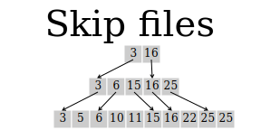
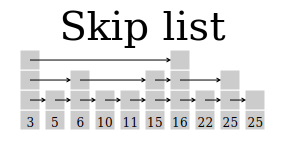

# A tiny full-text search engine

<!-- XXX name it? “chispa”? Like a very small light, from Lucene. -->

In the last quarter-century,
full-text search engines
have gone from being specialized research tools,
mostly used by lawyers and journalists,
to our most common means of navigating the web.
There are a couple of different basic data structures
for search engines,
but by far the most common one
is the “posting list” or “inverted index” search engine,
which stores a dictionary
from terms (typically words)
to lists of places where those terms are found,
typically in some kind of compressed form;
then it evaluates queries
by looking up the query terms in the dictionary,
merging the resulting lists of places,
and ranking the results.

That doesn’t sound very complicated,
and it turns out that you can make it work very simply indeed,
if you aren’t too concerned about space usage
or scaling to the whole web.

In this chapter, I demonstrate
a posting-list-based search engine,
modeled after Lucene in some ways,
but highly simplified;
it can perform full-text searches
of directory trees in your filesystem,
sort of like `grep -r`,
except that it can search through hundreds of gigabytes
in hundreds of milliseconds,
with an index size about 15% of the size of the text,
although it’s pretty slow at indexing.

It’s tuned to perform acceptably
even on electromechanical hard disks
coated with spinning rust.
On a single core of my laptop,
a 2.8GHz i7-3840QM,
a slightly earlier version of it
indexed 16 gigabytes of data
from the Project Gutenberg April 2010 DVD,
containing 29 500 ebooks,
in a bit over four hours,
producing a two-gigabyte index,
stored on a spinning-rust disk
with NTFS.
Then it was able to answer queries such as
`moby dick`, `Alice wonderland`, `Nemo squid`, `trochaic chrism`,
or `Bartleby Scrivener`
in between half a second and a second,
from a cold start.

<!-- Originally I said:
on XML dumps from StackOverflow.com
or other StackExchange sites,
thus providing instant help
for all common technical problems.

One problem with this: in the context of StackExchange dumps,
it’s difficult to motivate the need for incremental index updates, but
most of the time, incremental index updates are not optional, and they
can complicate a lot of things.  So I’d like to show that they can be
handled without too much fuss.  The original problem for which I wrote
dumbfts (the engine I’m updating for this chapter) was email indexing,
for which incremental updates are quite clearly motivated; but
achieving incremental updates in that context required that I limit my
mailbox mutation to appending, because once you start mutating mail in
the middle of the file that’s already been indexed, you’re kind of out
of luck on the incremental indexing thing.

So I figured the thing to do
is to make it a generic text-search program like 
Glimpse, storing the index in a directory somewhere up the parent
hierarchy like `.git`, with a list of filenames and mtimes?  Then I
can just reindex files when they change.  `grep -r e1000e
linux-3.2.41` takes almost four minutes on my netbook to search
through the 41706 files present, totaling 609MiB.

In that case, maybe mtime is the best thing to rank by?

The metadata indexing may turn out to be hairier than I expect... I
may still abandon this.

-->

The posting list
----------------

Since this search engine doesn’t do ranking,
it basically comes down to maintaining a posting list
on disk
and querying it.
We just need to be able to quickly find all the files
that contain a given term.
The simplest data structure
that supports this task
would be something like a sorted text file
with a term and a filename on each line;
for example:

    get_ds ./sh/include/asm/segment.h
    get_ds ./x86/include/asm/uaccess.h
    get_eilvt ./x86/kernel/cpu/perf_event_amd_ibs.c
    get_event ./x86/kernel/apm_32.c
    get_event_constraints ./x86/kernel/cpu/perf_event.c
    get_event_constraints ./x86/kernel/cpu/perf_event.h
    get_event_constraints ./x86/kernel/cpu/perf_event_p4.c
    get_exit_info ./x86/include/asm/kvm_host.h

You could binary-search this file
to find all the lines that begin with a given term;
if you have a billion lines in the file,
this might take as many as 60 probes into the file.
On an electromechanical hard disk,
this could take more than half a second,
and it will have to be repeated for each search term.

A somewhat simpler
approach,
although it requires more comparisons,
is to break the file up into chunks
with a compact “skip file”
which tells you what each chunk contains.
Then you can read only the chunks
that might contain the term you are looking up.
Then you typically only need to consult
the skip file
and a single chunk
to find all the postings for a term.
You have to examine potentially a larger number of keys,
but disks are fast at transferring large numbers of sequential records
into RAM.

This structure with chunks indexed by a "skip file" is analogous to a skip list;
the source code of the popular search engine Lucene
even calls it a "skip list".
It's analogous in the sense that the pointers in a skip list,
like a skip file,
allow a searching procedure to skip over most of the keys
that a purely sequential traversal would have to examine.
The difference is that the two data structures are sliced along different axes
so that
the skip file can be accessed entirely sequentially,
while the skip pointers
at a given level in a skip list
are scattered across many skip-list nodes,
rather than sequential in memory.
Skip files are more like a B-tree.

The diagram here shows multilevel skip lists and skip files,
as used by current Lucene,
while this engine uses only a single level of skip file;
it doesn't have a skip file for its skip file.
Also, this diagram
uses a very small
chunk size,
averaging only about two items.
This is reasonable for an in-memory skip list,
but not for a skip file,
where our main goal is to minimize *random* accesses
rather than the total number of keys compared.

XXX should these paragraphs be reordered?

Industrial-strength search engines
identify terms by integer indices into a term dictionary
and documents by integer document IDs,
which allows for delta compression.
Instead, we simply rely on gzip,
which typically makes our index
about 15%
of the size of the original text,
which is reasonable,
but runs more slowly
than application-specific compression schemes.

For this simple engine,
I’ve chosen to put 4096 postings in each chunk,
and each chunk in a separate file.
With my sample dataset of the Linux kernel,
4096 postings is about 20K gzipped (5 bytes per posting),
or about 150K uncompressed,
representing about 150K of original text,
and can be decompressed and parsed
on my netbook
in about 30ms.
The skip file,
which is not compressed,
is about 9 bytes per chunk
on my sample data.
For it to reach 9 megabytes,
you would need to have a million chunks,
or about 150 gigabytes of original source data.
Reading a 9-megabyte file is a bearable startup cost,
since it should take perhaps 200ms,
though far from ideal.

There’s a chunk size tradeoff:
smaller chunks
mean more filesystem overhead,
worse compression,
and a larger skip file,
while larger chunks
waste more time decompressing and parsing
postings for terms before the one we’re looking for.
4096 postings decompress in about 27ms on my netbook,
which is only about a factor of 3 slower than spinning-rust seek times,
but achieve most of the compression available from gzip.

Scaling up further
can be done
by using multiple levels of skip files,
making the search engine’s run time proportional
to the logarithm of the number of postings
rather than its square root.

Sequential access
-----------------

To build full-text indices on spinning-rust electromechanical disks,
it’s important that the access patterns
be basically sequential.
Random access on spinning rust
involves a delay on the order of 8–12 milliseconds,
during which time
the disk could have transferred
on the order of half a megabyte of data,
if it weren’t busy seeking.
So every random seek
costs you half a megabyte of data transfer time;
if you are doing the seek to transfer much less data than that,
then the disk is spending most of its time seeking
instead of transferring data.
On the other hand,
if you are transferring much more than half a megabyte
for each seek,
then the disk’s transfer rate is close to its maximum possible.
If you have a networking background,
you could think of this number as the bandwidth-delay product
of the disk.

Nowadays, since we have a lot of RAM,
we can build fairly large indices in RAM
before writing them out to disk.
This engine <!-- XXX chispa? --> by default builds up
4 million postings in RAM
which takes up around a quarter gig of RAM
before sorting them and writing them to a file,
which typically ends up being about 12MB compressed.

On modern solid-state drives,
this kind of locality of reference
is less of a problem,
since they can handle some ten thousand “seeks” per second;
the corresponding bandwidth-delay product
is more like 20 kilobytes
rather than 500.

The classic algorithm
for producing a sorted sequence
on media that only support sequential access
is mergesort.
To index a large volume of data,
first we index blocks of it,
producing these primary index segments of some 3MB;
then, we merge the primary index segments
to produce a merged index segment.
For a sufficiently large dataset and small RAM,
we could imagine needing to do a multi-pass merge,
but we probably don’t need to worry about that nowadays;
for efficient merging,
we need only about half a megabyte of buffer memory
per input file,
so a low-end modern smartphone
with a gigabyte of RAM
can do a 2000-way merge,
merging 2000 primary segments into one merged segment,
which would be some 6GB in size,
indexing some 40 gigabytes of text.
We could create bigger primary index segments
at the cost of bogging down the computer,
up to ten times as big on that smartphone;
that would allow us to
index up to 400 gigabytes
in only two passes.
With this engine’s current primary segment size
of about 13 megabytes compressed,
indexing about 100 megabytes uncompressed,
this strategy only scales up to 200 gigabytes.

Since we’re restricting ourselves
to essentially sequential access
for efficiency,
the filesystem interface is very simple.
Each file
(compressed or not)
contains a sequence of tuples
whose elements are arbitrary strings.
We have a function
which takes a sequence
(in Python, known as an iterable)
and writes its contents
to a file of tuples:

    # in the body of index.py:
    def write_tuples(outfile, tuples):
        for item in tuples:
            line = ' '.join(urllib.quote(str(field)) for field in item)
            outfile.write(line + "\n")

<!--

XXX skip introductory Python paragraph?

-->

If you’re not familiar with Python,
some of the contents of this function
may be a little puzzling.
**The `with` statement**
calls a method called `__exit__`
on the passed-in `context_manager`
when it finishes,
whether due to normal exit or due to an exception.
For file and `GzipFile` objects,
the `__exit__` method closes the file.
The `for` statement
iterates over a sequence (in this case, of tuples)
which could be **generated on the fly**
rather than precomputed before entering the function.
And the argument to `' '.join()`
is a **generator expression**
of the form `(x for y in z)`,
which generates a sequence (on the fly)
by evaluating the expression `x`
once for each item of `z`.

As it turns out,
in the current version of this search engine,
it isn’t actually important that the tuples can be generated on the fly,
because the largest thing we’re writing as a sequence of tuples
is the posting list,
and it has to be sorted before writing it to each chunk anyway.

`urllib.quote` encodes the strings being written to the file
to ensure they can’t contain spaces.

Reading the tuples is even simpler,
using a generator function:

    def read_tuples(infile):
        for line in infile:
            yield tuple(urllib.unquote(field) for field in line.split())
<!--

XXX more introductory Python material; omit?

-->

When the function is invoked,
it doesn’t do anything but return a generator object;
each time the `.next()` method is invoked on that generator object,
the function starts running,
either from the beginning
or from the last place it suspended,
until it reaches a `yield` expression,
which suspends execution of the function
and causes `.next()` to return a value.
You can think of it as producing a sequence of values,
one for each `yield`,
in the same way that a function with a `print` statement
could print a sequence of values.

This kind of coroutine concurrency,
which is also available in Lua, Ruby, Golang, and Scheme,
allows functions like `read_tuples()`
to be written straightforwardly as functions,
rather than as iterator classes with methods.
This search engine uses this technique extensively
to simplify its structure.

Index structure
---------------

This engine
stores its index in a directory,
with a structure like the following:

    # in your filesystem:
    .chispa
    .chispa/0
    .chispa/0/1.gz
    .chispa/0/2.gz
    .chispa/0/3.gz
    .chispa/0/skip
    .chispa/1
    .chispa/1/1.gz
    .chispa/1/2.gz
    .chispa/1/3.gz
    .chispa/1/skip

Each subdirectory of the top-level index directory
is a segment;
essentially an independent index.
The index results from different segments
must be combined
with the set union operation
to get the final index results.

Each segment is divided into sequential chunks,
which are gzipped,
and the skip file,
which tells which postings can be found in each chunk,
is called `skip`.

At some point,
my plan is to interpret the pathnames in the index
relative to the index’s parent directory,
and to search up toward the root of the filesystem
to look for an index to consult.

Merging strategy for incremental updates
----------------------------------------

Some sets of files
never change,
and this engine in its current form
is perfectly suited to those,
because it has no way to update an index once it exists.
However,
its
index structure can handle them already,
since each segment is entirely independent of other segments;
you can just create a new segment
to contain the postings from the new or newly modified files,
and any subsequent search will then be able to find
things in those files.

(This requires some way to keep track of which files
and which versions of those files
are already indexed
and which are not yet indexed,
and we also need to eventually discard postings
that pertain to old versions of modified files.)

But if you create too many segments,
searches will become slow.
So at some point
you need to merge segments to keep your searches fast.
But, if you merge all the segments into one segment
every time you update your index,
your updates are no longer very incremental.
It’s wasteful to copy an entire huge segment
just to add a few things to it.

It turns out there’s a middle ground that works pretty well,
although I don’t know if it has
reasonable mathematically guaranteed worst-case performance.
You find the largest index segment
that is no bigger
than all the segments
smaller than itself
put together;
and you merge it with all those smaller segments.
Intuitively, it’s not too wasteful to merge it,
since it comprises no more than half of the resulting index.

For example, suppose you have existing segments
of sizes 100k, 250k, 750k, and 2500k:

    100 250 750 2500

and you create a new segment of 20k:

    20 100 250 750 2500

We can write down the total sizes of the smaller segments underneath:

      20  100  250  750 2500
       0   20  120  370 1120

All of the segments are bigger than all the smaller segments put together,
so you don’t merge anything this time.
Now you create another segment of 30k:

      20   30  100  250  750 2500
       0   20   50  150  400 1150

Still nothing.
Now another segment of 50k:

      20   30   50  100  250  750 2500
       0   20   50  100  200  450 1200

Now the 100k segment is no bigger
than all the smaller segments put together,
so we combine all of them
in a four-way merge.
If we assume that the merged result
has exactly the sum of the sizes of its inputs,
which is close to true but not quite due to compression ratios,
this produces a 200k segment:

     200  250  750 2500
       0  200  450 1200

If we add another 20k segment, no merging happens:

      20  200  250  750 2500
       0   20  220  470 1220

But a second 20k segment gets merged with the first one:

      20   20  200  250  750 2500
       0   20   40  240  490 1240
      40  200  250  750 2500
       0   40  240  490 1240

Note that at this point,
due to the 200k and 250k segments
being so close in size,
another 20k segment is enough to push us over the edge
into another four-way merge:

      20   40  200  250  750 2500
       0   20   60  260  510 1260
     510  750 2500
       0  510 1260

In some sense,
because every surviving segment is constrained to be
larger than the sum of all the segments smaller than it is,
the segment sizes at any given moment
are never too far from an exponentially growing sequence,
which means that only a logarithmic number of segments can exist.

So, if that’s true, then this “middle ground”
guarantees that your searches never get too slow;
but how do we know that it guarantees that you don’t
waste too much time merging?

Since every merge input
is no more than half the size of the merge output,
every posting moves into a segment of at least double the size
every time it undergoes a merge.
That means that, if your total corpus has 16 billion postings,
each posting will be merged at most some 34 times;
and actually, since it’s probably starting in a primary segment
with a million other postings,
it won’t actually go through more than 14 merges.
That is, the total amount of merge work done with this policy
is O(N log N),
which is pretty good.

One problem is that the merge work isn’t very evenly distributed.
Adding an arbitrarily small bit of index
can result in an arbitrarily large amount of work;
in my last example above, adding 20k
resulted in 510k of merging
that had been postponed previously.

Finding out what files have changed
-----------------------------------

XXX incomplete

To incrementally update our index,
we need some way to find out which files have new data
without having to read the full contents of every file.
On a standard filesystem, this is not possible in general,
because it's possible to change a byte anywhere in the file
and then eliminate any change to the metadata.

In practice, though,
nearly all content changes will change
the modification time of the file,
as well as its size.
So if we record the size and modification time
when we index the file,
then when we go to update the index,
we have an excellent chance of noticing if the file has changed,
at which point we can add it to a list to be reindexed.

    # in the body of index.py:
    # XXX maybe these functions don't need to exist?
    def read_metadata(index_path):
        with path['documents'].open() as metadata_file:
            return dict((pathname, (int(mtime), int(size)))
                        for pathname, size, mtime in read_tuples(metadata_file))

    # XXX we probably want files_unchanged
    def file_unchanged(metadatas, path):
        return any(metadata.get(path.name) == get_metadata(path)
                   for metadata in metadatas)

Evaluating a query
------------------

If we just want to find
the doc_ids of
all the documents
that contain all the search terms,
given an index to search in,
this is simple:

    # in the body of index.py:
    def doc_ids(index_path, terms):
        "Actually evaluate a query."
        doc_id_sets = (set(term_doc_ids(index_path, term)) for term in terms)
        return set.intersection(*doc_id_sets)

We want the document IDs
that are in the posting list
of every term;
that is, we want the intersection of all the posting lists.
For a search engine that deals with larger quantities of data,
we might want to be careful about our query planning,
using the most selective terms first
and probing the posting lists for the least selective ones
rather than running O(N) algorithms on them;
but for our purposes,
just doing an eager hash join like this is probably adequately fast.

To get the document IDs for a term,
we need to combine the postings
from all the segments:

    def term_doc_ids(index_path, term):
        doc_id_sets = (segment_term_doc_ids(segment, term)
                       for segment in index_segments(index_path))
        return itertools.chain(*doc_id_sets)

    # XXX make this a method of the Index object, perhaps returning Segment objects
    def index_segments(index_path):
        return [path for path in index_path if path.basename().startswith('seg_')]

`chain` essentially concatenates
the sequences of document IDs
from the calls to `segment_term_doc_ids`.

To iterate over the segments in index_path,
this is using
a `Path` object
whose `__iter__` method
returns a `Path` object
for each file or subdirectory
in the directory:

    class Path:                     # like java.lang.File
        def __init__(self, name):
            self.name = name
        __getitem__  = lambda self, child: Path(os.path.join(self.name, str(child)))
        __contains__ = lambda self, child: os.path.exists(self[child].name)

        __iter__     = lambda self: (self[child] for child in os.listdir(self.name))

        open         = lambda self, *args:          open(self.name, *args)
        open_gzipped = lambda self, *args: gzip.GzipFile(self.name, *args)

        basename     = lambda self:     os.path.basename(self.name)
        parent       = lambda self: Path(os.path.dirname(self.name))
        abspath      = lambda self:      os.path.abspath(self.name)

Most manipulation of filesystem paths
in this engine
is done with this class.
I laid out its code a tabular structure,
using lambdas rather than the normal `def`,
to show the parallelism between the different methods in each group,
clarify that none of the methods other than `__init__` contains
assignment statements or other side effects,
and avoid making it look more complicated than it really is.

Anyway, to find the document IDs
from a given segment
for a given term,
we read through each of the chunks
that might contain postings for the term:

    def segment_term_doc_ids(segment, needle_term):
        for chunk_name in segment_term_chunks(segment, needle_term):
            with segment[chunk_name].open_gzipped() as chunk_file:
                for haystack_term, doc_id in read_tuples(chunk_file):
                    if haystack_term == needle_term:
                        yield doc_id
                    # Once we reach an alphabetically later term, we're done:
                    if haystack_term > needle_term:
                        break

Here `[]` invokes `Path.__getitem__`,
and `open_gzipped` invokes decompression of the chunk.

But which chunks might contain postings?
We have to read the skip file to find out:

    # XXX maybe return Path objects?
    def segment_term_chunks(segment, term):
        previous_chunk = None
        for headword, chunk in skip_file_entries(segment):
            if headword >= term:
                if previous_chunk is not None:
                    yield previous_chunk
            if headword > term:
                break

            previous_chunk = chunk
        else:                   # executed if we don't break
            if previous_chunk is not None:
                yield previous_chunk

We don’t know
the full range of the terms in a chunk
until we get to the skip file entry for the next chunk,
so we’re always yielding the previous chunk.

The contents of `skip_file_entries` is quite simple:

    def skip_file_entries(segment_path):
        with segment_path['skip'].open() as skip_file:
            return list(read_tuples(skip_file))

This invokes the same `read_tuples` function
as `segment_term_doc_ids`.

XXX the paragraph below needs to be split into a part that pertains to
read_tuples and a part that pertains to its faulty caller.

XXX update all this text for the new code with its `list()`.

By using the `with` statement,
the file is guaranteed to be closed
when the generator is terminated,
either by garbage collection,
by finishing the iteration,
or by explicitly calling .close() on the generator.
If you don’t close files,
sooner or later,
you’ll run out of file descriptors,
and any future attempts to open files will fail with an error.
In CPython,
the reference-counting garbage collector
finalizes generators
as soon as they go out of scope,
but the other implementations of Python
(PyPy, Jython, and IronPython)
do not offer such guarantees.
While `skip_file_entries` is guaranteed to exhaust the generator
and thus close the file
by using `sorted()`,
`segment_term_pathnames` may exit the iteration early,
and so XXX currently leaks file descriptors in PyPy.

And that’s all there is to evaluating a query:
the candidate postings for each query term,
as (term, doc_id) tuples,
are read by `read_tuples`
from the chunks supplied by `segment_term_chunks`;
they’re filtered by `segment_term_pathnames`
to only the ones that really do pertain to the term;
the doc_ids from different segments are combined
with `term_pathnames`;
and finally,
the doc_ids from different terms
are combined
so that only doc_ids that contain every term remain.

Search engines on large corpuses,
or corpuses that have been maliciously poisoned by SEO consultants,
generate too many hits for even fairly specific queries
to be useful
without ranking the results
so that the results most likely to be interesting
are displayed first.
This typically uses document weights,
such as Google’s PageRank or StackOverflow’s scores;
and measures of relevance to the query.

The general recipe for relevance measures
is “TF-IDF” plus a proximity ranking factor.
TF-IDF means
“term frequency, inverse document frequency”,
which is to say,
documents containing terms more frequently are rated higher,
while terms that occur more frequently in the corpus overall
are weighted more lightly.
It really should be called
“term frequency, inverse corpus frequency,”
but the term dates from the early years of information retrieval research,
when the terminology was different.
There are different formulas in the TF-IDF family,
which I would discuss here
if I knew anything about them.
The most popular of them seems to be called “Okapi BM25”.
Proximity ranking
considers a document more relevant to a query
if the terms in the query
occur near one another in the document
rather than far apart,
and perhaps in the right order.

This engine
does a very crude ranking:
it returns the newest files first:

    def get_metadata(path):
        s = os.stat(path.name)
        return int(s.st_mtime), int(s.st_size)

    def search_ui(index_path, terms):
            # Use the crudest possible ranking: newest (largest mtime) first.
            for path in sorted(paths(index_path, terms),
                               key=get_metadata, reverse=True):
                print(path.name)

This uses a `paths` function
to convert document ids,
which are currently paths relative to the location of the index,
XXX explain why,
into paths that the user can actually use directly:

    # At the moment, our doc_ids are just pathnames; this converts them to Path objects.
    def paths(index_path, terms):
        parent = index_path.parent()
        for doc_id in doc_ids(index_path, terms):
            yield Path(os.path.relpath(parent[doc_id].abspath(), start='.'))

Generating an index
-------------------

So that explains
how you would evaluate a query
given that you already have an index on disk
in the format described earlier;
but how do you generate the index?

First,
you have to generate the sorted sequence of postings
for each segment,
and then you have to write that sequence into the segment.
In outline, that is:

    # 2**20 is chosen as the maximum segment size because that uses
    # typically about a quarter gig, which is a reasonable size these
    # days.
    segment_size = 2**20

    def build_index(index_path, corpus_path, postings_filters):
        os.mkdir(index_path.name)

        # XXX hmm, these should match the doc_ids in the index
        corpus_paths = list(find_documents(corpus_path))
        with index_path['documents'].open('w') as outfile:
            write_tuples(outfile, ((path.name,) + get_metadata(path)
                                   for path in corpus_paths))

        postings = tokenize_documents(corpus_paths)
        for filter_function in postings_filters:
            postings = filter_function(postings)

        # XXX at this point we should just pass the fucking doc_id into
        # the analyzer function :(
        parent = index_path.parent()
        rel_paths = dict((path.name, os.path.relpath(path.name, start=parent.name))
                         for path in corpus_paths)
        rel_postings = ((term, rel_paths[doc_id]) for term, doc_id in postings)
        for ii, chunk in enumerate(blocked(rel_postings, segment_size)):
            write_new_segment(index_path['seg_%s' % ii], sorted(chunk))

        merge_segments(index_path, index_segments(index_path))

XXX the constants like `segment_size` need a place

The number `2**20` was chosen
to keep the memory usage of the indexer
around a quarter gigabyte on my test data,
because a quarter gigabyte is tolerable.
If you decrease it,
you'll use less memory
and generate more primary segments.

Note that the `os.mkdir` at the beginning
will keep you from accidentally building an index
in a place that already has something else in it,
because it will raise an exception if the directory already exists.

The `blocked` function
lazily breaks up a sequence of things
into a sequence of blocks of things
of up to the given size;
for example, `list(blocked("colon", 2))`
will return `[('c', 'o'), ('l', 'o'), ('n',)]`.
This set of postings is by far the largest thing present in memory
during the creation of the index,
and it can easily grow far larger than memory,
so we limit how many we keep in memory at a time.
Its code,
mostly taken from an answer on Stack Overflow,
is maybe a little too clever:

    # From nikipore on Stack Overflow <http://stackoverflow.com/a/19264525>
    def blocked(seq, block_size):
        seq = iter(seq)
        while True:
            # XXX for some reason using list(), and then later sorting in
            # place, makes the whole program run twice as slow and doesn't
            # reduce its memory usage.  No idea why.
            block = tuple(itertools.islice(seq, block_size))
            if block:
                yield block
            else:
                raise StopIteration

<!--

More introductory Python.

-->

`itertools.islice` takes the first N items from an iterator,
but it can terminate before yielding N items
if the underlying iterator does.
In that case, you will end up with a short tuple.
If there are no items left,
you will end up with an empty tuple.
But it’s not desirable for `blocked` to keep yielding empty tuples forever.
Instead, it should terminate its iteration
when there are no more items left.
A generator can terminate its iteration
either in the usual way that functions terminate,
by returning or running off the end of its code,
or by raising the `StopIteration` exception
that Python’s iteration protocol uses
in place of a `hasNext` method.
The easiest way to raise `StopIteration`
is to invoke `next` on an empty iterator,
so that’s what this code does.

You’ll note that the explanation for this code
is about 130 words,
while the code is only 15 words.
That probably means it’s bad code.
So far I’ve kept it in this form
instead of a more straightforward but longer form
mostly because I expect `itertools.islice`
will be faster than doing the same thing
in interpreted CPython.

`postings_from_dir`,
the tokenizer that generates postings from a directory,
is currently fairly crude;
it generates a sequence of (term, doc_id) tuples
given a directory
by treating every file in that directory
as a text file.  XXX not any more!
It’s careful not to generate the same posting twice,
which both simplifies and speeds up the rest of the code.

    def find_documents(path):
        for dir_name, _, filenames in os.walk(path.name):
            dir_path = Path(dir_name)
            for filename in filenames:
                yield dir_path[filename]

    def tokenize_documents(paths):
        for path in paths:
            for posting in remove_duplicates(tokenize_file(path)):
                yield posting

    # Demonstrate a crude set of smart tokenizer frontends.
    def tokenize_file(file_path):
        if file_path.name.endswith('.html'):
            return tokenize_html(file_path)
        else:
            return tokenize_text(file_path)

    def tokenize_text(file_path):
        word_re = re.compile(r'\w+')
        with file_path.open() as fo:
            for line in fo:
                for word in word_re.findall(line):
                    yield word, file_path.name

    def remove_duplicates(seq):
        seen_items = set()
        for item in seq:
            if item not in seen_items:
                yield item
                seen_items.add(item)

So that’s the sequence of postings
being broken into 1048576-item blocks by `blocked`
which are then sorted and passed to `write_new_segment`.
Note that the `seen_words` set could potentially get dangerously large
if this is run on a particularly large input file.
A little more code would suffice
to write the candidate postings out to a temporary file in such a case,
sort the file on disk to eliminate duplicates,
and then yield the postings.

So what does `write_new_segment` do?

    chunk_size = 4096
    def write_new_segment(path, postings):
        os.mkdir(path.name)
        chunks = blocked(postings, chunk_size)
        skip_file_contents = (write_chunk(path, '%s.gz' % ii, chunk)
                              for ii, chunk in enumerate(chunks))
        with path['skip'].open('w') as skip_file:
            write_tuples(skip_file, itertools.chain(*skip_file_contents))

    # Yields one skip file entry, or, in the edge case of an empty chunk,
    # zero skip file entries.
    def write_chunk(path, filename, chunk):
        with path[filename].open_gzipped('w') as chunk_file:
            write_tuples(chunk_file, chunk)
        if chunk:
            yield chunk[0][0], filename

This uses the `write_tuples` function explained earlier,
passing it a `gzip.GzipFile` to automatically close when it’s done.
It might be more sensible to write the data in an uncompressed form,
then later launch a background `gzip` process to compress it,
since about half of the program’s run time is taken up by compression.

The `build_skip_file` function is similarly simple;
its only tricky bit is that it lists the chunk names
before opening the skip file
so it won’t mistake the skip file for a chunk:

XXX gone

But that’s because the actual skip-file generation logic
is in `generate_skip_entries`:

XXX gone

We simply read the first tuple from each chunk.
Since we aren’t reading all the tuples,
the `read_tuples` generator won’t implicitly exit automatically
and close the file.
As discussed previously,
to avoid a file descriptor leak in non-reference-counted Pythons,
we explicitly close the generator.

So that covers the whole paper path from input files
into a primary index segment.
Aside from the representational issues
like document IDs and term dictionaries,
which are essentially a matter of compression,
this presentation glosses over a couple of other issues
that more complete search engines handle:
our documents are not divided into fields,
which means that you can’t, say,
search for a term in just the title,
or just the filename,
or (as in my email search engine `dumbfts` that this was modeled after)
just the from address;
the postings stored for each term
include only the document ID,
without any frequency or proximity information,
or even any stemming;
and the term extraction itself
is a simple regular expression match,
with no attention given to the type of the file.

Tokenizing HTML
---------------

Finding the words in a plain text file
can be as simple as `re.findall(r'\w+', line)`,
but people have more than just plain text
on their system.
For example, HTML is plain text,
but if you're putting it into your index,
you probably don’t want to index the names of its tags
like `body` and `div`,
unless they occur in its text.
But some error rate is acceptable,
and may be a good tradeoff for indexing speed;
and if the HTML is syntactically invalid,
you still need to recover somehow.

Here’s a quick HTML tokenizer I whipped up
with those desires in mind:

    # Crude approximation of HTML tokenization.  Note that for proper
    # excerpt generation (as in the "grep" command) the postings generated
    # need to contain position information, because we need to run this
    # tokenizer during excerpt generation too.
    def tokenize_html(file_path):
        tag_re       = re.compile('<.*?>')
        tag_start_re = re.compile('<.*')
        tag_end_re   = re.compile('.*?>')
        word_re      = re.compile(r'\w+')

        with file_path.open() as fo:
            in_tag = False
            for line in fo:

                if in_tag and tag_end_re.search(line):
                    line = tag_end_re.sub('', line)
                    in_tag = False

                elif not in_tag:
                    line = tag_re.subn('', line)[0]
                    if tag_start_re.search(line):
                        in_tag = True
                        line = tag_start_re.sub('', line)
                    for term in word_re.findall(line):
                        yield term, file_path.name

XXX talk about pluggable tokenizers

Merging
-------

But `build_index`
also invoked `merge_segments(index_path, list(index_path))`.
How do we merge segments?

    def merge_segments(path, segments):
        if len(segments) == 1:
            return

        postings = heapq.merge(*(read_segment(segment)
                                 for segment in segments))
        write_new_segment(path['seg_merged'], postings)

        for segment in segments:
            shutil.rmtree(segment.name)

First, if we only have one primary segment,
there’s no need to merge it;
we can just return.
But if we have more than one,
we open all of them and hook them up to a heap,
which then yields a stream of all of their items
in order.

Then we must choose an unused name for the new output segment,
and then we write the tuples to it
using the same `write_new_segment`
that we use to create primary segments.
Note that in this case
we are in fact taking advantage of the fact
that we can pass `postings` to `write_new_segment`
even though most of the postings it will yield
have not yet been read from disk.

Finally, we delete the now-obsolete input segments.

Because this engine doesn't yet support incremental updates,
there will only ever be a single merge,
(XXX is this really true?)
and so "choosing an unused name for the new output segment"
is very simple: we just use the constant `"seg_merged"`.

The only new function here
is `read_segment`:

    def read_segment(path):
        for _, chunk in skip_file_entries(path):
            # XXX refactor chunk reading?  We open_gzipped in three places now.
            with path[chunk].open_gzipped() as chunk_file:
                for item in read_tuples(chunk_file):
                    yield item

We use the skip file entries
to make sure we are reading the chunks in the correct order.
XXX I think this can be rewritten in terms of `itertools.chain`.

Stopwords
---------

A simple measure
to improve the performance
of inefficient search engines like this one
is to exclude very common words like “the” and “of”.
These words have very large posting lists
which slow down naïve query evaluation strategies,
they add significantly to the size of the search index,
and at the same time,
they add very little selectivity
except in phrase searches.
(Tim Bray’s examples
are “The Limited”
and “To be or not to be”.)

These words that we omit from the index
are called “stopwords”.

Remember that `build_index`
takes a list of `postings_filters`
to manipulate the sequence of postings being generated,
and a stopwords removal filter can fit into that list
quite comfortably:

    def make_stopwords_filter(stopwords):
        stopwords = set(stopwords)
        stopwords |= ( set(word.upper()      for word in stopwords) 
                     | set(word.capitalize() for word in stopwords))
        return lambda postings: ((term, doc_id) for term, doc_id in postings
                                 if term not in stopwords)

Long nonsense words
-------------------

Another category of “words”
that provides little value
and inflates index sizes
is the random words that occur sometimes
when base64 or uuencoded text,
or just text with all the spaces somehow removed,
somehow finds its way into your full-text indexer.
These words mostly only occur once,
it’s unlikely that they will ever be searched for,
and they can be arbitrarily large,
again inflating the index for no benefit.
Unlike stopwords,
at least they don’t slow down queries
significantly.

    word_len = 20                   # to eliminate nonsense words
    def discard_long_nonsense_words_filter(postings):
        """Drop postings for nonsense words."""
        return ((term, doc_id) for term, doc_id in postings if len(term) < word_len)

Stemming
--------

It’s common
to want queries for, say, “filter”
to also return documents that contain “filtering” or “filtered”.
This is achieved by transforming the terms
in the index and possibly also the query
into some normalized “stem”.
The simplest such transformation
is simply to map indexed terms to their lower-case versions,
which gives you case-insensitive search
when you use a lowercase search term:

    def case_insensitive_filter(postings):
        for term, doc_id in postings:
            yield term, doc_id
            if term.lower() != term:
                yield term.lower(), doc_id

Stemming transformations work the same way.

A Minimal User Interface
------------------------

To have a minimal user interface for testing the engine,
the `grep` function provides an interface
kind of compatible with `grep -rn`
and therefore with Emacs:

    def grep(index_path, terms):
        for path in paths(index_path, terms):
            try:
                with path.open() as text:
                    for ii, line in enumerate(text, start=1):
                        if any(term in line for term in terms):
                            sys.stdout.write("%s:%s:%s" % (path.name, ii, line))
            except Exception:          # The file might e.g. no longer exist.
                traceback.print_exc()

Here, `except Exception:` rather than the older `except:`
avoids catching possible `KeyboardInterrupt` exceptions,
raised if the user aborts with control-C or its equivalent on other platforms,
which don't inherit from `Exception` in Python
in order to make it easy to avoid accidentally catching them.
Also, in Python, the `exit` builtin function
works by raising a `SystemExit` exception;
this has the benefit of running cleanup `finally:` clauses,
but also means that a stray `except:`
can accidentally prevent the program from exiting.
This program doesn't use `exit`,
but `except Exception:` also avoids catching `SystemExit`.

In Python, iterating over a file
gives you the lines of the file,
including the terminating newlines, if any.
So the `line` variable in the above normally includes a terminating newline.
XXX but what if it doesn't because the last line of the file is unterminated?
and there's another file? BUG

Then, the `main` function provides an additional interface
kind of compatible with `grep -rl`,
plus an interface to build a new index:

    # in the end of index.py:
    def main(argv):
        # Eliminate the most common English words from queries and indices.
        stopwords = 'the of and to a in it is was that i for on you he be'.split()

        if argv[1] == 'index':
            build_index(index_path=Path(argv[2]), corpus_path=Path(argv[3]),
                        postings_filters=[discard_long_nonsense_words_filter,
                                          make_stopwords_filter(stopwords),
                                          case_insensitive_filter])
        elif argv[1] == 'query':
            search_ui(Path(argv[2]), [term for term in argv[3:]
                                      if term not in stopwords])
        elif argv[1] == 'grep':
            grep(Path(argv[2]), [term for term in argv[3:]
                                 if term not in stopwords])
        else:
            raise Exception("%s (index|query|grep) index_dir ..." % (argv[0]))

    if __name__ == '__main__':
        main(sys.argv)

Python overhead
---------------

That covers
the entire search engine code,
except for the excise Python demands of us:

    # in index.py:
    #!/usr/bin/python
    # -*- coding: utf-8 -*-

    import gzip
    import heapq                    # for heapq.merge
    import itertools
    import os
    import re                       # used to extract words from input
    import sys
    import shutil                   # to remove directory trees
    import traceback
    import urllib                   # for quote and unquote
    <<the body of index.py>>
    <<the end of index.py>>

Performance
-----------

On the Project Gutenberg 2010 DVD data,
as mentioned earlier,
I was able to index about four gigabytes per hour
on a single core.

This indexing speed
is about a tenth of what you get
out of a production-quality search engine
like Sphinx or Lucene,
but perhaps more importantly,
this search engine doesn’t support
any kind of parallelism,
so its performance is limited to its single-core performance.
But you can see that it doesn’t really matter
what order the postings are produced in,
and indeed you could easily divide up a set of input files
among a set of processes
and generate separate primary input segments from them
entirely independently,
perhaps even on different machines,
before perhaps merging them later.
This can give you orders of magnitude improvement
via parallelism.
And this basically describes
the original implementation of MapReduce at Google
and what it was written for.

Aside from that,
about half of the indexer’s run time
is spent `gzip`-compressing postings data.
The standard approach
of maintaining an in-RAM dictionary
and using integers for document IDs,
then using delta-compression to compress the posting lists for each term,
is considerably less CPU-hungry,
and that could speed the system up by about a factor of 2,
though at the cost of additional complexity.
As a bonus, it would produce much smaller index files.
A more efficient application-specific file format
can also produce postings files
that can be parsed without iterating over each of their bytes,
which may be a win;
this also lets you intersect posting lists
without doing string comparisons
between URLs or file paths.

As a sort of in-between alternative,
you could use a high-speed compression algorithm
like Snappy or LZO
instead of `gzip`,
getting somewhat larger index files
but at much higher speed;
indeed,
these compressors can speed up your program
rather than slowing it down
because the disk is managing a smaller amount of data.

Another 20% is spent
tokenizing the input files,
and improving that
could add up to another factor of 2 in performance;
but a more industrial-strength search engine
needs to do stemming, synonym generation, stopword exclusion,
and parsing of file formats
more complicated than just plain text,
so it’s likely that a more complete implementation will actually be slower
rather than faster.
However,
careful attention given to the in-memory data structure used for accumulating tokens,
as well as the memory allocation strategy,
can produce substantial payoffs.

The *query evaluator*, however,
is 100× slower rather than 10× slower
than industrial-strength search engines;
and, as you’d expect,
speeding it up
probably requires quite a bit more work:
it would help a lot
to be able to get posting lists from the index lazily,
to plan queries to start with the most specific term
to be able to take advantage of that ability,
to stop generating hits when we’ve generated enough to display,
to store the index on SSD or in RAM rather than spinning rust,
and perhaps to have sub-indices
covering the higher-ranked subsets of the corpus.

Other approaches
----------------

Inverted indexes aren’t the only way to build a full-text search engine,
although they are still
the approach used by essentially all full-text indexers
intended for human-language text.

However,
the first web search engine,
by Open Text,
used a [suffix array](https://en.wikipedia.org/wiki/Suffix_array)
instead,
which is like a slower, much smaller version of a
[suffix tree](https://en.wikipedia.org/wiki/Suffix_tree).
Three different simple space-efficient linear-time
suffix-array construction algorithms
have been discovered in the last few years,
making the topic suddenly very interesting.
Suffix trees and suffix arrays,
in theory,
support much richer operations than inverted indexes:
not only general substring search,
but also regular expression search.

Taking the suffix-array idea further
is the *self-index*,
a compressed representation of the text
which also works as a full-text-searchable index.
The first self-index,
the [FM-index](https://en.wikipedia.org/wiki/FM-index),
was only discovered in 2000.
Research has been active since then,
and [Bowtie-2](http://bowtie-bio.sourceforge.net/bowtie2/index.shtml)
seems to be
production-quality self-indexing software
using the FM-index
for bioinformatics.
(Genes and proteins aren’t conveniently divided into words.)

I have the impression that the FM-index in particular
has the disadvantage
that it requires many random accesses per search,
so it works orders of magnitude slower
when it’s stored on spinning rust.
XXX I don’t know if this is really true.

Further information
-------------------

Lucene, which powers Solr and ElasticSearch,
and Sphinx, which powers MariaDB’s text indexing,
are
the two industrial-strength open-source full-text search engines
for natural language.
The [Lucene manual](https://lucene.apache.org/core/4_7_0/index.html)
and especially the [Sphinx manual](http://sphinxsearch.com/docs/current.html)
provide a wealth of information about what they do and how they work,
and how modern search engines work in general.

Just over a decade ago, Tim Bray wrote
a series [On Search](https://www.tbray.org/ongoing/When/200x/2003/07/30/OnSearchTOC)
on his blog;
it’s still the best introduction I know of.

Acknowledgments
---------------

Many thanks to Dave Long, Darius Bacon, Alastair Porter, Daniel
Lawson, Javier Candeira,
Amber Yust, Andrew Kuchling, and Dustin J. Mitchell
for their help and inspiration on this chapter.
