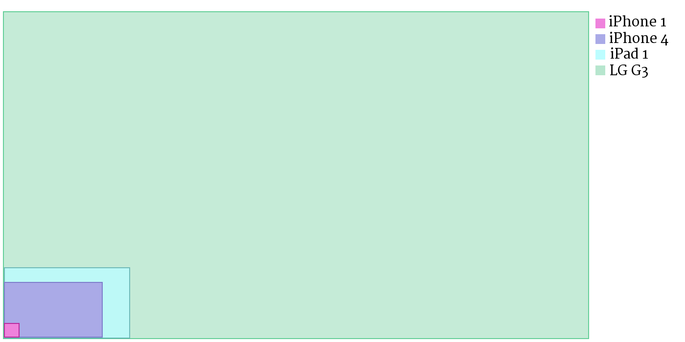
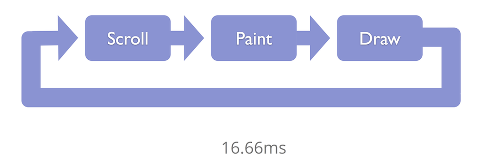
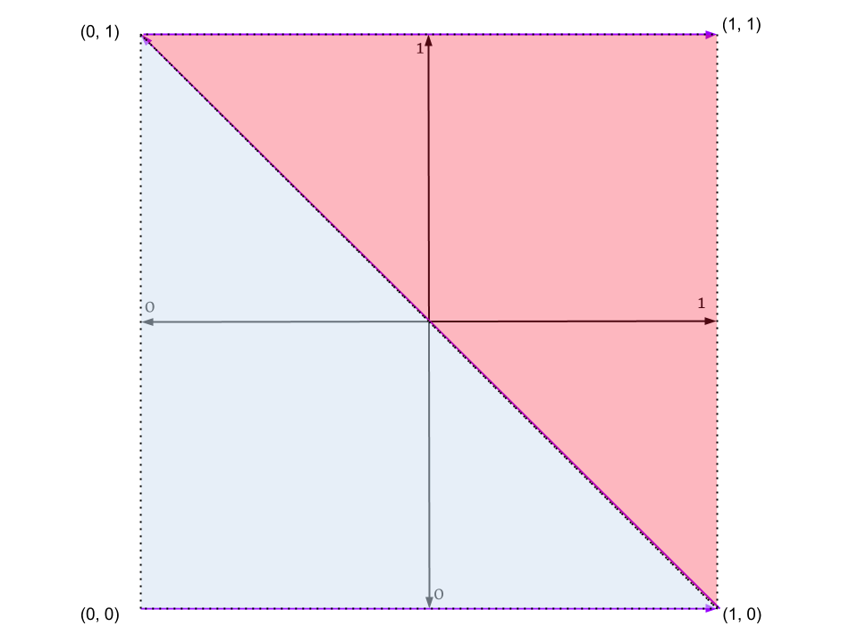

# A Tiled Renderer

> What if, Carmack thought, instead of redrawing everything, I could figure out a
> way to redraw only the things that actually change? That way, the scrolling
> effect could be rendered more quickly. [...]
> Carmack wrote some code that duped the computer into thinking that, for
> example, the seventh tile from the left was in fact the first tile on the
> screen. This way the computer would begin drawing right where Carmack wanted it
> to. Instead of spitting out dozens of little blue pixels on the way over to the
> cloud, the computer could start with the cloud itself. To make sure the player
> felt the effect of smooth movement Carmack added one other touch, instructing
> the computer to draw an extra strip of blue tile outside the right edge of the
> screen and store it in its memory for when the player moved in that direction.
> Because the tiles were in memory, they could be quickly thrown up on the screen
> without having to be redrawn. Carmack called the process “adaptive tile
> refresh.”

> &mdash;Kushner, David (2004). Masters of Doom: How Two Guys Created an Empire and Transformed Pop Culture. Random House, Inc. p.50.

John Carmack, formerly of id Software, pioneered many innovations in computer
graphics throughout his exceptional career as a game developer. He developed
Commander Keen (1990) the first side-scrolling video game that ran on the IBM
PC using the "adaptive tile refresh" method dramatized in the above excerpt
from Masters of Doom. At the time console games were able to implement
side-scrolling thanks to dedicated hardware support. Carmack used tile
rendering to bring side-scrolling to the PC market. Game developers have always
pushed the limits of hardware to create more emersive experiences. Today's
development platforms make use of the innovations from the gaming industry to
accelerate rendering dynamic content. It is a process of having the CPU and the
GPU work together to create the best user experience possible. The GPU has
evolved being optimized for the gaming use case. GPU performance can be
evaluated with metrics such as: triangles per second, which measures how fast
the GPU can render complex geometry, and pixels per second which measures how
fast the GPU can render pixels. The impressive triangle and pixel throughputs
of graphics hardware makes the GPU a great option for rendering outside of
games. On mobile, we are now able to accelerate rendering apps and web content
by treating everything as geometry to be rendered by the GPU. Though the iOS
platform leveraged the GPU for rendering from the beginning, Android originally
used the GPU only for window compositing, games, live wallpapers, and video
until the Android 3.0 Honeycomb release in 2011. Honeycomb added support for
tablets which would have more than 2.5 times the pixels of the highest
resolution Android phones at the time. This became a problem since the memory
bandwidth of those devices would not be able to keep up with the number of
pixels on the screen ([see Google I/O 2011: Accelerated Android
Rendering](https://www.youtube.com/watch?v=v9S5EO7CLjo)). Android would start
to use the GPU for rendering out of necessity. In 2007, the iPhone launched
with a 412Mhz ARM11 CPU, a PowerVR MBX Lite 3D graphics processor, and 128MB of
memory. Sufficient at the time but meager compared to the current generation of
devices. Advances in display technology have been quite demanding on rendering.
Mobile displays have been seemingly involved in a pixels per inch (ppi) arms
race. The original iPhone had a 3.5 inch 480x320px display (~165 ppi); the
iPhone 4 retina display quadrupled the pixel count to 960x640px (~326 ppi).
Today we have phones such as the LG G3 which boasts a 5.5 inch 2560x1440px
screen which translates to an incredible 538 ppi. That's 78% more pixels than a
1080p 60" LED TV on a 5.5 inch display.



| Device          | PPI     | Pixels                  |  Pixel ratio vs iPhone 1 |
|:----------------|:-------:|:------------------------|:------------------------:|
| iPhone (2007)   | 165 ppi | 480 x 320 = 153,600     | 1.0                      |
| iPhone 4 (2010) | 326 ppi | 960 x 640 = 614,400     | 4.0                      |
| iPad (2010)     | 132 ppi | 1024 x 768 = 786,432    | 5.12                     |
| LG G3 (2014)    | 538 ppi | 2560 x 1440 = 3,686,400 | 24.0                     |

We aren't far from seeing 4k displays arrive on mobile; high end Android
devices like the Samsung Galaxy Note 3 and the LG G3 already support 4k video
recording. A 4k display has at least 4x the pixels of a full HD 1920x1080px
display. It starts at 3840x2160px but a popular resolution used in professional
cameras and projectors is 4096x2160px or an astounding 8,847,360 pixels. All
those pixels need to be rendered every frame, thus the efficiency of the
rendering pipeline is of utmost importance.

Consider the use case of a web browser on a mobile phone: a web page can be
arbitrarily large though confined to be viewed through a small fixed size
display. Moreover, mobile devices have limited memory to store the page
contents and they must support fundamental features such as: scrolling,
panning, and zooming. There are no guarantees on how complex the page may be.
Scrolling and zooming at a smooth 60 frames per second becomes challenging when
tasked with rasterizing a complex scene and pushing 4 million pixels to the
screen every update. *A Tiled Renderer* demonstrates the method modern browsers
have used to implement rendering arbitrarily sized content to a fixed sized
viewport. It is the same fundamental idea Carmack used to implement
side-scrollers. It is a technique you'll be familiar with from using Google
Maps which also uses a WebGL based tiled renderer. Tiling is one of many
possible methods for rendering dynamic content; all of which have different
tradeoffs in terms of flexibility, performance, and memory consumption.


## Rendering Every Frame



The simplest solution would be to re-render to the screen every frame. Prior to
Android Honeycomb, the platform Browser app used this approach along with a
retained mode rendering pipeline that allowed for other optimizations. The
entire page, not just the viewport, was stored in a vector representation
referred to as a `Picture` ([see Google I/O 2012: Android
WebView](https://developers.google.com/events/io/2012/sessions/gooio2012/122/)).
During a scroll, the `Picture` would be rasterized clipped to the current
viewport size and translation every frame. This method did not require storing
the entire page bitmap, but rather a recording of the rendering calls that are
required to create the page. This allowed for a memory efficient representation
of the page that was suitable for mobile. Each frame would require going
through the rendering pipeline and generating a new image to fill the viewport.
A disadvantage is that performance will suffer due to the redundant work being
done every frame. Every scroll event triggers a viewport size rasterization of
the retained `Picture`. A scroll of a pixel requires re-rendering the entire
viewport. The speed of rendering may vary depending on the complexity of the
page's `PictureSet`.

Another issue can occur if we are rendering directly to the screen framebuffer.
Displays have a fixed rate at which the screen is refreshed. A mobile display
is likely to have a refresh rate of 60Hz. If the renderer can't produce an
updated buffer at the rate the display refreshes, the display will either show
the old buffer or show a partially updated buffer. This may cause visual
artifacts such as choppiness, flickering, and tearing. A solution to this
problem is to keep a secondary buffer, known as the back buffer or backing
store, in which the renderer can draw while the main buffer is being rendered
by the display. This technique is known as double buffering and is a standard
practice in rendering. Typically the system supports vertical synchronization
(vsync) of the display refresh cycles which prevents updates to display memory
until the current cycle is completed. The back buffer will be copied to video
memory during the vertical blanking interval reducing the risk of rendering
artifacts. Applications generally don't render directly to the screen, they
typically render into a system-provided window buffer which will be composited
along with any other visible applications and system UI. However, a fullscreen
game might want to render directly to the screen to avoid copying and achieve
the best possible performance. Rendering to an unbuffered display surface
allows for minimal latency.

## Full Page Backing Store

Another solution would be to render the entire page into a pixel buffer and
copy the portion of the page that corresponds to the position of the viewport
into video memory for consumption by the display. A scroll would simply consist
of a bit blit of the page buffer after having performed the requested viewport
translation. In this solution the cost is payed up front in the initial render
and scrolling or panning can be done at very little cost. A CPU is highly
optimized to execute fast blitting operations. Copying a viewport sized buffer
to display memory every frame may be fast enough depending on the size and the
available memory bandwidth. The major drawback of this approach is the
unpredictable memory requirement. A web renderer must support arbitrarily large
pages which are not guaranteed to fit in memory. Thus it may not be possible to
keep a full page backing store leading us to various possible partial backing
store solutions.

## Viewport Sized Backing Store

Keeping a backing store that is fixed to the size of the viewport (or slightly
larger) is a memory efficient solution. During a scroll, we can reuse the
section of the viewport that is cached in the backing store. The update of the
exposed region can be scheduled asynchronously and the reused region can be
rendered along with placeholder content for the newly exposed region. Typically
either the background color of the page or a checkerboard pattern would be used
to indicate the section of the page that has not yet been rendered. A drawback
to this approach is that the entire exposed region will be rasterized before
replacing the placeholder. If 99% of the viewport is made up of the newly
exposed region, then we'll wait for essentially a full page rasterization
before showing any content. Ideally we want to start showing new content as
fast as possible to indicate the progress of the loading of the page. However,
the single paint for the exposed region provides the fastest possible rendering
time. Any type of partial painting solution will have some overhead costs for
doing multiple paints to update the exposed region.

## Tiled Backing Store


In a tiled renderer, the backing store is a set of tiles that cover the
viewport area and possibly part of the contents surrounding the visible region.
The "tile cover area" contains both the viewport and any extra area around the
viewport. Each tile can be updated and rendered to the screen independently.
We can adjust the size of the tile cover area and the size of tiles to
different tradeoffs. A larger tile cover area means better scrolling
responsiveness however it means more memory usage. Using larger tiles results
in better painting speed due to less overhead from more paints but results in a
larger memory footprint. Like the viewport-sized backing store, we can schedule
asynchronous updates of the exposed region tiles and render the reused tiles
immediately with placeholders for exposed tiles. Rather than do a single paint
of the exposed region, we can rasterize individual tiles and render them to the
screen as they are completed. This gives a more responsive loading process
where the exposed region is updated progressively giving valuable feedback
rather than showing a blank area until the entire region can be rendered. We
can also do tile prefetching to expand the tile cover area when we have free
cycles. For example, if the user is reading text on the page we can prefetch
the next couple rows of tiles that are not yet visible so that when the user
scrolls in a particular direction, they don't have to wait for the content to
be rasterized.

A tiled renderer may or may not leverage the GPU to assist in rendering. Using
the GPU provides hardware support for operations such as: translation,
rotation, scaling, and alpha blending. To get the best performance possible,
the GPU is used render tiles. Tiles are kept in graphics memory and are
rendered to the window buffer by the GPU. Rendering with tiles reduces the
memory bandwidth demand on the GPU. During a scroll, we update the translation
offset of the tiles and render any tiles that still intersect the viewport
rect. There are various optimizations we can do with the GPU such as rendering
tiles in low quality mode to make content show up as fast as possible then
schedule another update that replaces the low quality tiles with the high
quality rendering. This is useful for supporting zooming. We scale the textures
using the GPU and schedule the rasterization of zoomed tiles in high quality.
This is also useful for handling the case where the page is being scrolled
quickly and newly exposed regions are being revealed faster than we could
render in high quality. In this case, rendering blurry low quality content is
preferable to not showing anything at all. Tiles are pooled to avoid the cost
of allocation during rendering and set a fixed amount memory for the backing
store. When a tile is scrolled out of the visible region, it can be made
available for use in the tile pool again. We can detect tiles that only contain
a solid color and avoid using up a tile buffer by letting the GPU render the
color directly to the tile's location in the viewport. A significant portion of
a typical web page is simply the background color. Take
[http://www.google.com](http://www.google.com) for example. By detecting such
tiles, we save GPU memory bandwidth and improve rendering speed.

To support layered content, typically multiple z-ordered backing stores will be
used. We use the [Painter's
Algorithm](http://en.wikipedia.org/wiki/Painter's_algorithm) and walk through
the layers and render from back to front. Keeping separate backing store layers
allows us to update only the layer that changes. This is particularly useful
with animations. If a sprite is moving across the screen and the background is
static, there is no reason we need to re-render the static content. We can also
do basic hidden surface removal, not bothering to render tiles that are
occluded by other layers.

## 500 lines

*A Tiled Renderer* was created to run in a browser that implements a tiled
renderer which, on embedded devices in particular, is likely rendered by a GPU
that uses tile based rendering; our tiled renderer is an inception of sorts.
Written in JavaScript's [Web Graphics
Library](https://www.khronos.org/registry/webgl/specs/latest), which is based
on the OpenGL ES 2.0 API, the implementation is meant to provide insight into
how modern browsers render web content. For those whom are unfamiliar with
OpenGL's programmable graphics pipeline, it may be difficult to understand the
code without an overview of the underlying concepts of WebGL. It is for this
reason that I have avoided using any of the WebGL frameworks that abstract away
the complexities of setting up WebGL for rendering. One of the barriers for
developers learning WebGL is the relatively significant amount of work that one
must do just to render even the simplest geometry. I'll cover the setup phase
and briefly introduce the core graphics concepts at work. There are no third
party dependencies for this code; it is true to the 500 lines.

To start we'll examine the folder structure.

```
+-- tiled-renderer
|    +-- app.yaml
|    +-- chapter.md
|    +-- fonts
|        +-- Raleway-Regular.ttf
|    +-- images
|        +-- _README.txt
|        +-- A_Song_of_Ice_and_Fire.jpg
|        +-- A_Tiled_Renderer.png
|        +-- OpenGL_ES_2_Pipeline.jpg
|        +-- Pixel_Count_Comparison.png
|        +-- The_Render_Loop.png
|        +-- The_Tiled_Renderer_Loop.png
|        +-- Tile_Outline.png
|        +-- Tiling_Exposed_Region.png
|        +-- Triangle_Strip_In_Clip_Space.png
|        +-- Triangle_Strip_In_Texture_Coordinates.png
|    +-- index.html
|    +-- index.py
|    +-- README.md
|    +-- src
|        +-- logger.js
|        +-- matrix3.js
|        +-- renderer.js
|        +-- shader.js
|        +-- timer.js
|    +-- stylesheets
|        +-- renderer.css
```

There is a live version of the app running on Google's AppEngine at
[http://tiled-renderer.appspot.com](http://tiled-renderer.appspot.com). The
`app.yaml` file is the configuration file for AppEngine and can be ignored
along with `index.py` which simply generates an HTML response in the webapp2
web application framework. The main entry point is `index.html` as is customary
on the web.

### index.html

```
<body onload="renderer.initGL();">
  <h1>A Tiled Renderer
    <span style="font-size: 10pt">by Pierre-Antoine LaFayette</span>
  </h1>

  

  <!-- iPhone 1 sized -->
  <canvas id="glCanvas" width="320 height="480"></canvas>

  <p class="info">Scroll the image in the WebGL canvas
                  on the right with by clicking and moving the mouse.</p>
  <br/><br/>

  <div id="log"></div>

  <script type="text/javascript" src="src/logger.js"></script>
  <script type="text/javascript" src="src/timer.js"></script>
  <script type="text/javascript" src="src/matrix3.js"></script>
  <script type="text/javascript" src="src/shader.js"></script>
  <script type="text/javascript" src="src/renderer.js"></script>
</body>
```


The page displays a 720x480px image by Romain Guy titled "A Song of Ice and
Fire". Beside the image is a 320x480px JavaScript canvas that serves as our
window into our tiled backing store. The canvas has the same dimensions as the
original iPhone. The canvas supports panning the full resolution 2808x1872px
version of the image around in the viewport by clicking and dragging the
contents of the canvas. Below the `#info` paragraph, we have a container div
for log messages that are generated by the renderer object. After that all the
script dependencies are loaded. Finally in our body tag's `onload` callback we
make a call to `renderer.initGL()` to fire up the renderer; without this call
our page would be quite uninteresting.

Before getting in to the main event `renderer.js`, let's take a look at the
supporting cast of scripts that it depends on:

### logger.js

This file defines a helper object that used to output logs to the page. The
logging methods simply create and attach DOM elements containing the log
messages to the `#log` div in `index.html`. The `logDynamicLine()` method takes
an element id and replaces that element's first child with a newly created log
element. This allows us to update the section in-place rather than appending to
the `#log` container. This method is used to output the frame rate and the
number of tiles generated each frame. The `logGLStatus` method adds an error
log if the WebGL context is in an error state.

### timer.js

I've included a simple timer that will be used to give us a rough frame rate
calculation. The timer object has a tick method that ideally should be called
every time the screen is painted. As you'll see later on, we call `tick()` in
our `requestAnimationFrame()` callback. The `requestAnimationFrame()` method is
a JavaScript API that tells the browser to call your callback in sync with the
display update interval. HTML5 currently doesn't have a standardized way to get
how many frames have been painted so counting the number of times the
`requestAnimationFrame()` callback is called is the best way to time rendering
from JS code. If you are using Chrome, you can also navigate to chrome://flags
and enable the FPS counter which will show the page's actual frame rate when
hardware acceleration is active.

The implementation uses a rolling average that resets every 32 frames. We use
this technique to smooth out short term fluctuations that would skew the
average. We also clamp the frame rate to 30 FPS and 60 FPS if the frame rate is
within 5% of those values since browsers will often throttle to those values.
If the frame rate can't hit 60 FPS consistently it is better to throttle down
to 30 FPS and avoid jarring effects like stuttering. Note that our timer's FPS
will drop once we stop dragging the canvas. We are only interested in the frame
rate while scrolling.

### matrix3.js

`Matrix3` is a function that creates a representation of a 3x3 matrix. The
matrix is internally represented by a typed `Float32Array`. You can read up on
typed arrays at
[https://www.khronos.org/registry/typedarray/specs/latest](https://www.khronos.org/registry/typedarray/specs/latest).
Typed arrays were added to deal with the inefficiencies and deficiencies with
accessing binary data through generic `Array` and `string` objects. Graphics
libraries deal heavily with floating-point data and the previous method of
treating raw data as a `string` and using `charCodeAt()` to read the bytes was
slow and error-prone. The `values` `Float32Array` stores our matrix in column
major order. This means that when matrices are flattened in linear arrays,
columns are stored one after the other.

```
                    0 1 2
E.g. A 3x3 matrix:  3 4 5
                    6 7 8

row major array = [0,1,2,3,4,5,6,7,8]

column major array = [0,3,6,1,4,7,2,5,8]
```

Column major order is the standard representation for WebGL (and OpenGL) so if
your WebGL matrices are stored in row major form, they would need to be
transposed before being passed to a WebGL API function.

`Matrix3` implements the two matrix operations we need for our renderer:
`translate`, and `scale`. While uniform scaling is a linear transformation that
simply requires multiplying our vertices by a constant scale factor,
translation is an affine transformation and requires that we use homogeneous
coordinates to get around the fact that matrix multiplication requires that the
origin be a fixed point and translation does not have fixed points. Homogeneous
coordinates augment each point in space with an additional coordinate that
allows us to perform affine transformations with matrix multiplications.
Because our renderer operates in 2D, we really only need a 2x2 matrix to
represent the points of our geometry. The 3rd dimension is used to hold our
homogeneous coordinates.

While Matrix3 is sufficient for our purposes, developing more complex WebGL
applications will likely require a fully featured matrix math library. See
[http://stepheneb.github.io/webgl-matrix-benchmarks/matrix_benchmark.html](http://stepheneb.github.io/webgl-matrix-benchmarks/matrix_benchmark.html)
for a matrix math benchmark that evaluates the performance of several popular
libraries.

### shader.js

Now we've reached the shaders; this is where we lose a lot of potential WebGL
developers. At this point we must spend some time exploring OpenGL ES 2.0
concepts. It is likely that shaders will go over your head if you are
unfamiliar with graphics rendering and the programmable pipeline in particular.


Behold the magical diagram that makes all things clear. Well perhaps not.
Despite now knowing the components and the flow of the pipeline, there is still
much to learn about what each component does and how you would use them in your
code. Luckily, for me, an in depth tutorial on WebGL is beyond the scope of
this text so I absolve myself of the task. There is a set of WebGL introductory
tutorials written by Gregg Tavares at
[http://webglfundamentals.org](http://webglfundamentals.org) that I recommend
reading. If you chose to head over there right this moment and read those
tutorials, I would not be offended. The WebGL Fundamentals tutorial explains
that WebGL is not a 3D API it is a 2D API. You can create the illusion of 3D
using concepts from linear algebra to project 3D objects onto a 2D plane. In
fact, everything in the tiled-renderer application can be done with much less
effort using the 2D canvas API. However, programming directly to the GPU allows
for greater control and provides opportunities for optimization that would not
  be possible at a higher level.

#### Shaders

Shaders are small programs that get compiled by the GPU driver and run on the
GPU. There are two types of shaders that we have to create to make WebGL work:
the vertex shader and the fragment shader. The vertex shader is responsible for
assigning a position to each vertex in a mesh of geometry. This is done by
setting the global gl_Position variable to a vec4, which is a 3D vector with a
homogeneous coordinate. The fragment shader is responsible for assigning a
color to each fragment or pixel. It does so by setting the global gl_FragColor
variable to a vec4 representing a RGBA color. The shaders used in the
tiled-renderer are very simple. Much more complex shaders can be created to do
things like image processing and lighting.

```
var ShaderSource = {
    kVertexShaderStr :
        "uniform mat3 u_mvpMatrix; \n" +
        "attribute vec2 a_vPosition; \n" +
        "attribute vec2 a_texCoord; \n" +
        "varying vec2 v_texCoord; \n" +
        "void main() { \n" +
        "   gl_Position = vec4(u_mvpMatrix * vec3(a_vPosition, 1), 1); \n" +
        "   v_texCoord = a_texCoord; \n" +
        "} \n",

    kFragmentShaderStr :
        "precision mediump float; \n" +
        "varying vec2 v_texCoord; \n" +
        "uniform sampler2D s_texture; \n" +
        "void main() { \n" +
        "   gl_FragColor = texture2D(s_texture, v_texCoord); \n" +
        "} \n"
};
```

The `ShaderSource` object contains the source code of the vertex shader
`kVertexShaderStr` and the fragment shader `kFragmentShaderStr` written in
OpenGL Shading Language (GLSL). You'll notice that the syntax is based on the C
language. The vertex shader's main method gets executed for each vertex and the
fragment shader's main method gets executed for each pixel. GLSL supports
looping and branching however recursion is forbidden. There are built in
methods to do things like matrix and vector operations. The vertex positions
for our scene's geometry are passed in as inputs to the vertex shader.
Typically a model view projection matrix will be passed in that is used to
transform each vertex from model space to normalized device space. The
qualifier `uniform` declares global read-only variables whose values don't
change across the entire primitive been processed. The `attribute` qualifier
is used to specify input attributes for vertices in the vertex shader. A
`varying` is used to store the output of the vertex shader which is made
available as an input to the fragment shader. In the code, there is a `vec2
varying v_texCoord` that stores the `a_texCoord` attribute which is later
declared as an input `varying` to the fragment shader. This `varying` passes
the input texture coordinates to the fragment shader so that they can be used
to sample the bound texture to provide the fragment's color. A 2D texture is
simply an array of image data. Texturing consists of mapping an image to a
mesh of geometry to provide the color data for each fragment of the geometry.
In WebGL, the fundamental building block of geometry is the triangle.
Triangles can be combined to form a mesh. To render a simple quad, we need two
triangles. More complex models like the human body require many more triangles
to make a somewhat realistic form. Since we are only rendering images and
tiles, we only need to be able to draw quads.

The `Shader` function creates objects that allocate a GL shader object in
graphics memory and compiles the shader source code passed in as a parameter.
If there is an error during the compilation we output an error log.

### renderer.js

Welcome to the main event. This is where all the magic happens. In our renderer
object's initGL method, we start by requesting the WebGL canvas context,
setting up initial GL state and geometry, initializing the mouse event
listeners that are used to track the panning gestures and update the viewport
translation, and finally we load the input images and request an animation
frame.

```
instance.initGL = function() {
    this.canvas = document.getElementById('glCanvas');
    this.gl = this.canvas.getContext('webgl');
    this.viewportRect = new Rect(0, 0, this.canvas.width, this.canvas.height);
    this.gl.clearColor(1.0, 0.0, 0.0, 1.0);
    this.gl.enable(this.gl.BLEND);
    this.gl.blendFunc(this.gl.ONE, this.gl.ONE_MINUS_SRC_ALPHA);
    this.initShader();
    this.initProgram();
    this.setupGeometry();
    this.setupCanvasEventListeners();
    this.loadImagesAndDrawScene();
};
```

The clear color is set to red; we clear the canvas before rendering to make
sure there are no artifacts from the previous frame. Blend is enabled in GL
with a blend function which specifies the blending coefficient for the incoming
fragment and the destination pixel. `ONE` indicates that the source fragment
will be treated as opaque and blended in its entirety into the destination.
`ONE_MINUS_SRC_ALPHA` specifies that the destination pixel will be set to 1
minus the alpha value of the source. Thus if the alpha is 0, the destination
pixel will be used. If the source alpha is 1.0 (opaque) then the destination
will be transparent and the source pixel will be used. Blending is used to
render debug outlines for our tiles. We draw the tile outline image over each
tile which allows us to see the tile boundaries.

In `initShader()` two `Shader` objects are instantiated for the vertex and
fragment shaders. The `initProgram` method creates a GL program object, which
is used to attach, compile, and link the shaders. Calls to get uniform and
attribute locations in the program object are made and the locations are stored
in the ShaderHandles data object. These handles will be used to upload the
input data for the vertex shader.

```
instance.setupGeometry = function() {
    this.clipspaceBuffer = this.gl.createBuffer();
    this.gl.bindBuffer(this.gl.ARRAY_BUFFER, this.clipspaceBuffer);
    this.gl.bufferData(this.gl.ARRAY_BUFFER,
        new Float32Array([
            -1.0, -1.0, 0.0, 0.0,
              1.0, -1.0, 1.0, 0.0,
            -1.0,  1.0, 0.0, 1.0,
              1.0,  1.0, 1.0, 1.0]), this.gl.STATIC_DRAW);
    this.gl.enableVertexAttribArray(ShaderHandles.a_vPosition);
    this.gl.vertexAttribPointer(
        ShaderHandles.a_vPosition, 2, this.gl.FLOAT, false, 16, 0);
    this.gl.enableVertexAttribArray(ShaderHandles.a_texCoord);
    this.gl.vertexAttribPointer(
        ShaderHandles.a_texCoord, 2, this.gl.FLOAT, false, 16, 8);
    this.gl.uniform1i(ShaderHandles.s_texture, 0);
    logger.logGLStatus(this.gl,
        'uploading vertex, texture buffer data, attributes and uniforms');
};
```

Setting up the geometry consists of creating a graphics memory buffer that will
hold the clipspace vertex coordinates and the texture coordinates. In WebGL,
clipspace is defined by a bounding box that goes from -1 to 1 in x and y with
the origin at (0,0). Since we are drawing a quad, we have to define the
vertices of the two triangles that combine to create the quad mesh. WebGL has
several ways of specifying mesh vertices for drawing. A triangle strip draws a
series of connected triangles. There are (n - 2) triangles that will be drawn
for n indices. We have 4 vertices defined (the other two vertices are shared)
to draw 2 triangles. We want to upload the least amount of data possible and
avoid uploading redundant vertices. This becomes very important for performance
in large complex models with thousands of vertices.


Our triangle strip is specified by the vertices: (-1,-1), (1,-1), (-1,1),
(1,1). The `Float32Array` that we pass to `this.gl.bufferData()` is packed with
both the vertices and the texture coordinates. The first two columns have the
vertices and the last two hold the texture coordinates. Texture coordinates go
from 0 to 1 in x and y where (0,0) is the bottom left. The order we specify the
texture coordinates must match the order in which the vertices were defined
otherwise the texture won't be mapped correctly. Our triangle strip in texture
coordinates is defined by: (0,0), (1,0), (0,1), (1,1).



In GL, we must call `this.gl.vertexAttribPointer()` to bind the current buffer
as the vertex attribute data referenced by the shader handle whose location we
previously retrieved. The second last argument to the function is the stride
which is the byte offset between consecutive vertex attributes. In our case, we
have a 16 byte stride (4 bytes per entry * 4 entries in a row). The last
argument, when we have a bound buffer, is the offset to the first component of
the vertex attribute. For the case of our texture coordinates
`ShaderHandles.a_texCoord`, they are at an offset of 8 bytes after each vertex.
Interleaving buffers like this is common as it provides memory locality and can
provide a performance gain on vertex attribute uploads. Lastly, the call to
`uniform1i` sets the `ShaderHandles.s_texture` handle to point to the texture
sampler located at index 0. The texture sampler is used in the fragment shader
to sample pixel colors from the bound texture.

The call to `setupCanvasEventListeners` registers callbacks for the
`mousedown`, `mouseup`, `mouseout`, and `mousemove` events on our canvas
element. The interesting part is the callback for `mousemove`:

```
this.canvas.addEventListener('mousemove',
    function(event) {
        if (!this.mouseDown) return;
        var offsetX = event.offsetX === undefined ?
            event.layerX : event.offsetX;
        var offsetY = event.offsetY === undefined ?
            event.layerY : event.offsetY;
        this.viewportRect.x -= (offsetX - this.mousePressRect.x);
        this.viewportRect.x = Math.max(0, Math.min(this.viewportRect.x,
            this.backingImage.width - this.viewportRect.width));
        this.viewportRect.y -= (offsetY - this.mousePressRect.y);
        this.viewportRect.y = Math.max(0, Math.min(this.viewportRect.y,
            this.backingImage.height - this.viewportRect.height));
        this.mousePressRect.x = offsetX;
        this.mousePressRect.y = offsetY;
        this.needsUpdate = true;
    }.bind(this));

```

After a `mousedown` event has happened, and prior to a `mouseup` or `mouseout`
event, if we receive a `mousemove` then we initiate the drag of the
backing store. We maintain a `Rect` object that defines the current viewport
size and offset. When a drag is in progress, we update the `viewportRect`
offset with the delta in the current position of the `mousemove` this delta
defines the amount we need to shift the contents of the viewport. We use
`Math.max()` and `Math.min()` to clamp the values to the edges of the backing
image. Note that by subtracting (instead of adding) the delta from our current
x and y values, we are performing a *natural scroll* similar to how one would
scroll on a touch screen device rather than how scrolling with a mouse wheel
originally worked. Mac OS X Lion introduced *natural scrolling* as the default
scrolling behaviour for applications. Google Maps also uses natural scrolling
for the panning of their maps. For panning with a click and drag interaction,
it does seem like this is the appropriate scrolling method.

At the end of the funciton, the `needsUpdate` flag is set which will be checked
during the next execution of the `requestAnimationFrame()` callback to see if the
tiles need to be re-rendered. Now that the listeners have been properly set up,
we can begin loading assets.

```
instance.loadImagesAndDrawScene = function() {
    this.tileOutline = new ImageTexture(this.gl,
        'images/Tile_Outline.png', function() {});
    this.backingImage = new ImageTexture(this.gl,
        'images/A_Song_of_Ice_and_Fire.jpg', function(imageTexture) {
        this.createTiles(imageTexture);
        requestAnimationFrame(this.drawScene.bind(this));
    }.bind(this));
};
```

This function is responsible for uploading the two images we are using to
graphics memory so that they can be used as textures. We create `ImageTexture`
objects that allocates a new JS `Image` object and triggers a network load of
the image data by setting the `src` property.

```
function ImageTexture(gl, src, loadCallback) {
    this.gl = gl;
    this.loadImage = function() {
        this.image = new Image();
        var self = this;
        this.image.onload = function() {
            self.width = this.width;
            self.height = this.height;
            self.createImageTexture(this);
            loadCallback(self);
        };
        this.image.src = src;
    };

    this.createImageTexture = function(image) {
        try {
            this.texture = renderer.createAndSetupTexture();
            this.gl.texImage2D(this.gl.TEXTURE_2D, 0,
                this.gl.RGBA, this.gl.RGBA, this.gl.UNSIGNED_BYTE, image);
            logger.logGLStatus(this.gl, 'loading image ' + image.src + '...');
        } catch (e) {
            // Notify user of SecurityErrors need to run with
            // --disable-web-security on Chrome
            renderer.hideCanvas();
            logger.logError(e);
            throw e;
        }
    };
    this.loadImage();
};
```

When the browser has finished fetching the image data over the network, it will
call the onload callback which sets the `ImageTexture`'s width and height and
proceeds to create a texture from the Image object.

```
  instance.createAndSetupTexture = function() {
      var texture = this.gl.createTexture();
      this.gl.bindTexture(this.gl.TEXTURE_2D, texture);
      this.gl.pixelStorei(this.gl.UNPACK_FLIP_Y_WEBGL, true);
      this.gl.texParameteri(this.gl.TEXTURE_2D,
          this.gl.TEXTURE_WRAP_S, this.gl.CLAMP_TO_EDGE);
      this.gl.texParameteri(this.gl.TEXTURE_2D,
          this.gl.TEXTURE_WRAP_T, this.gl.CLAMP_TO_EDGE);
      this.gl.texParameteri(this.gl.TEXTURE_2D,
          this.gl.TEXTURE_MIN_FILTER, this.gl.NEAREST);
      this.gl.texParameteri(this.gl.TEXTURE_2D,
          this.gl.TEXTURE_MAG_FILTER, this.gl.NEAREST);
      return texture;
  };
```

In `createAndSetupTexture`, we begin by allocating a texture reference using
`gl.createTexture()` and binding the texture reference as the active texture
for the GL context using `gl.bindTexture(gl.TEXTURE_2D, texture)`. We set the
pixel storage parameter `this.gl.UNPACK_FLIP_Y_WEBGL` to true to indicate that
source data should be flipped along the vertical axis when `texImage2D` is
called. This is required because the coordinate system used for WebGL textures
is different than that of a JS Image. In WebGL, textures have the origin (0,0)
at the bottom-left and the vertical axis pointing upwards. JS Image objects
have the origin at the top-left with the vertical axis pointing downwards. The
first two calls to `gl.texParameteri()` are defining the texturing behaviour
when a texture is outside of the range [0,1]. The second two are setting the
filtering mode for when the texture needs to scale up or scale down to fit the
geometry. In our case, we are using nearest-neighbour interpolation. It is a
crude but fast method which uses the colour of the texture pixel (known as
texel) closest to the pixel center for determining the pixel colour. Note that
these properties we are setting only apply to operations on the currently bound
texture.

Finally our call to `gl.texImage2D` in which we specify the pixel input and
output formats and pass in the JS Image object. This is an asynchronous
operation in the sense that the command is scheduled by the driver to run on
the GPU; the GPU may not have executed the upload immediately if it is busy
however from the developer's perspective everything has been set up properly
and the texture can be used immediately. The GPU will block and perform the
texture upload by the time it needs to render it. Generally we don't need to
worry about whether a command has finished execution on the GPU. However, for
the rare cases when we do care, there is `gl.flush()` which issues the commands
immediately but does not wait for them to complete, and `gl.finish()` which is
a blocking call which doesn't return till all queued commands on the context
have been completed. Similarly, the `gl.readPixels()` command is a blocking
operation that performs a readback of the contents of the GL framebuffer into
CPU memory. In general, calls that require syncing the CPU and GPU may
potentially be very slow. These calls should be avoided in your rendering loop
if possible. Ideally you'll want to do a loading phase in which you upload all
geometry and textures that will be used and then begin rendering animation
frames. Games traditionally have used splash screens and explicit loading
screens to perform the slow uploads to the GPU before beginning gameplay.

Once the `createImageTexture()` has finished, the `loadCallback` parameter is
called. The second ImageTexture we create which loads
`A_Song_of_Ice_and_Fire.jpg` has a callback that calls
`createTiles(imageTexture)` to make tile textures from the image texture we
created and `requestAnimationFrame()` which will call our `drawScene()`
function once the browser renderer is ready to prepare the next frame for
display.

```
instance.createTiles = function(imageTexture) {
    this.backing store = [];
    var rows = Math.ceil(imageTexture.height / kTileSize);
    var columns = Math.ceil(imageTexture.width / kTileSize);
    this.gl.viewport(0, 0, kTileSize, kTileSize);
    for (var i = 0; i < rows; ++i) {
        for (var j = 0; j < columns; ++j)
            this.createTile(imageTexture, i, j, columns);
    }

    logger.logGLStatus(this.gl,'creating ' + rows * columns +
        ' ' + kTileSize + 'x' + kTileSize + ' tiles for ' +
        imageTexture.width + 'x' + imageTexture.height + ' image');
    this.gl.bindFramebuffer(this.gl.FRAMEBUFFER, null);
    this.gl.viewport(0, 0, this.canvas.width, this.canvas.height);
    this.setDefaultTextureCoordinates();
    this.needsUpdate = true;
};
```

We start by resizing the GL viewport to the size of a tile (128px) then create
each tile from the image texture. We specify the row and column offsets as well
as the stride to the `createTile()` function.

```
instance.createTile = function(imageTexture, i, j, stride) {
    var texture = this.createAndSetupTexture();
    this.backing store[i * stride + j] = new Tile(j * kTileSize, i * kTileSize,
        kTileSize, kTileSize, texture);
    this.attachTextureToFBO(texture);
    this.setupTextureCropCoordinates(j * kTileSize, i * kTileSize,
        kTileSize, kTileSize, imageTexture.width, imageTexture.height);
    this.drawQuad(imageTexture.texture, 0, 0, kTileSize,
        kTileSize, kTileSize, kTileSize);
};
```

For each tile, we initialize a GL texture and add a `Tile` instance to a
`backing store` array which holds all tiles. A `Tile` object holds onto a GL
texture reference and a `Rect` which defines the tile dimensions and offset. In
`attachTextureToFBO` we are performing what is known as render-to-texture.

```
instance.attachTextureToFBO = function(texture) {
    if (!this.fbo)
        this.fbo = this.gl.createFramebuffer();

    this.gl.bindTexture(this.gl.TEXTURE_2D, texture);
    this.gl.texImage2D(this.gl.TEXTURE_2D, 0, this.gl.RGBA, kTileSize,
        kTileSize, 0, this.gl.RGBA, this.gl.UNSIGNED_BYTE, null);

    this.gl.bindFramebuffer(this.gl.FRAMEBUFFER, this.fbo);
    this.gl.framebufferTexture2D(this.gl.FRAMEBUFFER,
        this.gl.COLOR_ATTACHMENT0, this.gl.TEXTURE_2D, texture, 0);
    if (this.gl.checkFramebufferStatus(this.gl.FRAMEBUFFER) !=
            this.gl.FRAMEBUFFER_COMPLETE) {
        logger.logError('Error: FBO is not complete');
        this.gl.deleteFramebuffer(this.fbo);
    }
    this.gl.clear(this.gl.COLOR_BUFFER_BIT);
};
```

Render-to-texture is a GL paradigm in which we are able to use a texture as our
rendering target. To do this we need to use a framebuffer object (FBO). A FBO
is an abstraction used to provide an offscreen rendering buffer. By default,
WebGL will render to the windowing system provided framebuffer. Textures can be
attached to a FBO as a color or depth buffer. When a valid FBO is bound to a GL
context, rendering commands apply to the color buffer of the FBO. If a texture
is attached as the color buffer of a FBO, we can render into the texture
without having to perform a copy. We attach a tile texture as the color buffer
of our FBO using `gl.framebufferTexture2D()`. After the color attachment is set
we check if we have a complete FBO. If for some reason the setup failed, we
delete the FBO and log an error. If it succeeded, we can proceed to rendering
into the tile texture. The rendering code is the same as if we using the
default rendering target. Now that we can render into the tile texture, we need
to prepare the cropping of the image texture in `setupTextureCropCoordinates`.

```
instance.setupTextureCropCoordinates = function(
    x, y, cropWidth, cropHeight, imageWidth, imageHeight) {
    if (!this.textureCropBuffer)
        this.textureCropBuffer = this.gl.createBuffer();

    this.gl.bindBuffer(this.gl.ARRAY_BUFFER, this.textureCropBuffer);
    var scaledCropWidth = cropWidth / imageWidth;
    var scaledCropHeight = cropHeight / imageHeight;
    var offsetX = x / imageWidth;
    // First tile should be top left of the input texture.
    var offsetY = 1 - y / imageHeight - scaledCropHeight;
    this.gl.bufferData(this.gl.ARRAY_BUFFER,
        new Float32Array([
            offsetX, offsetY,
            offsetX + scaledCropWidth, offsetY,
            offsetX, offsetY + scaledCropHeight,
            offsetX + scaledCropWidth, offsetY +
                scaledCropHeight]), this.gl.STATIC_DRAW);
    this.gl.enableVertexAttribArray(ShaderHandles.a_texCoord);
    this.gl.vertexAttribPointer(
        ShaderHandles.a_texCoord, 2, this.gl.FLOAT, false, 0, 0);
};
```

This is actually the most interesting WebGL code we have seen thus far.
Conceptually what we want to do is find the 128x128 section of the input image
at the desired row and column offset and copy that into a 128x128 tile texture.
We do this for every tile until our `backingStore` array has a tile for every
part of the input image. If we had the raw image data, we could achieve this
with a routine similar to this pseudocode:

```
var tile = []; // holds the pixels for the tile at the offset (x, y)
for (var i = 0; i < 128; ++i) {
  for (var j = 0; j < 128; ++j)
    tile[(i * 128) + j] = image[((x + i) * imageWidth) + (y + j)];
}
```

In real life we'd have to make sure when we reach the last row and column that
we aren't indexing out of bounds if the image width or height isn't a factor of
the tile size. We'd then set each out of bound index to a transparent black
pixel in the tile array. In C/C++ we could `memcpy()` each contiguous row (in
Java we'd `System.arraycopy()`) into the destination buffer. See this excerpt
from Chromium's `TextureUploader::UploadWithTexSubImage`
[method](https://code.google.com/p/chromium/codesearch#chromium/src/cc/resources/texture_uploader.cc&q=TextureUploader&sq=package:chromium&l=209)
that shows how it's done:

```
// Strides not equal, so do a row-by-row memcpy from the
// paint results into a temp buffer for uploading.
for (int row = 0; row < source_rect.height(); ++row)
  memcpy(&sub_image_[upload_image_stride * row],
         &image[bytes_per_pixel *
                (offset.x() + (offset.y() + row) * image_rect.width())],
         source_rect.width() * bytes_per_pixel);
```

If we wanted to create our tiles using the HTML5 canvas 2D API, we could create
a `canvas` element for each tile and use `tileContext.drawImage(image, dx, dy,
dw, dh)` to draw a tile sized section of the input image to a tile canvas.
Those tiles could then be drawn to the actual scrollable canvas by calling
`mainContext.drawImage(tileCanvas, dx, dy, dw, dh)`. We could also use
`gl.texImage2D()` on each tile canvas to create tile textures. Another way to
do this would be to get each tile's image data by calling
`context.getImageData()` on the input image canvas, creating the tile textures
by passing the `ImageData` to the `gl.texImage2D()` function, and clipping to
create each tile. In modern browsers, the canvas element is normally hardware
accelerated; this means that the canvas context will render into GPU memory.
Calling `context.getImageData()` could be effectively executing a costly
`gl.readPixels()` operation which copies from GPU to CPU memory. If the 2D
canvas element isn't backed by a texture, then the second approach where we
create a canvas for each tile would effectively mean we'd need to do a CPU copy
to create each tile canvas from the input image canvas. In our implementation,
the input image is a texture in GPU memory and we are creating the tiles in GPU
memory. Essentially a GPU copy. This is a technique used by browsers to
composite the different layers of a page.

Browsers keep an internal representation of the renderable content of a web
page in a render tree. Modern browsers use compositing layers to separate parts
of the render tree onto their own backing surfaces. This is done to handle
things like transparency, z-ordering, transforms, positioned content, canvas
elements, video elements, etc. It enables the browser to update only the layer
that changed then composite all layers in z-order to the final page buffer
rather than repainting the entire page. The technique we use to render the
input image texture into our tile textures is more or less how a browser will
create compositing layers: use a FBO to render into an offscreen texture
buffer. Once the browser has layer textures, it can leverage the GPU do fancy
things like translate, rotate, and scale the layers independently. This enabled
a new class of web applications that use features such as 3D transforms, the
hardware accelerated canvas, and WebGL to make new experiences that previously
were only possible on the web using plugins.

Getting back to our texture crop coordinates code, we have our input image
texture and we want to crop out a 128x128 square at the (x,y) offset. Remember
that in texture coordinate space, our values are between 0 and 1 with the
origin (0,0) being at the bottom left. We map the tile's offset and dimensions
to texture coordinate space by dividing x values by `imageWidth` and the y
values by `imageHeight`. Note that `offsetY` must be updated to start from the
top left of the image due to the aforementioned image coordinate system
differences. We want a tile backing store in which we have tiles layed out from
left to right, top to bottom. Once we've transformed our values, we can create
the `a_texCoord` buffer that defines the triangle strip that represents the
texture quad. The coordinates in the buffer crop the image to the tile region
we are interested in drawing. Once the buffer of texture coordinates has been
uploaded to the attribute location on the GPU, we can move on to the
rasterization stage.

```
instance.drawQuad = function(
    texture, x, y, width, height, viewportWidth, viewportHeight) {
    x += width / 2; // The center of the quad needs to move from (0,0)
    y += height / 2;

    if (!this.mvpMatrix)
        this.mvpMatrix = new Matrix3();
    else
        this.mvpMatrix.identity();

    var scaleX = width / viewportWidth;
    var scaleY = height / viewportHeight;
    // Map from [0, viewportWidth] to [-1, 1]
    var translateX = (2 * x / viewportWidth) - 1;
    // Map from [0, viewportHeight] to [-1, 1]
    var translateY = (2 * y / viewportHeight) - 1;
    // top left coordinates
    this.mvpMatrix.translate(translateX, -translateY);
    this.mvpMatrix.scale(scaleX, scaleY);
    this.gl.uniformMatrix3fv(ShaderHandles.u_mvpMatrix,
        this.gl.FALSE, this.mvpMatrix.values);
    this.gl.bindTexture(this.gl.TEXTURE_2D, texture);
    this.gl.drawArrays(this.gl.TRIANGLE_STRIP, 0, 4);
};
```

The `drawQuad()` function creates a model to view space transformation matrix.
This matrix will transform all our vertices in the vertex shader. As
`drawQuad()` will be called for each visible tile every frame, we keep a single
instance and clear it to the identity before we apply our transformations. We
want to minimize allocations during the render loop to help avoid having the
garbage collector run and block the renderer. We upload the matrix buffer to
the `u_mvpMatrix` uniform location stored in the `ShaderHandles` object. We
bind the image texture so that we can sample from it in the fragment shader
using the `s_texture` sampler. Finally, we call
`gl.drawArrays(gl.TRIANGLE_STRIP, O, 4)` which draws a triangle strip specified
by the currently enabled vertex array starting at index 0 and drawing 4 total
vertex indices.

Every call to `createTile()` results in a `drawQuad()` call that will render
the cropped image texture into the tile texture that is attached to the FBO. At
the end of `createTiles()` we have an array full of all the tiles that make up
the input image. The needsUpdate flag is set to true so that our `drawScene()`
animation frame callback knows that the scene has been invalidated and needs to
be re-rendered. After the tiles have been created, `loadImagesAndDrawScene()`
makes the call to `requestAnimationFrame()` indicating that we are ready to
start animating and that we'd like for the browser to call our `drawScene()`
function when the next animation frame is available. The calls should occur
every 16.6 ms to render at 60 FPS.

```
instance.drawScene = function(timestamp) {
    requestAnimationFrame(this.drawScene.bind(this));
    if (!this.backingImage.texture ||
        !this.tileOutline.texture || !this.needsUpdate) return;
    timer.tick(timestamp);
    this.gl.clear(this.gl.COLOR_BUFFER_BIT);
    this.renderTiles();
};
```

Notice that our callback requests the next animation frame to continue the
animation loop. We are able to end animation by not requesting the next
animation frame. The code returns if we don't have our backing image texture
reference as well as our tile outline image texture reference which are loaded
asynchronously. It will also return if the `needsUpdate` flag hasn't been set
meaning that the scene hasn't changed. This is an important flag as when the
canvas isn't being scrolled, it doesn't change and the tiles do not need to be
re-rendered. We call `timer.tick(timestamp)` to notify our FPS timer that we
are going to render a frame then clear the canvas and call `renderTiles()`.

```
instance.renderTiles = function() {
    var rows = Math.ceil(this.backingImage.height / kTileSize);
    var columns = Math.ceil(this.backingImage.width / kTileSize);
    this.tileCount = 0;
    for (var i = 0; i < rows; ++i) {
        for (var j = 0; j < columns; ++j)
            this.renderTile(i, j, columns);
    }
    logger.logDynamicLine('tileCount', 'Rendered ' + this.tileCount +
        ' tiles for frame #' + timer.totalFrames + ' at ' +
        parseInt(timer.fps(), 10) + ' fps');
    this.needsUpdate = false;
};
```

For each frame, we walk through all each tile in the backing store and make a
call to `renderTile()`.

```
instance.renderTile = function(i, j, stride) {
    var tile = this.backing store[i * stride + j];
    if (!this.viewportRect.intersects(tile.rect)) return;

    this.drawQuad(tile.texture, tile.rect.x - this.viewportRect.x,
        tile.rect.y - this.viewportRect.y, tile.rect.width, tile.rect.height,
        this.canvas.width, this.canvas.height);
    this.drawQuad(this.tileOutline.texture, tile.rect.x - this.viewportRect.x,
        tile.rect.y - this.viewportRect.y, tile.rect.width, tile.rect.height,
        this.canvas.width, this.canvas.height);
    ++this.tileCount;
};
```

The code is pretty straightforward, we check if the viewport `Rect` intersects
the tile `Rect` and if our tile is outside of the viewport it doesn't need to
be rendered. If it is visible we make a call to draw the tile texture quad
translated by the scroll offset. Recall that during a scroll we update the
offset of the `viewportRect`. I've included a second `drawQuad()` call that
renders a debug outline for each tile which allows us to see the tile
boundaries. After the tiles are rendered we log a dynamic line that outputs the
number of tiles drawn this frame, the total number of frames that have been
rendered, and the FPS as tracked by our rolling average timer. Finally we unset
the `needsUpdate` flag. We won't render again until the canvas is invalidated
by a scroll. Notice that we are quite efficient in our rendering; in the worst
case we render at most 20 128x128px tiles. In the best case, we render only 12
tiles. The GPU will clip out the portions of the tiles that are not visible.
The tile size could be tweaked to suit a particular rendering use case. On my
MacBook Pro with a Retina Display, the Chrome browser uses 256x256 tiles. One
constraint is that it is generally best to keep the tile size as a power of 2
because some GPUs only support power of two textures or at least recommend
using power of 2 textures for performance reasons.

And there you have it: a tiled backing store in less than 500 lines of
JavaScript and WebGL. A more complete backing store implementation would handle
things like pinch to zoom and do progressive tile updates. Fortunately there is
another tiled renderer implementation that, in 500 lines of C++, Qt, and
OpenGL, implements both the aformentioned features. It was written by Ariya
Hidayat and can be found on his blog at:
[http://ariya.ofilabs.com/2011/06/progressive-rendering-via-tiled-backing-store.html](http://ariya.ofilabs.com/2011/06/progressive-rendering-via-tiled-backing-store.html).
