# A Perfect World

TODO: A physicist, a mathematician, and a software engineer joke...

Many software engineers reflecting on their training will remember having the pleasure of living in a very perfect world. We were taught to solve discrete problems, with defined parameters, in an ideal domain. 

Then, we were thrown into the real world, with all of it's complexities and challenges. It's messy, which makes it all the more exciting. When you can solve a real-life problem, with all of it's quirks, you can build software that really helps people, every day. 

In this chapter, we'll examine a problem that looks straightforward on the surface, and gets tangled very quickly when the real world, and real people, are thrown into it. 

# A Basic Pedometer

The rise of the mobile device brought with it a trend to collect more and more data on our daily lives. One type of data many people today collect is the number of steps they've taken over a period of time. This data can be used for health tracking, training for sporting events, or, for those of us obsessed with collecting and analyzing data, just for kicks. Steps can be counted using a pedometer, which often uses data from a hardware accelerometer as input.

## What's an Accelerometer, You Ask?

An accelerometer is a piece of hardware that measures acceleration in the x, y, and z directions. In today's mobile world, many people carry an accelerometer with them wherever they go, as it's built into almost all smartphones currently on the market. The x, y, and z directions are relative to the device the hardware is contained in.

TODO: This diagram is a direct copy from Apple. Problem? 
(https://developer.apple.com/library/ios/documentation/EventHandling/Conceptual/EventHandlingiPhoneOS/motion_event_basics/motion_event_basics.html)
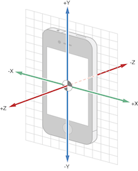\

An accelerometer measures x, y, z acceleration at points in time. Let's call one group of x, y, z coordinates at a point in time a triple. The sampling rate of the accelerometer, which can often be calibrated, determines the number of triples the accelerometer returns per second. For instance, an acceleroemeter with a sampling rate of 100 returns 100 x, y, z triples each second. Each x, y, z triple indicates the acceleration in each of the directions at that point in time. 

TODO: Can I call this a triple?

## Let's Talk About a Walk

When a person walks, they bounce slightly with each step. This bounce, if you are walking on Earth (or another big ball of mass floating in space) is always in the same direction as gravity. A pedometer can count steps by counting the number of bounces in the direction of gravity.

Let's look at person walking with smartphone containing an accelerometer held in the position depicted below.

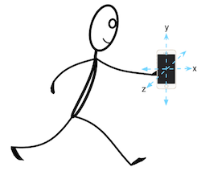\

For the sake of simplicity, we'll assume that:

* the stick man is walking in the x direction, with step bounces in the y direction, and no motion in the z direction;
* the phone remains in the same position throughout the entire walk;
* the bounces created by each step are identical;
* the accelerometer is perfectly accurate.

Ah, the joys of a perfect world, that we only ever really experience in texts like these. Don't fret, we'll deal with an imperfect, but real and more exciting world soon.

The phone in the example above is positioned such that the y direction is the one in the direction of gravity. Since we want to count the number of bounces in the direction of gravity, and y is the only direction affected by gravity with the current position, we can completely ignore x and z. 

The accelerometer is picking up the person's acceleration in the y direction, which is due to the bounces in their steps. In our perfect world, these bounces form a perfect sine wave. Each cycle in the waveform is exactly one step. So, when we can completely ignore x and z, acceleration in the y direction should look like the diagram below, and we can count cycles in code by counting the number of times that our waveform crosses the x-axis in the positive direction. Easy, right?

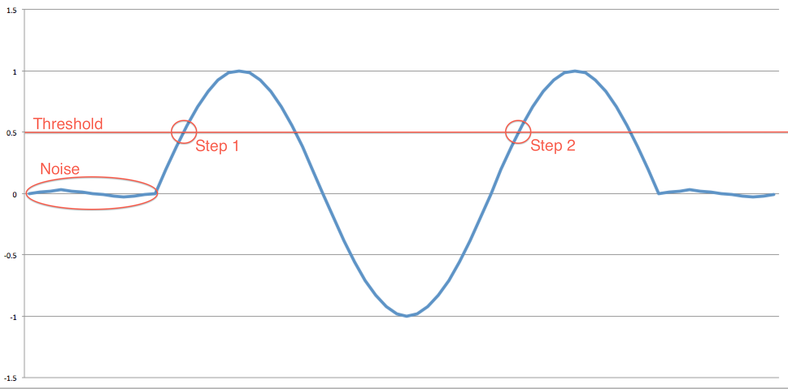\

Wrong. Nothing is ever easy. Where's the fun in that? There's a bit of a kicker here. 

## Even Perfect Worlds Have Fundamental Forces of Nature

Even in our perfect world, gravity exists, so there is a constant acceleration in the direction of gravity at $-9.8m/s^2$. The total acceleration ($a_{t}$) measured by our accelerometer, then, is the sum of user acceleration ($a_{u}$), and gravitational acceleration ($a_{g}$), where user acceleration is the acceleration that the user imparts on the device: $a_{t} = a_{u} + a_{g}$. This means that in our perfect world acceleration in the y direction actually looks like this:

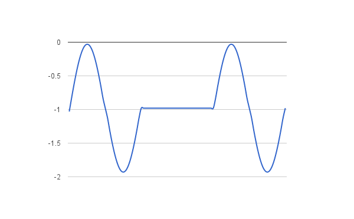\

Uh oh. We can no longer count when the waveform crosses the x-axis. We'll have to isolate user acceleration in order to use our x-axis method of counting steps. We can isolate user acceleration like so: 

$a_{t} = a_{u} + a_{g}$\
$a_{t} = a_{u} - 0.98$\
$a_{u} = a_{t} + 0.98$

This means that we can simply add 0.98 to every single y value, resulting in the first graph we saw, and making our step counting once again a matter of counting the points when the sine wave crosses the x-axis in the positive direction. 

What if, however, our silly stick man holds the phone in a more wonky, but still consistent, position?

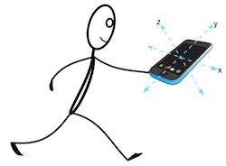\

Yikes. Gravitational acceleration is now split amongst all directions: part of the acceleration added in the x direction, part in the y direction, and part in the z direction. To make matters worse, what if our stick man decides to rotate his phone part way through the walk?

Our pefect world just got a little more real, and now we have two problems:

1. Isolating user acceleration from gravitational acceleration. Separating total acceleration into gravitational acceleration and user acceleration isn't a simple matter of adding 0.98 to a single direction.
2. Isolating movement in the direction of gravity. We can no longer ignore the x and z directions and simply take the data from the y direction.

Every problem has a solution. Let's look at each problem separately, and put on our mathematician hats. 

## 1. Isolating user acceleration from gravitational acceleration

When the phone is held in such a way that the gravitational acceleration affects more than one coordinate, we need to find a way to completely separate user acceleration from gravitational acceleration. We can do that using a tool called a low-pass filter.

### Low-pass Filter
A filter is a tool used in signal processing to remove an unwanted component from a signal. Our total acceleration sine wave is considered a signal. In our case, we want to remove user acceleration from our total acceleration signal, so that we're left with just the gravitational component. Once we have that, we can subtract gravitational acceleration from the total acceleration, and we'll be left with user acceleration. In this way, we'll have three sets of data at the end, one for the total acceleration, one for gravitational acceleration on its own, and one for user acceleration on its own. 

A low-pass filter is a filter that allows low-frequency signals through, while attenuating signals higher than a set threshold. In our sitation, gravitational acceleration is a 0 Hz signal because it's constant, while user acceleration is not. This means that if we pass our signal through a low-pass filter, we'll allow the gravitational component of the signal to pass through, while removing the user acceleration component. There are numerous varieties of low-pass filters, but the one we'll use is called a Chebyshev filter. We've chosen a Chebyshev filter because it has a steep cutoff, which means that it very quickly attenuates frequencies beyond our threshold, which is ideal for isolating a 0 Hz signal like gravity. 

### Implemeting a Low-pass Filter
Let's have a look at an example of total acceleration, $a_{t}$.

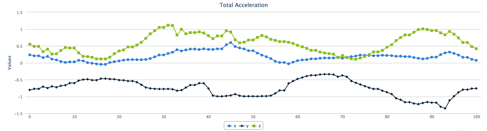\ 

To filter out gravitational acceleration, $a_{g}$, we use the low-pass filter formula $a_{gn} = \alpha_{0} * (a_{tn} * \beta_{0} + a_{tn-1} * \beta_{1} + a_{tn-2} * \beta_{2} - a_{gn-1} * \alpha_{1} - a_{gn-2} * \alpha_{2})$. The $\alpha$ and $\beta$ values are set based on the type of filter, in this case, the Chebyshev filter. Notice that the resulting gravitational acceleration is constant, as we expected.
TODO: Expland the section on calculating alpha and beta?

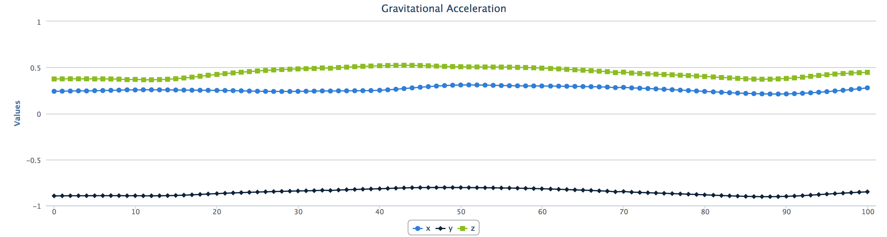\ 

To receive user acceleration, $a_{u}$, we can subtract gravitational acceleration from total acceleration, $a_{u} = a_{t} - a_{g}$.

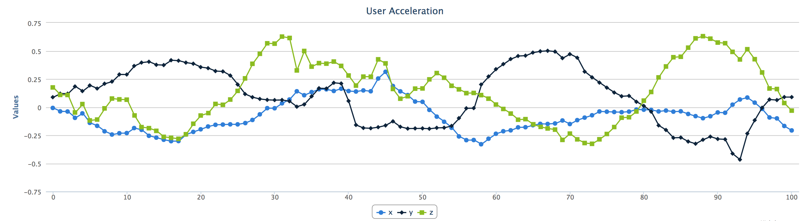\ 

## 2. Isolating movement in the direction of gravity
When gravity acts on our phone in multiple directions, how do we isolate acceleration in the direction of gravity, so that we can count bounces? We need to find a way to take just the movement in the direction of gravity from each of the x, y, and z directions. First, a very small amount of liner algebra 101. 

### The Dot Product

The dot product takes two signals of equal length and returns a single signal. 
In solving problem one above, we have our total acceleration signal separated into a gravitational acceleration signal and a user acceleration signal. So, what will happen if we take the dot product of user acceleration and gravitational acceleration?

TODO: Add image of summation from wikipedia, and vectors.

So, the dot product of user acceleration and gravitational acceleration results in the portion of user acceleration in the direction of gravity. 
TODO: Expand?

TODO: Add graphs from trial view showing original data and dot product data.

TODO: Start: Add this somewhere else...
All current iPhone and Android devices come with an accelerometer as well as a gyroscope, so they're able to separate gravitational acceleration from user acceleration. TODO: Expand this explanation.

However, we're creating a robust, flexible program, so we've decided that we want to accept input data from the newest of mobile devices, as well as from pure hardware accelerometers. This means that we'll need to accept input data in two formats: a **separated** format where user acceleration and gravitational acceleration are, well, separated; and a **combined** format which only provides us with total acceleration. 
TODO: End: Add this somewhere else...

# The Toolchain
We've decided to build a simple web app to process and analyze our data. A web app naturally separates the data processing from the presentation of the data, and since web apps have been build many times over, we may as well use a framework to do the boring plumbing work for us. The Sinatra framework does just that. In the tool's own words, Sinatra is "a DSL for quickly creating web applications in Ruby". Perfect. 

If I have to sell you on using Ruby, I'll try and do that with a quote from Ruby's creator, Yukihiro Matsumoto:

"I hope to see Ruby help every programmer in the world to be productive, and to enjoy programming, and to be happy. That is the primary purpose of the Ruby language."

Ruby will stay out of our way, it's flexible, and concise, and has been used on the web for over 10 years. And, it was *made* to make us happy. What more can we ask for?

Since we're building a web app, we'll need a web server, so we'll use the thin web server. It's simple and certainly fast enough for our purposes. 

The last tool we'll be including is a JavaScript library called Highcharts, used for creating interactive charts. What's the point of interesting data if we can't display it in interesting ways? 

# The Platform

TODO: Option 1 
Our goal for this chapter is to create a web application that takes, as input, data from an accelerometer that a person carries during a walk, and outputs the number of steps taken, along with some additional information like distance and elapsed time. 

OR TODO: Option 2
Before we dive into code, let's talk about what we're building. We want a web app that allows us to:

1. Upload data in the combined or separated format.
2. Input some basic information about the data set (sampling rate, actual step count, gender/height/stride of user, etc.)
3. Parse and analyze our data, outputting the number of steps taken, distance traveled, and time elapsed, and present charts representing the data in different processing stages.

The meat and potatoes of our program is in step 3, where we parse and analyze the input data. It makes sense, then, to start with that, and build the web app and interface later, once we have some outputs to work with.

## Parsing Input Data

Let's look at what our input data will look like in each format. 

### Combined Format

The first, more rudimentary data format we'll accept is in the combined format. Data in the combined format is simply total acceleration in the x, y, z directions, over time. 

$"x1,y1,z1;...xn,yn,zn;"$

Below is a small portion of data, sampled 100 times per second, of a female walking with an iPhone in her pocket.

\ 

### Separated Format

The second data format we'll accept is user acceleration in the x, y, z directions separated from gravitational acceleration in the x, y, z directions, over time:

$"x1_{u},y1_{u},z1_{u}|x1_{g},y1_{g},z1_{g};...xn_{u},yn_{u},zn_{u}|xn_{g},yn_{g},zn_{g};"$

Below is the separated data format of the exact same walk as the plot above. This time, we have two plots, one for user acceleration, and one for gravitational acceleration.

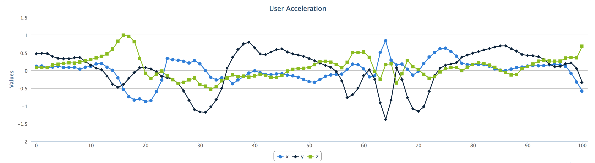
\ 

### Making Sense of Data

Looking at our plots, we can start to see a pattern. We notice where the flatter parts of the data are, and where the steps likely occur. However, we don't have enough, yet, to count steps. 

We need to do 3 things to our input data:

1. Parse our text data and extract numerical data.
2. Isolate movement in the direction of gravity.
3. Filter our data series and smooth out our waveform to make it easier to analyze.

These 3 tasks are related, and it makes sense to combine them into one class called a **Parser**. 

## The Parser Class

~~~~~~~
class Parser

  GRAVITY_COEFF = {
    alpha: [1, -1.979133761292768, 0.979521463540373],
    beta:  [0.000086384997973502, 0.000172769995947004, 0.000086384997973502]
  }
  
  SMOOTHING_COEFF = {
    alpha: [1, -1.80898117793047, 0.827224480562408], 
    beta:  [0.095465967120306, -0.172688631608676, 0.095465967120306]
  }  

  FORMAT_COMBINED  = 'combined'
  FORMAT_SEPARATED = 'separated'

  attr_reader :data, :format, :parsed_data, :dot_product_data, :filtered_data

  def initialize(data)
    @data = data.to_s

    parse_raw_data
    dot_product_parsed_data
    filter_dot_product_data
  end

  def is_data_combined?
    @format == FORMAT_COMBINED
  end

private

  def split_accl_combined(accl)
    @format = FORMAT_COMBINED
    
    accl = accl.flatten.map { |i| i.split(',').map(&:to_f) }
    split_accl = accl.transpose.map do |total_accl|
      grav = chebyshev_filter(total_accl, GRAVITY_COEFF)
      user = total_accl.zip(grav).map { |a, b| a - b }
      [user, grav]
    end
    split_accl.transpose
  end

  def split_accl_separated(accl)
    @format = FORMAT_SEPARATED
    
    accl = accl.map { |i| i.map { |i| i.split(',').map(&:to_f) } }
    [accl.map {|a| a.first}.transpose, accl.map {|a| a.last}.transpose]
  end

  def parse_raw_data
    accl = @data.split(';').map { |i| i.split('|') }
    
    split_accl = if accl.first.count == 1
      split_accl_combined(accl)
    else
      split_accl_separated(accl)
    end

    user_accl, grav_accl   = split_accl
    user_x, user_y, user_z = user_accl
    grav_x, grav_y, grav_z = grav_accl
    
    @parsed_data = []
    accl.length.times do |i|
      @parsed_data << { x: user_x[i], y: user_y[i], z: user_z[i],
                        xg: grav_x[i], yg: grav_y[i], zg: grav_z[i] }
    end
  rescue
    raise 'Bad Input. Ensure data is properly formatted.'
  end

  def dot_product_parsed_data
    @dot_product_data = @parsed_data.map do |data|
      data[:x] * data[:xg] + data[:y] * data[:yg] + data[:z] * data[:zg]
    end
  end

  def filter_dot_product_data
    @filtered_data = chebyshev_filter(@dot_product_data, SMOOTHING_COEFF)
  end

  def chebyshev_filter(input_data, coefficients)
    output_data = [0,0]
    (2..input_data.length-1).each do |i|
      output_data << coefficients[:alpha][0] * 
                      (input_data[i]    * coefficients[:beta][0] +
                       input_data[i-1]  * coefficients[:beta][1] +
                       input_data[i-2]  * coefficients[:beta][2] -
                       output_data[i-1] * coefficients[:alpha][1] -
                       output_data[i-2] * coefficients[:alpha][2])
    end
    output_data
  end

end
~~~~~~~

Let's start with the initialize method. Our parser class takes string data as input and stores it in the @data instance variable. It then calls three methods in sequence: parse_raw_data, dot_product_parsed_data, and filter_dot_product_data. 

Each method accomplishes one of our three steps above. Let's look at each method individually. 

## Step 1: Parsing text to extract numerical data (parse_raw_data)

The goal of parse_raw_data is to convert string data to a format we can more easily work with, and store it in @parsed_data. 

At this stage, we have two possible data formats, combined and separated, as string data. We need to parse both into numerical data, and, as we discovered before, we need some extra work on the combined format to split out user acceleration from gravitational acceleration. 

TODO: Tie in low pass filtering from above, and talk about the Chebyshev filter specifically.

### Back to our code
It's wise for us, while we're parsing our string data to numerical data, to parse all incoming data into one data format that the rest of our program can use. That way, if we ever have to add a third data format (or fourth, or fifth, or, well, you get the idea) we only have to change the parse_raw_data method. 

TODO: Look up GOF pattern here. Talk about separation of concerns? Only this method needs to know about the multiple data formats.

TODO: Discuss why the separated format is more accurate than the combined format?

The first line splits the string by semicolon into as many arrays as samples taken, and then splits each individual array by the pipe, storing the result in accl.

We determine the input format by the first element of accl, which is an array. 

* accl in the combined format: $[["x1,y1,z1"],...["xn,yn,zn"]]$
* accl in the separated format: $[["x1_{u},y1_{u},z1_{u}", "x1_{g},y1_{g},z1_{g}"],...["xn_{u},yn_{u},zn_{u}", "xn_{g},yn_{g},zn_{g}"]]$

If the array has exactly one element, we know that our input format is combined. Otherwise, our input format is separated. Based on this, we call either split_accl_combined or split_accl_separated. Each of these methods sets the @format instance variable, and generates data in the format below. We store this result in split_accl:

$[[[x1_{u},...xn_{u}], [y1_{u},...yn_{u}], [z1_{u},...zn_{u}]],
[[x1_{g},...xn_{g}], [y1_{g},...yn_{g}], [z1_{g},...zn_{g}]]$

TODO: Dig into the details of split_accl_combined and split_accl_separated. Specifically, chat about how split_accl_combined low pass filters to grab the gravitational data.

The next line splits out the split_accl array into user_accl and grav_accl, which are both arrays of arrays, with user acceleration in the x, y, z directions and gravitational acceleration in the x, y, z directions, respectively. The two lines following split each of user_accl and grav_accl into their x, y, z components:

\ 

In order to get one data series we can work with, we then create an array of hashes in the format below, and store it in @parsed_data.

$[\lbrace x\colon x1_{u}, y\colon y1_{u}, z\colon z1_{u}, xg\colon x1_{g}, yg\colon y1_{g}, zg\colon z1_{g} \rbrace,...\lbrace x\colon xn_{u}, y\colon yn_{u}, z\colon zn_{u}, xg\colon xn_{g}, yg\colon yn_{g}, zg\colon zn_{g}\rbrace]$

The entire purpose of the parse_raw_data method is to take input data in one of two formats, and output data in this more workable format.

## Step 2: Isolating movement in the direction of gravity (dot_product_parsed_data)

TODO: Add graphs from trial view showing original data and dot product data. Does this belong here, or in the explanation above?

Taking the dot product in our Parser class is straightforward. We add a @dot_product_data instance variable, and a method, dot_product_parsed_data, to set that variable. The dot_product_parsed_data method is called immeditely after parse_raw_data in the initializer, and iterates through our @parsed_data hash, calculates the dot product with map, and sets the result to @dot_product_data. 

## Step 3: Filtering our data series

Again, back to the mathematics for some signal processing 101.

TODO: Basics of filtering, Chebyshev filter specifically

TODO: Add graphs from trial view showing dot product data and filtered data.

Following the pattern from steps 1 and 2, we add another instance variable, @filtered_data, to store the filtered data series, and a method, filter_dot_product_data, that we call from the initializer.

The filter_dot_product_data method initalizes the data series by setting the first two elements to 0, and then iterates through the remaining element indeces in @dot_product_data, applying the Chebyshev filter. 

### Our Parser class in the wild

Our Parser now takes string data in the separated format, converts it into a more useable format, isolates movement in the direction of gravity through the dot product operation, and filters the resulting data series to smooth it out. 

Our parser class is useable on its own as is. An example with combined data:

~~~~~~~
> data = '0.123,-0.123,5;0.456,-0.789,0.111;-0.212,0.001,1;'
> parser = Parser.new(data)

> parser.format
=> 'combined'
> parser.parsed_data
=> [{:x=>0.123, :y=>-0.123, :z=>5.0, :xg=>0, :yg=>0, :zg=>0},
    {:x=>0.456, :y=>-0.789, :z=>0.111, :xg=>0, :yg=>0, :zg=>0},
    {:x=>-0.2120710948533322,
   	 :y=>0.0011468544965549535,
   	 :z=>0.9994625125426089,
   	 :xg=>7.109485333219216e-05,
     :yg=>-0.00014685449655495343,
     :zg=>0.0005374874573911294}]
> parser.dot_product_data
=> [0.0, 0.0, 0.0005219529804999682]
> parser.filtered_data
=> [0, 0, 4.9828746074755684e-05]
~~~~~~~

An example with separated data:

~~~~~~~
> data = '0.028,-0.072,5|0.129,-0.945,-5;0,-0.07,0.06|0.123,-0.947,5;0.2,-1,2|0.1,-0.9,3;'
> parser = Parser.new(data)

> parser.format
=> 'separated'
> parser.parsed_data
=> [{:x=>0.028, :y=>-0.072, :z=>5, :xg=>0.129, :yg=>-0.945, :zg=>-5}, 
	{:x=>0, :y=>-0.07, :z =>0.06, :xg=>0.123, :yg=>-0.947, :zg=>5},
	{:x=>0.2, :y=>-1.0, :z=>2.0, :xg=>0.1, :yg=>-0.9, :zg=>3.0}]
> parser.dot_product_data
=> [-24.928348, 0.36629, 6.92]
> parser.filtered_data
=> [0, 0, -1.7824384769309702]
~~~~~~~

### Things to note
* Ability to pass in either format and the Parser determines it. It's the only class that has to be concerned with it. 
* ...

### Where to improve
* Exception handling in parse_raw_data can be more specific (rather than capturing any error that occurs)

## Pedometer functionality

Our pedometer will measure 3 metrics:

1. Distance traveled
2. Time traveled
3. Steps taken

Let's discuss the infomation we'll need to calculate each of these metrics. We're intentionally leaving the exciting, step counting part of our program to the end.

### Distance traveled
A mobile pedometer app would generally be used by one person. The stride length of that person would be a necessary value to determine distance traveled, which is simply the steps taken multiplied by the stride length. The pedometer can ask the user to input their info.

If the user can directly provide their stride length, then we're good to go. If not, and they provide their gender and their height, we can use $0.413 * height$ for a female, and $0.415 * height$ for a male. 

If they only provide their height, we can use $(0.413 + 0.415)/2 * height$, averaging the two multipliers. 

If they only provide their gender, we can use the average of 70 cm for a female, and 78 cm for a male.

Finally, if the user does not wish to provide any information, we can simply take the average of 70 cm and 78 cm and set the stride length to 74 cm.

TODO: Do I need to add references for multipliers and averages above? Can we just say some basic research turned up these numbers, but we're free to change them if more accurate ones are uncovered?

All of this information is related to the user, so it makes sense to include it in a User class. 

~~~~~~~
class User

  GENDER      = ['male', 'female']
  AVERAGES    = {'female' => 70, 'male' => 78}
  MULTIPLIERS = {'female' => 0.413, 'male' => 0.415}

  attr_reader :gender, :height, :stride

  def initialize(gender = nil, height = nil, stride = nil)
    @gender = gender.to_s.downcase if GENDER.include? gender.to_s.downcase
    @height = height.to_f if height.to_f > 0
    @stride = (stride.to_f > 0) ? stride.to_f : calculate_stride
  end

private

  def calculate_stride
    if gender && height
      MULTIPLIERS[@gender] * height
    elsif height
      height * (MULTIPLIERS.values.reduce(:+) / MULTIPLIERS.size)
    elsif gender
      AVERAGES[gender]
    else
      AVERAGES.values.reduce(:+) / AVERAGES.size
    end
  end

end
~~~~~~~

Things to note:

* Information is optional. The class handles it.
* Magic numbers are defined at the top.
* Basic input data formatting in the initalizer allows for a case insensitive gender parameter, prevents a non-numerical height and stride or a height and stride less than 0. Finally, the stride is calculated through the calculate_stride method unless a valid stride is provided.
* Even when all parameters are provided, the input stride takes precedence. 

### The User class in the wild

The User class is straightforward to use. Below are examples of users created with the least specific to the most specific data:

* Without any parameters
* A gender parameter
* A height parameter
* Gender and height parameters
* A stride parameter
* All parameters

~~~~~~~
> User.new.stride
=> 74
> User.new('Female').stride
=> 70
> User.new(nil, '167.5').stride
=> 69.345
> User.new('male', 191).stride
=> 79.265
> User.new(nil, nil, '80').stride
=> 80.0
> User.new('female', 1, '72').stride
=> 72.0
~~~~~~~

### Time Traveled

The time traveled is measured by dividing the number of data samples in our Parser's @parsed_data set by the sampling rate of the device. Since the rate has more to do with the device itself than the user (and the user in fact does not have to be aware of the sampling rate), this looks like a good time to create a Device class. 

~~~~~~~
class Device

  attr_reader :rate, :method, :steps, :trial

  def initialize(rate = nil, steps = nil, trial = nil, method = nil)
    @rate   = (rate.to_f.round > 0) ? rate.to_f.round : 100
    @steps  = steps.to_f.round if steps.to_f.round > 0
    @trial  = trial
    @method = method
  end

end
~~~~~~~

Our device class is quite simple. Note that all of the attribute readers are set in the initializer based on parameters passed in. All of the other attributes are simply metadata:

* method is used to set the type of walk that is taken (walk with phone in pocket, walk with phone in bag, jog, etc.)
* steps is used to set the actual steps taken, so that we can record the difference between the actual steps the user took and the ones our program counted.
* trial is a title for the specific trial (trial 1, 2, 3, etc.)

Things to note:

* Much like our User class, information is optional. The class handles it.
* Basic input data formatting in the initalizer ensures that rate and steps are always numerical values greater than 0.
* One could argue that metadata doesn't really belong in the Device class. For the sake of keeping our small program simple, we included the metadata in this class because it's more logical here than in the User class, and to avoid too much abstration for too little code. However, as our program grows and we have more metadata and more attributes related to the device, it would be wise to split the Device class apart from the metadata. 

Our Device class is straightforward to use, so we won't bore you with the details of showing it in the wild. 

### Steps taken
Our Parser's @parsed_data waveform is created by the bounces in the z-direction of a person as they take a step. Each cycle of our waveform represents a single step taken. Therefore, counting steps is a matter of counting the number of peaks or the number of troughs in our Parser's @parsed_data waveform. 

But, how do we count peaks or troughs in code? Let's assume for this discussion that we're deciding to count peaks. 

If we had a perfect waveform, we could simply count the number of times that a point is numerically lower than the point before it. However, while our smoothing algorithm is good, it's not perfect. Examine the waveform below. 

TODO: Add waveform graph that shows too many peaks, with 4 major peaks.

We can tell by looking at it that there are 4 peaks, but the circled areas would also be counted as peaks with the algorithm we described above. Unfortunately, even with our smoothing algorithm, we can't depend on a perfect waveform, so we'll have to use a similar method that accomodates an imperfect waveform. 

Examine the waveform below with a line parallel to the x-axis. This line is below all of the peaks, but not so far down the y-axis that it's below any of the troughs. 

TODO: Add graph of waveform with threshold line.

This line can be used as a threshold. If we count each time our waveform crosses the line in the positive y direction, we'll achieve the same result as counting peaks, and therefore counting steps. 

We can count troughs in a similar fashion, by using a threshold that is exactly the negative of our previous threshold. 

If we assume that we're just as likely to accuarately count peaks as we are to count troughs, we'll get the most accurate result by counting both and taking the average of the two to determine our final step count. This will remove some error from certain data sets that have less prominent peaks or troughs. 

Alright, back to some code. So far, we have a Parser class that contains our parsed waveform, and classes that give us the necessary information about a user and a device. What we're missing is a way to analyze the @parsed_data waveform with the information from User and Device, and count steps, measure distance, and measure time. The analysis portion of our program is different from the data manipulation of the Parser, and different from the information collection and aggregation of the User and Device classes. Let's create a new class called Analyzer to perform this data analysis.

~~~~~~~
require 'mathn'
require_relative 'parser'
require_relative 'user'
require_relative 'device'

class Analyzer

  MAX_STEPS_PER_SECOND = 6.0
  THRESHOLD = 0.2

  attr_reader :parser, :user, :device, :steps, :distance, :time

  def initialize(parser, user = User.new, device = Device.new)
    raise "Parser invalid." unless parser.kind_of? Parser
    raise "User invalid."   unless user.kind_of? User
    raise "Device invalid." unless device.kind_of? Device

    @parser = parser
    @user   = user
    @device = device
  end

  def measure
    measure_steps
    measure_distance
    measure_time
  end

private

  # -- Edge Detection -------------------------------------------------------

  def count_edges(positive)
    count           = 0
    index_last_step = 0
    threshold       = positive ? THRESHOLD : -THRESHOLD
    min_interval    = (@device.rate/MAX_STEPS_PER_SECOND)

    @parser.filtered_data.each_with_index do |data, i|
      # If the current value >= the threshold, and the previous was < the threshold
      # AND the interval between now and the last time a step was counted is 
      # above the minimun threshold, count this as a step
      if (data >= threshold) && (@parser.filtered_data[i-1] < threshold)
        next if index_last_step > 0 && (i-index_last_step) < min_interval
        count += 1
        index_last_step = i
      end
    end
    count
  end

  # -- Measurement ----------------------------------------------------------

  def measure_steps
    positive_edge_count = count_edges(true)
    negative_edge_count = count_edges(false)
    
    @steps = ((positive_edge_count + negative_edge_count)/2).to_f.round
  end

  def measure_distance
    @distance = @user.stride * @steps
  end

  def measure_time
    @time = @parser.parsed_data.count/@device.rate
  end

end
~~~~~~~

Where our Parser class did all of the work of the input data cleaning, our Analyzer class does the work of analyzing the cleaned data.

The first thing we do in our Analyzer class file is pull in the Ruby math library, along with our Parser, Device, and User classes. Then, we define constants to represent the maximum number of steps taken per second (used for error correction which we'll disucss in a moment), and a value for our threshold. For the purposes of this discussion, let's assume we've analyzsed numerous diverse data sets and detemined a value for the threshold that accomodated the largest number of those data sets. 

Our Analyzer's initializer take a mandatory Parser because we necessarily need a data set to work with, and optionally takes a User and a Device. Note that the default values for those parameters is a new instance of each. Remember how those classes both had defualt values and could handle zero input parameters? That functionality comes in handy here. Note that the initializer raises exceptions if classes other than those expected are passed in, since we can't work with incorrect class types. Otherwise, all it does is set the instance variables @parser, @user, @device to the passed in parameters. 

The only other public method in Analyzer is measure, which calls the private methods measure_steps, measure_distance, and measure_time, in that order. Let's look at each:

### measure_steps

Finally! The step counting portion of our step counting app. 

The measure steps method counts the positive edges (the peaks) and the negative edges (the troughs) through the count_edges method, and then simply sets the @steps variable to the average of the two. The count_edges method takes a boolean parameter to determine whether we're counting peaks or troughs. The method iterates through each point in our parser's @filtered_data attribute to count steps. At the start of the method, we instantiate the following variables:

* count is used to keep track of the step count as we interate through our loop. This is, obviously, initialized to 0.
* index_last_steps keeps the index of the step before the one we're on when looping through @filtered_data.
* threshold uses the THRESHOLD constant but toggles between negative/positive depending on whether we're counting peaks or troughs. If we're counting peaks, we want a positive threshold above the x-axis. If we're counting troughs, we want a negative threshold below the x-axis. 
* min_interval is the minimum number of samples between steps. This is used to prevent counting steps that are impossibly close together. 

Let's take a closer look at the loop. We loop through filtered_data, keeping track of the value of each point in data, and the index in i. If our point value, data, is greater than or at the threshold and our previous point was below, then we're crossing the threshold in the positive y direction. We can count a step here, as long as the last step was not counted too close to this one. We determine this by comparing the difference between our current index and the index of the last step, if it exists, to our min_interval variable. If we're far enough away, we count our step by incrementing count, and set the index_last_step to the current index. The method returns the value in count as the total steps taken. 

There we have it, the step counting portion of our program. 

### measure_distance

The distance is simply measured by miltuplying our user's stride by the number of steps. Since the distance depends on the step count, the measure method calls it after the step count has been calcualted, and keeps the method private so that an outside class can't call in before the measure_steps. 

### measure_time

Time is also a trivial calculation, dividing the total number of samples (the number of points in our parser's filtered_data attribute) by the rate (samples/second). Time then, obviously, is returned in numbers of seconds. 

Things to Note:

* The value for threshold can eventually become dynamic based on the user and the calculated versus actual steps they've taken. A learning algorithm, if you will.
* We do some error handling in count_edges by ensuring that steps aren't impossibly close together. We can go a step further (pun intended?) by counting the number of false steps, and if we have too many, avoiding counting steps at all until some reasonable number of samples. That'll prevent any steps from being counted when the phone is shaken vigorously for a period of time. 
* TODO: There should be more here.

TODO: Add some examples here of plots showing a single trial with comibned and separated input data at each stage, and compare the final, parsed results. 

## Adding some friendly

We're through the most labour intensive part of our app. Now, all that's left is to present the data in a format that is pleasing to a user. It makes sense to create a very simple web app that allows a user to input a data set through a file upload (in our two formats!) and output the steps taken, distance traveled, time traveled, and maybe a few plots to display the data. 

Let's look at our app from a user's perspective before we dive into the code. 

When a user first enters the app, they see an empty table of trials, and an upload form. The upload form has fields for the user to enter device info and user info.

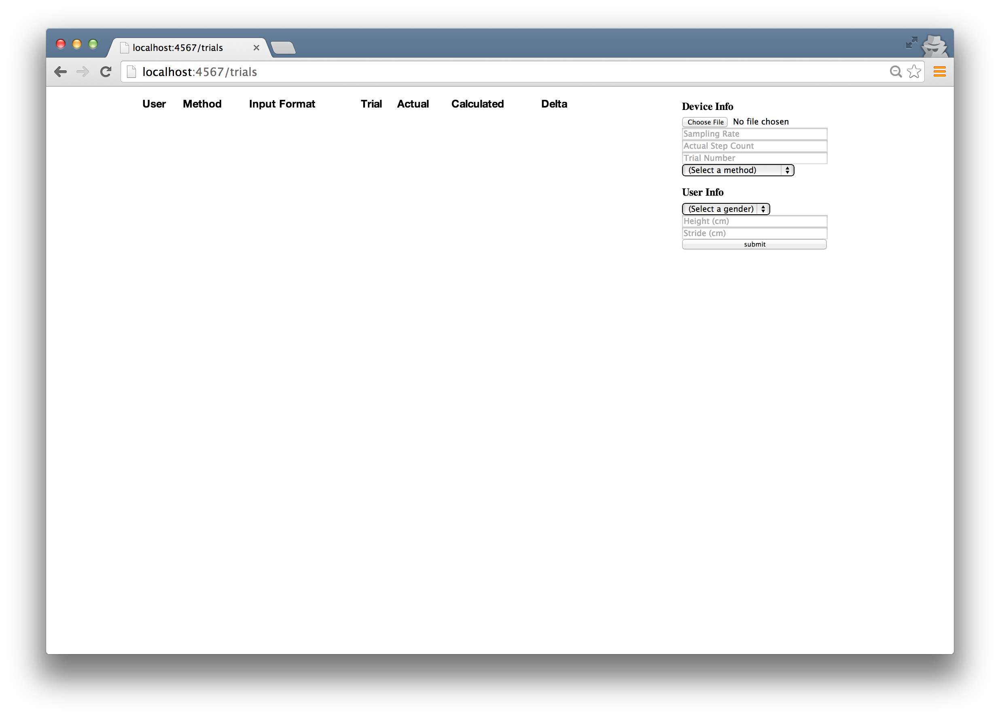\ 

Let's suppose the user uses the upload form to upload a trial walk with a phone in their pocket. 

\ 

Note that the user has entered everything but their stride. From this same trial, they have two text files of the exact same trial, one in each of our formats. In the screenshot below, they've chosen to upload one of the files. Hitting submit presents them with the following view:

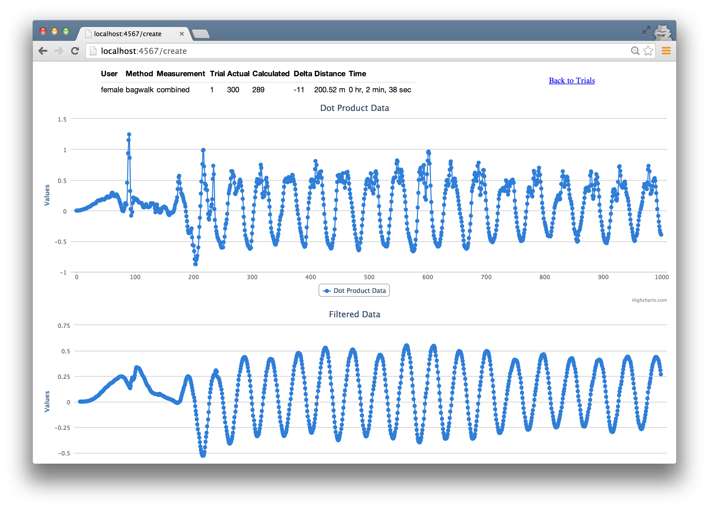\ 

Our program has parsed and analyzed the input file, and presented information at the very top for the user. The fields that our program calculated are the format of the file (Measurement), the calculated steps taken (Calculated), the difference between the calculated steps and actual steps taken (Delta), the distance traveled (Distance), and time it took (Time). The graphs shown are the dot product and the filtered data. 

The user can navigate back to the trials using the *Back to Trials* link, and upload the second file.

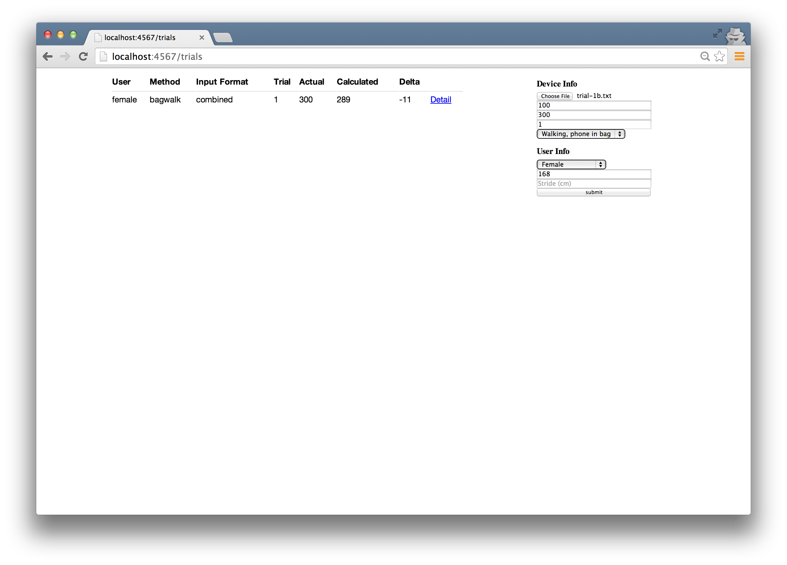\ 

As long as the user enters the same input in all text and dropdown fields, the program knows that this is the same trial, and outputs the following:

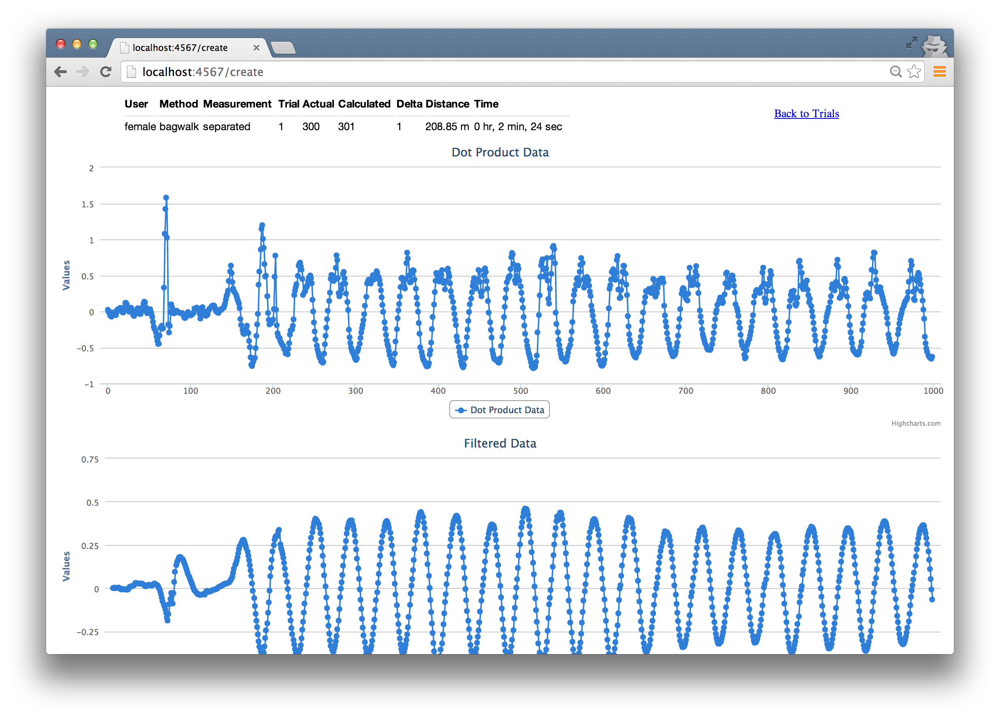

Note that since this trial is the separated format, it is more accurate than the combined format.

### Diving back to the code

Let's jump back in and talk about how we create our simple web app. 

TODO: Do I need to add a small MVC and web apps section here?

When building a web application, the functionality of the web app and the user experience should, ideally, be mostly locked down before the code is written. Assuming this perfect world, let's look at what the outlined funtionality above implies for us, technically. We'll need two major components that we don't yet have:

1. A way to store data that a user inputs, and load data that a user has previously inputted.
2. A web application with a basic interface.

Let's examine each of these two requirements.

### 1. Storing and loading data

Looking at the requirements, we see that we need a way to store the data the user inputs as a text file, as well as the user and device data associated to it. All of this data together - the raw text data as well as the input fields - is related to a trial. Let's create a Trial class to keep track of this data, and store and load it. 

~~~~~~~
require 'fileutils'
require_relative 'analyzer'

include FileUtils::Verbose

class Trial

  attr_reader :file_name, :parser, :user, :device, :analyzer
  attr_reader :user_params, :device_params

  def initialize(file_name = nil, input_data = nil, user_params = nil, device_params = nil)
    if file_name
      @file_name = file_name
    elsif input_data
      @parser = Parser.new(File.read(input_data))
      @user   = User.new(*user_params)
      @device = Device.new(*device_params)

      @file_name = "public/uploads/" + 
                   "#{user.gender}-#{user.height}-#{user.stride}_" +
                   "#{device.rate}-" + 
                   "#{device.steps}-" +
                   "#{device.trial.to_s.gsub(/\s+/, '')}-" + 
                   "#{device.method}-#{parser.format[0]}.txt"
    else 
      raise 'File name or input data must be passed in.'
    end
  end

  # -- Class Methods --------------------------------------------------------

  def self.create(input_data, user_params, device_params)
    trial = self.new(nil, input_data, user_params, device_params)
    cp(input_data, trial.file_name)
    trial
  end

  def self.find(file_name)
    self.new(file_name)
  end

  def self.all
    file_names = Dir.glob(File.join('public/uploads', "*"))
    file_names.map { |file_name| self.new(file_name) }
  end

  # -- Instance Methods -----------------------------------------------------

  def parser
    @parser ||= Parser.new(File.read(file_name))
  end

  def user
    @user ||= User.new(*file_components.first.split('-'))
  end

  def device
    @device ||= Device.new(*file_components.last.split('-')[0...-1])
  end

  def analyzer
    unless @analyzer
      @analyzer = Analyzer.new(parser, user, device)
      @analyzer.measure
    end
    @analyzer
  end

private

  def file_components
    @file_components ||= file_name.split('/').last.split('_')
  end

end
~~~~~~~

Since we're dealing with storage and retrieval of data here, our Trial class has more class level methods than our previous classes. This is best explained when we can observe how our Trial class is used. 

When using the browser upload field, the browser creates a tempfile for the uploaded file, that our app has access to. To create a Trial, the create method is used, passing in the location of a tempfile, as well as user and device input parameters as arrays. 

~~~~~~~
> Trial.create('test/data/trial-1.txt', ['female', '168', '71'], ['100', '10', '1','run'])
cp test/data/trial-1.txt public/uploads/female-168.0-71.0_100-10-1-run-c.txt
=> #<Trial:0x007fa25b8be8b8>
~~~~~~~

The create method calls the constructor, passing in nil for the file_name, and the tempfile and user and device parameters. The constructor then creates and sets Parser, User, and Device objects, and generates a filename. Finally, the create method copies the tempfile to the filesystem, using the file_name from the Trial object, and saves it to 'public/uploads/'. The Trial object is returned. 

Now the we have our trial saved to the file system, we need a way to retireve it. We do that with the find class method. 

~~~~~~~
> trial = Trial.find('public/uploads/female-168.0-70.0_100-100-1-walk-c.txt')
=> #<Trial:0x007fa25b8dec80>
~~~~~~~

Like the create method, find calls into the constructor, but passes only the file_name. All the constructor does at that point is set the file_name instance method on the instance of Trial. 

We can now ask for the parser, user, device, or analyzer objects directly from our trial instance. Notice that all of these variables are lazy loaded, to prevent creation and parsing until needed. The user and device instance methods parse the file_name to retirve the necessary parameters to create the objects, and the parser method reads the data from the file itself. 

The all class method simply grabs all of the files in our public/upoads folder, and creates trial objects, returning an array of all trials. 

~~~~~~~
> Trial.all
=> [#<Trial:0x007f8a8a03b2b0>, #<Trial:0x007f8a8a03b288>, #<Trial:0x007f8a8a03b238>, #<Trial:0x007f8a8a03b210>, #<Trial:0x007f8a8a03b148>]
~~~~~~~

Our Trial object has the ability to store and retireve data from and for the user, and can create and return all of the other objects to our program. Let's move on to the web application side of our program to see how Trial will be helpful.

### Things to note
* As our application grows, we'll likely want to use a database rather than saving everything to the filesystem. When the time comes for that, all we have to do it change the Trial class. This makes our refactoring simple. 
* In the future, we can also start saving User and Device objects to the database as well. The create, find, and all methods in Trial will then be relevant to User and Device as well. That means we'd likely refactor those out into their own class to deal with just the data storage and retrieval, and each of our User, Device, and Trial classes will inherit from that class. We might eventually add helper query methods to that class, and continue building it up from there. 

### 2. Building a web application

TODO: Do I need a quick web app or MVC explanation here?

We're using Sinatra, which, in the tool's own words, is "a DSL for quickly creating web applications in Ruby". We'll create a Gemfile with the following lines:

~~~~~~~
source 'https://rubygems.org'

gem 'sinatra'
gem 'thin'
~~~~~~~

Once we run bundle install, we'll have Sinatra, as well as the Thin web server.We'll need a controller file for our web app. Let's call is pedometer.rb.

~~~~~~~
require 'sinatra'

Dir['./models/*', './helpers/*'].each {|file| require_relative file }

include FileUtils::Verbose

get '/trials' do
  @trials = Trial.all
  @error = "A #{params[:error]} error has occurred." if params[:error]

  erb :trials
end

get '/trial/*' do |file_name|
  @trial = Trial.find(file_name)
  
  erb :trial
end

# TODO
# - Is file sanitized here? We don't want to be passing around untrusted data, especially not if it's touching the filesystem.
post '/create' do
  begin
    @trial = Trial.create(
      params[:parser][:file_upload][:tempfile], 
      params[:user].values,
      params[:device].values
    )

    erb :trial
  rescue Exception => e
    redirect '/trials?error=creation'
  end
end
~~~~~~~

Running ruby pedometer.rb starts the web server, and hitting http://localhost:4567/trials takes us to an index of all of our trials. 

Let's look at each of our routes individually. 

### get '/trials'

The get '/trials' route sets @trials through Trial.all, and @error is set if an :error key is present in the params hash. The trials view is then rendered. Let's take a look at the view, below. 

trials.erb

~~~~~~~
<link href="/styles.css" rel="stylesheet" type="text/css" />

<html>
  
<%= @error %>

  <%= erb :summary, locals: { trials: @trials, detail_hidden: true } %>
  <form method="post" action="/create" enctype="multipart/form-data">
    <h3 class="upload-header">Device Info</h3>
    <input name="parser[file_upload]" type="file">
    <input name="device[rate]" type="number" class="params" placeholder="Sampling Rate">
    <input name="device[steps]" type="number" class="params" placeholder="Actual Step Count">
    <input name="device[trial]" type="number" class="params" placeholder="Trial Number">
    <select name="device[method]" class="params">
      <option value="">(Select a method)</option>
      <option value="walk">Walking</option>
      <option value="run">Running</option>
      <option value="bagwalk">Walking, phone in bag</option>
      <option value="bagrun">Running, phone in bag</option>
    </select>
    <h3 class="upload-header">User Info</h3>
    <select class="params" name="user[gender]">
      <option value="">(Select a gender)</option>
      <option value="female">Female</option>
      <option value="male">Male</option>
    </select>
    <input class="params" type="number" name="user[height]" placeholder="Height (cm)">
    <input class="params" type="number" name="user[stride]" placeholder="Stride (cm)">
    
<input type="submit" value="submit">

  </form>
</html>
~~~~~~~

The trials view first pulls in a stylesheet, styles.css. The stylesheet, below, uses basic css for some minimal styling of our views. It's included in both the trials view, and the trial view which we'll see in the next route.

~~~~~~~
table.summary {
  font-family: 'Helvetica Neue', Helvetica, Arial, sans-serif;
  width: 50%;
  display: inline;
  margin: 0% 10%;
}

tr, th {
  text-align: left;
  font-size: 14px;
  height: 30px;
}

td { border-top: solid 1px rgb(221, 221, 221); }

form {
  display: inline-table;
  width: 20%;
}

h3.upload-header {
  font-size: 14px;
  margin-bottom: 6px;
}

input { width: 200px; }

a.nav { 
  float: right;
  margin: 20px 150px 0 0;
}

.error { 
  text-align: center;
  color: red;
}

.graph {
  min-width: 310px;
  height: 400px;
  margin: 0 auto;
}
~~~~~~~

The trials view also renders summary.erb. We place it in its own file, because we reuse it in another view, which we'll see soon.

~~~~~~~
<table class="summary">
  <th>User</th>
  <th>Method</th>
  <th>Format</th>
  <th>Trial</th>
  <th>Actual</th>
  <th>Calculated</th>
  <th>Delta</th>
  <th></th>
  <% trials.each do |trial| %>
    <tr>
      <td><%= trial.analyzer.user.gender %></td>
      <td><%= trial.analyzer.device.method %></td>
      <td><%= trial.analyzer.parser.format %></td>
      <td><%= trial.analyzer.device.trial %></td>
      <td><%= trial.analyzer.device.steps %></td>
      <td><%= trial.analyzer.steps %></td>
      <td><%= trial.analyzer.steps - trial.analyzer.device.steps %></td>
      <% if detail_hidden %>
        <td><a href=<%= "trial/" + trial.file_name %>>Detail</a></td>
      <% else %>
        <td><%= ViewHelper.format_distance(trial.analyzer.distance) %></td>
        <td><%= ViewHelper.format_time(trial.analyzer.time) %></td>
      <% end %>
    </tr>
  <% end %>
</table>
~~~~~~~

Note the use of ViewHelper in the summary view. Let's take a closer look at it.

~~~~~~~
class ViewHelper

  DISTANCE = { cm_per_m: 100, cm_per_km: 100000, m_per_km: 1000 }
  DECIMAL_PLACES = 2

  # TODO: Can this be cleaner?
  # - (expr).round(2) is repeated multiple times within this function. It might be a good idea to define an anonymous function to reduce code repetition.
  def self.format_distance(distance_cm)
    distance_cm = distance_cm.round(DECIMAL_PLACES)
    if distance_cm >= DISTANCE[:cm_per_km]
      "#{(distance_cm/DISTANCE[:cm_per_km]).round(DECIMAL_PLACES)} km"
    elsif distance_cm >= DISTANCE[:cm_per_m]
      distance = (distance_cm/DISTANCE[:cm_per_m]).round(DECIMAL_PLACES)
      (distance == DISTANCE[:m_per_km]) ? "1.0 km" : "#{distance} m"
    else
      (distance_cm == DISTANCE[:cm_per_m]) ? "1.0 m" : "#{distance_cm} cm"
    end
  end

  def self.format_time(time_sec)
    Time.at(time_sec.round).utc.strftime("%-H hr, %-M min, %-S sec")
  end

  def self.limit_1000(series)
    series.to_a[0..999]
  end

end
~~~~~~~

The purpose of the ViewHelper is to present numerical data in a more visually pleasing way, by formatting inputs into output strings that can be used in views. ViewHelper contains three class methods. format_distance takes a distance in cm, converts it to the most reasonable unit of measurement, and outputs a string. Note that all "magic numbers" are defined at the top of the class as class level variables. Let's take a look at three use cases, that show how rounding is handled.

~~~~~~~
> ViewHelper.format_distance(99.987)
=> "99.99 cm"
> ViewHelper.format_distance(99999)
=> "999.99 m"
> ViewHelper.format_distance(99999.99)
=> "1.0 km"
~~~~~~~

Similarly, the format_time method takes a time in seconds and formats it using Ruby's strftime.

~~~~~~~
> ViewHelper.format_time(7198.9)
=> "1 hr, 59 min, 59 sec"
~~~~~~~

The final method, limit_1000, simply takes a series of data, and returns the first 1000 points. We'll see this used in another view shortly. 

Back to the trials view. The trials view renders an error if one exists, renders summary.erb with all trials to present the table of trial data, and then creates the input form for user and device info. 

### Things to note
* Here we once again see spearation of concerns. To keep as much logic as possible out of the view, we use a ViewHelper to format the data. The view's responsibility is to present data, not format it, so we split that out into a separate class.

The last and largest portion of the trials view is the layout of the form that allows a user to input data. Note that the form, on submission, posts to the create action, which we'll discuss as our last action. All input fields either have placeholder text to indicate the data needed, or, in the case of select fields, a placeholder field. The fields that require numerical data are of type number so that the browser doesn't allow submission of the form unless proper data is passed in. 

TODO: Discussion around client-side validation as well as server-side validation. Make note that the trial number is set to numerical data even though the model accepts a string.

### get '/trial/*'

The get '/trial/*' route is called with a file path. For example: http://localhost:4567/trial/public/uploads/female-168.0-70.0_100-100-1-walk-c.txt. It sets @trial through Trial.find, passing in the file_name from the url. It then loads up the trial.erb view. 

~~~~~~~

<link href="/styles.css" rel="stylesheet" type="text/css" />

<html>
    <a class="nav" href='/trials'>Back to Trials</a>
    <%= erb :summary, locals: { trials: [@trial], detail_hidden: false } %>

    

    

</html>

~~~~~~~

The trial.erb view has both HTML and JavaScript. As our application grows, we would likely split out all JavaScript into separate files. For simplicity, we've kept it all together. 

We're using a tool called Highcharts to generate all of the charts in our view, which requires jQuery and other additional JavaScript files. Note that both are included at the top of the view. 

The HTML portion is simple. We create a link to return to /trials, for ease of navigation purposes. Then, we render summary.erb once more. Since both summary tables are quite similar, we've chosen to extract the HTML for the summary table into one view and reuse it from both trials and trial. This ensures that the format of the tables remains consistent, and avoids code duplication. In this case, we pass in false for detail_hidden, since we want to see time and distance data, whereas in the trials view, we wanted those fields replaced with a link to this view. Following the summary table, we create containers for the charts. 

The JavaScript portion uses the Highcharts API to create the three charts: dot product data, filtered data, and, optionally, a comparison between the filtered data of the separated and combined data sets. Each chart is limited to 1000 points, to make it easy on our eyes, using the limit_1000 method in ViewHelper that we looked at earlier.

### post '/create'

Our final action, create, is an HTTP POST called when a user submits the form in the trials view. The action sets a @trial instance variable to a new Trial record, created by passing in values from the params hash. It then renders the trial view. If an error occurs in the creation process, the trials view is rendered, with the an error parameter passed in. 

## Summary

TODO

## Extensions
  * The concepts behind our basic pedometer can be extended and directly applied as mobile applications analyzing data in real-time.
  * Data has been collected from an iPhone in two formats, and is being analyzed by our web application in Ruby.
* Error detection can be enhanced
  * Currently we're not counting steps that are too close together. 
  * One enhancement would be to discount any steps if there are too many false steps. 
  * TODO: More error detection suggestions.
* Many ways to analyze data to count steps
  * There are many methods present to analyze movement data and count steps. Some are more accurate than others in specific instances, for example, day-to-day tracking vs. step counting during a jog.
  * This is just one of many ways. 

TODO: Wrap it up, and conclusion.