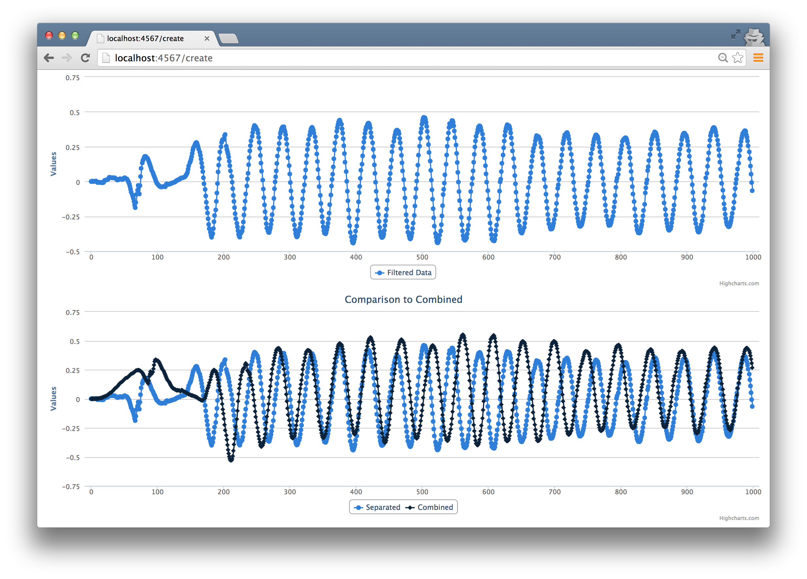

# A Basic Pedometer
TODO: Intro

## Simplifications
* Ruby instead of native for mobile (Objective-C or Java)
	* A pedometer is a common app built for mobile devices that have hardware/software built in to measure acceleration and gravity. 
	* If the mobile device is an iPhone or Android, the pedometer would commonly be written natively for the platform in Objective-C or Java, respectively. 
	* Java is verbose, and Objective-C is both verbose and difficult on the eyes for a developer not familiar with it.
	* Additionaly, native mobile APIs are quickly evolving, and code that may be accurate now may not be in several years.
	* Our basic pedometer is written in Ruby for two reasons: to keep the complexities of the language out of the way and allow us to focus on architecture, and to ensure that code for the specifics of native mobile platforms as they are today is not confused with code for data processing and presentation.
* Batch processing instead of real-time
	* A pedometer would rarely be written as a batch processing problem analyzed by a web application, but it has been done this way for the purposes of simplification.
	* The concepts behind our basic pedometer can be extended and directly applied as mobile applications analyzing data in real-time.
	* Data has been collected from an iPhone in two formats, and is being abalzed by our web application in Ruby.
* Error detection can be enhanced
	* Currently we're not counting steps that are too close together. 
	* One enhancement would be to discount any steps if there are too many false steps. 
	* TODO: More error detection suggestions.
* Many ways to analyze data to count steps
	* There are many methods present to analyze movement data and count steps. Some are more accurate than others in specific instances, for example, day-to-day tracking vs. step counting during a jog.
	* This is just one of many ways. 

## The Toolchain
* Sinatra web app, using Highcharts to display data.
* This was chosen to be built as a web app because a web app naturally separates the data processing from the presentation.
* Sinatra gives us the ability to demosntrate a fully-functional web app accepting input and presenting output very easily, without worrying about the piping. 
* While this project is not intended to show the separation of concerns present in a well-built web app, using Sinatra allows us to naturally segment those concerns and isolate the data processing from the presentation.
* Using Sinatra and Highcharts requires very little additional code and presents our data nicely, so, well, why not have some fancy charts to really satisfy our data craving?

## The Platform
TODO: Describe basic flow. 

1. Upload data in one of two formats:
	* Combined: Data in what we'll call the **combined** format is user acceleration combined with gravitational acceleration. Data in this format is passed in as x, y, z coordinates, each of which shows combined acceleration in that direction at a point in time.
	* Separated: Data in what we'll call the **separated** format is user acceleration separated from gravitational acceleration. Data in this format is passed in as x, y, z coordinates showing user acceleration is each of the directions, followed by x, y, z coordinates showing gravitational acceleration.
2. Input the following metadata:
	* Sampling rate
	* Actual step count
	* Trial number
	* Method (walking, running, etc.)
	* Gender
	* Height
	* Stride
3. Our program parses the data and outputs:
	* Number of steps taken
	* Distance traveled
	* Time duration
	* Charts representing the data in two different stages of parsing

The meat and potatoes of our program is in step 3, where we parse the input data. 

## Parsing Input Data

The sample data we'll be using here is data collected by an iPhone. Let's look at what our input data will look like in each format. 

### Combined Format
The first, more rudimentary data format we'll accept is in the combined format. Data in the combined format is simply total acceleration in the x, y, z directions, over time. 

$"x1,y1,z1;...xn,yn,zn;"$

Let's look at what this data looks like when plotted. Below is a small portion of data, sampled 100 times per second, of a person walking with an iPhone in a bag on their shoulder.

TODO: Add plot.

### Separated Format

The second data format we'll accept is user acceleration in the x,y,z directions separated from gravitational acceleration in the x,y,z directions, over time:

$"x1_{u},y1_{u},z1_{u}|x1_{g},y1_{g},z1_{g};...xn_{u},yn_{u},zn_{u}|xn_{g},yn_{g},zn_{g};"$

Let's look at what this data looks like when plotted. Below is a small portion of data, sampled 100 times per second, of a person walking with an iPhone in a bag on their shoulder.

TODO: Add 2 plots, one for x,y,z user and one for x,y,z gravity.

TODO: Discuss why the separated format is more accurate than the combined format. 

### Making Sense of Data

Looking at our plots, we can start to see a pattern, but we don't have enough, yet, to count steps. 

We need to do 3 things to our input data:

1. Parse our text data and extract numerical data.
2. Isolate movement in the direction of gravity to get a single data series waveform.
3. Filter our data series to smooth out our waveform.

These 3 tasks are related, and it makes sense to combine them into one class called a **Parser**. 

### The Parser Class

~~~~~~~
class Parser

  GRAVITY_COEFF = {
    alpha: [1, -1.979133761292768, 0.979521463540373],
    beta:  [0.000086384997973502, 0.000172769995947004, 0.000086384997973502]
  }
  
  SMOOTHING_COEFF = {
    alpha: [1, -1.80898117793047, 0.827224480562408], 
    beta:  [0.095465967120306, -0.172688631608676, 0.095465967120306]
  }  

  FORMAT_COMBINED  = 'combined'
  FORMAT_SEPARATED = 'separated'

  attr_reader :data, :format, :parsed_data, :dot_product_data, :filtered_data

  def initialize(data)
    @data = data.to_s

    parse_raw_data
    dot_product_parsed_data
    filter_dot_product_data
  end

  def is_data_combined?
    @format == FORMAT_COMBINED
  end

private

  def split_accl_combined(accl)
    @format = FORMAT_COMBINED
    
    accl = accl.flatten.map { |i| i.split(',').map(&:to_f) }
    split_accl = accl.transpose.map do |total_accl|
      grav = chebyshev_filter(total_accl, GRAVITY_COEFF)
      user = total_accl.zip(grav).map { |a, b| a - b }
      [user, grav]
    end
    split_accl.transpose
  end

  def split_accl_separated(accl)
    @format = FORMAT_SEPARATED
    
    accl = accl.map { |i| i.map { |i| i.split(',').map(&:to_f) } }
    [accl.map {|a| a.first}.transpose, accl.map {|a| a.last}.transpose]
  end

  def parse_raw_data
    accl = @data.split(';').map { |i| i.split('|') }
    
    split_accl = if accl.first.count == 1
      split_accl_combined(accl)
    else
      split_accl_separated(accl)
    end

    user_accl, grav_accl   = split_accl
    user_x, user_y, user_z = user_accl
    grav_x, grav_y, grav_z = grav_accl
    
    @parsed_data = []
    accl.length.times do |i|
      @parsed_data << { x: user_x[i], y: user_y[i], z: user_z[i],
                        xg: grav_x[i], yg: grav_y[i], zg: grav_z[i] }
    end
  rescue
    raise 'Bad Input. Ensure data is properly formatted.'
  end

  def dot_product_parsed_data
    @dot_product_data = @parsed_data.map do |data|
      data[:x] * data[:xg] + data[:y] * data[:yg] + data[:z] * data[:zg]
    end
  end

  def filter_dot_product_data
    @filtered_data = chebyshev_filter(@dot_product_data, SMOOTHING_COEFF)
  end

  def chebyshev_filter(input_data, coefficients)
    output_data = [0,0]
    (2..input_data.length-1).each do |i|
      output_data << coefficients[:alpha][0] * 
                      (input_data[i]    * coefficients[:beta][0] +
                       input_data[i-1]  * coefficients[:beta][1] +
                       input_data[i-2]  * coefficients[:beta][2] -
                       output_data[i-1] * coefficients[:alpha][1] -
                       output_data[i-2] * coefficients[:alpha][2])
    end
    output_data
  end

end
~~~~~~~

Let's start with the initialize method. Our parser class takes string data as input and stores it in the @data instance variable. It then calls three methods in sequence: parse_raw_data, dot_product_parsed_data, and filter_dot_product_data. 

Each method accomplishes one of our three steps above. Let's look at each method individually. 

### Step 1: Parsing text to extract numerical data (parse_raw_data)

The goal of parse_raw_data is to convert string data to a format we can more easily work with, and store it in @parsed_data. The first line splits the string by semicolon into as many arrays as samples taken, and then splits each individual array by the pipe, storing the result in accl.

We determine the input format by the first element of accl, which is an array. 

* accl in the combined format: $[["x1,y1,z1"],...["xn,yn,zn"]]$
* accl in the separated format: $[["x1_{u},y1_{u},z1_{u}", "x1_{g},y1_{g},z1_{g}"],...["xn_{u},yn_{u},zn_{u}", "xn_{g},yn_{g},zn_{g}"]]$

If the array has exactly one element, we know that our input format is combined. Otherwise, our input format is separated. Based on this, we call either split_accl_combined or split_accl_separated. Each of these methods sets the @format instance variable, and generates data in the format below. We store this result in split_accl:

$[[[x1_{u},...xn_{u}], [y1_{u},...yn_{u}], [z1_{u},...zn_{u}]],
[[x1_{g},...xn_{g}], [y1_{g},...yn_{g}], [z1_{g},...zn_{g}]]$

TODO: Dig into the details of split_accl_combined and split_accl_separated. Specifically, chat about how split_accl_combined low pass filters to grab the gravitational data.

The next line splits out the split_accl array into user_accl and grav_accl, which are both arrays of arrays, with user acceleration in the x, y, z directions and gravitational acceleration in the x, y, z directions, respectively. The two lines following split each of user_accl and grav_accl into their x, y, z components:

\ 

In order to get one data series we can work with, we then create an array of hashes in the format below, and store it in @parsed_data.

$[\lbrace x\colon x1_{u}, y\colon y1_{u}, z\colon z1_{u}, xg\colon x1_{g}, yg\colon y1_{g}, zg\colon z1_{g} \rbrace,...\lbrace x\colon xn_{u}, y\colon yn_{u}, z\colon zn_{u}, xg\colon xn_{g}, yg\colon yn_{g}, zg\colon zn_{g}\rbrace]$

The entire purpose of the parse_raw_data method is to take input data in one of two formats, and output data in this more workable format.

### Step 2: Isolating movement in the direction of gravity

First, a very small amount of liner algebra 101. 

TODO: Short explanation of why the dot product is used to help us isolate movement in the direction of gravity.

TODO: Add graphs from trial view showing original data and dot product data.

Taking the dot product in our Parser class is straightforward. We add a @dot_product_data instance variable, and a method, dot_product_parsed_data, to set that variable. The dot_product_parsed_data method is called immeditely after parse_raw_data in the initializer, and iterates through our @parsed_data hash, calculates the dot product with map, and sets the result to @dot_product_data. 

### Step 3: Filtering our data series

Again, back to the mathematics for some signal processing 101.

TODO: Basics of filtering, Chebyshev filter specifically

TODO: Add graphs from trial view showing dot product data and filtered data.

Following the pattern from steps 1 and 2, we add another instance variable, @filtered_data, to store the filtered data series, and a method, filter_dot_product_data, that we call from the initializer.

The filter_dot_product_data method initalizes the data series by setting the first two elements to 0, and then iterates through the remaining element indeces in @dot_product_data, applying the Chebyshev filter. 

### Our Parser class in the wild

Our Parser now takes string data in the separated format, converts it into a more useable format, isolates movement in the direction of gravity through the dot product operation, and filters the resulting data series to smooth it out. 

Our parser class is useable on its own as is. An example with combined data:

~~~~~~~
> data = '0.123,-0.123,5;0.456,-0.789,0.111;-0.212,0.001,1;'
> parser = Parser.new(data)

> parser.format
=> 'combined'
> parser.parsed_data
=> [{:x=>0.123, :y=>-0.123, :z=>5.0, :xg=>0, :yg=>0, :zg=>0},
    {:x=>0.456, :y=>-0.789, :z=>0.111, :xg=>0, :yg=>0, :zg=>0},
    {:x=>-0.2120710948533322,
   	 :y=>0.0011468544965549535,
   	 :z=>0.9994625125426089,
   	 :xg=>7.109485333219216e-05,
     :yg=>-0.00014685449655495343,
     :zg=>0.0005374874573911294}]
> parser.dot_product_data
=> [0.0, 0.0, 0.0005219529804999682]
> parser.filtered_data
=> [0, 0, 4.9828746074755684e-05]
~~~~~~~

An example with separated data:

~~~~~~~
> data = '0.028,-0.072,5|0.129,-0.945,-5;0,-0.07,0.06|0.123,-0.947,5;0.2,-1,2|0.1,-0.9,3;'
> parser = Parser.new(data)

> parser.format
=> 'separated'
> parser.parsed_data
=> [{:x=>0.028, :y=>-0.072, :z=>5, :xg=>0.129, :yg=>-0.945, :zg=>-5}, 
	{:x=>0, :y=>-0.07, :z =>0.06, :xg=>0.123, :yg=>-0.947, :zg=>5},
	{:x=>0.2, :y=>-1.0, :z=>2.0, :xg=>0.1, :yg=>-0.9, :zg=>3.0}]
> parser.dot_product_data
=> [-24.928348, 0.36629, 6.92]
> parser.filtered_data
=> [0, 0, -1.7824384769309702]
~~~~~~~

### Things to note
* Ability to pass in either format and the Parser determines it. It's the only class that has to be concerned with it. 
* ...

### Where to improve
* Exception handling in parse_raw_data can be more specific (rather than capturing any error that occurs)

## Pedometer functionality

Our pedometer will measure 3 metrics:

1. Distance traveled
2. Time traveled
3. Steps taken

Let's discuss the infomation we'll need to calculate each of these metrics. We're intentionally leaving the exciting, step counting part of our program to the end.

### Distance traveled
A mobile pedometer app would generally be used by one person. The stride length of that person would be a necessary value to determine distance traveled, which is simply the steps taken multiplied by the stride length. The pedometer can ask the user to input their info.

If the user can directly provide their stride length, then we're good to go. If not, and they provide their gender and their height, we can use $0.413 * height$ for a female, and $0.415 * height$ for a male. 

If they only provide their height, we can use $(0.413 + 0.415)/2 * height$, averaging the two multipliers. 

If they only provide their gender, we can use the average of 70 cm for a female, and 78 cm for a male.

Finally, is the user does not wish to provide any information, we can simply take the average of 70 cm and 78 cm and set the stride length to 74 cm.

TODO: Add references for multipliers and averages above.

All of this information is related to the user, so it makes sense to include it in a User class. 

~~~~~~~
class User

  GENDER      = ['male', 'female']
  AVERAGES    = {'female' => 70, 'male' => 78}
  MULTIPLIERS = {'female' => 0.413, 'male' => 0.415}

  attr_reader :gender, :height, :stride

  def initialize(gender = nil, height = nil, stride = nil)
    @gender = gender.to_s.downcase if GENDER.include? gender.to_s.downcase
    @height = height.to_f if height.to_f > 0
    @stride = (stride.to_f > 0) ? stride.to_f : calculate_stride
  end

private

  def calculate_stride
    if gender && height
      MULTIPLIERS[@gender] * height
    elsif height
      height * (MULTIPLIERS.values.reduce(:+) / MULTIPLIERS.size)
    elsif gender
      AVERAGES[gender]
    else
      AVERAGES.values.reduce(:+) / AVERAGES.size
    end
  end

end
~~~~~~~

Things to note:

* Information is optional. The class handles it.
* Magic numbers are defined at the top.
* Basic input data formatting in the initalizer allows for a case insensitive gender parameter, prevents a non-numerical height and stride or a height and stride less than 0. Finally, the stride is calculated through the calculate_stride method unless a valid stride is provided.
* Even when all parameters are provided, the input stride takes precedence. 

### The User class in the wild

The User class is straightforward to use. Below are examples of users created with the least specific to the most specific data:

* Without any parameters
* A gender parameter
* A height parameter
* Gender and height parameters
* A stride parameter
* All parameters

~~~~~~~
> User.new.stride
=> 74
> User.new('Female').stride
=> 70
> User.new(nil, '167.5').stride
=> 69.345
> User.new('male', 191).stride
=> 79.265
> User.new(nil, nil, '80').stride
=> 80.0
> User.new('female', 1, '72').stride
=> 72.0
~~~~~~~

### Time Traveled

The time traveled is measured by dividing the number of data samples in our Parser's @parsed_data set by the sampling rate of the device. Since the rate has more to do with the device itself than the user (and the user in fact does not have to be aware of the sampling rate), this looks like a good time to create a Device class. 

~~~~~~~
class Device

  attr_reader :rate, :method, :steps, :trial

  def initialize(rate = nil, steps = nil, trial = nil, method = nil)
    @rate   = (rate.to_f.round > 0) ? rate.to_f.round : 100
    @steps  = steps.to_f.round if steps.to_f.round > 0
    @trial  = trial
    @method = method
  end

end
~~~~~~~

Our device class is quite simple. Note that all of the attribute readers are set in the initializer based on parameters passed in. All of the other attributes are simply metadata:

* method is used to set the type of walk that is taken (walk with phone in pocket, walk with phone in bag, jog, etc.)
* steps is used to set the actual steps taken, so that we can record the difference between the actual steps the user took and the ones our program counted.
* trial is a title for the specific trial (trial 1, 2, 3, etc.)

Things to note:

* Much like our User class, information is optional. The class handles it.
* Basic input data formatting in the initalizer allows ensures that rate and steps are always numerical values greater than 0.
* One could argue that metadata doesn't really belong in the Device class. For the sake of keeping our small program simple, we included the metadata in this class because it's more logical here than in the User class, and to avoid too much abstration for too little code. However, as our program grows and we have more metadata and more attributes related to the device, it would be wise to split the Device class apart from the metadata. 

Our Device class is so straightforward to use, we won't bore you with the details of showing it in the wild. 

### Steps taken
Our Parser's @parsed_data waveform is created by the bounces in the z-direction of a person as they take a step. Each cycle of our waveform represents a single step taken. Therefore, counting steps is a matter of counting the number of peaks or the number of troughs in our Parser's @parsed_data waveform. 

But, how do we count peaks or troughs in code? Let's assume for this discussion that we're deciding to count peaks. 

If we had a perfect waveform, we could simply count the number of times that a point is numerically lower than the point before it. However, while our smoothing algorithm is good, it's not perfect. Example the waveform below. 

TODO: Add waveform graph that shows too many peaks, with 4 major peaks.

We can tell by looking at it that there are 4 peaks, but the circled areas would also be counted as peaks with the algorithm we described above. Unfortunately, even with our smoothing algorithm, we can't depend on a perfect waveform, so we'll have to use a similar method that accomodates an imperfect waveform. 

Examine the waveform below with a line parallel to the x-axis. This line is below all of the peaks, but not so far down the y-axis that it's below any of the troughs. 

TODO: Add graph of waveform with threshold line.

This line can be used as a threshold. If we count each time our waveform crosses the line in the positive y direction, we'll achieve the same result as counting peaks, and therefore counting steps. 

We can count troughs in a similar fashion, by using a threshold that is exactly the negative of our previous threshold. 

If we assume that we're just as likely to accuarately count peaks as we are to count troughs, we'll get the most accurate result by counting both and taking the average of the two to determine our final step count. This will remove some error from certain data sets that have less prominent peaks or troughs. 

Alright, back to some code. So far, we have a Parser class that contains our parsed waveform, and classes that give us the necessary information about a user and a device. What we're missing is a way to analyze the @parsed_data waveform with the information from User and Device, and count steps, measure distance, and measure time. The analysis portion of our program is different from the data manipulation of the Parser, and different from the information collection and aggregation of the User and Device classes. Let's create a new class called Analyzer to perform this data analysis.

~~~~~~~
require 'mathn'
require_relative 'parser'
require_relative 'user'
require_relative 'device'

class Analyzer

  MAX_STEPS_PER_SECOND = 6.0
  THRESHOLD = 0.2

  attr_reader :parser, :user, :device, :steps, :distance, :time

  def initialize(parser, user = User.new, device = Device.new)
    raise "Parser invalid." unless parser.kind_of? Parser
    raise "User invalid."   unless user.kind_of? User
    raise "Device invalid." unless device.kind_of? Device

    @parser = parser
    @user   = user
    @device = device
  end

  def measure
    measure_steps
    measure_distance
    measure_time
  end

private

  # -- Edge Detection -------------------------------------------------------

  def count_edges(positive)
    count           = 0
    index_last_step = 0
    threshold       = positive ? THRESHOLD : -THRESHOLD
    min_interval    = (@device.rate/MAX_STEPS_PER_SECOND)

    @parser.filtered_data.each_with_index do |data, i|
      # If the current value >= the threshold, and the previous was < the threshold
      # AND the interval between now and the last time a step was counted is 
      # above the minimun threshold, count this as a step
      if (data >= threshold) && (@parser.filtered_data[i-1] < threshold)
        next if index_last_step > 0 && (i-index_last_step) < min_interval
        count += 1
        index_last_step = i
      end
    end
    count
  end

  # -- Measurement ----------------------------------------------------------

  def measure_steps
    positive_edge_count = count_edges(true)
    negative_edge_count = count_edges(false)
    
    @steps = ((positive_edge_count + negative_edge_count)/2).to_f.round
  end

  def measure_distance
    @distance = @user.stride * @steps
  end

  def measure_time
    @time = @parser.parsed_data.count/@device.rate
  end

end
~~~~~~~

Where our Parser class did all of the work of the input data cleaning, our Analyzer class does the work of analyzing the cleaned data.

The first thing we do in our Analyzer class file is pull in the Ruby math library, along with our Parser, Device, and User classes. Then, we define constants to represent the maximum number of steps taken per second (used for error correction which we'll disucss in a moment), and a value for our threshold. For the purposes of this discussion, let's assume we've analyzsed numerous diverse data sets and detemined a value for the threshold that accomodated the largest number of those data sets. 

Our Analyzer's initializer take a mandatory Parser because we necessarily need a data set to work with, and optionally takes a User and a Device. Note that the default values for those parameters is a new instance of each. Remember how those classes both had defualt values and could handle zero input parameters? That functionality comes in handy here. Note that the initializer raises exceptions if classes other than those expected are passed in, since we can't work with incorrect class types. Otherwise, all it does is set the instance variables @parser, @user, @device to the passed in parameters. 

The only other public method in Analyzer is measure, which calls the private methods measure_steps, measure_distance, and measure_time, in that order. Let's look at each:

### measure_steps

Finally! The step counting portion of our step counting app. 

The measure steps method counts the positive edges (the peaks) and the negative edges (the troughs) through the count_edges method, and then simply sets the @steps variable to the average of the two. The count_edges method takes a boolean parameter to determine whether we're counting peaks or troughs. The method iterates through each point in our parser's @filtered_data attribute to count steps. At the start of the method, we instantiate the following variables:

* count is used to keep track of the step count as we interate through our loop. This is, obviously, initialized to 0.
* index_last_steps keeps the index of the step before the one we're on when looping through @filtered_data.
* threshold uses the THRESHOLD constant but toggles between negative/positive depending on whether we're counting peaks or troughs. If we're counting peaks, we want a positive threshold above the x-axis. If we're counting troughs, we want a negative threshold below the x-axis. 
* min_interval is the minimum number of samples between steps. This is used to prevent counting steps that are impossibly close together. 

Let's take a closer look at the loop. We loop through filtered_data, keeping track of the value of each point in data, and the index in i. If our point value, data, is greater than or at the threshold and our previous point was below, then we're crossing the threshold in the positive y direction. We can count a step here, as long as the last step was not counted too close to this one. We determine this by comparing the difference between our current index and the index of the last step, if it exists, to our min_interval variable. If we're far enough away, we count our step by incrementing count, and set the index_last_step to the current index. The method returns the value in count as the total steps taken. 

There we have it, the step counting portion of our program. 

### measure_distance

The distance is simply measured by miltuplying our user's stride by the number of steps. Since the distance depends on the step count, the measure method calls it after the step count has been calcualted, and keeps the method private so that an outside class can't call in before the measure_steps. 

### measure_time

Time is also a trivial calculation, dividing the total number of samples (the number of points in our parser's filtered_data attribute) by the rate (samples/second). Time then, obviously, is returned in numbers of seconds. 

Things to Note:

* The value for threshold can eventually become dynamic based on the user and the calculated versus actual steps they've taken. A learning algorithm, if you will.
* We do some error handling in count_edges by ensuring that steps aren't impossibly close together. We can go a step further (pun intended?) by counting the number of false steps, and if we have too many, avoiding counting steps at all until some reasonable number of samples. That'll prevent any steps from being counted when the phone is shaken vigorously for a period of time. 
* TODO: There should be more here.

## Adding some friendly

We're through the most labour intensive part of our app. Now, all that's left is to present the data in a format that is pleasing to a user. It makes sense to create a very simple web app that allows a user to input a data set through a file upload (in our two formats!) and output the steps taken, distance traveled, time traveled, and maybe a few plots to display the data. 

Let's look at our app from a user's perspective before we dive into the code. 

When a user first enters the app, they see an empty table of trials, and an upload form. The upload form has fields for the user to enter device info and user info.

\ 

Let's suppose the user uses the upload form to upload a trial walk with a phone in their pocket. 

\ 

Note that the user has entered everything but their stride. From this same trial, they have two text files of the exact same trial, one in each of our formats. In the screenshot below, they've chosen to upload one of the files. Hitting submit presents them with the following view:

\ 

Our program has parsed and analyzed the input file, and presented information at the very top for the user. The fields that our program calculated are the format of the file (Measurement), the calculated steps taken (Calculated), the difference between the calculated steps and actual steps taken (Delta), the distance traveled (Distance), and time it took (Time). The graphs shown are the dot product and the filtered data. 

The user can navigate back to the trials using the *Back to Trials* link, and upload the second file.

\ 

As long as the user enters the same input in all text and dropdown fields, the program knows that this is the same trial, and outputs the following:

\ 

Note that since this trial is the separated format, it is more accurate than the combined format. This trial detail view now shows an extra plot at the bottom, comparing the filtered combined format with the filtered separated format. 

### Diving back to the code

Let's jump back in and talk about how we create our simple web app. 

TODO: Do I need to add a small MVC and web apps section here?

We're using Sinatra, which, in the tool's own words, is "a DSL for quickly creating web applications in Ruby". We'll create a Gemfile with the following lines:

~~~~~~~
source 'https://rubygems.org'

gem 'sinatra'
gem 'thin'
~~~~~~~

Once we run bundle install, we'll have Sinatra, as well as the Thin web server.

