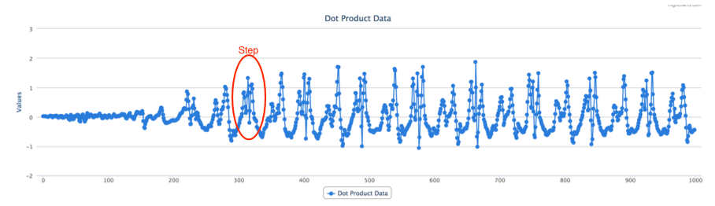
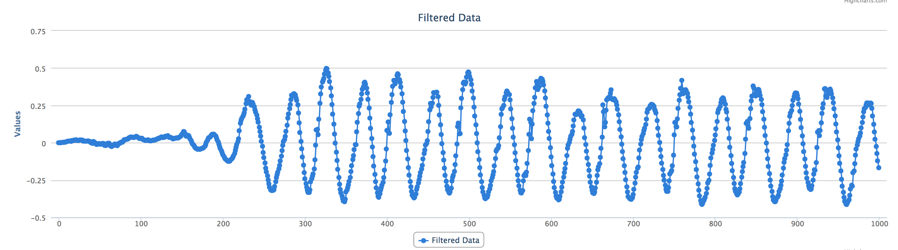
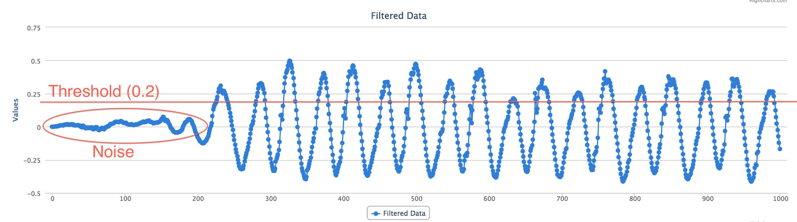
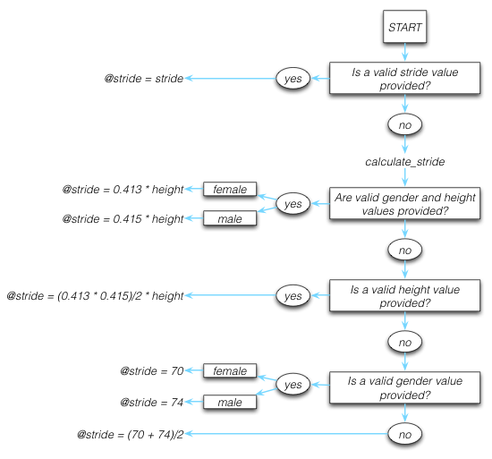

# A Perfect World

TODO: A physicist, a mathematician, and a software engineer joke...

Many software engineers reflecting on their training will remember having the pleasure of living in a very perfect world. We were taught to solve discrete problems, with defined parameters, in an ideal domain. 

Then, we were thrown into the real world, with all of it's complexities and challenges. It's messy, which makes it all the more exciting. When you can solve a real-life problem, with all of it's quirks, you can build software that really helps people, every day. 

In this chapter, we'll examine a problem that looks straightforward on the surface, and gets tangled very quickly when the real world, and real people, are thrown into it. 

Let's roll up our sleeves, and prepare to untangle.

# A Basic Pedometer

The rise of the mobile device brought with it a trend to collect more and more data on our daily lives. One type of data many people today collect is the number of steps they've taken over a period of time. This data can be used for health tracking, training for sporting events, or, for those of us obsessed with collecting and analyzing data, just for kicks. Steps can be counted using a pedometer, which often uses data from a hardware accelerometer as input.

## What's an Accelerometer, You Ask?

An accelerometer is a piece of hardware that measures acceleration in the x, y, and z directions. In today's mobile world, many people carry an accelerometer with them wherever they go, as it's built into almost all smartphones currently on the market. The x, y, and z directions are relative to the device the hardware is contained in.

TODO: This diagram is a direct copy from Apple. Problem? 

\

An accelerometer measures x, y, and z acceleration at points in time. The sampling rate of the accelerometer, which can often be calibrated, determines the number of measurements per second. For instance, an acceleroemeter with a sampling rate of 100 returns 100 x, y, z coordinates each second. Each x, y, z coordinate indicates the acceleration in each of the directions at that point in time. The set of all x, y, z coordinates returned by the accelerometer is called a signal.

## Let's Talk About a Walk

When a person walks, they bounce slightly with each step. This bounce, if you are walking on Earth (or another big ball of mass floating in space) is always in the same direction as gravity. A pedometer can count steps by counting the number of bounces in the direction of gravity.

Let's look at a person walking with a smartphone containing an accelerometer held in the position depicted below.

\

For the sake of simplicity, we'll assume that:

* the stick man is walking in the x direction, with step bounces in the y direction, and no motion in the z direction;
* the phone remains in the same position throughout the entire walk;
* the bounces created by each step are identical;
* the accelerometer is perfectly accurate.

Ah, the joys of a perfect world, that we only ever really experience in texts like these. Don't fret, we'll deal with an imperfect, but real and more exciting world soon.

The phone in the example above is positioned such that the y direction is the one in the direction of gravity. Since we want to count the number of bounces in the direction of gravity, and y is the only direction affected by gravity with the current position, we can completely ignore x and z. 

The accelerometer is picking up the person's acceleration in the y direction, which is due to the bounces in their steps. In our perfect world, these bounces form a perfect sine wave. Each cycle in the waveform is exactly one step. So, when we can completely ignore x and z, acceleration in the y direction should look like the diagram below. 

\

There could potentially be other movements of the device in the direction of gravity, not caused by a step. However, let's ignore those as noise, and assume that the step bounces are most prominent. If we assume that, we can pick a threshold value above which if a signal passes, we can count a step. This means that we can count steps by counting the number of times that our waveform crosses the threshold in the positive direction. Easy, right?

Wrong. Nothing is ever easy. Where's the fun in that? There's a bit of a kicker here. 

## Even Perfect Worlds Have Fundamental Forces of Nature

Even in our perfect world, gravity exists, so there is a constant acceleration in the direction of gravity at $-9.8m/s^2$. The total acceleration measured by our accelerometer, then, is the sum of user acceleration and gravitational acceleration, where user acceleration is the acceleration that the user imparts on the device. Letting total acceleraton be $a_{t}$, user acceleration be $a_{u}$, and gravitational acceleration be $a_{g}$, we can represent this as $a_{t} = a_{u} + a_{g}$. This means that in our perfect world acceleration in the y direction actually looks like this:

\

Uh oh. We can no longer count when the waveform crosses our threshold. We'll have to isolate user acceleration from the total acceleration in order to use our threshold method of counting steps. We can isolate user acceleration like so: 

$a_{t} = a_{u} + a_{g}$\
$a_{t} = a_{u} - 0.98$\
$a_{u} = a_{t} + 0.98$

This means that we can add 0.98 to every single y value, resulting in the first graph we saw, and making our step counting once again a matter of counting the points when the sine wave crosses the x-axis in the positive direction. 

Accommodating for gravity untangles one web that the real world weaves in. Now, let's see what happens when we introduce real people into the mix. What if our silly stick man holds the phone in a more wonky, but still consistent, position?

\

Yikes. Gravitational acceleration is now split amongst all directions: part of the acceleration added in the x direction, part in the y direction, and part in the z direction. To make matters worse, what if our stick man decides to rotate his phone part way through the walk?

Our pefect world just got a little more real, and now we have two problems:

1. Isolating user acceleration from gravitational acceleration. Separating total acceleration into gravitational acceleration and user acceleration isn't a simple matter of adding 0.98 to a single direction.
2. Isolating movement in the direction of gravity. We can no longer ignore the x and z directions and simply take the data from the y direction.

Every problem has a solution. Let's look at each problem separately, and put on our mathematician hats. 

## 1. Isolating user acceleration from gravitational acceleration

When the phone is held in such a way that the gravitational acceleration affects more than one coordinate, we need to find a way to completely separate user acceleration from gravitational acceleration. We can do that using a tool called a low-pass filter.

### Low-pass Filter
A **filter** is a tool used in signal processing to remove an unwanted component from a signal. A **low-pass filter** allows low-frequency signals through, while attenuating signals higher than a set threshold. In our sitation, gravitational acceleration is a 0 Hz signal because it's constant, while user acceleration is not. This means that if we pass our total acceleration signal through a low-pass filter, we'll allow the gravitational component of the signal to pass through, while removing the user acceleration component. Once we've done that, we can subtract gravitational acceleration from total acceleration, and we'll be left with just the user acceleration signal. 

There are numerous varieties of low-pass filters, but the one we'll use is called a Chebyshev filter. We've chosen a Chebyshev filter because it has a steep cutoff, which means that it very quickly attenuates frequencies beyond our threshold, which is ideal for isolating a 0 Hz signal like gravity. 

A low-pass filter is implemented using the formula $output_{i} = \alpha_{0} * (input_{i} * \beta_{0} + input_{i-1} * \beta_{1} + input_{i-2} * \beta_{2} - output_{i-1} * \alpha_{1} - output_{i-2} * \alpha_{2})$. The $\alpha$ and $\beta$ values are set based on the type of filter and the attenuation we want to achieve.

TODO: Expand the section on calculating alpha and beta?

### Implemeting a Low-pass Filter
Let's have a look at an example of total acceleration, $a_{t}$.

\ 

To filter out gravitational acceleration, $a_{g}$, we apply the low-pass filter formula $a_{gn} = \alpha_{0} * (a_{tn} * \beta_{0} + a_{tn-1} * \beta_{1} + a_{tn-2} * \beta_{2} - a_{gn-1} * \alpha_{1} - a_{gn-2} * \alpha_{2})$. 

In the example below, gravity is near-constant at 0 in the x and z directions, and $-9.8m/s^2$ in the y direction. 

\ 

To receive user acceleration, $a_{u}$, we can subtract gravitational acceleration from total acceleration, $a_{u} = a_{t} - a_{g}$. Note that the patterns in the resulting user acceleration signals remain very similar to those in total acceleration. However, since gravity was acting mostly in the y direction, the y direction signal has moved up to fluctuate around 0 along with the x and z components. 

\ 

We've successfully isolated user acceleration from gravitational acceleration! That's one more web untanglged. 

## 2. Isolating movement in the direction of gravity
When gravity acts on our phone in multiple directions, how do we isolate acceleration in the direction of gravity, so that we can count bounces? We need to find a way to take just the movement in the direction of gravity from each of the x, y, and z directions. First, some liner algebra 101. Don't take that mathematician hat off just yet!

### The Dot Product

The dot product takes two signals of equal length and returns a single signal. 
In solving problem one above, we have three resulting signals: $a_{t}$, $a_{g}$ and $a_{u}$, each of which has an x, y, and z coordinate. Each of these signals is necessarily the same length, since $a_{u}$ and $a_{g}$ are derived from $a_{t}$. 

Let's take a look at what it means to take the dot product of $a_{u}$ and $a_{g}$, $a_{u} \cdot a_{g}$, for the x-coordinate at point $n$, which is equivalent to any point from 0 to the length of the entire signal.

\ 

Taking the dot product in this case means that we'll get the portion of user acceleration in the direction of gravity. Just what we need! 

### Implemeting the Dot Product
So, in order to get a single signal representing user acceleration in the direction of gravity, we need to take the dot product of $a_{u}$ and $a_{g}$. Let's call this new signal $a_{ug}$:

$a_{ugn} = a_{un} \cdot a_{gn} = x_{un}x_{gn} + y_{un}y_{gn} + z_{un}z_{gn}$

Using the same data as problem one above, the dot product results in the single signal below. 

\ 

## Solutions in the Real World
We saw how quickly our seemingly simple problem turned a little more complex when we threw in the challenges of the real world and real people. However, we're getting a lot closer to counting steps. 

Using the two mathematical tools from above, a low-pass filter and the dot product, we were able to bring our real-world, complex data set a lot closer to our ideal one. We're even able to see pick out where the steps are, once again: 

\ 

We can see how this data is starting to resemble our ideal sine wave.

\

But, only "kinda, sorta" starting to. 

We need to make our messy data set smoother, so that it looks more like our ideal sine wave, allowing us to count steps. Our messy data set is very "jumpy". This jumpiness means that there is a high frequency component to the signal. Fortunately, a low-pass filter can be used once again to filter out just the low-frequency component, eliminating the "jumpy", high frequency portions of the signal, and smoothing out our data set. 

Passing our messy signal through a low-pass filter, using the same formula but different alpha and beta values, results in the cleaner signal below:

TODO: Talk more about determining alpha and beta coefficients.

\ 

Now, if we once again set a reasonable threshold value such that it sits above the smaller bounces in the signal, but below the peaks of the steps, we're in a similar situation as our ideal signal, where we can count steps by counting the number of times our signal crosses the threshold in the positive direction. Voilà!

\ 

## Recap

The problem, at first glance, looked straightforward. However, the real world and real people threw a few curve balls our way. Let's recap how we solved the problem: 

1. We started with total acceleration, $a_{t}$.
2. We used a low-pass filter to split $a_{t}$ into gravitational acceleration, $a_{g}$, and user acceleration, $a_{u}$.
3. We took the dot product of $a_{u}$ and $a_{g}$ to obtain the user acceleration in the direction of gravity, $a_{ug}$. 
4. We used a low-pass filter again to remove the high-frequency component of $a_{ug}$, smoothing it out.
5. We chose a threshold and were able to count steps by counting the number of times our signal crossed the threshold in the positive direction.

As software developers in a training or academic setting, we may have been presented with a perfect signal and asked to write code to count the steps in that signal. While that may have been an interesting coding challenge, it wouldn't have been something we could apply in a live situation. We saw that in a reality with gravity and people thrown into the mix, the problem was a little more complex. We used mathematical tools to address the complexities, and were able to solve a real-world problem. Now it's time to translate our solution into code. 

# Diving Into Code

Our goal for this chapter is to create a web application that counts steps from a set of different walks recorded with mobile devices containing accelerometers. 

Our web app will:

1. Allow a user to upload a text file containing coordinate data from a walk.
2. Provide input fields for the user to enter some basic information about the data set such as the sampling rate, actual step count, gender, height, and stride.
3. Parse, process, and analyze our data, calculating the number of steps taken, distance traveled, and time elapsed.
4. Output charts representing the data in different processing stages.

The meat and potatoes of our program is in step 3, where we parse, process, and analyze the input data. It makes sense, then, to start with that, and build the web app and interface afterward.

## Processing Input Data

The input data we'll be processing is coming from mobile devices such as Android phones and iPhones. Most iPhone and Android devices on the market today have accelerometers built in. This means that both device types are able to record total acceleration. Let's call the input data format that records total acceleration the *combined format*. Many, but not all, devices can also record user acceleration and gravitational acceleration separately. Let's call this format the *separated format*. A device that has the ability to return data in the separated format necessarily has the ability to return data in the combined format. However, the inverse is not necessarily true. Some devices on the market today can only record data in the combined format. Input data in the combined format will need to be passed through a low-pass filter to turn it into the separated format. 

We want our program to handle all mobile devices on the market with accelerometers, regardless of whether or not they are able to record data in both the combined and separated format, or only in the combined format. This means that we'll need to accept data in both formats. 

Let's look at each of the formats we'll be accepting individually.

### Combined Format

Data in the combined format is total acceleration in the x, y, z directions, over time. x, y, and z values will be separated by a comma, and samples per unit time will be separated by a semi-colon.

$"x1,y1,z1; ... xn,yn,zn;"$

### Separated Format

The separated format returns user acceleration in the x, y, z directions as well as gravitational acceleration in the x, y, z directions, over time. Again, x, y, and z values will be separated by a comma, and samples will be separated by a semi-colon. User acceleration coordinates will be separated from gravitational acceleration coordinates by a pipe.

$"x1_{u},y1_{u},z1_{u}|x1_{g},y1_{g},z1_{g}; ... xn_{u},yn_{u},zn_{u}|xn_{g},yn_{g},zn_{g};"$

## I Got Multiple Input Formats But a Standard Ain't One

Dealing with multiple input formats is a common programming problem. If we want our entire program to work with both formats, every single piece of code dealing with the data would need to know how to handle both formats. This can become very messy, very quickly, especially if a third (or a fourth, or a fifth, or a hundredth) input format is added in the future. 

The cleanest way for us to deal with this is to take our two input formats and determine a standard format to fit them both into as soon as possible, allowing the rest of the program to work with this new standard format. This means that the remaining parts of the program don't need to be concerned with, or even know about, multiple formats. 

The diagram below outlines the basic idea. 

\

We'll write a small parser to a standard format that is contained in only one section of code, that allows us to take our two known input formats and convert them to a single standard output format. In the future, if we ever have to add another input format, the only code we'll have to touch is this small parser. Once the data is in a standard format, the program can have any number of processors that process the data from the standard format, without ever being concerned about the original format that the data was in. 

Converting multiple input formats into one common format is an example of *separation of concerns*, a commonly-used design principle, which promotes splitting a program into numerous distinct pieces, where every piece has one primary concern. It's a beautiful way to write clean, maintainable code that's easily extensible. We'll revist this idea several times throughout the chapter.

## Applying Our Step Counting Solution

Based on the solution we defined, and our two input formats, we'll need our code to do three things to our input data before we can count steps:

1. Parse our input formats into a standard format. 
2. Isolate movement in the direction of gravity using the dot product.
3. Smooth out our waveform using a low-pass filter.

The diagram below shows each of these three steps.

\

We know we'll need to work with user acceleration and gravitational acceleration separately in order to follow our solution, so our standard format will need to split out the two accelerations. This means that if our data is in the combined format, we'll need to first pass it through a low-pass filter in step 1 to convert it to the standard format.

Take note of the standard format:

\

Our standard format allows us to store a data series signal, as each element represents acceleration at a point in time. We've defined it as an array of arrays of arrays. Let's peel back that onion. 

* The first array is just a wrapper to hold the all of the data.
* The second set of arrays contains one array per data sample taken. If our sampling rate is 100 and we sample data for 10 seconds, we'll have $10 * 100$, or 1000, arrays in this second set. 
* The third set of arrays is the pair of arrays enclosed within the second set. They both contain acceleration data in the x, y, and z directions; the first representing user acceleration and the second gravitational acceleration.

These three tasks - parse, dot product, and filter - are all related to taking input data, and parsing and processing it to get it to a state where our resulting signal is clean enough for us to count steps. Due to this relationship, it makes sense to combine these tasks into one class. We'll call it a **Processor**. 

## The Processor Class

~~~~~~~
class Processor

  GRAVITY_COEFF = {
    alpha: [1, -1.979133761292768, 0.979521463540373],
    beta:  [0.000086384997973502, 0.000172769995947004, 0.000086384997973502]
  }
  
  SMOOTHING_COEFF = {
    alpha: [1, -1.80898117793047, 0.827224480562408], 
    beta:  [0.095465967120306, -0.172688631608676, 0.095465967120306]
  }  

  FORMAT_COMBINED  = 'combined'
  FORMAT_SEPARATED = 'separated'

  attr_reader :data, :format, :parsed_data, :dot_product_data, :filtered_data

  def initialize(data)
    @data = data

    parse_raw_data
    dot_product_parsed_data
    filter_dot_product_data
  end

  def parse_raw_data
    @parsed_data = @data.to_s.split(';').map { |i| i.split('|') }
                   .map { |i| i.map { |i| i.split(',').map(&:to_f) } }

    unless @parsed_data.map { |data| data.map(&:length).uniq }.uniq == [[3]]
      raise 'Bad Input. Ensure data is properly formatted.'
    end

    @format = if @parsed_data.first.count == 1
      filtered_accl = @parsed_data.map(&:flatten).transpose.map do |total_accl|
        grav = chebyshev_filter(total_accl, GRAVITY_COEFF)
        user = total_accl.zip(grav).map { |a, b| a - b }
        [user, grav]
      end

      @parsed_data = @parsed_data.length.times.map do |i|
        coordinate_user = filtered_accl.map(&:first).map { |elem| elem[i] }
        coordinate_grav = filtered_accl.map(&:last).map { |elem| elem[i] }
        [coordinate_user, coordinate_grav]
      end
      
      FORMAT_COMBINED
    else
      FORMAT_SEPARATED
    end
  end

  def dot_product_parsed_data
    @dot_product_data = @parsed_data.map do |data|
      data[0][0] * data[1][0] + 
      data[0][1] * data[1][1] + 
      data[0][2] * data[1][2]
    end
  end

  def filter_dot_product_data
    @filtered_data = chebyshev_filter(@dot_product_data, SMOOTHING_COEFF)
  end

  def chebyshev_filter(input_data, coefficients)
    output_data = [0,0]
    (2..input_data.length-1).each do |i|
      output_data << coefficients[:alpha][0] * 
                     (input_data[i]   * coefficients[:beta][0] +
                     input_data[i-1]  * coefficients[:beta][1] +
                     input_data[i-2]  * coefficients[:beta][2] -
                     output_data[i-1] * coefficients[:alpha][1] -
                     output_data[i-2] * coefficients[:alpha][2])
    end
    output_data
  end

end
~~~~~~~

### Low-pass Filtering

Let's start with the last method in our class, `chebyshev_filter`. This method implements the low-pass filter. We'll see it used twice in this class, the first time when we low-pass filter the combined input format during the parsing to the standard format, and the second time when we low-pass filter the dot product output to smooth out our waveform. 

`chebyshev_filter` takes two parameters: `input_data` and `coefficients`. `input_data` is an array of numerical data representing the signal that we want passed through the filter. `coefficients` is a hash with two keys, `alpha` and `beta`, each containing an array with three numerical data points as values. Note the constants `GRAVITY_COEFF` and `SMOOTHING_COEFF` at the top of the class. These will be the hashes we'll pass to the `coefficients` parameter.

TODO: Talk about choosing these specific coefficients?

The `chebyshev_filter` method returns an array of numerical data representing the signal resulting from low-pass filtering the `input_data` signal using the low-pass filter formula, $output_{i} = \alpha_{0} * (input_{i} * \beta_{0} + input_{i-1} * \beta_{1} + input_{i-2} * \beta_{2} - output_{i-1} * \alpha_{1} - output_{i-2} * \alpha_{2})$, and the values in `coefficients` as the alpha and beta values. 

We implement the low-pass filter in code by first instantiating an `output_data` array with zeros at index 0 and 1, so that the equation has inital values to work with. Then, we loop through the remaining indeces of the `input_data` signal, apply the formula at each turn, and append the result to `output_data`, returning `output_data` when the loop is complete. 

The `chebyshev_filter` method is another example of *separation of concerns*. Since we know we'll need to implement a low-pass filter more than once in our code, we leave the knowledge of how to do that in one method only. The rest of our code need only know how to call the method and pass in the appropriate `coefficients` for the `input_data` it needs filtered. If there is ever a bug in the filtering code, we only need to fix it in the `chebyshev_filter` method.

## The Inner Workings of the Processor Class

Let's take a look at how the rest of the class works, and how it uses `chebyshev_filter`, starting with the `initialize` method. Our processor class takes string data as input and stores it in the `@data` instance variable. It then calls three methods in sequence: `parse_raw_data`, `dot_product_parsed_data`, and `filter_dot_product_data`. 

Each method accomplishes one of our three steps. Let's look at each method individually. 

### Step 1: Parse our input formats into a standard format (parse_raw_data)

The goal of `parse_raw_data` is to convert string data in either the combined or separated format to numerical data, and store it in `@parsed_data` in our new standard format.

The first step in the process is to take string data and convert it to numerical data. The first operation sets `@parsed_data` after performing three tasks in sequence:

* splitting the string by semicolon into as many arrays as samples taken, 
* splitting each individual array by the pipe into another array, and,
* splitting the resulting array string elements by the comma and converting them to floats.

This gives us an array of arrays of arrays. Sound familiar? The next thing we do is ensure that the format is as expected. Unless we have exactly three elements per the innermost arrays, we throw an exception. Otherwise, we continue on.

Note the differences in `@parsed_data` between the two formats at this stage:

* `@parsed_data` in the *combined format* contains arrays with exactly **one** array: $[[[x1t, y1t, z1t]], ... [[xnt, ynt,znt]]$
* `@parsed_data` in the *separated format* contains arrays with exactly **two** arrays: $[[[x1_{u},y1_{u},z1_{u}], [x1_{g},y1_{g},z1_{g}]], ... [[xn_{u},yn_{u},zn_{u}], [xn_{g},yn_{g},zn_{g}]]]$

We see here that the separated format is already in our desired standard format after this operation. Amazing. 

To get the combined format into the standard format, we'll need to low-pass filter it to split the acceleration into user and gravitational first, and ensure it ends up in the same standard format afterward. We'll do this in the `parse_raw_data` method, so that it's the only one concerned with the two formats, as per our separation of concerns pattern. In order to do that, we use the difference in `@parsed_data` at this stage to determine whether the format is combined or separated in the `if` statement in the next portion of the code. If it's combined (or, equivalently, has exactly one array where the separated format would have two), then we proceed with:

* passing the data through the `chebyshev_filter` method to low-pass filter it and split out the accelerations, and,
* formatting the data into the standard format. 

We accomplish each of these steps with a loop. The first loop uses our array after calling `flatten` on each element, followed by `transpose` on the result, so that it can work with x, y, and z total accelerations individually. The array after `flatten` and `transpose` and before looping is structured as follows:

$[[[x1t, ... xnt]], [[y1t, ... ynt]], [[z1t, ... znt]]]$

Then, we use `map` to loop through each of the three coordinate arrays. In the first line of the loop, we call `chebyshev_filter` with `GRAVITY_COEFF` to split out gravitational acceleration, storing the resulting array in `grav`. In the second line, we isolate user acceleration by using `zip` to subtract gravitational acceleration from total acceleration, storing the resulting array in `user`. In the last line, we return an array with `user` and `grav` as the two elements. 

This loop runs exactly three times, once for each coordinate, and stores the final result in `filtered_accl`:

$[[[x1u, x2u, ..., xnu], [x1g, x2g, ..., xng]], [[y1u, y2u, ..., ynu], [y1g, y2g, ..., yng]], [[z1u, z2u, ..., znu], [z1g, z2g, ..., zng]]]$

We're almost there. We've split total acceleration into user and gravitational. All that's left is to format `filtered_accl` to our standard format. We do this in the second loop. 

The second loop sets `@parsed_data` to the standard format. We use `map` to loop once for each index in `@parsed_data`, which represents a data sample at a point in time. The first line in the loop stores an array with the x, y, and z user acceleration at that point in time in `coordinate_user` by grabbing the coordinate values using `map` once again. The second line stores the equivalent values for gravitational acceleration in `coordinate_grav`. The last line returns an array with `coordinate_user` and `coordinate_grav` as the elements. 

The last thing the `if` statement does, for each branch, is set the `@format` variable to either `FORMAT_COMBINED` or `FORMAT_SEPARATED`, both of which are constants that indicate the type of format the original data was passed in as. These are used predominantly for display purposes in the web app. Otherwise, the remainder of the program is no longer concerned with these two formats. 

TODO: Would be awesome to remove the format property so that we can talk about separation of concerns without this added complexity.

At the end of the `if` statement, we're left with the `@parsed_data` variable holding data in the standard format, regardless of whether we started off with combined or separated data. As we add more and more input formats, we might deicde that a cleaner solution would be to split out the `parse_raw_data` code into a `Parser` class to deal with these formats. For now, however, two formats are a small number to work with, so it's simpler to leave this code as a single method in our `Processor` class.

Great. We can now move on without worrying about our two formats again, and with the peace of mind that the changes required if we choose to add a third or fourth or hundredth format will be isolated to just the `parse_raw_data` code. What a relief!

### Step 2: Isolate movement in the direction of gravity using the dot product (dot_product_parsed_data)

Taking the dot product in our `Processor` class is a matter of using the data in our standard format, `@parsed_data`, and applying the dot product formula to it. We add a `@dot_product_data` instance variable, and a method, `dot_product_parsed_data`, to set that variable. The `dot_product_parsed_data` method is called immeditely after `parse_raw_data` in the initializer. It iterates through our standard format, `@parsed_data`, using `map`, calculating the dot product for each index and setting the final result to `@dot_product_data`. 

### Step 3: Smooth out our waveform using a low-pass filter (filter_dot_product_data)

Following the pattern from steps one and two, we add another instance variable, `@filtered_data`, to store the filtered data series, and a method, `filter_dot_product_data`, that we call from the initializer.

The `filter_dot_product_data` method is the second place our low-pass filtering method, `chebyshev_filter`, is used. This time, we pass `@dot_product_data` in as our signal, and `SMOOTHING_COEFF` as the `coefficients` constant. The result returned is our signal without the high frequency component, which we store in `@filtered_data`. This final signal, `@filtered_data`, is the clean signal we can use to count steps. 

## Our Processor class in the wild

Our Processor now takes string data in both the separated and combined formats, converts it into a more useable format, isolates movement in the direction of gravity through the dot product operation, and filters the resulting data series to smooth it out. 

Our processor class is useable on its own as is. An example with combined data:

~~~~~~~
> data = '0.123,-0.123,5;0.456,-0.789,0.111;-0.212,0.001,1;'
> processor = Processor.new(data)

> processor.format
=> 'combined'
> processor.parsed_data
=> [
    [[0.123, -0.123, 5.0], [0, 0, 0]], 
    [[0.456, -0.789, 0.111], [0, 0, 0]], 
    [
     [-0.2120710948533322, 0.0011468544965549535, 0.9994625125426089], 
     [7.109485333219216e-05, -0.00014685449655495343, 0.0005374874573911294]
    ]
   ]
> processor.dot_product_data
=> [0.0, 0.0, 0.0005219529804999682]
> processor.filtered_data
=> [0, 0, 4.9828746074755684e-05]
~~~~~~~

An example with separated data:

~~~~~~~
> data = '0.028,-0.072,5|0.129,-0.945,-5;0,-0.07,0.06|0.123,-0.947,5;0.2,-1,2|0.1,-0.9,3;'
> processor = Processor.new(data)

> processor.format
=> 'separated'
> processor.parsed_data
=> [
    [[0.028, -0.072, 5.0], [0.129, -0.945, -5.0]], 
    [[0.0, -0.07, 0.06], [0.123, -0.947, 5.0]], 
    [[0.2, -1.0, 2.0], [0.1, -0.9, 3.0]]
   ]
> processor.dot_product_data
=> [-24.928348, 0.36629, 6.92]
> processor.filtered_data
=> [0, 0, -1.7824384769309702]
~~~~~~~

### Where to improve
* Exception handling in parse_raw_data can be enhanced

TODO: Is the section above needed?

## Pedometer functionality

Our pedometer will measure three metrics:

1. Distance traveled
2. Time traveled
3. Steps taken

Let's discuss the infomation we'll need to calculate each of these metrics. We're intentionally leaving the exciting, step counting part of our program to the end.

### Distance traveled
A mobile pedometer app is generally be used by one person. Total distance travelled during a walk is calculated by multiplying the steps taken by the person's stride length. If the stride length is provided, we can use it directly. If it's unknown, we can allow other optional information to be provided for the user, such as gender and height. We can do the best we can with what's provided to calculate the stride and, ultimately, the distance travelled. 

Information like stride length, gender, and height is related to the user, so it makes sense to create a `User` class. 

~~~~~~~
class User

  GENDER      = ['male', 'female']
  MULTIPLIERS = {'female' => 0.413, 'male' => 0.415}
  AVERAGES    = {'female' => 70,    'male' => 78}
  
  attr_reader :gender, :height, :stride

  def initialize(gender = nil, height = nil, stride = nil)
    @gender = gender.to_s.downcase if GENDER.include? gender.to_s.downcase
    @height = height.to_f if height.to_f > 0
    @stride = (stride.to_f > 0) ? stride.to_f : calculate_stride
  end

private

  def calculate_stride
    if gender && height
      MULTIPLIERS[@gender] * height
    elsif height
      height * (MULTIPLIERS.values.reduce(:+) / MULTIPLIERS.size)
    elsif gender
      AVERAGES[gender]
    else
      AVERAGES.values.reduce(:+) / AVERAGES.size
    end
  end

end
~~~~~~~

Looking at our initializer, we notice that we're accepting `gender`, `height`, and `stride` all as optional parameters. Handling optional information is a common programming problem. The diagram below captures how we calcualte stride using the optional parameters:

\

Our initializer accepts the optional parameters, and sets instance variables of the same names, after some data formatting in the initalizer to allow for a case insensitive gender parameter to be passed in, and prevent a height and stride that is non-numerical or less than 0.

* We set `@gender` to the stringified, downcased version of the passed in `gender` parameter, as long as it's included in the `GENDER` constant. If it's not, our `@gender` instance variable will be `nil`.
* `@height` is set to the `height` parameter converted to a float, as long as it's greater than 0. If not, then `@height` will also be `nil`.
* If `stride` converted to a float is greater than 0, then we set that value to `@stride`. If not, we call `calculate_stride`.

At the top of our class, we define the following constants:

* The `GENDER` array stores gender values.
* The `MULTIPLIERS` hash stores the multiplier values for a male and female that we can multiply height by to calcuate stride.
* The `AVERAGES` hash stores the average stride values for a male and female.

If a stride is provided, we're all set. Even when all optional parameters are provided, the input stride takes precedence. If not, our `calculate_stride` method will determine the most accurate stride length it can for the user, using the optional information provided. This is done with an `if` statement. 

* The most accurate way to calcuate stride beyond it being provided directly is to use a person's height and a multiplier based on gender. If we have a valid gender and height, we can calcualte stride by multiplying the height by the value in `MULTIPLIERS` which corresponds to the gender provided. We use a multiplier of 0.413 for a female, and 0.415 for a male. 
* A person's height is a better predictor of stride than their gender is. Therefore, if we don't have both gender and height, but we do have a valid height, we can multiply the height by the average of the two values in `MULTIPLIERS`. 
* If all we have is a gender, we can use the average stride length from `AVERAGES`, which gives us 70 cm for a female, and 78 cm for a male.
* Finally, if we don't have anything, we can take the average of the two values in `AVERAGES` and use that as our stride. 

TODO: Do I need to add references for multipliers and averages above? Can we just say some basic research turned up these numbers, but we're free to change them if more accurate ones are uncovered?

Note that the further down the chain we get, the less accurate our stride length becomes. In any case, our `User` class does determines the stride length as best as it can.

### The User class in the wild

Below are examples of users created with the least specific to the most specific data:

* Without any parameters
* A gender parameter
* A height parameter
* Gender and height parameters
* A stride parameter
* All parameters

~~~~~~~
> User.new.stride
=> 74
> User.new('Female').stride
=> 70
> User.new(nil, '167.5').stride
=> 69.345
> User.new('male', 191).stride
=> 79.265
> User.new(nil, nil, '80').stride
=> 80.0
> User.new('female', 1, '72').stride
=> 72.0
~~~~~~~

### Time Traveled

The time traveled is measured by dividing the number of data samples in our `Processor`'s `@parsed_data` set by the sampling rate of the device. Since the rate has more to do with the trial walk itself than the user, and the `User` class in fact does not have to be aware of the sampling rate, this is a good time to create a `Trial` class.

~~~~~~~
class Trial

  attr_reader :name, :rate, :steps, :method

  def initialize(name = nil, rate = nil, steps = nil, method = nil)
    @name   = name
    @rate   = (rate.to_f.round > 0) ? rate.to_f.round : 100
    @steps  = steps.to_f.round if steps.to_f.round > 0
    @method = method
  end

end
~~~~~~~

Our `Trial` class is quite short. Note that all of the attribute readers are set in the initializer based on optional parameters passed in:

TODO: Remove `method` from code?

* `name` is a name for the specific trial, to help differentiate between the different trials.
* `method` is used to set the type of walk that is taken. Types of walks include walking with the device in a pocket, walking with the device in a bag, jogging with the device in a pocket, jogging with the device in a bag, etc.
* `steps` is used to set the actual steps taken, so that we can record the difference between the actual steps the user took and the ones our program counted.

Much like our `User` class, information is optional. We're given the opportunity to input details of the trial, if we have it, for more accurate end results. If we don't have it, however, our program makes assumptions and is still able to produce results, albeit with a higher margin of error. Another similarity to our `User` class is the basic input data formatting in the initalizer. This ensures that `@rate` and `@steps` are always numerical values greater than 0. 

Our `Trial` class is straightforward to use, so we won't bore you with the details of showing it in the wild. 

### Steps taken
We decided that we could count steps by counting the number of peaks in our signal. To do this, we chose to set a threshold value, and count the number of times our signal, now stored in `@parsed_data`, crosses the threshold in the positive direction. 

\ 

If we assume that we're just as likely to accuarately count peaks as we are to count troughs, we'll get the most accurate result by counting both and taking the average of the two to determine our final step count. This will remove some error from certain data sets that have less prominent peaks than troughs, or vice versa. We can count troughs in a similar fashion to peaks, by using a threshold that is exactly the negative of our threshold for a peak. 

Let's implement this threshold strategy in code. So far, we have a `Processor` class that contains `@filtered_data`, which is our processed, smooth signal representing the walk. We also have classes that give us the necessary information about the user and the trial. What we're missing is a way to analyze the `@filtered_data` signal with the information from `User` and `Trial`, and count steps, measure distance, and measure time. The analysis portion of our program is different from the data manipulation of the `Processor`, and different from the information collection and aggregation of the `User` and `Trial` classes. Let's create a new class called `Analyzer` to perform this data analysis.

~~~~~~~
require 'mathn'
require_relative 'processor'
require_relative 'user'
require_relative 'trial'

class Analyzer

  THRESHOLD = 0.2
  MAX_STEPS_PER_SECOND = 6.0

  attr_reader :processor, :user, :trial, :steps, :distance, :time

  def initialize(processor, user = User.new, trial = Trial.new)
    raise 'Processor invalid.' unless processor.kind_of? Processor
    raise 'User invalid.'      unless user.kind_of? User
    raise 'Trial invalid.'     unless trial.kind_of? Trial

    @processor = processor
    @user      = user
    @trial     = trial
  end

  def measure
    measure_steps
    measure_distance
    measure_time
  end

private

  # -- Edge Detection -------------------------------------------------------

  def count_threshold_cross(positive)
    count           = 0
    index_last_step = 0
    threshold       = positive ? THRESHOLD : -THRESHOLD
    min_interval    = (@trial.rate/MAX_STEPS_PER_SECOND)

    @processor.filtered_data.each_with_index do |data, i|
      if (data >= threshold) && (@processor.filtered_data[i-1] < threshold)
        next if index_last_step > 0 && (i-index_last_step) < min_interval
        count += 1
        index_last_step = i
      end
    end
    count
  end

  # -- Measurement ----------------------------------------------------------

  def measure_steps
    peak_count = count_threshold_cross(true)
    trough_count = count_threshold_cross(false)
    
    @steps = ((peak_count + trough_count)/2).to_f.round
  end

  def measure_distance
    @distance = @user.stride * @steps
  end

  def measure_time
    @time = @processor.filtered_data.count/@trial.rate
  end

end
~~~~~~~

Where our `Processor` class did all of the work of the input data formatting and processing, our `Analyzer` class does the work of analyzing the processed data.

The first thing we do in our `Analyzer` class file is pull in the Ruby math library, along with our `Processor`, `Trial`, and `User` classes. Then, we define two constants. 

`THRESHOLD` is the threshold value where a step is counted if the signal crosses it. For the purposes of this discussion, let's assume we've analyzsed numerous diverse data sets and detemined a value for the threshold that accomodated the largest number of those data sets. The value for threshold can eventually become dynamic and vary with different users, based on the calculated versus actual steps they've taken. A learning algorithm, if you will.

`MAX_STEPS_PER_SECOND` is the maximum number of steps that a person can reasonably take per second if they are walking or running. If we notice more steps taken per second, we determine that the person is not walking or running, and the device motion is for a different reson. When this occurs, we don't count those steps.

Our `Analyzer`'s initializer take a mandatory `Processor` instance because we necessarily need a data set to work with because, well, otherwise we have nothing to analyze. The initalizer also optionally takes a `User` and `Trial` instance. Note that the default values for the `user` and `trial` parameters is a new instance of each. Remember how those classes both had defualt values and could handle zero input parameters? That functionality comes in handy here. The initializer raises exceptions if classes other than those expected are passed in, since we can't work with incorrect class types. Following that, it sets the instance variables `@processor`, `@user`, and `@trial` to the passed in parameters. 

Aside from the initializer, the only other public method in `Analyzer` is `measure`, which calls the private methods `measure_steps`, `measure_distance`, and `measure_time`, in that order. Let's take a look at each.

### measure_steps

Finally! The step counting portion of our step counting app. 

`measure_steps` counts peaks and troughs through the `count_threshold_cross` method, and then sets the `@steps` variable to the average of the two. The `count_threshold_cross` method takes a boolean parameter to determine whether we're counting peaks or troughs. At the start of the method, we instantiate the following variables:

* `count` is used to keep track of the number of peaks or troughs, which are each equivalent to a step, as we interate through our loop. We initalize `count` to 0.
* `index_last_step` holds the index of the last step we counted as we loop through `@filtered_data`. We initialize `index_last_step` to 0.
* `threshold` uses the `THRESHOLD` constant but toggles between a negative and positive value depending on whether we're counting peaks or troughs. If we're counting peaks, we use `THRESHOLD` as it is, and if we're counting troughs, we use `-THRESHOLD`.
* `min_interval` is the minimum number of samples between steps. This is used to prevent counting steps that are impossibly close together. We calculate `min_interval` by dividing our trial's sampling rate by the maximum number of steps we're allowing per second. 

The method iterates through each point in `@processor.filtered_data` to count steps. Let's take a closer look at the loop. We loop through `@processor.filtered_data`, keeping track of the value of each point in `data`, and the index in `i`. If our point value, `data`, is greater than or at the threshold and our previous point was below, then we're crossing the threshold. We can count a step here, as long as the last step was not counted too close to this one. We determine this by calculating the delta between `i`, and `index_last_step`, if `index_last_step` is greater than 0. If this delta is less than `min_interval`, then our previous step was impossibly close to this one, so we move to the next iteration of the loop without counting this step. If, however, our last step was far enough away, we count our step by incrementing count, and set the `index_last_step` to the current index, `i`. The method returns the value in `count` as the total steps taken. 

We do some error handling in `count_threshold_cross` by ensuring that steps aren't impossibly close together. We can go a step further (pun intended?) by counting the number of false steps, and if we have too many, avoid counting steps at all until some reasonable number of samples. That'll prevent any steps from being counted when the phone is shaken vigorously for a period of time. 

There we have it, the step counting portion of our program. 

### measure_distance

The distance is measured by multiplying our user's stride by the number of steps. Since the distance depends on the step count, `measure_distance` is called after `measure_steps`. All methods called by `measure` are kept private so that an outside class can't call them out of order.

### measure_time

Time is calculated by dividing the total number of samples in `@processor.filtered_data` by the sampling rate. It follows, then, that time is calculated in numbers of seconds. 

# Adding Some Friendly

We're through the most labour intensive part of our program. Next, we'll build a web app to present the data in a format that is pleasing to a user. A web app naturally separates the data processing from the presentation of the data. Let's look at our app from a user's perspective before we dive into the code. 

## A User Scenario

When a user first enters the app, they see an empty table of uploads, and an upload form. The upload form has fields for the user to enter trial info and user info.

TODO: Replace all of these screenshots now that the naming has changed. 

\ 

Suppose the user uses the upload form to submit data of a walk with a phone in their pocket. 

\ 

Note that the user has entered everything but their stride. From this same upload, they have two text files of the exact same walk, one in each of our formats. In the screenshot below, they've chosen to upload one of the files. Hitting submit presents them with the following view:

\ 

Our program has parsed, processed, and analyzed the input file, and presented information at the very top for the user. Our programs outputs several pieces of information.

* **Name**: the name of the trial, if provided.
* **Method**: the type of walk taken, if provided.
* **Format**: the format of the input file, which can be either *combined* or *separated*.
* **Actual**: the actual number of steps the user took, if provided.
* **Calculated**: the number of steps taken as calculated by our step counting algorithm.
* **Delta**: the difference between the calculated steps and actual steps taken, if actual steps taken is provided.
* **User**: the gender if the user, if provided.
* **Distance**: the distance traveled.
* **Time**: the time duration of the walk.
* **Dot Product Data**: a graph of the first 1000 points of the signal after the dot product has been computed.
* **Filtered Data**: a graph of the first 1000 points of the signal after it has been low pass filtered.

The user can navigate back to uploads using the *Back to Uploads* link, and upload the second file.

\ 

Hitting enter again outputs the following:

Note that since this data is the separated format, it is more accurate than the combined format. The actual number of steps taken in the walk was 300. The calculated steps with the separated format was 301, whereas with the combined format it was 289. 

Let's look at what the outlined funtionality above implies for us, technically. We'll need two major components that we don't yet have:

1. A way to store data that a user inputs, and retrieve data that has been stored.
2. A web application with a basic interface.

Let's examine each of these two requirements.

## 1. Storing and retrieving data

Looking at the requirements, we see that we need a way to store the text file containing the data samples, as well as the user and trial inputs associated with it. All of these pieces in combination - the raw text data as well as the input fields - is related to an upload. Let's create an `Upload` class to keep track of this data, and store and load it. 

~~~~~~~
require 'fileutils'
require_relative 'analyzer'

include FileUtils::Verbose

class Upload

  UPLOAD_DIRECTORY = 'public/uploads/'

  attr_reader :file_path, :processor, :user, :trial, :analyzer
  attr_reader :user_params, :trial_params

  def initialize(file_path = nil, input_data = nil, user_params = nil, trial_params = nil)
    if file_path
      @file_path = file_path
    elsif input_data
      @processor = Processor.new(File.read(input_data))
      @user      = User.new(*user_params)
      @trial     = Trial.new(*trial_params)

      @file_path = UPLOAD_DIRECTORY + 
                   "#{user.gender}-#{user.height}-#{user.stride}_" +
                   "#{trial.name.to_s.gsub(/\s+/, '')}-" + 
                   "#{trial.rate}-" + 
                   "#{trial.steps}-" +
                   "#{trial.method}-#{processor.format[0]}.txt"
    else 
      raise 'File name or input data must be passed in.'
    end
  end

  # -- Class Methods --------------------------------------------------------

  def self.create(input_data, user_params, trial_params)
    upload = self.new(nil, input_data, user_params, trial_params)
    cp(input_data, upload.file_path)
    upload
  end

  def self.find(file_path)
    self.new(file_path)
  end

  def self.all
    file_paths = Dir.glob(File.join(UPLOAD_DIRECTORY, "*"))
    file_paths.map { |file_path| self.new(file_path) }
  end

  # -- Instance Methods -----------------------------------------------------

  def processor
    @processor ||= Processor.new(File.read(file_path))
  end

  def user
    @user ||= User.new(*file_name.first.split('-'))
  end

  def trial
    @trial ||= Trial.new(*file_name.last.split('-')[0...-1])
  end

  def analyzer
    unless @analyzer
      @analyzer = Analyzer.new(processor, user, trial)
      @analyzer.measure
    end
    @analyzer
  end

private

  def file_name
    @file_name ||= file_path.split('/').last.split('_')
  end

end
~~~~~~~

Our `Upload` class has three class-level methods used to store data to, and retrieve data from, the filesystem. 

### Storing Data

The `create` method stores a file that a user uploads using the browser upload field. The details of the user and trial information passed in through the browser input fields and dropdown boxes are stored in the filename. When using the browser upload field, the browser creates a tempfile that our app has access to. The first parameter passed in to `create`, `input_data`, is the location of the tempfile. The next two parameters, `user_params` and `trial_params`, are arrays of the values for a user and a trial, respectively.

~~~~~~~
> Upload.create('test/data/upload-1.txt', ['female', '168', '71'], ['1', 100', '10', 'run'])
cp test/data/upload-1.txt public/uploads/female-168.0-71.0_1-100-10-run-c.txt
=> #<Upload:0x007fa25b8be8b8>
~~~~~~~

The `create` method calls the initializer to create a new instance of `Upload`, passing in `nil` for the `file_path` parameter, and passing forward the remaining three parameters, `input_data`, `user_params`, and `trial_params`, unchanged. The initializer then creates and sets `Processor`, `User`, and `Trial` objects, and generates a filename using the attributes from these objects. Finally, the `create` method copies the tempfile to the filesystem under `public/uploads`, using the `file_path`. The `Upload` instance is returned. 

### Retrieving Data

Now the we have our data saved to the filesystem, we need a way to retrieve it. We do that with the `find` and `all` class methods. 

Like the `create` method, `find` returns an instance of `Upload`. It calls into the initializer, passing in the `file_path`. All the initializer does if it's passed a `file_path` is set the `@file_path` instance variable. 

~~~~~~~
> upload = Upload.find('public/uploads/female-168.0-70.0_1-100-100-walk-c.txt')
=> #<Upload:0x007fa25b8dec80>
~~~~~~~

The `all` class method grabs all of the files in our `public/uploads` folder, and returns an array of `Upload` objects.

~~~~~~~
> Upload.all
=> [#<Upload:0x007f8a8a03b2b0>, #<Upload:0x007f8a8a03b288>, #<Upload:0x007f8a8a03b238>, #<Upload:0x007f8a8a03b210>, #<Upload:0x007f8a8a03b148>]
~~~~~~~

### Working with an instance of Upload

Our `Upload` class contains instance methods to access the `Processor`, `User`, `Trial`, or `Analyzer` objects directly. Notice that all of these objects are lazy loaded, to prevent creation and parsing until necessary. The `user` and `trial` instance methods use the `file_name` method to parse the file path to isolate the file name, and retrieve the necessary parameters from the file name to create `User` and `Trial` objects. The `processor` method reads the data from the file itself. Finally, the `analyzer` method uses `processor`, `user`, and `trial` to instantiate an `Analyzer` object and call `measure` on it, before returning the instance.

### Separation of concerns in Upload

Once again, we've been wise to separate concerns in our program. All code related to storage and retrieval is contained in the `Upload` class. As our application grows, we'll likely want to use a database rather than saving everything to the filesystem. When the time comes for that, all we have to do it change the `Upload` class. This makes our refactoring simple and clean. 

In the future, we can also start saving `User` and `Trial` objects to the database as well. The `create`, `find`, and `all` methods in `Upload` will then be relevant to `User` and `Trial` as well. That means we'd likely refactor those out into their own class to deal with data storage and retrieval in general, and each of our `User`, `Trial`, and `Upload` classes would inherit from that class. We might eventually add helper query methods to that class, and continue building it up from there. 

Let's move on to the web application side of our program to see how `Upload` will be helpful.

## 2. Building a web application

Web apps have been built many times over, so we may as well use a framework to do the boring plumbing work for us. The Sinatra framework does just that. In the tool's own words, Sinatra is "a DSL for quickly creating web applications in Ruby". Perfect. 

Since we're building a web app, we'll need a web server. We'll use the Thin web server, which is simple and certainly fast enough for our purposes. 

The last tool we'll be including is a JavaScript library called Highcharts, used for creating interactive charts. What's the point of interesting data if we can't display it in interesting ways? 

We'll start by creating a Gemfile with the following lines:

~~~~~~~
source 'https://rubygems.org'

gem 'sinatra'
gem 'thin'
~~~~~~~

Once we run bundle install, we'll have Sinatra, as well as the Thin web server.

Our web app will need to respond to HTTP requests, so we'll need a file that defines a route for each combination of HTTP method and URL. Let's call it `pedometer.rb`.

~~~~~~~
require 'sinatra'

Dir['./models/*', './helpers/*'].each {|file| require_relative file }

include ViewHelper

get '/uploads' do
  @uploads = Upload.all
  @error = "A #{params[:error]} error has occurred." if params[:error]

  erb :uploads
end

get '/upload/*' do |file_path|
  @upload = Upload.find(file_path)
  
  erb :upload
end

# TODO
# - Is file sanitized here? We don't want to be passing around untrusted data, especially not if it's touching the filesystem.
post '/create' do
  begin
    @upload = Upload.create(
      params[:processor][:file_upload][:tempfile], 
      params[:user].values,
      params[:trial].values
    )

    erb :upload
  rescue Exception => e
    redirect '/uploads?error=creation'
  end
end
~~~~~~~

Our `pedometer.rb` file is responsible for responding to each of the routes defined within it, running the code within each route's associated block, and rendering a view or handling an error.

The first thing our `pedometer.rb` file does is load in all models and helpers. It then includes a `ViewHelper` module. Let's take a closer look at it.

### ViewHelper

~~~~~~~
module ViewHelper

  DISTANCE = { cm_per_m: 100, cm_per_km: 100000, m_per_km: 1000 }
  DECIMAL_PLACES = 2

  # TODO: Can this be cleaner?
  # - (expr).round(2) is repeated multiple times within this function. It might be a good idea to define an anonymous function to reduce code repetition.
  def format_distance(distance_cm)
    distance_cm = distance_cm.round(DECIMAL_PLACES)
    if distance_cm >= DISTANCE[:cm_per_km]
      "#{(distance_cm/DISTANCE[:cm_per_km]).round(DECIMAL_PLACES)} km"
    elsif distance_cm >= DISTANCE[:cm_per_m]
      distance = (distance_cm/DISTANCE[:cm_per_m]).round(DECIMAL_PLACES)
      (distance == DISTANCE[:m_per_km]) ? "1.0 km" : "#{distance} m"
    else
      (distance_cm == DISTANCE[:cm_per_m]) ? "1.0 m" : "#{distance_cm} cm"
    end
  end

  def format_time(time_sec)
    Time.at(time_sec.round).utc.strftime("%-H hr, %-M min, %-S sec")
  end

  def limit_1000(series)
    series.to_a[0..999]
  end

end
~~~~~~~

`ViewHelper` contains methods that present numerical data in a more visually pleasing way. `ViewHelper` contains three class methods. 

`format_distance` takes a distance in cm, converts it to the most reasonable unit of measurement, and outputs a string. Note that all "magic numbers" are defined at the top of the class as class-level variables. Let's take a look at three use cases, that show how rounding is handled.

~~~~~~~
> format_distance(99.987)
=> "99.99 cm"
> format_distance(99999)
=> "999.99 m"
> format_distance(99999.99)
=> "1.0 km"
~~~~~~~

Similarly, `format_time` takes a time in seconds and formats it using Ruby's `strftime`.

~~~~~~~
> format_time(7198.9)
=> "1 hr, 59 min, 59 sec"
~~~~~~~

The final method, `limit_1000`, takes a data series, and returns the first 1000 points. We'll see this used in the `upload` view shortly. 

Here we once again see spearation of concerns. To keep as much logic as possible out of the view, we use `ViewHelper` to format the data. The view's responsibility is to display data, not format it, so we split out the formatting into a separate class.

### Back to our app

Running `ruby pedometer.rb` from our app's directory starts the web server, and our app can now respond to HTTP requests for each of our routes. For instance, hitting `http://localhost:4567/uploads` takes us to an index of all of our uploads. 

Let's look at each of our routes individually. 

### get '/uploads'

The `get '/uploads'` route sets `@uploads` through `Upload.all`, and `@error` is set if an `:error` key is present in the params hash. The `uploads` view is then rendered. Let's take a look at the `uploads` view, below. 

~~~~~~~
<link href="/styles.css" rel="stylesheet" type="text/css" />

<html>
  
<%= @error %>

  <%= erb :summary, locals: { uploads: @uploads, detail_hidden: true } %>
  <form method="post" action="/create" enctype="multipart/form-data">
    <h3 class="upload-header">Trial Info</h3>
    <input name="processor[file_upload]" type="file">
    <input name="trial[name]" class="params" placeholder="Name">
    <input name="trial[rate]" type="number" class="params" placeholder="Sampling Rate">
    <input name="trial[steps]" type="number" class="params" placeholder="Actual Step Count">
    <select name="trial[method]" class="params">
      <option value="">(Select a method)</option>
      <option value="walk">Walking</option>
      <option value="run">Running</option>
      <option value="bagwalk">Walking, phone in bag</option>
      <option value="bagrun">Running, phone in bag</option>
    </select>
    <h3 class="upload-header">User Info</h3>
    <select class="params" name="user[gender]">
      <option value="">(Select a gender)</option>
      <option value="female">Female</option>
      <option value="male">Male</option>
    </select>
    <input class="params" type="number" name="user[height]" placeholder="Height (cm)">
    <input class="params" type="number" name="user[stride]" placeholder="Stride (cm)">
    
<input type="submit" value="submit">

  </form>
</html>
~~~~~~~

The `uploads` view first pulls in a stylesheet file, `styles.css`. The stylesheet, below, uses basic css for some minimal styling of our views. It's included in both the `uploads` view, and the `upload` view which we'll see in the next route.

~~~~~~~
table.summary {
  font-family: 'Helvetica Neue', Helvetica, Arial, sans-serif;
  width: 50%;
  display: inline;
  margin: 0% 10%;
}

tr, th {
  text-align: left;
  font-size: 14px;
  height: 30px;
}

td { border-top: solid 1px rgb(221, 221, 221); }

form {
  display: inline-table;
  width: 20%;
}

h3.upload-header {
  font-size: 14px;
  margin-bottom: 6px;
}

input { width: 200px; }

a.nav { 
  float: right;
  margin: 20px 150px 0 0;
}

.error { 
  text-align: center;
  color: red;
}

.graph {
  min-width: 310px;
  height: 400px;
  margin: 0 auto;
}
~~~~~~~

The `uploads` view also renders the `summary` view. We place it in its own file, because we reuse it again in the `upload` view.

~~~~~~~
<table class="summary">
  <th>Name</th>
  <th>Method</th>
  <th>Format</th>
  <th>Actual</th>
  <th>Calculated</th>
  <th>Delta</th>
  <th>User</th>
  <th></th>
  <% uploads.each do |upload| %>
    <% analyzer = upload.analyzer %>
    <tr>
      <td><%= analyzer.trial.name %></td>
      <td><%= analyzer.trial.method %></td>
      <td><%= analyzer.processor.format %></td>
      <td><%= analyzer.trial.steps %></td>
      <td><%= analyzer.steps %></td>
      <td>
        <%= 
          analyzer.trial.steps ? (analyzer.steps - analyzer.trial.steps) : '-' 
        %>
      </td>
      <td><%= analyzer.user.gender %></td>
      <% if detail_hidden %>
        <td><a href=<%= "upload/" + upload.file_path %>>Detail</a></td>
      <% else %>
        <td><%= format_distance(analyzer.distance) %></td>
        <td><%= format_time(analyzer.time) %></td>
      <% end %>
    </tr>
  <% end %>
</table>
~~~~~~~

Note the use of the `ViewHelper` methods in the `summary` view.

Back to the `uploads` view. The `uploads` view renders an error if one exists, renders `summary` with all uploads to present the table of upload data, and then creates the input form for user and trial info. 

The last and largest portion of the `uploads` view is the layout of the form that allows a user to input data. Note that the form, on submission, performs an HTTP POST to `/create`, which we'll discuss as our last route. All input fields either have placeholder text to indicate the data needed, or, in the case of select fields, a placeholder field. The fields that require numerical data are of type `number` so that the browser doesn't allow submission of the form unless proper data is passed in. This type of front-end validation prevents us from making an unnecessary HTTP request when we know that the data is incorrect before having to pass it to the server to determine that.

### get '/upload/*'

The `get '/upload/*'` route is called with a file path. For example: `http://localhost:4567/upload/public/uploads/female-168.0-70.0_100-100-1-walk-c.txt`. It sets `@upload` through `Upload.find`, passing in the `file_path` from the url. It then renders the `upload` view. 

~~~~~~~

<link href="/styles.css" rel="stylesheet" type="text/css" />

<html>
    <a class="nav" href='/uploads'>Back to Uploads</a>
    <%= erb :summary, locals: { uploads: [@upload], detail_hidden: false } %>

    

    

</html>

~~~~~~~

The `upload` view has both HTML and JavaScript. As our application grows, we would likely split out JavaScript codd in the views into separate files. For simplicity, we've kept it all together. 

We're using a tool called Highcharts to generate all of the charts in our view, which requires jQuery and other additional JavaScript files. Note that both are included at the top of the view. 

In the HTML portion, we create a link to return to `/uploads`, for ease of navigation purposes. Then, we render `summary` once more. Since both summary tables are quite similar, we've chosen to extract the HTML for the summary table into one view and reuse it from both `uploads` and `upload`. This ensures that the format of the tables remains consistent, and avoids code duplication. In this case, we pass in false for `detail_hidden`, since we want to see time and distance data, whereas in the uploads view, we wanted those fields replaced with a link to this view. Following the summary table, we create containers for the charts. 

The JavaScript portion uses the Highcharts API to create two charts: dot product data, and filtered data. Each chart is limited to 1000 points, to make it easy on our eyes, using the `limit_1000` method in `ViewHelper`.

### post '/create'

Our final route, an HTTP POST to `create`, is called when a user submits the form in the `uploads` view. The action sets an `@upload` instance variable to a new `Upload` record, created by passing in values from the params hash. It then renders the `upload` view. If an error occurs in the creation process, the `uploads` view is rendered, with the an error parameter passed in. 

## A fully-functional app

Our routes and views were the final pieces to our fully-functional app.

## Summary

TODO

## Extensions
  * The concepts behind our basic pedometer can be extended and directly applied as mobile applications analyzing data in real-time.
  * Data has been collected from an iPhone in two formats, and is being analyzed by our web application in Ruby.
* Error detection can be enhanced
  * Currently we're not counting steps that are too close together. 
  * One enhancement would be to discount any steps if there are too many false steps. 
  * TODO: More error detection suggestions.
* Many ways to analyze data to count steps
  * There are many methods present to analyze movement data and count steps. Some are more accurate than others in specific instances, for example, day-to-day tracking vs. step counting during a jog.
  * This is just one of many ways. 

TODO: Wrap it up, and conclusion.