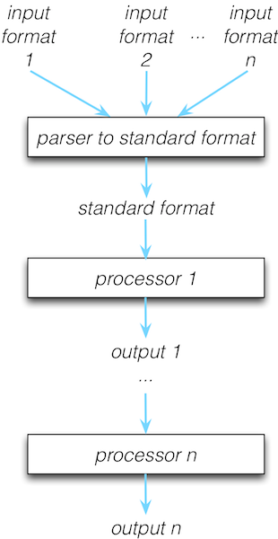
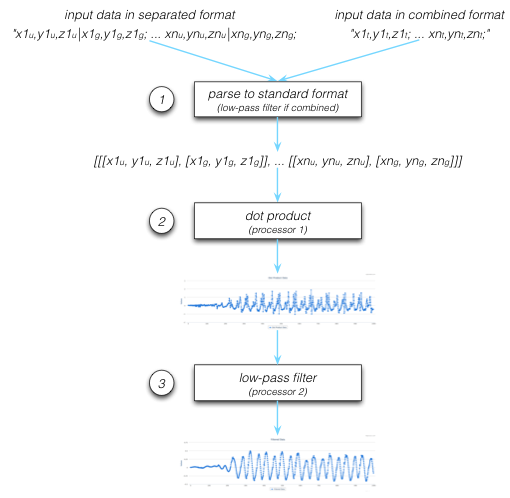
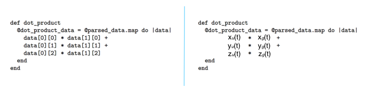
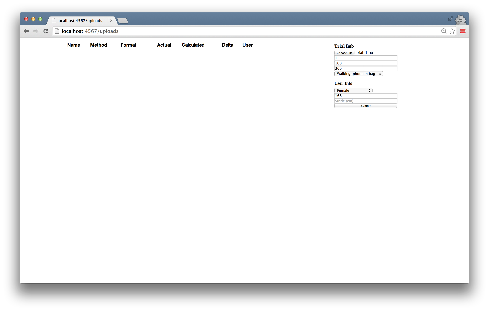
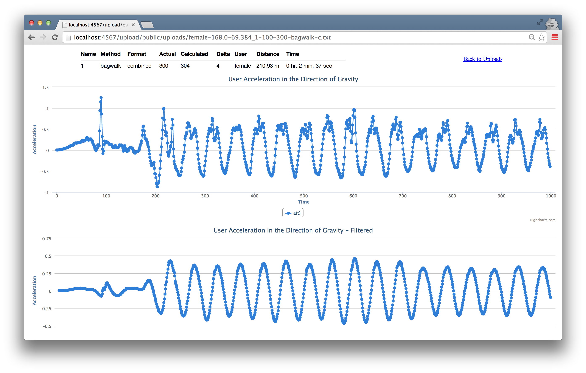
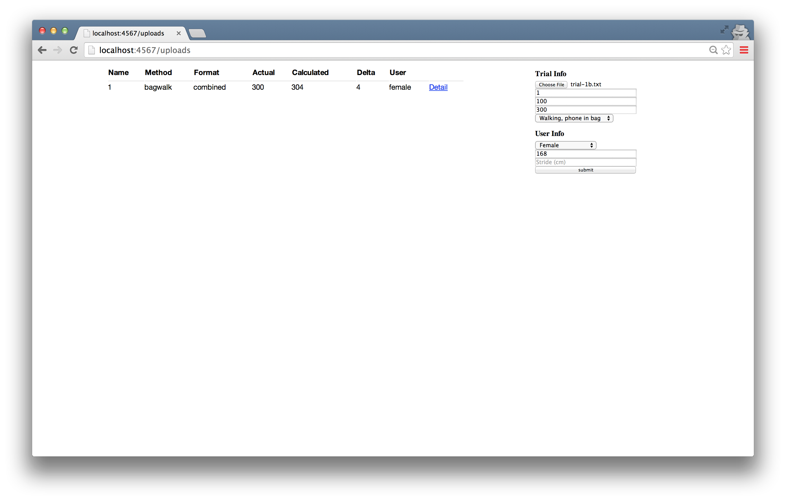

# A Perfect World

Many software engineers reflecting on their training will remember having the pleasure of living in a very perfect world. We were taught to solve discrete problems, with defined parameters, in an ideal domain. 

Then, we were thrown into the real world, with all of its complexities and challenges. It's messy, which makes it all the more exciting. When you can solve a real-life problem, with all of its quirks, you can build software that really helps people, every day. 

In this chapter, we'll examine a problem that looks straightforward on the surface, and gets tangled very quickly when the real world, and real people, are thrown into it. 

Let's roll up our sleeves, and prepare to untangle.

# A Basic Pedometer

The rise of the mobile device brought with it a trend to collect more and more data on our daily lives. One type of data many people today collect is the number of steps they've taken over a period of time. This data can be used for health tracking, training for sporting events, or, for those of us obsessed with collecting and analyzing data, just for kicks. Steps can be counted using a pedometer, which often uses data from a hardware accelerometer as input.

## What's an Accelerometer, You Ask?

An accelerometer is a piece of hardware that measures acceleration in the x, y, and z directions. In today's mobile world, many people carry an accelerometer with them wherever they go, as it's built into almost all smartphones currently on the market. The x, y, and z directions are relative to the phone.

An accelerometer returns a **signal** in 3-dimensional space. A signal is a set of data points recorded over time. Each component of the signal is a time series representing acceleration in one of the x, y, or z directions. Each point in a time series is the acceleration in that direction at a specific point in time. Acceleration is measured in units of g-force. One *g* is equal to $9.8 m/s^2$, which is the gravitational acceleration on Earth.

The diagram below shows an example acceleration signal from an accelerometer with the three time series.

\ 

The **sampling rate** of the accelerometer, which can often be calibrated, determines the number of measurements per second. For instance, an accelerometer with a sampling rate of 100 returns 100 data points for each x, y, and z time series each second.

## Let's Talk About a Walk

When a person walks, they bounce slightly with each step. Just watch the top of a person's head as they walk away from you. Their head, torso, and hips are synchronized in a smooth bouncing motion. While people don't bounce very far, only one or two inches, it is one of the clearest, most constant, and most recognizable parts of a person's walking acceleration signal!

A person bounces up and down, in the vertical direction, with each step. If you are walking on Earth, or another big ball of mass floating in space, the bounce is conveniently in the same direction as gravity. 

**We are going to count steps by using the accelerometer to count bounces up and down. Because the phone can rotate in any direction, we will take advantage of gravity to know which direction down is. A pedometer can count steps by counting the number of bounces in the direction of gravity.**

Let's look at a person walking with a smartphone containing an accelerometer, in his or her shirt pocket, as depicted below.

\

For the sake of simplicity, we'll assume that the stick person:

* is walking in the z direction;
* bounces with each step in the y direction;
* maintains the phone in the same orientation throughout the entire walk;

In our perfect world, acceleration from step bounces will form a perfect sine wave in the y direction. Each peak in the sine wave is exactly one step. Step counting becomes a matter of counting these perfect peaks. 

Ah, the joys of a perfect world, which we only ever experience in texts like this. Don't fret, things are about to get a little messier, and a lot more exciting. Let's add a little more reality to our world. 

## Even Perfect Worlds Have Fundamental Forces of Nature

The force of gravity causes an acceleration in the direction of gravity, which we refer to as gravitational acceleration. This acceleration is unique because it is always present, and is always constant at $9.8 m/s^2$. 

Suppose a smartphone is lying on a table screen-size up. In this orientation, our coordinate system is such that the negative z direction is the one in direction of gravity. Gravity will **pull** our phone in the negative z direction, so our accelerometer, **even when perfectly still**, will record an acceleration of $9.8 m/s^2$ in the negative z direction. Real accelerometer data from our phone in this orientation looks like the graph below. 

\

Note that the $x(t)$ and $y(t)$ remain constant at 0, while $z(t)$ is constant at $-1g$. Our accelerometer records all acceleration, including gravitational acceleration.

Each component of the acceleration signal measures the **total acceleration** in that direction. Total acceleration is a result of **user acceleration** and **gravitational acceleration**. 

User acceleration is the acceleration of the device due to the movement of the user, and is constant at 0 when the phone is perfectly still. However, when the user is moving with the device, user acceleration is rarely constant, since it's difficult for a person to move with a constant acceleration. 

Our total acceleration is the sum of user acceleration and gravitational acceleration. 

\

To count steps, we're interested in the bounces created by the user in the direction of gravity. That means we're interested in isolating the 1-dimensional time series **user acceleration in the direction of gravity** from our 3-dimensional acceleration signal. 

When our stick person is walking with step bounces in the y direction, gravitational acceleration is zero in $x(t)$ and $z(t)$ and constant at $9.8 m/s^2$ in $y(t)$, so $x(t)$ and $z(t)$ fluctuate around 0 while $y(t)$ fluctuates around $-1g$. Note the obvious peaks in $y(t)$. Those are due to step bounces! Looking at the user acceleration plots next, we notice that when we remove gravitational acceleration from the time series, all three time series fluctuate around 0. In our last plot, gravitational acceleration, $y_{g}(t)$ is near-constant at $-1g$, $x_{g}(t)$ and $z_{g}(t)$ are near-constant at 0.

So, in our simple case, the 1-dimensional user acceleration in the direction of gravity time series we're interested in is $y_{u}(t)$. Although $y_{u}(t)$ isn't as smooth as our perfect sine wave, we can identify the peaks, and use those peaks to count steps. So far, so good. Now, let's add a little more reality to our world. 

## People Are Complicated Creatures

Let's see what happens when we introduce real people into the mix. What if a person carries the phone in a bag on their shoulder, with the phone in a more wonky position? To make matters worse, what if the phone rotates in the bag part way through the walk?

\

Yikes. Now all three of our components have a non-zero gravitational acceleration, so the user acceleration in the direction of gravity is now split amongst all three x, y, and z time series. To determine user acceleration in the direction of gravity, we have to first determine which direction gravity is in. To do this, we have to split total acceleration in each of the three time series into a user acceleration time series and a gravitational acceleration time series. 

\

Then, we can isolate the portion of user acceleration in each component that is in the direction of gravity, resulting in just the user acceleration in the direction of gravity time series. 

Let's define this as two steps below:

1. Splitting total acceleration into user acceleration and gravitational acceleration. 
2. Isolating user acceleration in the direction of gravity. 

Let's look at each problem separately, and put on our mathematician hats. 

## 1. Splitting Total Acceleration Into User Acceleration and Gravitational Acceleration

We can use a tool called a **filter** to split our total acceleration time series into a user acceleration time series and a gravitational acceleration time series.

### Low-pass and High-pass Filters
A **filter** is a tool used in signal processing to remove an unwanted component from a signal. 

A **low-pass filter** allows low-frequency signals through, while attenuating signals higher than a set threshold. Conversely, a **high-pass filter** allows high-frequency signals through, while attenuating signals below a set threshold. Using music as an analogy, a low-pass filter can be used to get rid of the treble, while and a high-pass filter can be used to get rid of the bass. 

In our situation, the frequency, measured in Hz, indicates how quickly the acceleration is changing. A constant acceleration has a frequency of 0 Hz, while a non-constant acceleration has a non-zero frequency. This means that our constant gravitational acceleration is a 0 Hz signal, while user acceleration is not. 

For each component, we can pass total acceleration through a low-pass filter, and we'll be left with just the gravitational acceleration time series. Then, we can subtract gravitational acceleration from total acceleration, and we'll have the user acceleration time series. 

\ 

There are numerous varieties of filters. The one we'll use is called a Chebyshev filter. We've chosen a Chebyshev filter because it has a steep cutoff, which means that it very quickly attenuates frequencies beyond our chosen threshold.

The Chebyshev filter we've chosen is implemented using the formula $output_{i} = \alpha_{0} * (input_{i} * \beta_{0} + input_{i-1} * \beta_{1} + input_{i-2} * \beta_{2} - output_{i-1} * \alpha_{1} - output_{i-2} * \alpha_{2})$. 

The design of digital filters is outside of the scope of this chapter, but a very short teaser discussion is warranted. It's a well-studied, fascinating topic, with numerous practical applications. A digital filter can be designed to cancel any frequency or range of frequencies desired. The $\alpha$ and $\beta$ values in the formula are coefficients, set based on the cutoff frequency, and the range of frequencies we want to preserve. 

We want to cancel all frequencies except for our constant gravitational acceleration, so we've chosen coefficients that attenuate frequencies higher than 0.2 Hz. Notice that we've set our threshold slightly higher than 0 Hz. While gravity does create a true 0 Hz acceleration, our real, imperfect world has real, imperfect accelerometers, so we're allowing for a slight margin of error in measurement. 

### Implementing a Low-pass Filter

Let's work through a low-pass filter implementation using our earlier example. We'll split: 

* $x(t)$ into $x_{g}(t)$ and $x_{u}(t)$, 
* $y(t)$ into $y_{g}(t)$ and $y_{u}(t)$,
* $z(t)$ into $z_{g}(t)$ and $z_{u}(t)$.

We'll initialize the first two values of gravitational acceleration to 0, so that the formula has initial value to work with.

$x_{g}(0) = x_{g}(1) = y_{g}(0) = y_{g}(1) = z_{g}(0) = z_{g}(1) = 0$\

Then, we'll implement the filter formula for each time series.

$x_{g}(t) = \alpha_{0} * (x(t) * \beta_{0} + x(t-1) * \beta_{1} + x(t-2) * \beta_{2} - x_{g}(t-1) * \alpha_{1} - x_{g}(t-2) * \alpha_{2})$\

$y_{g}(t) = \alpha_{0} * (y(t) * \beta_{0} + y(t-1) * \beta_{1} + y(t-2) * \beta_{2} - y_{g}(t-1) * \alpha_{1} - y_{g}(t-2) * \alpha_{2})$\

$z_{g}(t) = \alpha_{0} * (z(t) * \beta_{0} + z(t-1) * \beta_{1} + z(t-2) * \beta_{2} - z_{g}(t-1) * \alpha_{1} - z_{g}(t-2) * \alpha_{2})$\

The resulting time series after low-pass filtering are below. 

\ 

$x_{g}(t)$ and $z_{g}(t)$ hover around 0, and $y_{g}(t)$ very quickly drops to $-1g$. The initial 0 value in $y_{g}(t)$ is from the initialization of the formula.

Now, to receive user acceleration, we can subtract gravitational acceleration from our total acceleration:

$x_{u}(t) = x(t) - x_{g}(t)$\
$y_{u}(t) = y(t) - y_{g}(t)$\
$z_{u}(t) = z(t) - z_{g}(t)$

When we do that, we receive the time series below:

\ 

We've successfully split our total acceleration into user acceleration and gravitational acceleration!

## 2. Isolating User Acceleration in the Direction of Gravity

$x_{u}(t)$, $y_{u}(t)$, and $z_{u}(t)$ include all movements of the user, not just movements in the direction of gravity. Our goal here is to end up with a 1-dimensional time series representing **user acceleration in the direction of gravity**. This time series will include portions of user acceleration in each of our directions.

Let's get to it. First, some liner algebra 101. Don't take that mathematician hat off just yet!

### The Dot Product

When working with coordinates, you won't get very far before being introduced to the **dot product**, one of the fundamental tools used in comparing the magnitude and direction of x, y, z coordinates.

The dot product will take us from 3-dimensional space to 1-dimensional space, returning a single time series. We'll jump right in with an example.

\ 

Taking the dot product of user acceleration and gravitational acceleration at time *t* will give us the portion of user acceleration in the direction of gravity at that time. When we do this for every *t* in our time series, we'll get a single time series representing user acceleration in the direction of gravity. Exactly what we need! We'll arbitrarily call this new time series $a(t)$, because, well, every important time series deserves a name. 

### Implementing the Dot Product
We can implement the dot product for our earlier example using the formula

$a(t) = x_{u}(t) * x_{g}(t) + y_{u}(t) * y_{g}(t) + z_{u}(t) * z_{g}(t)$,

leaving us with $a(t)$, in 1-dimensional space. 

\ 

We can now visually pick out where the steps are. The dot product is very powerful, yet beautifully simple. 

## Solutions in the Real World 

We saw how quickly our seemingly simple problem turned more complex when we threw in the challenges of the real world and real people. However, we're getting a lot closer to counting steps, and we can see how $a(t)$ is starting to resemble our ideal sine wave. But, only "kinda, sorta" starting to. We still need to make our messy $a(t)$ time series smoother. There are four main issues with $a(t)$ in its current state. Let's examine each one.

\ 

### 1. Jumpy Peaks

$a(t)$ is very "jumpy", because a phone can jiggle with each step, adding a high-frequency component to our time series. By studying numerous data sets, we've determined that a step acceleration is at maximum 5 Hz. We can again use a low-pass Chebyshev filter, picking $\alpha$ and $\beta$ to attenuate all signals above 5 Hz, to remove the "jumpiness".

### 2. Slow Peaks

With a sampling rate of 100, the slow peak displayed in $a(t)$ spans 1.5 seconds, which is too slow to be a step. In studying enough samples of data, we've determined that the slowest step we can take is at a 1 Hz frequency. Slower accelerations are due to a low-frequency component, that we can again remove using a high-pass Chebyshev filter, setting $\alpha$ and $\beta$ to cancel all signals below 1 Hz. 

### 3. Short Peaks

As a person is using an app or making a call, the accelerometer registers small movements in the direction of gravity, presenting themselves as short peaks in our time series. We can eliminate these short peaks by setting a minimum threshold, and counting a step every time $a(t)$ crosses that threshold in the positive direction.

### 4. Bumpy Peaks

Our pedometer should accommodate many people with different walks, so we set minimum and maximum step frequencies based on a large sample size of people and walks. This means that we may sometimes filter slightly too much or too little. While we'll often have fairly smooth peaks, we can, once in a while, get a "bumpier" peak. The diagram above zooms in on one such peak. 

When bumpiness occurs at our threshold, we can mistakenly count too many steps for one peak. We can use a method called **hysteresis** to address this. Hysteresis refers to the dependence of an output on past inputs. We can count threshold crossings in the positive direction, as well as 0 crossings in the negative direction. Then, we only count steps where a threshold crossing occurs after a 0 crossing, ensuring we count each step only once. 

### Peaks That Are Juuuust Right

In accounting for these four scenarios, we've managed to bring our messy $a(t)$ fairly close to our ideal sine wave, allowing us to count steps. 

## Recap

The problem, at first glance, looked straightforward. However, the real world and real people threw a few curve balls our way. Let's recap how we solved the problem: 

1. We started with total acceleration, $(x(t), y(t), z(t))$.
2. We used a low-pass filter to split total acceleration into user acceleration, $(x_{u}(t), y_{u}(t), z_{u}(t))$, and gravitational acceleration, $(x_{g}(t), y_{g}(t), z_{g}(t))$.
3. We took the dot product of $(x_{u}(t), y_{u}(t), z_{u}(t))$ and $(x_{g}(t), y_{g}(t), z_{g}(t))$ to obtain the user acceleration in the direction of gravity, $a(t)$. 
4. We used a low-pass filter again to remove the high-frequency component of $a(t)$, removing noise.
5. We used a high-pass filter to cancel the low-frequency component of $a(t)$, removing slow peaks.
6. We set a threshold to ignore short peaks.
7. We used hysteresis to avoid double-counting steps with bumpy peaks.

As software developers in a training or academic setting, we may have been presented with a perfect signal and asked to write code to count the steps in that signal. While that may have been an interesting coding challenge, it wouldn't have been something we could apply in a live situation. We saw that in a reality with gravity and people thrown into the mix, the problem was a little more complex. We used mathematical tools to address the complexities, and were able to solve a real-world problem. Now it's time to translate our solution into code. 

# Diving Into Code

Our goal for this chapter is to create a web application in Ruby that accepts accelerometer data, parses, processes, and analyzes it, and returns the steps taken along with some other related information. Let's begin with the parsing, processing, and analyzing. 

## Processing Input Data

The input data we'll be processing is coming from mobile devices such as Android phones and iPhones. Most iPhone and Android devices on the market today have accelerometers built in, that are able to record total acceleration. Let's call the input data format that records total acceleration the *combined format*. Many, but not all, devices can also record user acceleration and gravitational acceleration separately. Let's call this format the *separated format*. A device that has the ability to return data in the separated format necessarily has the ability to return data in the combined format. However, the inverse is not necessarily true. Some devices on the market today can only record data in the combined format. 

Input data in the combined format will need to be passed through a low-pass filter to turn it into the separated format. This extra step will result in slightly less accurate results. Some hardware manufacturers use additional sensors to measure rotational changes, resulting in a slightly higher degree of accuracy in their separated data, versus our strategy of splitting total acceleration into gravitational and user. Don't worry, we'll still get quite close. The discrepancy is only due to the hardware having more information at the time of measurement than we have with the combined input.

We want our program to handle all mobile devices on the market with accelerometers, regardless of whether or not only able to record data in the combined format. This means that we'll need to accept data in both formats. 

Let's look at the two formats we'll be accepting individually.

### Combined Format

Data in the combined format is total acceleration in the x, y, z directions, over time. x, y, and z values will be separated by a comma, and samples per unit time will be separated by a semi-colon.

$"x1,y1,z1; ... xn,yn,zn;"$

### Separated Format

The separated format returns user acceleration in the x, y, z directions as well as gravitational acceleration in the x, y, z directions, over time. User acceleration values will be separated from gravitational acceleration values by a pipe.

$"x_{u}1,y_{u}1,z_{u}1|x_{g}1,y_{g}1,z_{g}1; ... x_{u}n,y_{u}n,z_{u}n|x_{g}n,y_{g}n,z_{g}n;"$

## I Got Multiple Input Formats But a Standard Ain't One

Dealing with multiple input formats is a common programming problem. If we want our entire program to work with both formats, every single piece of code dealing with the data would need to know how to handle both formats. This can become very messy, very quickly, especially if a third (or a fourth, or a fifth, or a hundredth) input format is added.

The cleanest way for us to deal with this is to take our two input formats and determine a standard format to fit them both into as soon as possible, allowing the rest of the program to work with this new standard format. The diagram below outlines the basic idea. 

\

We'll write a parser to a standard format that is contained in only one section of code, that allows us to take our two known input formats and convert them to a single standard output format. In the future, if we ever have to add another input format, the only code we'll have to touch is this small parser. Once the data is in a standard format, the program can have any number of processors that process the data from the standard format, without ever being concerned about the original format that the data was in. 

Converting multiple input formats into one common format is an example of *separation of concerns*, a commonly-used design principle, which promotes splitting a program into numerous distinct pieces, where every piece has one primary concern. It's a beautiful way to write clean, maintainable code that's easily extensible. We'll revisit this idea several times throughout the chapter.

## Applying Our Step Counting Solution

Based on the solution we defined, and our two input formats, we'll need our code to do three things to our input data before we can count steps:

1. Parse our input formats into a standard format. 
2. Isolate movement in the direction of gravity using the dot product.
3. Apply a low-pass filter and a high-pass filter to remove low-frequency and high-frequency components.

The diagram below shows each of these three steps.

\

We know we'll need to work with user acceleration and gravitational acceleration separately in order to follow our solution, so our standard format will need to split out the two accelerations. This means that if our data is in the combined format, we'll need to first pass it through a low-pass filter in step 1 to convert it to the standard format.

Take note of the standard format:

\

Our standard format allows us to store a time series, as each element represents acceleration at a point in time. We've defined it as an array of arrays of arrays. Let's peel back that onion. 

* The first array is just a wrapper to hold the all of the data.
* The second set of arrays contains one array per data sample taken. If our sampling rate is 100 and we sample data for 10 seconds, we'll have $10 * 100$, or 1000, arrays in this second set. 
* The third set of arrays is the pair of arrays enclosed within the second set. They both contain acceleration data in the x, y, and z directions; the first representing user acceleration and the second gravitational acceleration.

These three tasks - parse, dot product, and filter - are all related to taking input data, and parsing and processing it to get it to a state where our resulting data set is clean enough for us to count steps. Due to this relationship, it makes sense to combine these tasks into one class, called a **Processor**. 

## The Processor Class

~~~~~~~
class Processor

  GRAVITY = {
    alpha: [1, -1.979133761292768, 0.979521463540373],
    beta:  [0.000086384997973502, 0.000172769995947004, 0.000086384997973502]
  }
  
  SMOOTHING = {
    alpha: [1, -1.80898117793047, 0.827224480562408], 
    beta:  [0.095465967120306, -0.172688631608676, 0.095465967120306]
  }  

  HIGHPASS = {
    alpha: [1, -1.905384612118461, 0.910092542787947], 
    beta:  [0.953986986993339, -1.907503180919730, 0.953986986993339]
  }

  FORMAT_COMBINED  = 'combined'
  FORMAT_SEPARATED = 'separated'

  attr_reader :data, :format, :parsed_data, :dot_product_data, :filtered_data

  def initialize(data)
    @data = data

    parse
    dot_product
    filter
  end

  def parse
    @parsed_data = @data.to_s.split(';').map { |i| i.split('|') }
                   .map { |i| i.map { |i| i.split(',').map(&:to_f) } }

    unless @parsed_data.map { |data| data.map(&:length).uniq }.uniq == [[3]]
      raise 'Bad Input. Ensure data is properly formatted.'
    end

    @format = if @parsed_data.first.count == 1
      filtered_accl = @parsed_data.map(&:flatten).transpose.map do |total_accl|
        grav = chebyshev_filter(total_accl, GRAVITY)
        user = total_accl.zip(grav).map { |a, b| a - b }
        [user, grav]
      end

      @parsed_data = @parsed_data.length.times.map do |i|
        user = filtered_accl.map(&:first).map { |elem| elem[i] }
        grav = filtered_accl.map(&:last).map { |elem| elem[i] }
        [user, grav]
      end
      
      FORMAT_COMBINED
    else
      FORMAT_SEPARATED
    end
  end

  def dot_product
    @dot_product_data = @parsed_data.map do |data|
      data[0][0] * data[1][0] + 
      data[0][1] * data[1][1] + 
      data[0][2] * data[1][2]
    end
  end

  def filter
    low_pass_filtered_data = chebyshev_filter(@dot_product_data, SMOOTHING)
    @filtered_data = chebyshev_filter(low_pass_filtered_data, HIGHPASS)
  end

  def chebyshev_filter(input_data, coefficients)
    output_data = [0,0]
    (2..input_data.length-1).each do |i|
      output_data << coefficients[:alpha][0] * 
                     (input_data[i]   * coefficients[:beta][0] +
                     input_data[i-1]  * coefficients[:beta][1] +
                     input_data[i-2]  * coefficients[:beta][2] -
                     output_data[i-1] * coefficients[:alpha][1] -
                     output_data[i-2] * coefficients[:alpha][2])
    end
    output_data
  end

end
~~~~~~~

### Filtering

Let's start with the last method in our class, `chebyshev_filter`, which implements the low-pass and high-pass Chebyshev filters. The first parameter it expects, `input_data`, is an array containing the time series we want filtered. The `coefficients` parameter expects a hash with two keys, `alpha` and `beta`, each of which contains the coefficients to be used in the formula. The constants `GRAVITY`, `SMOOTHING`, and `HIGHPASS` will be passed into `coefficients`. The `chebyshev_filter` method returns an array containing the resulting time series. 

We implement the low-pass filter in code by first instantiating an `output_data` array with zeros at index 0 and 1, so that the equation has initial values to work with. Then, we loop through the remaining indices of the `input_data` time series, apply the formula at each turn, and append the result to `output_data`, returning `output_data` when the loop is complete. 

The `chebyshev_filter` method is another example of *separation of concerns*. We know we'll need to implement a filter more than once in our code, so we leave the knowledge of how to do that in one method only. The rest of our code need only know how to call the method and pass in the appropriate `coefficients` for the `input_data` it needs filtered. If there is ever a bug in the filtering code, we only need to fix it in the `chebyshev_filter` method.

## The Inner Workings of the Processor Class

Let's take a look at how the rest of the class works, starting with the `initialize` method. Our `Processor` class takes string data as input and stores it in the `@data` instance variable. It then calls three methods in sequence: `parse`, which sets `@parsed_data`; `dot_product`, which sets `@dot_product_data`; and `filter`, which sets `@filtered_data`.

Each method accomplishes one of our three steps. Let's look at each method individually. 

### Step 1: Parse Our Input Formats Into a Standard Format (parse)

The goal of `parse` is to convert string data in either the combined or separated format to numerical data, and store it in our standard format in `@parsed_data`.

The first step in the process is to take string data and convert it to numerical data. The first operation sets `@parsed_data` after performing three tasks in sequence:

* splitting the string by semicolon into as many arrays as samples taken, 
* splitting each individual array by the pipe into another array, and,
* splitting the resulting array string elements by the comma and converting them to floats.

This gives us an array of arrays of arrays. Sound familiar? The next thing we do is ensure that the format is as expected. Unless we have exactly three elements per the innermost arrays, we throw an exception. Otherwise, we continue on.

Note the differences in `@parsed_data` between the two formats at this stage:

* `@parsed_data` in the *combined format* contains arrays with exactly **one** array: $[[[x1, y1, z1]], ... [[xn, yn, zn]]$
* `@parsed_data` in the *separated format* contains arrays with exactly **two** arrays: $[[[x_{u}1,y_{u}1,z_{u}1], [x_{g}1,y_{g}1,z_{g}1]], ... [[x_{u}n,y_{u}n,z_{u}n], [x_{g}n,y_{g}n,z_{g}n]]]$

We see here that the separated format is already in our desired standard format after this operation. Amazing. 

To get the combined format into the standard format, we'll need to low-pass filter it to split the acceleration into user and gravitational first, and ensure it ends up in the same standard format afterward. In order to do that, we use the difference in `@parsed_data` at this stage to determine whether the format is combined or separated in the `if` statement in the next portion of the code. If it's combined (or, equivalently, has exactly one array where the separated format would have two), then we proceed with:

1. passing the data through `chebyshev_filter` to low-pass filter it and split out the accelerations, and,
2. formatting the data into the standard format. 

We accomplish each of these steps with a loop. The first loop uses our array after calling `flatten` on each element, followed by `transpose` on the result, so that it can work with x, y, and z total acceleration components individually. The array after `flatten` and `transpose` and before looping is structured as follows:

$[[[x1, ... xn]], [[y1, ... yn]], [[z1, ... zn]]]$

Then, we use `map` to loop through each of the three components. In the first line of the loop, we call `chebyshev_filter` with `GRAVITY` to split out gravitational acceleration, storing the resulting array in `grav`. In the second line, we isolate user acceleration by using `zip` to subtract gravitational acceleration from total acceleration, storing the resulting array in `user`. In the last line, we return an array with `user` and `grav` as the two elements. 

This loop runs exactly three times, once for each component time series, and stores the final result in `filtered_accl`:

$[[[x_{u}1, x_{u}2, ..., x_{u}n], [x_{g}1, x_{g}2, ..., x_{g}n]], $\
$[[y_{u}1, y_{u}2, ..., y_{u}n], [y_{g}1, y_{g}2, ..., y_{g}n]], $\
$[[z_{u}1, z_{u}2, ..., z_{u}n], [z_{g}1, z_{g}2, ..., z_{g}n]]]$

We're almost there. We've split total acceleration into user and gravitational. All that's left is to format `filtered_accl` to our standard format. We do this in the second loop. 

The second loop sets `@parsed_data` to the standard format. We use `map` to loop once for each index in `@parsed_data`, which represents a data sample at a point in time. The first line in the loop stores an array with the x, y, and z user acceleration at that point in time in `user` by grabbing the acceleration values using `map` once again. The second line stores the equivalent values for gravitational acceleration in `grav`. The last line returns an array with `user` and `grav` as the elements. 

The last thing the `if` statement does, for each branch, is set the `@format` variable to either `FORMAT_COMBINED` or `FORMAT_SEPARATED`, both of which are constants that indicate the type of format the original data was passed in as. These are used predominantly for display purposes in the web app. Otherwise, the remainder of the program is no longer concerned with these two formats. 

At the end of the `if` statement, we're left with the `@parsed_data` variable holding data in the standard format, regardless of whether we started off with combined or separated data. Great. We can now move on without worrying about our two formats again, and with the peace of mind that the changes required if we choose to add a third or fourth or hundredth format will be isolated to just the `parse` method. What a relief!

### Step 2: Isolate Movement in the Direction of Gravity Using the Dot Product (dot_product)

`dot_product` iterates through `@parsed_data` using `map`, calculating the dot product for each index, and storing the resulting time series in `@dot_product_data`.

\ 

### Step 3: Apply Filters to Remove Low-Frequency and High-Frequency Components (filter)

We use `chebyshev_filter` twice in `filter`. First, we pass `@dot_product_data` in as our time series, and `SMOOTHING` as the `coefficients` parameter. The result is our time series without the high frequency component, which we store in `low_pass_filtered_data`. Next, we call `chebyshev_filter` once more, this time passing in `low_pass_filtered_data` as the time series, and `HIGHPASS` as the `coefficients` constant. This resulting time series is the clean one we can use to count steps, stored in `@filtered_data`. 

## Our Processor Class in the Wild

Our Processor now takes string data in both the separated and combined formats, converts it into a more useable format, isolates user acceleration in the direction of gravity, and filters the time series to smooth it out. Our processor class is useable on its own as is.

As our program grows, we would likely modify `Processor`. As we add more and more input formats, we might decide to split out the `parse` code into a `Parser` class to deal with these formats, allowing for more separation of concerns. We could also make our users' lives easier by throwing exceptions with more specific messages than "Bad Input. Ensure data is properly formatted.", to allow them to more quickly track down common input formatting problems. 

## Pedometer Functionality

Our pedometer will measure **distance traveled**, **time traveled**, and **steps taken**. Let's discuss the information we'll need to calculate each of these metrics. We're intentionally leaving the exciting, step counting part of our program to the end.

## Distance Traveled
A mobile pedometer app is generally used by one person. Total distance travelled during a walk is calculated by multiplying the steps taken by the person's stride length. If the stride length is provided, we can use it directly. If it's unknown, we can allow other optional information to be provided for the user, such as gender and height. We can do the best we can with what's provided to calculate the stride and, ultimately, the distance travelled. 

Information like stride length, gender, and height is related to the user, so it makes sense to create a `User` class. 

~~~~~~~
class User

  GENDER      = ['male', 'female']
  MULTIPLIERS = {'female' => 0.413, 'male' => 0.415}
  AVERAGES    = {'female' => 70,    'male' => 78}
  
  attr_reader :gender, :height, :stride

  def initialize(gender = nil, height = nil, stride = nil)
    @gender = gender.to_s.downcase if GENDER.include? gender.to_s.downcase
    @height = height.to_f if height.to_f > 0
    @stride = (stride.to_f > 0) ? stride.to_f : calculate_stride
  end

private

  def calculate_stride
    if gender && height
      MULTIPLIERS[@gender] * height
    elsif height
      height * (MULTIPLIERS.values.reduce(:+) / MULTIPLIERS.size)
    elsif gender
      AVERAGES[gender]
    else
      AVERAGES.values.reduce(:+) / AVERAGES.size
    end
  end

end
~~~~~~~

At the top of our class, we define constants to avoid hardcoding "magic" numbers and strings throughout. Our initializer accepts `gender`, `height`, and `stride` all as optional parameters. Handling optional information is a common programming problem. If the optional parameters are passed in, our initializer sets instance variables of the same names, after some data formatting to allow for a case insensitive gender parameter to be passed in, as long as its defined in `GENDER`, and prevent a height and stride that is non-numerical or less than 0.

Even when all optional parameters are provided, the input stride takes precedence. If a stride is not provided, our `calculate_stride` method will determine the most accurate stride length it can for the user. This is done with an `if` statement. 

* The most accurate way to calculate stride beyond it being provided directly is to use a person's height and a multiplier based on gender. If we have a valid gender and height, we can calculate stride by multiplying the height by the value in `MULTIPLIERS` which corresponds to the gender provided. 
* A person's height is a better predictor of stride than their gender is. If we have a height but not a gender, we can multiply the height by the average of the two values in `MULTIPLIERS`. 
* If all we have is a gender, we can use the average stride length from `AVERAGES`.
* Finally, if we don't have anything, we can take the average of the two values in `AVERAGES` and use that as our stride. 

For the purposes of this discussion, let's assume that the values in `MULTIPLIERS` and `AVERAGES` have been determined from a large sample size of diverse people. 

Note that the further down the chain we get, the less accurate our stride length becomes. In any case, our `User` class does determines the stride length as best as it can.

### Time Traveled

The time traveled is measured by dividing the number of data samples in our `Processor`'s `@parsed_data` by the sampling rate of the device. Since the rate has more to do with the trial walk itself than the user, and the `User` class in fact does not have to be aware of the sampling rate, this is a good time to create a very small `Trial` class.

~~~~~~~
class Trial

  attr_reader :name, :rate, :steps, :method

  def initialize(name = nil, rate = nil, steps = nil, method = nil)
    @name   = name
    @rate   = (rate.to_f.round > 0) ? rate.to_f.round : 100
    @steps  = steps.to_f.round if steps.to_s != '' && steps.to_f.round >= 0
    @method = method
  end

end
~~~~~~~

All of the attribute readers in `Trial` are set in the initializer based on optional parameters passed in:

* `name` is a name for the specific trial, to help differentiate between the different trials.
* `rate` is the sampling rate of the accelerometer during the trial.
* `steps` is used to set the actual steps taken, so that we can record the difference between the actual steps the user took and the ones our program counted.
* `method` is used to set the type of walk that is taken. Types of walks include walking with the device in a pocket, walking with the device in a bag, jogging with the device in a pocket, jogging with the device in a bag, etc.

Much like our `User` class, information is optional. We're given the opportunity to input details of the trial, if we have it, for more accurate end results. If we don't have those details, our program makes assumptions and is still able to produce results, albeit with a higher margin of error. Another similarity to our `User` class is the basic input data formatting in the initializer. This ensures that `@rate` and `@steps` are always numerical values, where `@rate` is greater than or equal to 0, and `@steps` is greater than 0. 

### Steps Taken

It's time to implement our step counting strategy in code. So far, we have a `Processor` class that contains `@filtered_data`, which is our processed, smooth time series representing user acceleration in the direction of gravity. We also have classes that give us the necessary information about the user and the trial. What we're missing is a way to analyze `@filtered_data` with the information from `User` and `Trial`, and count steps, measure distance, and measure time. The analysis portion of our program is different from the data manipulation of the `Processor`, and different from the information collection and aggregation of the `User` and `Trial` classes. Let's create a new class called `Analyzer` to perform this data analysis.

~~~~~~~
require_relative 'processor'
require_relative 'user'
require_relative 'trial'

class Analyzer

  THRESHOLD = 0.09

  attr_reader :processor, :user, :trial, :steps, :distance, :time

  def initialize(processor, user = User.new, trial = Trial.new)
    raise 'Processor invalid.' unless processor.kind_of? Processor
    raise 'User invalid.'      unless user.kind_of? User
    raise 'Trial invalid.'     unless trial.kind_of? Trial

    @processor = processor
    @user      = user
    @trial     = trial
  end

  def measure
    measure_steps
    measure_distance
    measure_time
  end

private

  def measure_steps
    @steps = 0
    count_steps = true

    @processor.filtered_data.each_with_index do |data, i|
      if (data >= THRESHOLD) && (@processor.filtered_data[i-1] < THRESHOLD)
        next unless count_steps

        @steps += 1
        count_steps = false
      end

      count_steps = true if (data < 0) && (@processor.filtered_data[i-1] >= 0)
    end
  end

  def measure_distance
    @distance = @user.stride * @steps
  end

  def measure_time
    @time = @processor.filtered_data.count/@trial.rate
  end

end
~~~~~~~

The first thing we do in our `Analyzer` class is define a `THRESHOLD` constant. For the purposes of this discussion, let's assume we've analyzed numerous diverse data sets and determined a threshold value that accommodated the largest number of those data sets. The threshold can eventually become dynamic and vary with different users, based on the calculated versus actual steps they've taken. A learning algorithm, if you will.

Our `Analyzer`'s initializer take a mandatory `Processor` instance because we necessarily need a data set to work with, and optionally takes a `User` and `Trial` instance. Note that the default values for the `user` and `trial` parameters is a new instance of each. Remember how those classes both had default values and could handle zero input parameters? That functionality comes in handy here. The initializer raises exceptions if classes other than those expected are passed in, and sets the instance variables `@processor`, `@user`, and `@trial` to the passed in parameters. 

Aside from the initializer, the only other public method in `Analyzer` is `measure`, which calls `measure_steps`, `measure_distance`, and `measure_time`, in that order. All three methods are kept private so that an outside class can't call them out of order. Let's take a look at each.

### measure_steps

Finally! The step counting portion of our step counting app. The first thing we do in `measure_steps` is initialize two variables:

* `@steps` is used to count the number of steps.
* `count_steps` is used for hysteresis to determine if we're allowed to count steps at a point in time.

We then iterate through `@processor.filtered_data`. If the current value is greater than or equal to `THRESHOLD`, and the previous value was less than `THRESHOLD`, then we've crossed the threshold in the positive direction, which could indicate a step. The `unless` statement skips ahead to the next data point if `count_steps` is `false`, indicating that we've already counted a step for that peak. If we haven't, we increment `@steps` by 1, and set `count_steps` to `false` to prevent any more steps from being counted for that peak. The next `if` statement sets `count_steps` to true once our time series has crossed the x-axis in the negative direction, and we're on to the next peak. 

There we have it, the step counting portion of our program! Our `Processor` class did a lot of work to clean up the time series and remove frequencies that would result in counting false steps, so our actual step counting implementation is not overly complex. 

It's worth noting that we store the entire time series for the walk in memory. Our trials are all short walks, so that's not currently a problem, but we'd like to eventually be able to analyze long walks with large amounts of data. We'd ideally want to stream data in, only storing very small portions of the time series in memory. Keeping this future direction in mind, we've put in the work to ensure that we only need the current data point we're analyzing and the data point before it. Additionally, we've implemented hysteresis using a boolean value, so we don't need to look backward in the time series to ensure we've crossed the x-axis at 0, avoiding having to store more than two data points in memory at a time. 

There's a fine balance between accounting for likely future iterations of the product, and over engineering a solution for every conceivable product direction under the sun. In this case, it's reasonable to assume that we'll have to handle longer walks in the near future, and the costs of accounting for that in step counting are fairly low, so we've decided to include it in our implementation.

### measure_distance

The distance is measured by multiplying our user's stride by the number of steps. Since the distance depends on the step count, `measure_distance` is called after `measure_steps`. 

### measure_time

Time is calculated by dividing the total number of samples in `filtered_data` by the sampling rate. It follows, then, that time is calculated in numbers of seconds. 

# Adding Some Friendly

We're through the most labour intensive part of our program. Next, we'll build a web app to present the data in a format that is pleasing to a user. A web app naturally separates the data processing from the presentation of the data. Let's look at our app from a user's perspective before we dive into the code. 

## A User Scenario

When a user first enters the app, they see an empty table of uploads, and an upload form with fields for trial info (Name, Sampling Rate, Actual Step Count, and Method, in the order) and user info (Gender, Height, and Stride), some of which are optional.

\ 

Filling out the form and hitting **submit** present the user with the following view:

\ 

Our program has parsed, processed, and analyzed the input file. The information presented includes values input by the user, values calculated by our program, and graphs of the time series following the dot product operation, and again following filtering. 

The user can navigate back to uploads using the *Back to Uploads* link, and continue uploading files as they wish.

\ 

Let's look at what the outlined functionality above implies for us, technically. We'll need two major components that we don't yet have:

1. A way to store and retrieve user input data.
2. A web application with a basic interface.

Let's examine each of these two requirements.

## 1. Storing and Retrieving Data

We need to store the text file containing the data samples, as well as the user and trial inputs associated with it. These user inputs are related to an upload, so we'll create an `Upload` class to keep track of, store, and load this data. 

~~~~~~~
require 'fileutils'
require_relative 'analyzer'

include FileUtils::Verbose

class Upload

  UPLOAD_DIRECTORY = 'public/uploads/'

  attr_reader :file_path, :processor, :user, :trial, :analyzer
  attr_reader :user_params, :trial_params

  def initialize(file_path = nil, input_data = nil, user_params = nil, trial_params = nil)
    if file_path
      @file_path = file_path
    elsif input_data
      @processor = Processor.new(File.read(input_data))
      @user      = User.new(*user_params)
      @trial     = Trial.new(*trial_params)

      @file_path = UPLOAD_DIRECTORY + 
                   "#{user.gender}-#{user.height}-#{user.stride}_" +
                   "#{trial.name.to_s.gsub(/\s+/, '')}-" + 
                   "#{trial.rate}-" + 
                   "#{trial.steps}-" +
                   "#{trial.method}-#{processor.format[0]}.txt"
    else 
      raise 'File name or input data must be passed in.'
    end
  end

  # -- Class Methods --------------------------------------------------------

  def self.create(input_data, user_params, trial_params)
    upload = self.new(nil, input_data, user_params, trial_params)
    cp(input_data, upload.file_path)
    upload
  end

  def self.find(file_path)
    self.new(file_path)
  end

  def self.all
    file_paths = Dir.glob(File.join(UPLOAD_DIRECTORY, "*"))
    file_paths.map { |file_path| self.new(file_path) }
  end

  # -- Instance Methods -----------------------------------------------------

  def processor
    @processor ||= Processor.new(File.read(file_path))
  end

  def user
    @user ||= User.new(*file_name.first.split('-'))
  end

  def trial
    @trial ||= Trial.new(*file_name.last.split('-')[0...-1])
  end

  def analyzer
    unless @analyzer
      @analyzer = Analyzer.new(processor, user, trial)
      @analyzer.measure
    end
    @analyzer
  end

private

  def file_name
    @file_name ||= file_path.split('/').last.split('_')
  end

end
~~~~~~~

Our `Upload` class has three class-level methods used to store data to, and retrieve data from, the file system. 

### Storing Data

The `create` method stores a file that a user uploads using the browser upload field. The details of the user and trial information passed in through the browser input fields and dropdown boxes are stored in the filename. When using the browser upload field, the browser creates a temporary file that our app has access to. The first parameter passed in to `create`, `input_data`, is the location of the temporary file. The next two parameters, `user_params` and `trial_params`, are arrays of the values for a user and a trial, respectively.

~~~~~~~
> Upload.create('test/data/upload-1.txt', ['female', '168', '71'], ['1', 100', '10', 'run'])
~~~~~~~

The `create` method calls the initializer to create a new instance of `Upload`, passing in `nil` for the `file_path` parameter, and passing forward the remaining three parameters, `input_data`, `user_params`, and `trial_params`, unchanged. The initializer then creates and sets `Processor`, `User`, and `Trial` objects, and generates a filename using the attributes from these objects. Finally, the `create` method copies the temporary file to the file system under `public/uploads`, using the `file_path`. The `Upload` instance is returned. 

### Retrieving Data

We retrieve data from the file system using the `find` and `all` class methods.

Like the `create` method, `find` returns an instance of `Upload`. It calls into the initializer, passing in the `file_path`. All the initializer does if it's passed a `file_path` is set the `@file_path` instance variable. 

~~~~~~~
> Upload.find('public/uploads/female-168.0-70.0_1-100-100-walk-c.txt')
~~~~~~~

The `all` class method grabs all of the files in our `public/uploads` folder, and returns an array of `Upload` objects.

~~~~~~~
> Upload.all
~~~~~~~

### Working With an Instance of Upload

Our `Upload` class contains instance methods to access the `Processor`, `User`, `Trial`, and `Analyzer` objects directly. These objects are lazy loaded, to prevent creation until necessary. The `user` and `trial` instance methods use the `file_name` method to parse the file path to isolate the file name, and retrieve the necessary parameters from the file name to create `User` and `Trial` objects. The `processor` method reads the data from the file itself. Finally, the `analyzer` method uses `processor`, `user`, and `trial` to instantiate an `Analyzer` object and call `measure` on it, before returning the instance.

## Separation of Concerns in Upload

Once again, we've been wise to separate concerns in our program. All code related to storage and retrieval is contained in the `Upload` class. As our application grows, we'll likely want to use a database rather than saving everything to the file system. When the time comes for that, all we have to do it change the `Upload` class. This makes our refactoring simple and clean. 

In the future, we can save `User` and `Trial` objects to the database. The `create`, `find`, and `all` methods in `Upload` will then be relevant to `User` and `Trial` as well. That means we'd likely refactor those out into their own class to deal with data storage and retrieval in general, and each of our `User`, `Trial`, and `Upload` classes would inherit from that class. We might eventually add helper query methods to that class, and continue building it up from there. 

Let's move on to the web application side of our program to see how `Upload` will be helpful.

## 2. Building a Web Application

Web apps have been built many times over, so we may as well use a framework to do the boring plumbing work for us. The Sinatra framework does just that. In the tool's own words, Sinatra is "a DSL for quickly creating web applications in Ruby". Perfect. 

Since we're building a web app, we'll need a web server. We'll use the Thin web server, which is simple and certainly fast enough for our purposes. 

The last tool we'll be including is a JavaScript library called Highcharts, used for creating interactive charts. What's the point of interesting data if we can't display it in interesting ways? 

We'll start by creating a Gemfile with the following lines:

~~~~~~~
source 'https://rubygems.org'

gem 'sinatra'
gem 'thin'
~~~~~~~

Once we run bundle install, we'll have Sinatra, as well as the Thin web server.

Our web app will need to respond to HTTP requests, so we'll need a file that defines a route for each combination of HTTP method and URL. Let's call it `pedometer.rb`.

~~~~~~~
require 'sinatra'

Dir['./models/*', './helpers/*'].each {|file| require_relative file }

include ViewHelper

get '/uploads' do
  @uploads = Upload.all
  @error = "A #{params[:error]} error has occurred." if params[:error]

  erb :uploads
end

get '/upload/*' do |file_path|
  @upload = Upload.find(file_path)
  
  erb :upload
end

post '/create' do
  begin
    @upload = Upload.create(
      params[:processor][:file_upload][:tempfile], 
      params[:user].values,
      params[:trial].values
    )

    erb :upload
  rescue Exception => e
    redirect '/uploads?error=creation'
  end
end
~~~~~~~

Our `pedometer.rb` file is responsible for responding to each of the routes defined within it, running the code within each route's associated block, and rendering a view or handling an error.

The first thing our `pedometer.rb` file does is load in all models and helpers. It then includes a `ViewHelper` module. Let's take a closer look at it.

### ViewHelper

~~~~~~~
module ViewHelper

  DISTANCE = { cm_per_m: 100, cm_per_km: 100000, m_per_km: 1000 }
  DECIMAL_PLACES = 2

  def format_distance(distance_cm)
    distance_cm = distance_cm.round(DECIMAL_PLACES)
    if distance_cm >= DISTANCE[:cm_per_km]
      "#{(distance_cm/DISTANCE[:cm_per_km]).round(DECIMAL_PLACES)} km"
    elsif distance_cm >= DISTANCE[:cm_per_m]
      distance = (distance_cm/DISTANCE[:cm_per_m]).round(DECIMAL_PLACES)
      (distance == DISTANCE[:m_per_km]) ? "1.0 km" : "#{distance} m"
    else
      (distance_cm == DISTANCE[:cm_per_m]) ? "1.0 m" : "#{distance_cm} cm"
    end
  end

  def format_time(time_sec)
    Time.at(time_sec.round).utc.strftime("%-H hr, %-M min, %-S sec")
  end

  def limit_1000(series)
    series.to_a[0..999]
  end

end
~~~~~~~

`ViewHelper` contains methods that present numerical data in a more visually pleasing way. `ViewHelper` contains three class methods. 

`format_distance` takes a distance in cm, converts it to the most reasonable unit of measurement, and outputs a string. Note that all "magic numbers" are defined at the top of the class as class-level variables. Let's take a look at three use cases, that show how rounding is handled.

~~~~~~~
> format_distance(99.987)
=> "99.99 cm"
> format_distance(99999)
=> "999.99 m"
> format_distance(99999.99)
=> "1.0 km"
~~~~~~~

`format_time` takes a time in seconds and formats it using Ruby's `strftime`.

The final method, `limit_1000`, takes a time series, and returns the first 1000 points. We'll see this used in the `upload` view shortly. 

Here we once again see separation of concerns. To keep as much logic as possible out of the view, we leave the formatting to `ViewHelper`.

Helpers are helpful (see what we did there?) when grouping methods that have a similar purpose. In our case, all of the methods in the `ViewHelper` module are for the purpose of formatting data used in a view. It's sometimes tempting to jam all miscellaneous methods of a program into one helper, making a helper a dumping ground for code we don't know what to do with. If you find yourself doing this, always question where that method should belong, and which one of your classes or modules is responsible for the functionality of that method. It's wise to resist the temptation to put outcast code into helpers, as it often allows you to mask a problem of a poorly structured app.

## Back to Our App

Running `ruby pedometer.rb` from our app's directory starts the web server, and our app can now respond to HTTP requests for each of our routes. Let's look at each of our routes individually. 

### get '/uploads'

The `get '/uploads'` route sets `@uploads` through `Upload.all`, and `@error` if an `:error` key is present in the params hash. The `uploads` view is then rendered. Let's take a look at the `uploads` view, below. 

~~~~~~~
<link href="/styles.css" rel="stylesheet" type="text/css" />

<html>
  
<%= @error %>

  <%= erb :summary, locals: { uploads: @uploads, detail_hidden: true } %>
  <form method="post" action="/create" enctype="multipart/form-data">
    <h3 class="upload-header">Trial Info</h3>
    <input name="processor[file_upload]" type="file">
    <input name="trial[name]" class="params" placeholder="Name">
    <input name="trial[rate]" type="number" class="params" placeholder="Sampling Rate">
    <input name="trial[steps]" type="number" class="params" placeholder="Actual Step Count">
    <select name="trial[method]" class="params">
      <option value="">(Select a method)</option>
      <option value="walk">Walking</option>
      <option value="run">Running</option>
      <option value="bagwalk">Walking, phone in bag</option>
      <option value="bagrun">Running, phone in bag</option>
    </select>
    <h3 class="upload-header">User Info</h3>
    <select class="params" name="user[gender]">
      <option value="">(Select a gender)</option>
      <option value="female">Female</option>
      <option value="male">Male</option>
    </select>
    <input class="params" type="number" name="user[height]" placeholder="Height (cm)">
    <input class="params" type="number" name="user[stride]" placeholder="Stride (cm)">
    
<input type="submit" value="submit">

  </form>
</html>
~~~~~~~

The `uploads` view first pulls in a style sheet file, `styles.css`, which we've eliminated for brevity. The `uploads` view also renders the `summary` view. We place it in its own file, because we reuse it again in another view, which we'll examine next.

~~~~~~~
<table class="summary">
  <th>Name</th>
  <th>Method</th>
  <th>Format</th>
  <th>Actual</th>
  <th>Calculated</th>
  <th>Delta</th>
  <th>User</th>
  <% unless detail_hidden %>
    <th>Distance</th>
    <th>Time</th>
  <% end %>
  <% uploads.each do |upload| %>
    <% analyzer = upload.analyzer %>
    <tr>
      <td><%= analyzer.trial.name %></td>
      <td><%= analyzer.trial.method %></td>
      <td><%= analyzer.processor.format %></td>
      <td><%= analyzer.trial.steps %></td>
      <td><%= analyzer.steps %></td>
      <td><%= analyzer.trial.steps ? (analyzer.steps - analyzer.trial.steps) : '' %></td>
      <td><%= analyzer.user.gender %></td>
      <% if detail_hidden %>
        <td><a href=<%= "upload/" + upload.file_path %>>Detail</a></td>
      <% else %>
        <td><%= format_distance(analyzer.distance) %></td>
        <td><%= format_time(analyzer.time) %></td>
      <% end %>
    </tr>
  <% end %>
</table>
~~~~~~~

Note the use of the `ViewHelper` methods in the `summary` view.

Back to the `uploads` view. The `uploads` view renders an error if one exists, renders `summary` with all uploads to present the table of upload data, and then creates the input form for user and trial info. 

The last and largest portion of the `uploads` view is the layout of the form that allows a user to input data. Note that the form, on submission, performs an HTTP POST to `/create`, which we'll discuss as our last route. All input fields either have placeholder text to indicate the data needed, or, in the case of select fields, a placeholder field. The fields that require numerical data are of type `number` so that the browser doesn't allow submission of the form unless proper data is passed in. This type of front-end validation prevents us from making an unnecessary HTTP request when we know then and there that the data is incorrect.

### get '/upload/*'

The `get '/upload/*'` route is called with a file path. For example: `http://localhost:4567/upload/public/uploads/female-168.0-70.0_100-100-1-walk-c.txt`. It sets `@upload` through `Upload.find`, passing in the `file_path` from the URL. It then renders the `upload` view. 

~~~~~~~

<link href="/styles.css" rel="stylesheet" type="text/css" />

<html>
    <a class="nav" href='/uploads'>Back to Uploads</a>
    <%= erb :summary, locals: { uploads: [@upload], detail_hidden: false } %>

    

    

</html>

~~~~~~~

Highcharts requires jQuery, so we include it at the top before we pull in `highcharts.js`. The `upload` view has both HTML and JavaScript. As our application grows, we would likely split out JavaScript code in the views into separate files. For simplicity, we've kept it all together. 

In the HTML portion, we create a link to return to `/uploads`, for ease of navigation purposes. Then, we render `summary` once more. Since both summary tables are quite similar, we've chosen to extract the HTML for the summary table into one view and reuse it from both `uploads` and `upload`. This ensures that the format of the tables remains consistent, and avoids code duplication. In this case, we pass in false for `detail_hidden`, since we want to see time and distance data, whereas in the uploads view, we wanted those fields replaced with a link to this view. This is another example of separation of concerns. Following the summary table, we create containers for the charts. 

The JavaScript portion uses the Highcharts API to create two charts: dot product data, and filtered data. Each chart is limited to 1000 points, to make it easy on our eyes, using the `limit_1000` method in `ViewHelper`.

### post '/create'

Our final route, an HTTP POST to `create`, is called when a user submits the form in the `uploads` view. The action sets an `@upload` instance variable to a new `Upload` record, created by passing in values from the params hash. It then renders the `upload` view. If an error occurs in the creation process, the `uploads` view is rendered, with the an error parameter passed in. 

# A Fully Functional App

Voilà! We've built a fully functional app, with true applicability. 

The real world presents us with intricate, complex challenges. Software is uniquely capable of addressing these challenges at scale with minimal resources. As software engineers, we have the power to create positive change in our homes, our communities, and our world. Our training, academic or otherwise, likely equipped us with the problem-solving skills to write code that solves isolated, well-defined problems. As we grow and hone our craft, it's up to us to extend that training to address practical problems, tangled in with all of the messy realities of our world. I hope that this chapter gave you a taste of breaking down a real problem into small, addressable parts, and writing beautiful, clean, extensible code to build a solution. 

Here's to solving interesting problems in an endlessly exciting world.