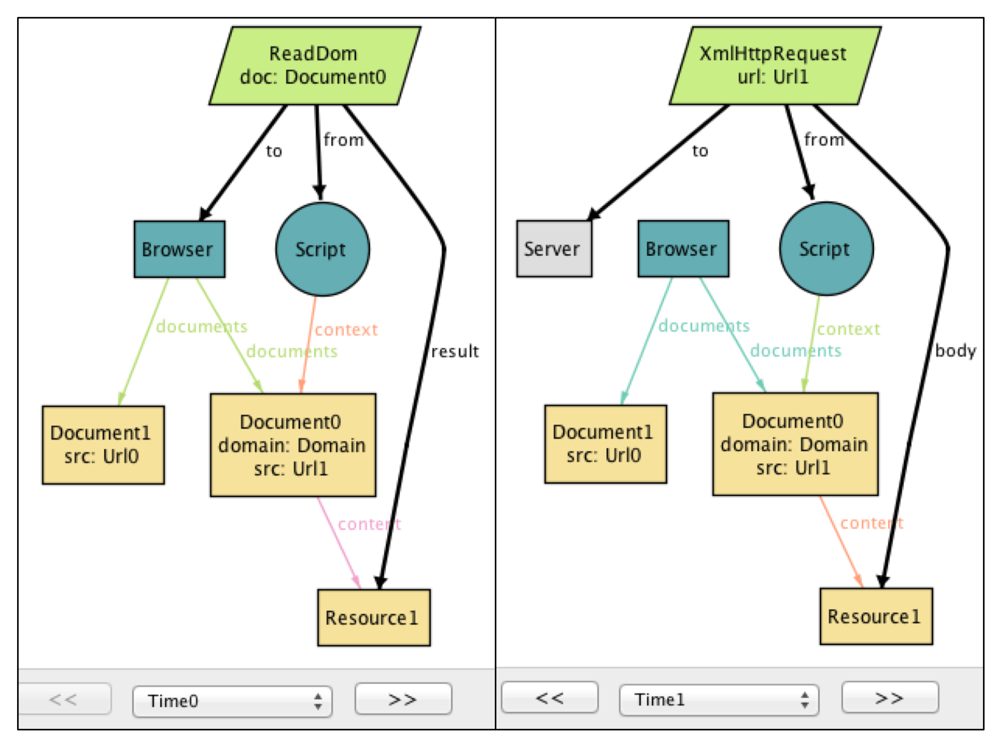
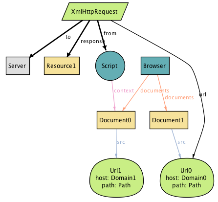
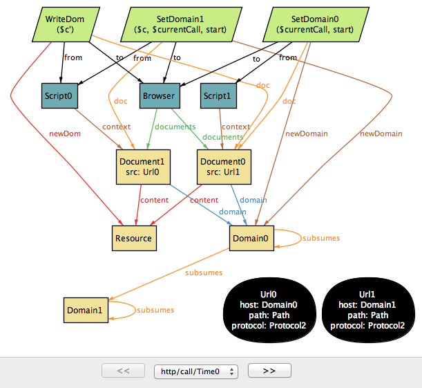
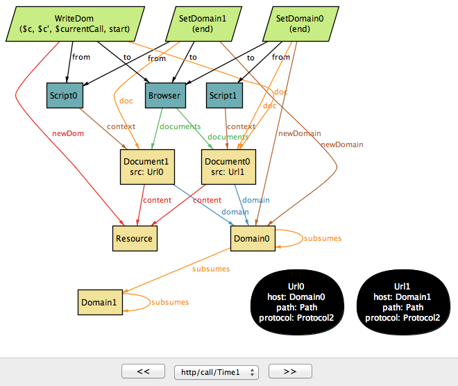

# The Same Origin Policy

## Introduction

The same-origin policy (SOP) is an important part of the security
mechanism of every modern browser. It controls when scripts running in
a browser can communicate with one another (roughly, when they
originate from the same website). First introduced in Netscape
Navigator, the SOP now plays a critical role in the security of web
applications; without it, it would be far easier for a malicious
hacker to peruse your private photos on Facebook, or empty the balance
on your bank account.

But the SOP is far from perfect. At times, it is too restrictive;
there are cases (such as mashups) in which scripts from different
origins should be able to share a resource but cannot. At other times,
it is not restrictive enough, leaving corner cases that can be
exploited using common attacks such as cross-site request forgery
(CSRF). Furthermore, the design of the SOP has evolved organically
over the years and puzzles many developers.

The goal of this chapter is to construct a crystallized description of
this important -- yet often misunderstood -- policy. In particular, we
will answer the following questions by implementing the SOP ourselves:

* Why is the SOP necessary? What are the types of security violations that it prevents?
* How is the behavior of a web application affected by the SOP?
* What are different mechanisms for bypassing the SOP? 
* How secure are these mechanisms? What are potential security issues that they introduce?

But building an implementation of the SOP is a daunting task, given
the complexity of the parts that are involved -- a web server, a
browser, the HTTP protocol, HTML documents, client-side scripts,
etc. Even before getting to the SOP, we will likely get bogged down by
all the gritty details of these pieces (not to mention, we need to do
this in less in 500 lines of code!). So how do we go about building a
version of the SOP that is simple and yet detailed enough to capture
all of the questions above?

## Modeling with Alloy

This chapter is somewhat different from others in this book. Instead
of building a working implementation, we will construct an executable
_model_ that serves as a simple yet precise description of the
SOP. Like an implementation, the model can be executed to explore
dynamic behaviors of the system; but unlike an implementation, the
model omits low-level details that may get in the way of understanding
the essential concepts.

The approach we take might be called “agile modeling” because of its
similarities to agile programming. We work incrementally, assembling
the model bit by bit. Our evolving model is at every point something
that can be executed. We formulate and run tests as we go, so that by
the end we have not only the model itself but also a collection of
_properties_ that it satisfies.

To construct this model, we use _Alloy_, a language for modeling and
analyzing software design. An Alloy model cannot be executed in the
traditional sense of program execution. Instead, a model can be (1)
_simulated_ to produce an _instance_, which represents a valid
scenario or configuration of a system, and (2) _checked_ to see
whether the model satisfies a desired property.

Despite above similarities, agile modeling differs from agile
programming in one key respect. Although we'll be running tests, we
actually won't be writing any. Alloy's analyzer generates test cases
automatically, and all that needs to be provided is the property to be
checked. Needless to say, this saves a lot of trouble (and text). The
analyzer actually executes all possible test cases up to a certain
size (called a _scope_); this typically means generating all starting
states with at most some number of objects, and then choosing
operations and arguments to apply up to some number of steps. Because
so many tests are executed (typically billions), and because all
possible configurations that a state can take are covered (albeit
within the scope), this analysis tends to expose bugs more effectively
than conventional testing.

### Simplifications

Because the SOP operates in the context of browsers, servers, the HTTP
protocol, and so on, a complete description would be overwhelming. So
our model (like all models) abstracts away irrelevant aspects, such as
how network packets are structured and routed. But it also simplifies
some relevant aspects, which means that the model cannot fully account
for all possible security vulnerabilities.

For example, we treat HTTP requests like remote procedure calls,
ignoring the fact that responses to requests might come out of
order. We also assume that DNS (the domain name service) is static, so
we cannot consider attacks in which a DNS binding changes during an
interaction. In principle, though, it would be possible to extend our
model to cover all these aspects, although it's in the very nature of
security analysis that no model (even if it represents the entire
codebase) can be guaranteed complete.

## Roadmap

Here is the order in which we will proceed with our model of the SOP. We will begin by building models of three key components that we need in order for us to talk about the SOP: the HTTP protocol, the browser, and the client-side scripting. We will build on top of these basic models to define what it means for some web application to be _secure_, and then introduce the SOP as a mechanism that attempts to achieve the security properties.

But we will then see that the SOP can be sometimes too restrictive, in that it sometimes gets in the way of a web application functioning properly! So we will introduce four different techniques that can be used to bypass the restrictions that are imposed by the policy.

Feel free to explore the sections in any order you'd like, although if you are new to Alloy, we recommend the first three sections (HTTP, Browser, and Script), as they will introduce some of the basic concepts of the modeling language. While you are making your way through the chapter, we also encourage you to play with the models in the Alloy Analyzer; run them, explore the generated scenarios, and add your own details to the models! The tool is freely available for download (http://alloy.mit.edu).

## Model of the Web

### HTTP Protocol

The first step in building an Alloy model is to declare some sets of objects. Let's start with resources:

```alloy
sig Resource {}
```

The keyword “sig” identifies this as an Alloy signature declaration.
Signatures represent sets and are assigned values in analysis (they
play a similar role to static variables in programming languages).
Think of these, just like the objects of a class with no instance variables, as blobs that have identity but no contents.
This signature, therefore, introduces a set of resource objects.
Resources are named by URLs (*uniform resource locators*):

```alloy
sig Url {
  protocol: Protocol,
  host: Domain,
  port: lone Port,
  path: Path
}
sig Protocol, Domain, Port, Path {}
```
Here we have five signature declarations, introducing sets for URLs and each of the basic types of objects they comprise. Within the URL declaration, we have four fields. Fields are like instance variables in a class; if `u` is a URL, for example, then `u.protocol` would represent the protocol of that URL (just like dot in Java). But in fact, as we'll see later, these fields are relations. You can think of each one as if it were a two column database table. Thus `protocol` is a table with the first column containing URLs and the second column containing protocols. And the innocuous looking dot operator is in fact a rather general kind of relational join, so that you could also write `protocol.p` for all the URLs with a protocol `p` -- but more on that later.

Note that domains and paths, unlike URLs, are treated as if they have no structure -- a simplification. The keyword `lone` (which can be read "less than or equal to one") says that each URL has at most one port. The path is the string that follows the host name in the URL, and which (for a simple static server) corresponds to the file path of the resource; we're assuming that it's always present, but can be an empty path.

Let us introduce clients and servers, each of which contains a mapping from paths to resources:

```alloy
abstract sig Endpoint {}
abstract sig Client extends Endpoint {}
abstract sig Server extends Endpoint {
  resources: Path -> lone Resource
}
```

The `extends` keyword introduces a subset, so the set `Client` of all clients, for example, is a subset of the set `Endpoint` of all endpoints. Extensions are disjoint, so no endpoint is both a client and a server. The `abstract` keyword says that all extensions of a signature exhaust it, so its occurrence in the declaration of `Endpoint`, for example, says that every endpoint must belong to one of the subsets (at this point, `Client` and `Server`). For a server `s`, the expression `s.resources` will denote a map from paths to resources (hence the arrow in the declaration). But as before, remember that each field is actually a relation that includes the owning signature as a first column, so this field represents a three-column relation on `Server`, `Path` and `Resource`.

To map a URL to a server, we introduce a set `Dns` of domain name servers, each with a mapping from domains to servers:

```alloy
one sig Dns {
  map: Domain -> Server
}
```

The keyword `one` in the signature declaration means that (for
simplicity) we're going to restrict to exactly one domain name server,
so that `Dns.map` will be the mapping used everywhere. Again, as with
serving resources, this could be dynamic (and in fact there are known
security attacks that rely on changing DNS bindings during an
interaction) but we're simplifying.

In order to model HTTP requests, we also need the concept of _cookies_, so let's declare them:

```alloy
sig Cookie {
  domains: set Domain
}
```

Each cookie is scoped with a set of domains; this captures the fact that a cookie can apply to "*.mit.edu", which would include all domains with the suffix "mit.edu".

Finally, we can put this all together to construct a model of HTTP requests:

```alloy
abstract sig HttpRequest extends Call {
  url: Url,
  sentCookies: set Cookie,
  body: lone Resource,
  receivedCookies: set Cookie,
  response: lone Resource,
}{
  from in Client
  to in Dns.map[url.host]
}
```

We're modeling an HTTP request and response in a single object; the `url`, `sentCookies` and `body` are sent by the client, and the `receivedCookies` and `response` are sent back by the server.

When writing the `HttpRequest` signature, we found that it contained generic features of calls, namely that they are from and to particular things. So we actually wrote a little Alloy module that declares the `Call` signature, and to use it here we need to import it:

```alloy
open call[Endpoint]
```

It's a polymorphic module, so it's instantiated with `Endpoint`, the set of things calls are from and to (details about calls can be found in Appendix).

Following the field declarations in `HttpRequest` is a collection of constraints. Each of these constraints applies to all members of the set of HTTP requests. The constraints say that (1) each request comes from a client, and (2) each request is sent to one of the servers specified by the URL host under the DNS mapping.

One of the prominent features of Alloy is that a model, no matter how simple or detailed, can be executed at any time to generate sample system instances. Let's use a `run` command to ask the Alloy Analyzer to execute the HTTP model that we have so far:

```alloy
run {} for 3	-- generate an instance with up to 3 objects of every signature type
```

As soon as the analyzer finds a possible instance of the system, it automatically produces its graphical representation, like the following:


This instance shows a client (represented by node `Client`) sending an `HttpRequest` to `Server`, which, in response, returns a resource object and instructs the client to store `Cookie` at `Domain`. 

Even though it's a tiny instance with seemingly few details, it already tells us something strange about the model -- note that the resource returned from the request (`Resource1`) does not actually exist in the server! Clearly, we neglected to specify an important part of the server; namely, that every response to a request must be a resource that the server stores. We can go back to our definition of `HttpRequest` and append the following constraint:

```alloy
abstract sig HttpRequest extends Call { ... }{
  ...
  response = to.resources[url.path]
}
```

Instead of generating sample instances, we can ask the analyzer to *check* whether the model satisfies a property. For example, one property that we want is that whenever a client sends the same request multiple times, it always receives the same response back:
```alloy
check { all r1, r2: HttpRequest | r1.url = r2.url implies r1.response = r2.response } for 3 
```
Given this `check` command, the analyzer explores every possible behavior of the system (up to the specified bound), and as soon as it finds one that violates the property, it returns that instance as a *counterexample*:


This counterexample again shows an HTTP request being made by a client, but with two different servers (in Alloy, objects of the same type are distinguished with a numeric suffix). Note that while the DNS server maps `Domain` to both `Server0` and `Server1` (in reality, this is a common practice for load balancing), only `Server1` maps `Path` to a resource object, causing `HttpRequest1` to result in empty response: another error in our model! To fix this, we add an Alloy *fact* to ensure that any two servers mapped to the common host by the DNS provide the same set of resources:

```alloy
fact ServerAssumption {
  all s1, s2: Server | (some Dns.map.s1 & Dns.map.s2) implies s1.resources = s2.resources
}
```

When we re-run the `check` command after adding the fact, the analyzer no longer reports any counterexamples for the property.

These examples show how even simple, abstract instances can provide often surprising insights into the system being modeled. Alloy is well-suited for this type of agile modeling: start out by building a small model of the system, run an analysis, and incrementally grow the model based on feedback from the analysis results.

### Browser

Let's introduce browsers:

```alloy
sig Browser extends Client {
  documents: Document -> Time,
  cookies: Cookie -> Time,
}
```

This is our first example of a signature with *dynamic fields*. Alloy has no built-in notions of time or behavior, which means that a variety of idioms can be used. In this model, we're using a common idiom in which you introduce a notion of `Time`, and attach it as a final column for every time-varying field. For example, expression `b.cookes.t` represents the set of cookies that are stored in browser `b` at particular time `t`. Likewise, the `documents` field associates a set of documents with each browser at a given time (for more details about we model the dyanmic behavior, see Appendix).

Documents are created from a response to an HTTP request. They could also be
destroyed if, for example, the user closes a tab or the browser but
we leave this out of the model.
A document has a URL (the one from which the document was originated), some
content (the DOM) and domain:

```alloy
sig Document {
  src: Url,
  content: Resource -> Time,
  domain: Domain -> Time
}
```

The inclusion of the `Time` column for the last two tells us that they can vary over time, but the first (`src`, representing the source URL of the document) is fixed.

To model the effect of an HTTP request on a browser, we introduce a new signature, since not all HTTP requests will originate at the level of the browser; the rest will come from scripts.

```alloy
sig BrowserHttpRequest extends HttpRequest {
  doc: Document
}{
  -- the request comes from a browser
  from in Browser
  -- the cookies being sent exist in the browser at the time of the request
  sentCookies in from.cookies.start
  -- every cookie sent must be scoped to the url of the request
  all c: sentCookies | url.host in c.domains

  -- browser creates a new document to display the content of the response
  documents.end = documents.start + from -> doc
  -- the new document has the response as its contents
  content.end = content.start ++ doc -> response
  -- the new document has the host of the url as its domain
  domain.end = domain.start ++ doc -> url.host
  -- the document's source field is the url of the request
  doc.src = url

  -- new cookies are stored by the browser
  cookies.end = cookies.start + from -> sentCookies
}
```

This kind of request has one new field, `doc`, which is the document created in the browser from the resource returned by the request. As with `HttpRequest`, the behavior is described as a collection of constraints. Some of these say when the call can happen: for example, that the call has to come from a browser. Some of these constrain the arguments of the call: for example, that the cookies must be scoped appropriately. Some of these constrain the effect, and have a common form that relates the value of a relation after the call to its value before. For example, to understand
`documents.end = documents.start + from -> doc`
remember that `documents` is a 3-column relation on browsers, documents and times. The fields `start` and `end` come from the declaration of `Call` (which we haven't seen, but is included in the listing at the end), and represent the times at the beginning and end of the call. The expression `documents.end` gives the mapping from browsers to documents when the call has ended. So this constraint says that after the call, the mapping is the same, except for a new entry in the table mapping `from` to `doc`.

Some constraints use the `++` operator which does a relational override (i.e, `e1 ++ e2` contains all tuples of `e2`, and additionally, any tuples of `e1` whose first element is not the first element of a tuple in `e2`). For example, the constraint
`content.end = content.start ++ doc -> response`
says that after the call, the `content` mapping will be updated to map `doc` to `response` (clobbering any previous mapping of `doc`).
If we were to use `+`, then the same document could map to multiple resources at the same time; which is hardly what we want.

### Script

Next, we will build on the HTTP and browser models to introduce *client-side scripts*, which represent a piece of code (typically in JavaScript) executing inside a browser document (`context`). 
```alloy
sig Script extends Client { context: Document }
```
A script is a dynamic entity that can perform two different types of actions: (1) it can make HTTP requests (i.e., Ajax requests) and (2) perform browser operations to manipulate the content and properties of a document. The flexibility of client-side scripts is one of the main catalysts behind the rapid development of Web 2.0, but it's also the reason why the SOP was created in the first place. Without the policy, scripts would be able to send arbitrary requests to servers, or freely modify the documents inside the browser -- which would be bad news if one or more of the scripts turned out to be malicious! 

A script can communicate to a server by sending an `XmlHttpRequest`:
```alloy
sig XmlHttpRequest extends HttpRequest {}{
  from in Script
  noBrowserChange[start, end] and noDocumentChange[start, end]
}
```
An `XmlHttpRequest` can be used by a script to send/receive resources to/from a server, but unlike `BrowserHttpRequest`, it does not immediately result in creation of a new page or other changes to the browser and its documents. To say that a call does not modify the states of the system, we use predicates `noBrowserChange` and `noDocumentChange`:
```alloy
pred noBrowserChange[start, end: Time] {
  documents.end = documents.start and cookies.end = cookies.start  
}
pred noDocumentChange[start, end: Time] {
  content.end = content.start and domain.end = domain.start  
}
```
What kind of operations can a script perform on documents? First, we introduce a generic notion of *browser operations* to represent a set of browser API functions that can be invoked by a script:
```alloy
abstract sig BrowserOp extends Call { doc: Document }{
  from in Script and to in Browser
  doc + from.context in to.documents.start
  noBrowserChange[start, end]
}
```
Field `doc` refers to the document that will be accessed or manipulated by this call. The second constraint in the signature facts says that both `doc` and the document in which the script executes (`from.context`) must be documents that currently exist inside the browser. Finally, a `BrowserOp` may modify the state of a document, but not the set of documents or cookies* that are stored in the browser.

(* actually, cookies can be associated with a document and modified using a browser API, but we will omit this detail for now.)

A script can read from and write to various parts of a document (often called DOM elements). In a typical browser, there are a large number of API functions for accessing DOM (e.g., `document.getElementById`), but enumerating all of them is not important for our purpose, we will simply group those into two types -- `ReadDom` and `WriteDom`:
```alloy
sig ReadDom extends BrowserOp { result: Resource }{
  result = doc.content.start
  noDocumentChange[start, end]
}
sig WriteDom extends BrowserOp { new_dom: Resource }{
  content.end = content.start ++ doc -> new_dom
  domain.end = domain.start
}
```
`ReadDom` returns the content the target document, but does not modify it; `WriteDom`, on the other hand, sets the new content of the target document to `new_dom`.

In addition, a script can modify various properties of a document,
such as its width, height, domain, and title. For the discussion of
the SOP, we are only interested in the domain property, which we will
introduce in a later section.

<!--
Let's ask the Alloy Analyzer to generate instances with scripts in action:
```alloy
run { some BrowserOp and some XmlHttpRequest} for 3 
```
One of the instances that it generates is as follows:

 

In the first time step, `Script`, executing inside `Document0` from `Url1`, reads the content of another document from a different origin (`Url0`). Then, it sends the same content, `Resource1`, to `Server` by making an `XmlHtttpRequest` call. Imagine that `Document1` is your banking page, and `Document0` is an online forum injected with a malicious piece of code, `Script`. Clearly, this is not a desirable scenario, since your sensitive banking information is being relayed to a malicious server!

Another instance shows `Script` making an `XmlHttpRequest` to a server with a different domain:



Note that the request includes a cookie, which is scoped to the same
domain as the destination server. This is potentially dangerous,
because if the cookie is used to represent your identity (e.g., a
session cookie), `Script` can effectively pretend to be you and trick
the server into responding with your private data!

These two instances tell us that extra measures are needed to restrict
the behavior of scripts, especially since some of those scripts could
be malicious. This is exactly where the SOP comes in.
-->

## Example: Email Application

As we've seen earlier, given a `run` or `check` command, the Alloy
Analyzer generates a scenario (if any) that is consistent with the
description of the system in the model. By default, the analyzer
arbitrarily picks _any_ one of the possible system scenarios (up to
the specified bound), and assign numeric identifiers to signature
instances (`Server0`, `Browser1`, etc.,) in the scenario.

Sometimes, we may wish to analyze the behavior of a _particular_ web
application, instead of exploring scenarios with a random
configuration of servers and clients. For example, imagine that we
wish to build an email application that runs inside a browser
(similar to Gmail). In addition to providing basic email features, our
application will display a banner from a third-party advertisement
service, which is controlled by a potentially malicious actor. 

In Alloy, keyword `one sig` introduces a _singleton_ that represents
one particular atom in the system. For example, the following line
says that there are two distinct `Document` objects that represent the
inbox of the email app and the third-party ad banner, respectively:

```alloy
one sig InboxPage, AdBanner extends Document {}
```

With this declaration, every scenario that Alloy generates will
contain at least these two `Document` objects.

Let's introduce the other parts of the system, and use a fact (`Configuration`) to specify the relationships between them: 

```alloy
one sig EmailServer, EvilServer extends Server {}
one sig EvilScript extends Script {}
one sig EmailDomain, EvilDomain extends Domain {}
fact Configuration {
  EvilScript.context = AdBanner
  InboxPage.domain.first = EmailDomain
  AdBanner.domain.first = EvilDomain  
  Dns.map = EmailDomain -> EmailServer + EvilDomain -> EvilServer
}
```

For example, the last constraint in the fact specifies how the DNS is configured to map domain names for the two servers in our system. Without this constraint, the Alloy Analyzer may generate scenarios where `EmailDomain` is mapped to `EvilServer`, which are not of interest to us (in practice, such a mapping may be possible due to an attack called _DNS sproofing_, but we will rule it out from our model since it lies outside the class of attacks that the SOP is designed to prevent). 

## Security Properties

Before we move onto the SOP, there is an important question that we
have not discussed yet: What exactly do we mean when we say our system
is _secure_?

It turns out that this is actually quite difficult to answer, since
security has different meanings to different people, and there is
still a lot of on-going research in the security community to develop
a universal notion of security. Nevertheless, for our purpose, we will
turn to two well-studied concepts in information
security -- _confidentiality_ and _integrity_. Both of these concepts talk
about how information should be allowed to travel throughout
various parts of the system. Roughly, _confidentiality_ means that a
critical piece of data should only be accessible to agents that are
deemed trusted. On the other hand, _integrity_ means trusted agents
should only rely on data that have not been maliciously tampered with.

In order to specify these security properties more precisely, we first
need to define what it means for a piece of data to _flow_ from one
part of the system to another. In our model so far, we have described
interactions between two endpoints as being carried out through
_calls_; e.g., a browser interacts with a server by making HTTP
requests, and a script interacts with the browser by invoking browser
API calls. Intuitively, during each call, a piece of data may flow
from one endpoint to another as an _argument_ or _return value_ of the
call. To represent this, we introduce a notion of `DataflowCall` into the
model, and associate each call with a set of `args` and `returns` data
fields:

```alloy
sig Data in Resource + Cookie {}

sig DataflowCall in Call {
  args, returns: set Data,  -- arguments and return data of this call
}{
 this in HttpRequest implies
    args = this.sentCookies + this.body and
    returns = this.receivedCookies + this.response
 ...
}
```

For example, during each call of type `HttpRequest`, the client
transfers two arguments (`sentCookies` and `body`) to the server, and
in turn, receives two addition sets of data (`receivedCookies` and
`response`) as return values. 

More generally, arguments flow from the sender of the call to the
receiver, and return values flow from the receiver to the sender. This
means that the only way for an endpoint to access a new piece of data
is by receiving it as an argument of a call that the endpoint accepts,
or a return value of a call that the endpoint invokes. We introduce a
notion of `DataflowModule`, and assign field `accesses` to represent the
set of data elements that the module can access at each time step:

```alloy
sig DataflowModule in Endpoint {
  -- Set of data that this component initially owns
  accesses: Data -> Time
}{
  all d: Data, t: Time - first |
	 -- This endpoint can only access a piece of data "d" at time "t" only when
    d -> t in accesses implies
      -- (1) It already had access in the previous time step, or
      d -> t.prev in accesses or
      -- there is some call "c" that ended at "t" such that
      some c: Call & end.t |
        -- (2) the endpoint receives "c" that carries "d" as one of its arguments or
        c.to = this and d in c.args or
        -- (3) the endpoint sends "c" that returns d" 
        c.from = this and d in c.returns 
}
```

We are not quite done yet! We also need to restrict data elements that a module can provide as arguments or return values of a call; otherwise, we may get weird scenarios where a module can make a call with an argument that it has no access to!

```alloy
sig DataflowCall in Call { ... } {
  -- (1) Any arguments must be accessible to the sender
  args in from.accesses.start
  -- (2) Any data returned from this call must be accessible to the receiver
  returns in to.accesses.start
}
```

Now that we have means to describe data flow between different parts
of the system, we are (almost) ready to state security properties that
we care about. But recall that confidentiality and integrity are
_context-dependent_ notions; these properties make sense only if we
can talk about some agents within the system as being trusted (or
malicious). Similarly, not all information is equally important: We
need to distinguish between data elements that we consider to be
critical or malicious (or neither):

```alloy
sig TrustedModule, MaliciousModule in DataflowModule {}
sig CriticalData, MaliciousData in Data {}
```

Then, the confidentiality property can be stated as an _assertion_ on
the flow of critical data into non-trusted parts of the system:

```alloy
// No malicious module should be able to access critical data
assert Confidentiality {
  no m : Module - TrustedModule, t : Time |
    some CriticalData & m.accesses.t 
}
```

The integrity property is the dual of confidentiality: 

```alloy
// No malicious data should ever flow into a trusted module
assert Integrity {
  no m: TrustedModule, t: Time | 
    some MaliciousData & m.accesses.t
}
```

When prompted with a `check` command, the Alloy Analyzer analyzes _all_ possible dataflow traces in the system and produces a counterexample (if any) that demonstrates how an assertion might be violated:

```
check Confidentiality for 5
```

For example, when checking the model of our example application against the confidentiality property, the analyzer generates the following scenario, which shows how `EvilScript` may access a piece of critical data (`MyInboxInfo`):

 
 

This counterexample involves two steps. In the first step, `EvilScript`, executing inside `AdBanner` from `EvilDomain`, reads the content of `InboxPage`, which originates from `EmailDomain`. In the next step, `EvilScript` sends the same content (`MyInboxInfo`) to `EvilServer` by making an `XmlHtttpRequest` call. The core of the problem here is that a script executing under one domain is able to read the content of a document from another domain; as we will see in the next section, this is exactly one of the issues that the SOP is designed to solve.

There may exist multiple counterexamples to a single assertion. Consider the following scenario, which shows a different way in which the system may violate the confidentiality property:

 

In this scenario, instead of reading the content of the inbox page,
`EvilScript` directly makes a `GetInboxInfo` request to `EmailServer`.
Note that the request includes a cookie (`MyCookie`), which is scoped
to the same domain as the destination server. This is potentially
dangerous, because if the cookie is used to represent the user's
identity (e.g., a session cookie), `EvilScript` can effectively
pretend to be the user and trick the server into responding with the
user's private data (`MyInboxInfo`)! Here, the problem is again
related to the liberal ways in which a script may be used to access
information across different domains -- namely, that a script executing
under one domain is able to make an HTTP request to a server with a
different domain.

These two counterexamples tell us that extra measures are needed to
restrict the behavior of scripts, especially since some of those
scripts could be malicious. This is exactly where the SOP comes in.

## Same Origin Policy

Before we can state the SOP, the first thing we should do is to introduce the
notion of an origin, which is composed of a protocol, host, and optional port:

```alloy
sig Origin {
  protocol: Protocol,
  host: Domain,
  port: lone Port
}
```

So two URLs have the same origin if they share the same protocol, host, and
port:

```alloy
fun origin[u: Url] : Origin {
    {o: Origin | o.protocol = u.protocol and o.host = u.host and o.port = u.port }
}
```
The SOP itself has two parts, restricting the ability of a script to (1) make DOM API calls and (2) send HTTP requests. The first part of the policy states that a script can only read from and write to a document that comes from the same origin as the script:
```alloy
pred domSop { all c: ReadDom + WriteDom | origin[c.doc.src] = origin[c.from.context.src] }
```
An instance such as the first script scenario is not possible under `domSop`, since `Script` is not allowed to invoke `ReadDom` on a document from a different origin.

The second part of the policy says that a script cannot send an HTTP request to a server unless its context has the same origin as the target URL -- effectively preventing instances such as the second script scenario.
```alloy
pred xmlHttpReqSop { all x: XmlHttpRequest | origin[x.url] = origin[x.from.context.src] }
```
As we can see, the SOP is designed to prevent the two types of vulnerabilities that could arise from actions of a malicious script; without it, the web would be a much more dangerous place than it is today.

It turns out, however, that the SOP can be *too* restrictive. For example, sometimes you *do* want to allow communication between two documents of different origins. By the above definition of an origin, a script from `foo.example.com` would not be able to read the content of `bar.example.com`, or send a HTTP request to `www.example.com`, because these are all considered distinct hosts. 

In order to allow some form of cross-origin communication when necessary, browsers implemented a variety of mechanisms for relaxing the SOP. Some of these are more well-thought-out than others, and some have serious flaws that, when badly used, could negate the security benefits of the SOP. In the following sections, we will describe the most common of these mechanisms, and discuss their potential security pitfalls.

## Techniques for Bypassing the SOP

The SOP is a classic example of the tension between functionality and security; we want to make sure our sites are secure, but the mechanism for ensuring security sometimes can get in the way of getting the sites to work properly. Indeed, when the SOP was initially introduced, developers ran into trouble building sites that had legitimate use of cross-domain communication (e.g., mashups)!

In this section, we will discuss four techniques that have been devised and frequently used by web developers to bypass the restrictions imposed by the SOP: (1) "document.domain" property, (2) JSONP, (3) PostMessage, and (4) CORS. These are useful tools, but when they are used without caution, the security problems that the SOP was designed to prevent in the first place can creep back into the picture! 

Each of these four techniques is surprisingly complex, and to be described in full detail, could merit its own chapter. So here, we will give you a brief flavor of how they work, potential security problems that they introduce, and how to prevent these problems.

### Domain property

The idea behind the domain property relaxation of the SOP, is to
give two pages of a same site the chance to read/write each others DOM by
setting the `document.domain` property to the same value -- thus bypassing the
SOP restriction on DOM access. So, for example,
a script in `foo.example.com` could read/write the DOM of `example.com` if both
scripts set the `document.domain` property to `example.com` (assuming both
source URLs have also the same protocol and port). 

We model the operation of setting the `document.domain` property by adding
a `SetDomain` browser operation:

```alloy
// Modify the document.domain property
sig SetDomain extends BrowserOp { newDomain: Domain }{
  doc = from.context
  domain.end = domain.start ++ doc -> newDomain
  -- no change to the content of the document
  content.end = content.start
}
```

The `newDomain` field represents the value to which the property should be set.
There's a caveat though, scripts can only set the domain property to only
one that is a right-hand, fully qualified fragment of its hostname.
(i.e., `foo.example.com` can set it to `example.com` but not to
 `aosabook.org`). \*

(\* Wondering if it's possible to set it to just `com`? `foo.example.com` would
 be a subdomain of `com` after all, but browsers know that
 `com` is a top-level domain and won't allow the operation.)

We add a `fact` to capture this rule:

```alloy
// Scripts can only set the domain property to only one that is a right-hand,
// fully-qualified fragment of its hostname
fact setDomainRule {
  all d: Document | d.src.host in (d.domain.Time).subsumes
}
```

If it weren't for this rule, any site could set the `document.domain` property
to any value, which means that, for example, a malicious
site could set the domain property to your bank domain, load your bank
account in a iframe, and (assuming the bank page has set its domain property)
read the DOM of your bank page!

Now we modify our original definition of the SOP for DOM accesses to reflect
the domain property relaxation. If two scripts set the `document.domain`
property to the same value, and they
have the same protocol and port, then these two scripts
can interact with each other (read and write each other's DOM), but they won't
be allowed if only one of the scripts sets the property while the other doesn't,
even if they match.\*

(\* Wondering why is it that (some) browsers make this distinction between
the property being explicitly set or not, even though they could have the same
value in both cases? Bad things could happen if it weren't for this, for example,
a site could be subject to XSS from its subdomains (`foo.example.com` could
set the `document.domain` property to `example.com` and write its DOM, even
if `example.com` never set the property))

```alloy
pred domSop {
  all c: ReadDom + WriteDom | 
    -- A script can only access the DOM of a document with the same origin or
    origin[c.doc.src] = origin[c.from.context.src] or
    -- (relaxation) the domain property of both the script's context and the
    -- target document has been set and
    (c.doc + c.from.context in (c.prevs <: SetDomain).doc and
    -- they have the same origin (using the domain property as the host and not
    -- the src host)
    origin[c.doc.src, c.doc.domain.(c.start)] =
    origin[c.from.context.src, c.from.context.domain.(c.start)])
}
```

Now we can ask the analyzer to give us an instance where two documents that
are from different origins manage to communicate between each other:

```alloy
// Can a script read or write the DOM of a document with another origin?
run { some c: ReadDom + WriteDom | origin[c.doc.src] != origin[c.from.context.src] }
```

This is one of the instances generated:




In this instance we have two scripts, which are executing under a different
context, with different URLs that correspond to different origins. But, one
of the domain subsumes the other, so both scripts do a `SetDomain` that
sets the domain property of each document to the same value, and after
the execution of these calls, the `WriteDom` call is allowed. If it weren't
for the domain property mechanism, this kind of cross-origin communication
wouldn't be allowed per the SOP.

Yet several properties of this mechanism make it less suitable for cross-origin
DOM access than PostMessage (which we will discuss shortly).
First, the mechanism is not general enough. While it is possible to use it to
enable some kinds of cross-origin communication, this is only limited to those
situations in which all ends have the same base domain.

Second, using the domain property mechanism might put your entire site at risk.
When you set the domain property of both `foo.example.com` and `bar.example.com`
to `example.com` you are not only allowing these two pages to communicate
between each other but you are also allowing any other page, say
`qux.example.com` to read/write the DOM of both `foo.example.com` and
`bar.example.com` (since it is possible for it to set the domain property to
`example.com`). It might seem like a small detail, but if `qux.example.com`
has a XSS vulnerability, then an attacker would be able to read/write the DOM
of these other pages while in a situation in which the domain mechanism is not
used, it wouldn't.

### JSON with Padding (JSONP)

Before the introduction of CORS (which we will discuss shortly), JSONP was perhaps the most popular technique for bypassing the SOP restriction on XMLHttpRequest, and still remains widely used today. JSONP takes advantage of the fact that script inclusion tags in HTML (i.e., `<script>`) are exempt from the SOP; that is, you can include a script from _any_ URL, and the browser readily executes it in the current document:

```html
<script src="http://www.example.com/myscript.js"></script>
```

A script tag can be used to obtain code, but how do we use it to receive arbitrary _data_ (e.g., a JSON object) from a different domain? The problem is that the browser expects the content of `src` to be a piece of JavaScript code, and so simply having it point at a data source results in a syntax error. 

One workaround is to wrap the desired data inside a piece of string that the browser recognizes as valid JavaScript code; this string is sometimes called _padding_ (thus, giving rise to the name JSON with "Padding"). This padding could be any arbitrary JavaScript code, but conventionally, it is the name of a callback function (already defined in the current document) that is to be executed on the response data:

```html
<script src="http://www.example.com/mydata?jsonp=processData"></script>
```

The server on `www.example.com` recognizes it as a JSONP request, and wraps the requested data inside the `jsonp` parameter:

```html
processData(mydata)
```

which is a valid JavaScript statement, and is executed by the browser in the current document.

In our approach, JSONP is modeled as a type of HTTP requests that
include the identifier of a callback function as the `padding`
parameter. In return, the server returns a response that has the
requested resource (`payload`) wrapped inside the callback function
(`cb`).

```alloy
sig CallbackID {}  // identifier of a callback function
// Request sent as a result of <script> tag
sig JsonpRequest in BrowserHttpRequest {
  padding: CallbackID
}{
  response in JsonpResponse
}
sig JsonpResponse in Resource {
  cb: CallbackID,
  payload: Resource
}
```

When the browser receives the response, it executes the callback
function on the payload:

```alloy
sig JsonpCallback extends EventHandler {
  cb: CallbackID,
  payload: Resource
}{
  causedBy in JsonpRequest
  let resp = causedBy.response | 
    cb = resp.@cb and
    -- result of JSONP request is passed on as an argument to the callback
    payload = resp.@payload
}
```

Note that the callback function executed is the same as the one that's
included in the response (`cb = resp.@cb`), but _not_ necessarily the
same as the padding. In other words, for the JSONP communication to
work, the server is responsible for properly constructing a response
that includes the original padding as the callback function (i.e.,
ensure that `JsonRequest.padding = JsonpResponse.cb`). In principle,
the server, if desired, can choose to include any other callback (or
any piece of JavaScript) that is completely different from the
requested padding. This highlights one downside of JSONP: You must
ensure that the server you are making a JSONP request to is completely
trustworthy.

Furthermore, even if the server itself may be free of malicious
intent, you must also rely on it being secure. For example, let us
consider the following counterexample that shows how JSONP may lead to
a violation of the integrity property. Here, a hacker (controlling
`Browser0`) sends an HTTP request that contains a piece of malicious
content (`Resource1`), which is accepted and stored by
`Server`.


In the next step, a trusted browser (`Browser1`) makes a JSONP request
to `Server`, which returns a JSONP response that correctly includes
the requested padding, but also the malicious data (`Resource1`) as
its payload. `Browser1` then executes the callback function with the
malcious data as its argument, which could lead to further security
consequences.


### PostMessage

PostMessage is a new feature in HTML5 that allows scripts from two documents (of possibly different origins) to communicate to each other. It is a more disciplined alternative to the method of setting the `domain` property, which is prone to mistakes, as we've already seen. However, PostMessage isn't without its own security risks, unless used carefully.

PostMessage is a browser API function that takes two arguments: (1) the data to be sent (`message`), and (2) the URL of the document receiving the message (`targetOrigin`):

```alloy
sig PostMessage extends BrowserOp {
  message: Resource,
  targetOrigin: Origin
}
```

To receive a message from another document, the receiving document must register an event handler that is invoked by the browser as a consequence of a `PostMessage`:

```alloy
sig ReceiveMessage extends EventHandler {
  data: Resource,
  srcOrigin: Origin
}{
  causedBy in PostMessage
  -- "ReceiveMessage" event is sent to the script with the correct context
  origin[to.context.src] = causedBy.targetOrigin
  -- messages match
  data = causedBy.@message
  -- the origin of the sender script is provided as "srcOrigin" param 
  srcOrigin = origin[causedBy.@from.context.src]
}
```

The browser passes two parameters to `ReceiveMessage`: a piece of resource (`data`) that corresponds to the message being sent, and the origin of the sender document (`srcOrigin`). The signature fact contains four constraints to ensure that each `ReceiveMessage` is well-formed with respect to its corresponding `PostMessage`. 

By default, the `PostMessage` mechanism does not restrict who is allowed to send PostMessage; in other words, any document can send a message to another document as long as the latter has registered a `ReceiveMessage` handler. It is the responsibility of the receiving document to _additionally_ check the `srcOrigin` parameter to ensure that the message is coming from a trustworthy document. 

Unfortunately, in practice, many sites omit this check, enabling a
malicious document to inject bad content as part of a `PostMessage`
(cite PostMessage study). For example, in the following instance
generated from Alloy, a malicious script (`Script0`), running inside
`Document2`, sends a malicious message (`Resource1`) to a document
with `targetOrigin`. `Browser` then readily forwards this message to
the document(s) with the corresponding origin (in this case
`Document1`). Unless `Script1` specifically checks the value of
`srcOrigin` to filter out messages from unwanted origins, `Document1`
accepts the malicious data, possibly leading to further security
attacks (for example, it may embed a piece of JavaScript to carry out
an XSS attack).


### Cross-Origin Resource Sharing (CORS)

Cross-Origin Resource Sharing (CORS) is a mechanism designed to allow
a server to share its resources with sites from different origins. In
particular, CORS can be used by a script from one origin to make
requests to a server with a different origin, effectively bypassing
the restriction of the SOP on cross-origin Ajax requests. 

Briefly, a typical CORS process involves two steps: (1) a script
wanting to access a resource from a foreign server includes, in its
request, an "Origin" header that specifies the origin of the script,
and (2) the server includes an "Access-Control-Allow-Origin" header as
part of its response, indicating a set of origins that are allowed to
access the server's resource. Normally, without CORS, a browser would
prevent the script from making a cross-origin request in the first
place, conforming to the SOP. However, with CORS enabled, the browser
allows the script to send the request and access its response, but
_only if_ "Origin" is one of the origins specified in
"Access-Control-Allow-Origin".

(CORS additionally includes a notion of _preflighted_ requests to
support complex types of cross-origin requests besides GETs and POSTs,
but we will omit its discussion in this chapter.)

In Alloy, we model a CORS request as a special kind of
`XmlHttpRequest`, with two extra fields `origin` and `allowedOrigins`:

```alloy
sig CorsRequest in XmlHttpRequest {
  -- "origin" header
  origin: Origin,
  -- "access-control-allow-origin" header
  allowedOrigins: set Origin
}{
  from in Script
}
```

We then use an Alloy fact `corsRule` to describe what constitutes a valid CORS reuqest:

```alloy
fact corsRule {
  all r: CorsRequest |
    -- "origin" header of every CORS request matches the script context and
    r.origin = origin[r.from.context.src] and
    -- a CORS request is accepted iff it is allowed by the server, as indicated
    -- in "access-control-allow-origin" header
    r.origin in r.allowedOrigins
}
```

Namely, a CORS request is valid if and only if `origin` correctly captures the actual origin of the script, and `origin` belongs to the set of origins that are deemed "allowed" by the server.

One common mistake that developers make with CORS is to use the
wildcard value "\*" as the value of "access-control-allow-origin"
header, allowing any site to access a resource on the server. This
access pattern is appropriate if the resource is considered public and
accessible to anyone; however, it turns out that many sites use "\*"
as the default value even for private resources, inadvertently
allowing malicious scripts to access them through CORS requests [cite
CORS study].

In our model, the wildcard value can be represented as
`allowedOrigins` containing to the set of all `Origin` objects in the
universe:

```alloy 
some r : CorsRequest | r.allowedOrigins = Origin 
```

The developer of the calendar application decides to share some of its resources with other applications by using the CORS mechanism. Unfortunately, `CalendarServer` is configured to always return "\*" as the value of the `access-control-allow-origin` header in CORS responses, exposing sensitive information (`MySchedule`) to a larger part of the web than the developer might have intended:

 

At this point, you may be thinking: "Clearly, this is a careless
mistake that can be easily avoided. Why didn't the developer restrict
the list of allowed origins to those that are meant to access
resources? The value "\*" should never be used!" However, coming up
with a suitable list of allowed origins is not always straightforward,
because it may not be possible to predict which origins will need
legimitiate access to the CORS resources at deployment time (imagine a
service that allows 3rd-party apps to dynamically subscribe to its
resources).

## Conclusion

In this chapter, we set out to construct a document that provides a
clear understanding of the SOP and its related mechanisms by building
a _model_ of the policy in a language called Alloy. Our model of the
SOP is not an implementation in the traditional sense, and can't be
deployed for use, unlike artifacts shown in other chapters. Instead, 
we wanted to demonstrate the key elements behind our approach to
``agile modeling'': (1) starting out with a small, abstract model of
the system and _incrementally_ adding details as necessary, (2)
specifying _properties_ that the system is expected to satisfy, and
(3) applying _rigorous analysis_ to explore potential flaws in the
design of the system. Of course, this chapter was written long after
the SOP was first introduced, but we believe that this type of
modeling would potentially be even more beneficial if it is done
during the early stage of system design.

Besides the SOP, Alloy has been used to model and reason about a
variety of systems across different domains -- ranging from network
procotols, semantic web, bytecode security to electronic voting and
medical systems. For many of these systems, Alloy's analysis led to
discovery of design flaws and bugs that had eluded the developers, in
some cases, for years. We invite our readers to visit the Alloy page
(http://alloy.mit.edu) and try building a model of their favorite
system!

## Appendix: Reusing Modules in Alloy 

As mentioned earlier in this chapter, Alloy makes no assumptions about
the behavior of the system being modeled. The lack of a built-in
paradigm allows the user to encode a wide range of modeling idioms
using a small core of the basic language constructs. We could, for
example, specify a system as a state machine, a data model with
complex invariants, a distributed event model with a global clock, or
whatever idiom is most suitable for the problem at hand. Commonly used
idioms can be captured as a generic module and reused across multiple
systems.

In our model of the SOP, we model the system as a set of endpoints
that communicate to each other by making one or more _calls_. Since
call is a fairly generic notion, we encapsulate its description in a
separate Alloy module, to be imported from other modules that rely on
it -- similar to standard libraries in programming languages:

```alloy 
module call[T] 
```

In this module declaration, `T` represents a type parameter that can be
instantiated to a concrete type that is provided when the module is
imported. We will soon see how this type parameter is used.

It is often convenient to describe the system execution as taking
place over a global time frame, so that we can talk about calls as
occurring before or after each other (or at the same time). To
represent the notion of time, we introduce a new signature called `Time`:

```alloy
open util/ordering[Time] as ord
sig Time {}
```
In Alloy, `util/ordering` is a built-in module that imposes a total
order on the type parameter, and so by importing `ordering[Time]`, we
obtain a set of `Time` objects that behave like other totally ordered
sets (e.g., natural numbers).

Note that there is absolutely nothing special about `Time`; we've
could named it any other way (for example, `Step` or `State`), and it
wouldn't have changed the behavior of the model at all. All we are
doing here is using an additional column in a relation as a way of
representing the content of a field at different points in a system
execution (for example, `cookies` in the `Browser` signature). In this
sense, `Time` objects are nothing but helper objects used as a kind of
indices.

Each call occurs between two points in time -- its `start` and `end`
times, and is associated with a sender (represented by `from`) and a
receiver (`to`):

```alloy 
abstract sig Call { start, end: Time, from, to: T } 
```

Recall that in our discussion of HTTP requests, we imported the module
`call` by passing `Endpoint` as its type parameter. As a result, the
parametric type `T` is instantiated to `Endpoint`, and we obtain a set
of `Call` objects that are associated to a pair of sender and receiver
endpoints. A module can be imported multiple times; for example, we
could declare a signature called `UnixProcess`, and instantiate the
module `call` to obtain a distinct set of `Call` objects that are sent
from one UNIX process to another.

