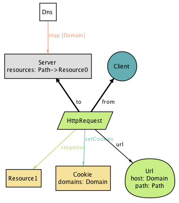
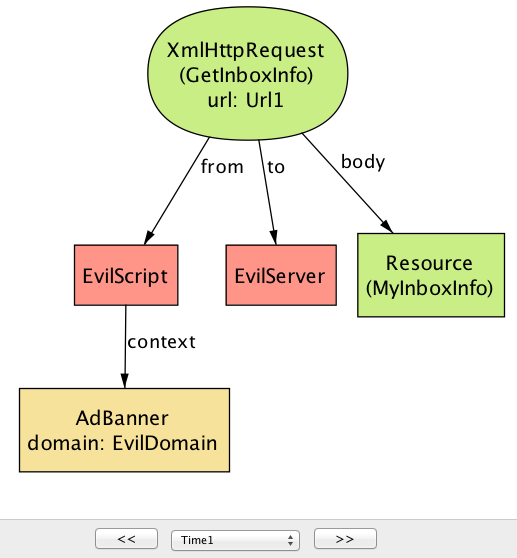
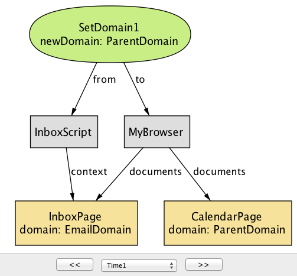
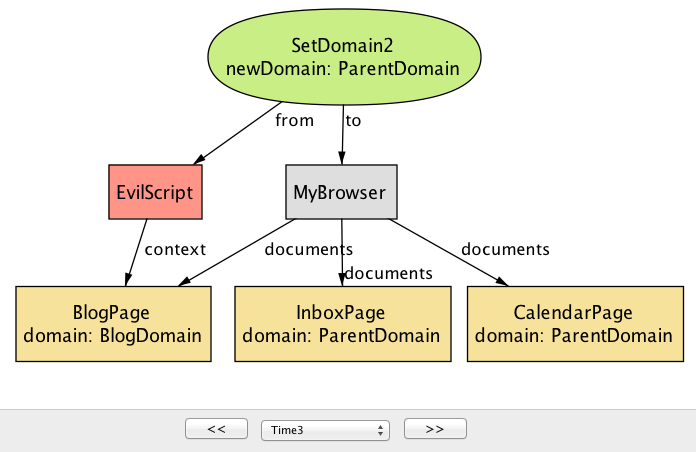
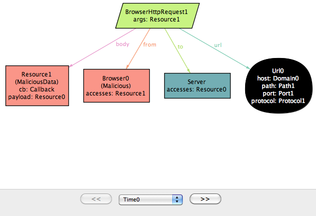
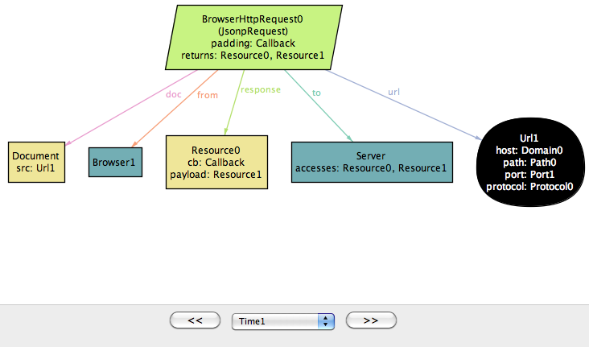
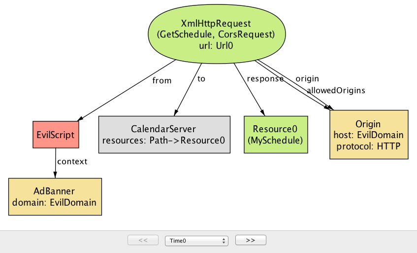

# The Same Origin Policy

## Introduction

The same-origin policy (SOP) is an important part of the security
mechanism of every modern browser. It controls when scripts running in
a browser can communicate with one another (roughly, when they
originate from the same website). First introduced in Netscape
Navigator, the SOP now plays a critical role in the security of web
applications; without it, it would be far easier for a malicious
hacker to peruse your private photos on Facebook, read your email, or
empty your bank account.

But the SOP is far from perfect. At times, it is too restrictive;
there are cases (such as mashups) in which scripts from different
origins should be able to share a resource but cannot. At other times
it is not restrictive enough, leaving corner cases that can be
exploited using common attacks such as cross-site request forgery.
Furthermore, the design of the SOP has evolved organically over the
years and puzzles many developers.

The goal of this chapter is to capture the essence of
this important -- yet often misunderstood -- feature. In particular, we
will attempt to answer the following questions:

* Why is the SOP necessary? What are the types of security violations that it prevents?
* How is the behavior of a web application affected by the SOP?
* What are different mechanisms for bypassing the SOP? 
* How secure are these mechanisms? What are potential security issues that they introduce?

Covering the SOP in its entirety is a daunting task, given the
complexity of the parts that are involved -- web servers, browsers,
the HTTP protocol, HTML documents, client-side scripts, and so on. We
would likely get bogged down by the gritty details of all these parts
(and consume our 500 lines before even reaching SOP!). But how can we
hope to be precise without representing crucial details?

## Modeling with Alloy

This chapter is somewhat different from others in this book. Instead
of building a working implementation, we will construct an executable
_model_ that serves as a simple yet precise description of the
SOP. Like an implementation, the model can be executed to explore
dynamic behaviors of the system; but unlike an implementation, the
model omits low-level details that may get in the way of understanding
the essential concepts.

The approach we take might be called “agile modeling” because of its
similarities to agile programming. We work incrementally, assembling
the model bit by bit. Our evolving model is at every point something
that can be executed. We formulate and run tests as we go, so that by
the end we have not only the model itself but also a collection of
_properties_ that it satisfies.

To construct this model, we use _Alloy_, a language for modeling and
analyzing software design. An Alloy model cannot be executed in the
traditional sense of program execution. Instead, a model can be (1)
_simulated_ to produce an _instance_, which represents a valid
scenario or configuration of a system, and (2) _checked_ to see
whether the model satisfies a desired property.

Despite above similarities, agile modeling differs from agile
programming in one key respect. Although we'll be running tests, we
actually won't be writing any. Alloy's analyzer generates test cases
automatically, and all that needs to be provided is the property to be
checked. Needless to say, this saves a lot of trouble (and text). The
analyzer actually executes all possible test cases up to a certain
size (called a _scope_); this typically means generating all starting
states with at most some number of objects, and then choosing
operations and arguments to apply up to some number of steps. Because
so many tests are executed (typically billions), and because all
possible configurations that a state can take are covered (albeit
within the scope), this analysis tends to expose bugs more effectively
than conventional testing (and is sometimes described not as "testing"
but as "bounded verification").

### Simplifications

Because the SOP operates in the context of browsers, servers, the HTTP
protocol, and so on, a complete description would be overwhelming. So
our model (like all models) abstracts away irrelevant aspects, such as
how network packets are structured and routed. But it also simplifies
some relevant aspects, which means that the model cannot fully account
for all possible security vulnerabilities.

For example, we treat HTTP requests like remote procedure calls,
ignoring the fact that responses to requests might come out of
order. We also assume that DNS (the domain name service) is static, so
we cannot consider attacks in which a DNS binding changes during an
interaction. In principle, though, it would be possible to extend our
model to cover all these aspects, although it's in the very nature of
security analysis that no model (even if it represents the entire
codebase) can be guaranteed complete.

## Roadmap

Here is the order in which we will proceed with our model of the
SOP. We will begin by building models of three key components that we
need in order for us to talk about the SOP: the HTTP protocol, the
browser, and client-side scripting. We will build on top of these
basic models to define what it means for a web application to be
_secure_, and then introduce the SOP as a mechanism that attempts to
achieve the required security properties.

We will then see that the SOP can be sometimes too restrictive,
getting in the way of a web application's proper functioning.  So we
introduce four different techniques that are commonly used to bypass
the restrictions that are imposed by the policy.

Feel free to explore the sections in any order you'd like. If you are
new to Alloy, we recommend starting with the first three sections
(HTTP, Browser, and Script), as they introduce some of the basic
concepts of the modeling language. While you are making your way
through the chapter, we also encourage you to play with the models in
the Alloy Analyzer; run them, explore the generated scenarios, and try
making modifications and seeing their effects. The tool is freely
available for download (http://alloy.mit.edu).

## Model of the Web

### HTTP Protocol

The first step in building an Alloy model is to declare some sets of
objects. Let's start with resources:

```alloy
sig Resource {}
```

The keyword “sig” identifies this as an Alloy signature
declaration. This introduces a set of resource objects; think of
these, just like the objects of a class with no instance variables, as
blobs that have identity but no content. When the analysis runs, this
set will be determined, just as a class in an object-oriented language
comes to denote a set of objects when the program executes.

Resources are named by URLs (*uniform resource locators*):

```alloy
sig Url {
  protocol: Protocol,
  host: Domain,
  port: lone Port,
  path: Path
}
sig Protocol, Domain, Port, Path {}
```

Here we have five signature declarations, introducing a set of URLs
and four additional sets for each of the basic kinds of objects they
comprise. Within the URL declaration, we have four fields. Fields are
like instance variables in a class; if `u` is a URL, for example, then
`u.protocol` would represent the protocol of that URL (just like dot
in Java). But in fact, as we'll see later, these fields are
relations. You can think of each one as if it were a two-column
database table. Thus `protocol` is a table with the first column
containing URLs and the second column containing protocols. And the
innocuous looking dot operator is in fact a rather general kind of
relational join, so that you could also write `protocol.p` for all the
URLs with a protocol `p` -- but more on that later.

Note that domains and paths, unlike URLs, are treated as if they have
no structure -- a simplification. The keyword `lone` (which can be
read "less than or equal to one") says that each URL has at most one
port. The path is the string that follows the host name in the URL,
and which (for a simple static server) corresponds to the file path of
the resource; we're assuming that it's always present, but can be an
empty path.

Let us introduce clients and servers, each of which contains a mapping
from paths to resources:

```alloy
abstract sig Endpoint {}
abstract sig Client extends Endpoint {}
abstract sig Server extends Endpoint {
  resources: Path -> lone Resource
}
```

The `extends` keyword introduces a subset, so the set `Client` of all
clients, for example, is a subset of the set `Endpoint` of all
endpoints. Extensions are disjoint, so no endpoint is both a client
and a server. The `abstract` keyword says that all extensions of a
signature exhaust it, so its occurrence in the declaration of
`Endpoint`, for example, says that every endpoint must belong to one
of the subsets (at this point, `Client` and `Server`). For a server
`s`, the expression `s.resources` will denote a map from paths to
resources (hence the arrow in the declaration). Recall that each field
is actually a relation that includes the owning signature as a first
column, so this field represents a three-column relation on `Server`,
`Path` and `Resource`.

To map a URL to a server, we introduce a set `Dns` of domain name
servers, each with a mapping from domains to servers:

```alloy
one sig Dns {
  map: Domain -> Server
}
```

The keyword `one` in the signature declaration means that (for
simplicity) we're going to assume exactly one domain name server, and
there will be a single DNS mapping, given by the expression `Dns.map`.
Again, as with the serving resources, this could be dynamic (and in
fact there are known security attacks that rely on changing DNS
bindings during an interaction) but we're simplifying.

In order to model HTTP requests, we also need the concept of
_cookies_, so let's declare them:

```alloy
sig Cookie {
  domains: set Domain
}
```

Each cookie is scoped with a set of domains; this captures the fact
that a cookie can apply to "*.mit.edu", which would include all
domains with the suffix "mit.edu".

Finally, we can put this all together to construct a model of HTTP
requests:

```alloy
abstract sig HttpRequest extends Call {
  url: Url,
  sentCookies: set Cookie,
  body: lone Resource,
  receivedCookies: set Cookie,
  response: lone Resource,
}{
  from in Client
  to in Dns.map[url.host]
}
```

We're modeling an HTTP request and response in a single object; the
`url`, `sentCookies` and `body` are sent by the client, and the
`receivedCookies` and `response` are sent back by the server.

When writing the `HttpRequest` signature, we found that it contained
generic features of calls, namely that they are from and to particular
things. So we actually wrote a little Alloy module that declares the
`Call` signature, and to use it here we need to import it:

```alloy
open call[Endpoint]
```

It's a polymorphic module, so it's instantiated with `Endpoint`, the
set of things calls are from and to. (The module appears in full in
the Appendix.)

Following the field declarations in `HttpRequest` is a collection of
constraints. Each of these constraints applies to all members of the
set of HTTP requests. The constraints say that (1) each request comes
from a client, and (2) each request is sent to one of the servers
specified by the URL host under the DNS mapping.

One of the prominent features of Alloy is that a model, no matter how
simple or detailed, can be executed at any time to generate sample
system instances. Let's use the `run` command to ask the Alloy
Analyzer to execute the HTTP model that we have so far:

```alloy
run {} for 3	-- generate an instance with up to 3 objects of every signature type
```

As soon as the analyzer finds a possible instance of the system, it
displays it graphically, like this:



This instance shows a client (represented by node `Client`) sending an
`HttpRequest` to `Server`, which, in response, returns a resource
object and instructs the client to store `Cookie` at `Domain`.

Even though this is a tiny instance with seemingly few details, it
signals a flaw in our model. Note that the resource returned from the
request (`Resource1`) does not exist in the server! We neglected to
specify an obvious fact about the server; namely, that every response
to a request is a resource that the server stores. We can go back to
our definition of `HttpRequest` and append the following constraint:

```alloy
abstract sig HttpRequest extends Call { ... }{
  ...
  response = to.resources[url.path]
}
```

Rerunning produces now instances without the flaw.

Instead of generating sample instances, we can ask the analyzer to
*check* whether the model satisfies a property. For example, one
property we might want is that when a client sends the same request
multiple times, it always receives the same response back:

```alloy
check { all r1, r2: HttpRequest | r1.url = r2.url implies r1.response = r2.response } for 3 
```

Given this `check` command, the analyzer explores every possible behavior of the system (up to the specified bound), and when it finds one that violates the property, displays that instance as a *counterexample*:


This counterexample again shows an HTTP request being made by a
client, but with two different servers. (In the Alloy visualizer,
objects of the same type are distinguished by appending numeric
suffixes to their names; if there is only one object of a given type,
no suffix is added. Every name that appears in a snapshot diagram is
the name of an object. So -- perhaps confusingly at first sight -- the
names `Domain`, `Path`, `Resource`, `Url` all refer to individual
objects, not to types!)

Note that while the DNS server maps `Domain` to both `Server0` and
`Server1` (in reality, this is a common practice for load balancing),
only `Server1` maps `Path` to a resource object, causing
`HttpRequest1` to result in empty response: another error in our
model! To fix this, we add an Alloy *fact* recording the assumption
that any two servers to which DNS maps a single host provide the same
set of resources:

```alloy
fact ServerAssumption {
  all s1, s2: Server | (some Dns.map.s1 & Dns.map.s2) implies s1.resources = s2.resources
}
```

When we re-run the `check` command after adding this fact, the
analyzer no longer reports any counterexamples for the property. This
doesn't mean the property has been proven to be true, since there
might be a counterexample in a larger scope. But it is unlikely that
the property is false, since the analyzer has tested all possible
instances involving 3 objects of each type. In this scope, the `map`
field alone (representing the DNS mapping) has 512 possible values.

### Browser

Let's introduce browsers:

```alloy
sig Browser extends Client {
  documents: Document -> Time,
  cookies: Cookie -> Time,
}
```

This is our first example of a signature with *dynamic fields*. Alloy
has no built-in notions of time or behavior, which means that a
variety of idioms can be used. In this model, we're using a common
idiom in which you introduce a notion of `Time`, and attach it as a
final column for every time-varying field. For example, expression
`b.cookes.t` represents the set of cookies that are stored in browser
`b` at particular time `t`. Likewise, the `documents` field associates
a set of documents with each browser at a given time (for more details
about how we model the dynamic behavior, see the Appendix).

Documents are created from a response to an HTTP request. They can
also be destroyed if, for example, the user closes a tab or the
browser, but we leave this out of the model. A document has a URL
(the one from which the document was originated), some content (the
DOM) and a domain:

```alloy
sig Document {
  src: Url,
  content: Resource -> Time,
  domain: Domain -> Time
}
```

The inclusion of the `Time` column for the latter two fields tells us
that they can vary over time, and its omission for the first (`src`,
representing the source URL of the document) indicates that the source
URL is fixed.

To model the effect of an HTTP request on a browser, we introduce a
new signature, since not all HTTP requests will originate at the level
of the browser; the rest will come from scripts.

```alloy
sig BrowserHttpRequest extends HttpRequest {
  doc: Document
}{
  -- the request comes from a browser
  from in Browser
  -- the cookies being sent exist in the browser at the time of the request
  sentCookies in from.cookies.start
  -- every cookie sent must be scoped to the url of the request
  all c: sentCookies | url.host in c.domains

  -- a new document is created to display the content of the response
  documents.end = documents.start + from -> doc
  -- the new document has the response as its contents
  content.end = content.start ++ doc -> response
  -- the new document has the host of the url as its domain
  domain.end = domain.start ++ doc -> url.host
  -- the document's source field is the url of the request
  doc.src = url

  -- new cookies are stored by the browser
  cookies.end = cookies.start + from -> sentCookies
}
```

This kind of request has one new field, `doc`, representing the
document created in the browser from the resource returned by the
request. As with `HttpRequest`, the behavior is described as a
collection of constraints. Some of these say when the call can happen:
for example, that the call has to come from a browser. Some constrain
the arguments of the call: for example, that the cookies must be
scoped appropriately. And some constrain the effect, using a common
idiom that relates the value of a relation after the call to its value
before.

For example, to understand the constraint `documents.end =
documents.start + from -> doc` remember that `documents` is a 3-column
relation on browsers, documents and times. The fields `start` and
`end` come from the declaration of `Call` (which we haven't seen, but
is included in the listing at the end), and represent the times at the
beginning and end of the call. The expression `documents.end` gives
the mapping from browsers to documents when the call has ended. So
this constraint says that after the call, the mapping is the same,
except for a new entry in the table mapping `from` to `doc`.

Some constraints use the `++` relational override operator: `e1 ++ e2`
contains all tuples of `e2`, and additionally, any tuples of `e1`
whose first element is not the first element of a tuple in `e2`. For
example, the constraint `content.end = content.start ++ doc ->
response` says that after the call, the `content` mapping will be
updated to map `doc` to `response` (clobbering any previous mapping of
`doc`).  If we were to use the union operator `+` instead, then the
same document might (incorrectly) be mapped in the after state to
multiple resources.

### Script

Next, we will build on the HTTP and browser models to introduce *client-side scripts*, which represent pieces of code (typically in JavaScript) executing inside a browser document (`context`). 

```alloy
sig Script extends Client { context: Document }
```

A script is a dynamic entity that can perform two different kinds of
action: (1) it can make HTTP requests (i.e., Ajax requests) and (2) it
can perform browser operations to manipulate the content and
properties of a document. The flexibility of client-side scripts is
one of the main catalysts behind the rapid development of Web 2.0, but
is also the reason why the SOP was created in the first place. Without
the SOP, scripts would be able to send arbitrary requests to servers,
or freely modify documents inside the browser -- which would be bad
news if one or more of the scripts turned out to be malicious!

A script can communicate to a server by sending an `XmlHttpRequest`:

```alloy
sig XmlHttpRequest extends HttpRequest {}{
  from in Script
  noBrowserChange[start, end] and noDocumentChange[start, end]
}
```

An `XmlHttpRequest` can be used by a script to send/receive resources
to/from a server, but unlike `BrowserHttpRequest`, it does not
immediately result in creation of a new page or other changes to the
browser and its documents. To say that a call does not modify these
aspects of the system, we define predicates `noBrowserChange` and
`noDocumentChange`:

```alloy
pred noBrowserChange[start, end: Time] {
  documents.end = documents.start and cookies.end = cookies.start  
}
pred noDocumentChange[start, end: Time] {
  content.end = content.start and domain.end = domain.start  
}
```

What kind of operations can a script perform on documents? First, we
introduce a generic notion of *browser operations* to represent a set
of browser API functions that can be invoked by a script:

```alloy
abstract sig BrowserOp extends Call { doc: Document }{
  from in Script and to in Browser
  doc + from.context in to.documents.start
  noBrowserChange[start, end]
}
```

Field `doc` refers to the document that will be accessed or
manipulated by this call. The second constraint in the signature facts
says that both `doc` and the document in which the script executes
(`from.context`) must be documents that currently exist inside the
browser. Finally, a `BrowserOp` may modify the state of a document,
but not the set of documents or cookies that are stored in the
browser. (Actually, cookies can be associated with a document and
modified using a browser API, but we omit this detail for now.)

A script can read from and write to various parts of a document
(usually called DOM elements). In a typical browser, there are a large
number of API functions for accessing the DOM (e.g.,
`document.getElementById`), but enumerating all of them is not
important for our purpose. Instead, we will simply group them into two
kinds -- `ReadDom` and `WriteDom` -- and model modifications as
wholesale replacements of the entire document:

```alloy
sig ReadDom extends BrowserOp { result: Resource }{
  result = doc.content.start
  noDocumentChange[start, end]
}
sig WriteDom extends BrowserOp { newDom: Resource }{
  content.end = content.start ++ doc -> newDom
  domain.end = domain.start
}
```

`ReadDom` returns the content the target document, but does not modify it; `WriteDom`, on the other hand, sets the new content of the target document to `newDom`.

In addition, a script can modify various properties of a document,
such as its width, height, domain, and title. For our discussion of
the SOP, we are only interested in the domain property, which we will
introduce in a later section.

## Example Applications

As we've seen earlier, given a `run` or `check` command, the Alloy
Analyzer generates a scenario (if it exists) that is consistent with
the description of the system in the model. By default, the analyzer
arbitrarily picks _any_ one of the possible system scenarios (up to
the specified bound), and assigns numeric identifiers to signature
instances (`Server0`, `Browser1`, etc.) in the scenario.

Sometimes, we may wish to analyze the behavior of a _particular_ web
application, instead of exploring scenarios with a random
configuration of servers and clients. For example, imagine that we
wish to build an email application (like Gmail) that runs inside a
browser.  In addition to providing basic email features, our
application might display a banner from a third-party advertisement
service, which is controlled by a potentially malicious actor.

In Alloy, the keywords `one sig` introduce a _singleton_ signature
containing exactly one object; we saw an example above with
`Dns`. This syntax can be used to specify concrete atoms. For example,
to say that there is one inbox page and one ad banner (each of which
is a document) we can write:

```alloy
one sig InboxPage, AdBanner extends Document {}
```

With this declaration, every scenario that Alloy generates will
contain at least these two `Document` objects.

Likewise, we can specify particular servers, domains and so on, with a
constraint (which we've called `Configuration`) to specify the
relationships between them:

```alloy
one sig EmailServer, EvilServer extends Server {}
one sig EvilScript extends Script {}
one sig EmailDomain, EvilDomain extends Domain {}
fact Configuration {
  EvilScript.context = AdBanner
  InboxPage.domain.first = EmailDomain
  AdBanner.domain.first = EvilDomain  
  Dns.map = EmailDomain -> EmailServer + EvilDomain -> EvilServer
}
```

For example, the last constraint in the fact specifies how the DNS is
configured to map domain names for the two servers in our
system. Without this constraint, the Alloy Analyzer may generate
scenarios where `EmailDomain` is mapped to `EvilServer`, which are not
of interest to us (in practice, such a mapping may be possible due to
an attack called _DNS spoofing_, but we will rule it out from our
model since it lies outside the class of attacks that the SOP is
designed to prevent).

Let us introduce two additional applications: an online calendar and a
blog site:

```alloy
one sig CalendarServer, BlogServer extends Document {} 
one sig CalendarDomain, BlogDomain extends Domain {}
```

We should update the constraint about the DNS mapping above to
incorporate the domain names for these two servers:

```alloy
fact Configuration {
  ...
  Dns.map = EmailDomain -> EmailServer + EvilDomain -> EvilServer + 
            CalendarDomain -> CalenderServer + BlogDomain -> BlogServer  
}
```

In addition, let us say that that the email, blog, and calendar
applications are all developed by a single organization, and thus,
share the same base domain name. Conceptually, we can think of
`EmailServer` and `CalendarServer` having domain names
`email.example.com` and `calendar.example.com`, thus sharing
`example.com` as the common superdomain. In our model, this can be
represented by introducing a domain name that _subsumes_ others:

```alloy 
one sig ExampleDomain extends Domain {}{
  subsumes = EmailDomain + EvilDomain + CalendarDomain + this
}   
```

Note that `this` is included as a member of `subsumes`, since every
domain name subsumes itself.

There are other details about these applications that we omit here
(see example.als for the full model). But we will revisit these
applications as our running example throughout the remainder of this
chapter.

## Security Properties

Before we get to the SOP itself, there is an important question that we
have not discussed yet: What exactly do we mean when we say our system
is _secure_?

Not surprisingly, this is a tricky question to answer. For our
purposes, we will turn to two well-studied concepts in information
security -- _confidentiality_ and _integrity_. Both of these concepts
talk about how information should be allowed to pass through the
various parts of the system. Roughly, _confidentiality_ means that a
critical piece of data should only be accessible to parts that are
deemed trusted, and _integrity_ means that trusted parts only rely on
data that have not been maliciously tampered with.

### Dataflow Properties

In order to specify these security properties more precisely, we first
need to define what it means for a piece of data to _flow_ from one
part of the system to another. In our model so far, we have described
interactions between two endpoints as being carried out through
_calls_; e.g., a browser interacts with a server by making HTTP
requests, and a script interacts with the browser by invoking browser
API operations. Intuitively, during each call, a piece of data may flow
from one endpoint to another as an _argument_ or _return value_ of the
call. To represent this, we introduce a notion of `DataflowCall` into the
model, and associate each call with a set of `args` and `returns` data
fields:

```alloy
sig Data in Resource + Cookie {}

sig DataflowCall in Call {
  args, returns: set Data,  -- arguments and return data of this call
}{
 this in HttpRequest implies
    args = this.sentCookies + this.body and
    returns = this.receivedCookies + this.response
 ...
}
```

For example, during each call of type `HttpRequest`, the client
transfers two arguments (`sentCookies` and `body`) to the server, and
in turn, receives two addition sets of data (`receivedCookies` and
`response`) as return values. 

More generally, arguments flow from the sender of the call to the
receiver, and return values flow from the receiver to the sender. This
means that the only way for an endpoint to access a new piece of data
is by receiving it as an argument of a call that the endpoint accepts,
or a return value of a call that the endpoint invokes. We introduce a
notion of `DataflowModule`, and assign field `accesses` to represent the
set of data elements that the module can access at each time step:

```alloy
sig DataflowModule in Endpoint {
  -- Set of data that this component initially owns
  accesses: Data -> Time
}{
  all d: Data, t: Time - first |
	 -- This endpoint can only access a piece of data "d" at time "t" only when
    d -> t in accesses implies
      -- (1) It already had access in the previous time step, or
      d -> t.prev in accesses or
      -- there is some call "c" that ended at "t" such that
      some c: Call & end.t |
        -- (2) the endpoint receives "c" that carries "d" as one of its arguments or
        c.to = this and d in c.args or
        -- (3) the endpoint sends "c" that returns "d" 
        c.from = this and d in c.returns 
}
```

We also need to restrict data elements that a module can provide as arguments or return values of a call. Otherwise, we may get weird scenarios where a module can make a call with an argument that it has no access to!

```alloy
sig DataflowCall in Call { ... } {
  -- (1) Any arguments must be accessible to the sender
  args in from.accesses.start
  -- (2) Any data returned from this call must be accessible to the receiver
  returns in to.accesses.start
}
```

Now that we have means to describe data flow between different parts
of the system, we are (almost) ready to state security properties that
we care about. But recall that confidentiality and integrity are
_context-dependent_ notions; these properties make sense only if we
can talk about some agents within the system as being trusted (or
malicious). Similarly, not all information is equally important: we
need to distinguish between data elements that we consider to be
critical or malicious (or neither):

```alloy
sig TrustedModule, MaliciousModule in DataflowModule {}
sig CriticalData, MaliciousData in Data {}
```

Then, the confidentiality property can be stated as an _assertion_ on
the flow of critical data into non-trusted parts of the system:

```alloy
// No malicious module should be able to access critical data
assert Confidentiality {
  no m: Module - TrustedModule, t: Time |
    some CriticalData & m.accesses.t 
}
```

The integrity property is the dual of confidentiality: 

```alloy
// No malicious data should ever flow into a trusted module
assert Integrity {
  no m: TrustedModule, t: Time | 
    some MaliciousData & m.accesses.t
}
```

### Threat Model

A threat model describes a set of actions that an attacker may perform
in an attempt to compromise a security property of a system. Building
a threat model is an important step in any secure system design; it
allows us to identify (possibly invalid) assumptions that we have
about the system and its environment, and prioritize different types
of risks that need to be mitigated. 

In our model, we consider an attacker that can act as a server, a
script or a client. As a server, the attacker may set up malicious web
pages to solicit visits from unsuspecting users, who, in turn, may
inadvertently send sensitive information to the attacker as part of a
HTTP request. The attacker may create a malicious script that invokes
DOM operations to read data from other pages and relays those data to
the attacker's server. Finally, as a client, the attacker may
impersonate a normal user and send malicious requests to a server in
an attempt to access the user's data. We do not consider attackers
that eavesdrop on the connection between different network endpoints;
although it is a considerable threat in practice, the SOP is not
designed to prevent it, and thus, lies outside the scope of our model.

### Checking Properties

Now that we have defined the security properties and the attacker's
behavior, let us show how the Alloy Analyzer can be used to
automatically check that those properties hold even in the presence of
the attacker.  When prompted with a `check` command, the analyzer
explores _all_ possible dataflow traces in the system and produces a
counterexample (if one exists) that demonstrates how an assertion
might be violated:

```
check Confidentiality for 5
```

For example, when checking the model of our example application
against the confidentiality property, the analyzer generates the
following scenario, which shows how `EvilScript` may access a piece of
critical data (`MyInboxInfo`):

 
 

This counterexample involves two steps. In the first step, `EvilScript`, executing inside `AdBanner` from `EvilDomain`, reads the content of `InboxPage`, which originates from `EmailDomain`. In the next step, `EvilScript` sends the same content (`MyInboxInfo`) to `EvilServer` by making an `XmlHtttpRequest` call. The core of the problem here is that a script executing under one domain is able to read the content of a document from another domain; as we will see in the next section, this is exactly one of the scenarios that the SOP is designed to prevent.

There may be multiple counterexamples to a single assertion. Consider the following scenario, which shows a different way in which the system may violate the confidentiality property:

 

In this scenario, instead of reading the content of the inbox page,
`EvilScript` directly makes a `GetInboxInfo` request to `EmailServer`.
Note that the request includes a cookie (`MyCookie`), which is scoped
to the same domain as the destination server. This is potentially
dangerous, because if the cookie is used to represent the user's
identity (e.g., a session cookie), `EvilScript` can effectively
pretend to be the user and trick the server into responding with the
user's private data (`MyInboxInfo`)! Here, the problem is again
related to the liberal ways in which a script may be used to access
information across different domains -- namely, that a script executing
under one domain is able to make an HTTP request to a server with a
different domain.

These two counterexamples tell us that extra measures are needed to
restrict the behavior of scripts, especially since some of those
scripts could be malicious. This is exactly where the SOP comes in.

## Same Origin Policy

Before we can state the SOP, the first thing we should do is to introduce the
notion of an origin, which is composed of a protocol, host, and optional port:

```alloy
sig Origin {
  protocol: Protocol,
  host: Domain,
  port: lone Port
}
```

We define a function that given a URL returns the corresponding origin:

```alloy
fun origin[u: Url] : Origin {
    {o: Origin | o.protocol = u.protocol and o.host = u.host and o.port = u.port }
}
```
The SOP itself has two parts, restricting the ability of a script to (1) make DOM API calls and (2) send HTTP requests. The first part of the policy states that a script can only read from and write to a document that comes from the same origin as the script:
```alloy
pred domSop {
  all o: ReadDom + WriteDom |  let target = o.doc, caller = o.from.context |
    origin[target] = origin[caller] 
}
```
An instance such as the first script scenario is not possible under `domSop`, since `Script` is not allowed to invoke `ReadDom` on a document from a different origin.

The second part of the policy says that a script cannot send an HTTP request to a server unless its context has the same origin as the target URL -- effectively preventing instances such as the second script scenario.
```alloy
pred xmlHttpReqSop { all x: XmlHttpRequest | origin[x.url] = origin[x.from.context.src] }
```
As we can see, the SOP is designed to prevent the two types of vulnerabilities that could arise from actions of a malicious script; without it, the web would be a much more dangerous place than it is today.

It turns out, however, that the SOP can be *too* restrictive. For
example, sometimes you *do* want to allow communication between two
documents of different origins. By the above definition of an origin,
a script from `foo.example.com` would not be able to read the content
of `bar.example.com`, or send a HTTP request to `www.example.com`,
because these are all considered distinct hosts.

In order to allow some form of cross-origin communication when
necessary, browsers implemented a variety of mechanisms for relaxing
the SOP. Some of these are more well-thought-out than others, and some
have pitfalls that, when badly used, can undermine the security
benefits of the SOP. In the following sections, we will describe the
most common of these mechanisms, and discuss their potential security
pitfalls.

## Techniques for Bypassing the SOP

The SOP is a classic example of the tension between functionality and
security; we want to make sure our sites are robust and functional,
but the mechanism for securing it can sometimes get in the
way. Indeed, when the SOP was initially introduced, developers ran
into trouble building sites that made legitimate uses of cross-domain
communication, e.g. for mashups.

In this section, we will discuss four techniques that have been
devised and frequently used by web developers to bypass the
restrictions imposed by the SOP: (1) The "document.domain" property
relaxation; (2) JSONP; (3) PostMessage; and (4) CORS. These are valuable
tools, but if used without caution, may render a web application
vulnerable to exactly the kinds of attacks that the SOP was designed
to thwart in the first place.

Each of these four techniques is surprisingly complex, and if
described in full detail, would merit its own chapter. So here we just
give a brief flavor of how they work, potential security problems that
they introduce, and how to prevent these problems. In particular, we
will ask the Alloy Analyzer to check, for each technique, whether it
could be abused by an attacker to undermine the two security
properties that we defined earlier:

```
check Confidentiality for 5
check Integrity for 5
```

Based on insights from the counterexamples that the analyzer
generates, we will discuss guidelines for safely using these techniques
without falling into security pitfalls.

### Domain Property

As the first technique on our list, we will look at the use of the
"document.domain" property as a way of bypassing the SOP. The idea
behind this technique is to allow two documents from different origins
to access each other's DOM simply by setting the "document.domain"
property to the same value. So, for example, a script from
`email.example.com` could read or write the DOM of a document from
`calendar.example.com` if the scripts in both documents set the
`document.domain` property to `example.com` (assuming both source URLs
have also the same protocol and port).

We model the behavior of setting the `document.domain` property as a type
of browser operation called `SetDomain`:

```alloy
// Modify the document.domain property
sig SetDomain extends BrowserOp { newDomain: Domain }{
  doc = from.context
  domain.end = domain.start ++ doc -> newDomain
  -- no change to the content of the document
  content.end = content.start
}
```

The `newDomain` field represents the value to which the property should be set.
There's a caveat, though: scripts can only set the domain property to 
a right-hand, fully qualified fragment of its hostname.
(i.e., `email.example.com` can set it to `example.com` but not to
 `google.com`). We use a fact to capture this rule about subdomains:

```alloy
// Scripts can only set the domain property to only one that is a right-hand,
// fully-qualified fragment of its hostname
fact setDomainRule {
  all d: Document | d.src.host in (d.domain.Time).subsumes
}
```

If it weren't for this rule, any site could set the `document.domain`
property to any value, which means that, for example, a malicious site
could set the domain property to your bank domain, load your bank
account in an iframe, and (assuming the bank page has set its domain
property) read the DOM of your bank page!

Let us go back to our original definition of the SOP, and relax its
restriction on DOM access in order to take into account the effect of
the `document.domain` property. If two scripts set the property to the
same value, and they have the same protocol and port, then these two
scripts can interact with each other (that is, read and write each
other's DOM). 

```alloy
pred domSop {
  -- For every successful read/write DOM operation,
  all o: ReadDom + WriteDom |  let target = o.doc, caller = o.from.context |
    -- (1) target and caller documents are from the same origin, or
    origin[target] = origin[caller] or
    -- (2) domain properties of both documents have been modified
    (target + caller in (o.prevs <: SetDomain).doc and
      -- ...and they have matching origin values.
      currOrigin[target, o.start] = currOrigin[caller, o.start])
}
```

Here, `currOrigin[d, t]` is a function that returns the origin of document `d` with the `document.domain` property at time `t` as its hostname.

It is worth pointing out that the `document.domain` properties for
_both_ documents must be _explictly_ set sometime after they
are loaded into the browser. Let us say that document A is
loaded from `example.com`, and document B from `calendar.example.com` has
its domain property modified to `example.com`. Even though the two
documents now have the same domain property, they will _not_ be able to
interact with each other, unless document A also explictly sets its
property to `example.com`. At first, this seems like a rather strange
behavior. However, without this, various bad things can happen. For
example, a site could be subject to a cross-site scripting attack from
its subdomains: A malicious script in document B might modify
its domain property to `example.com` and manipulate the DOM of
document A, even though the latter never intended to interact with
document B.

**Analysis:** Now that we have relaxed the SOP to allow
  cross-origin communication under certain circumstances, do the
  security guarantees of the SOP still hold? Let us ask the Alloy
  Analyzer to tell us whether the `document.domain` property could be
  abused by an attacker to access or tamper with a user's sensitive data.

Indeed, given the new, relaxed definition of the SOP, the analyzer
generates a counterexample scenario to the confidentiality property:

```
check Confidentiality for 5
```

This scenario consists of five steps; the first three steps show a typical use case of the `document.domain` property, where two documents from distinct origins, `CalendarPage` and `InboxPage`, communicate by setting their domain properties to a common value (`ExampleDomain`). The last two steps introduce another document, `BlogPage`, that has been compromised with a malicious script that attempts to access the content of the other two documents.

At the beginning of the scenario, `InboxPage` and `CalendarPage` have
domain properties with two distinct values (`EmailDomain` and
`ExampleDomain`, respectively), so the browser will prevent them from
accessing each other's DOM.  The scripts running inside the documents
(`InboxScript` and `CalendarScript`) each execute the `SetDomain`
operation to modify their domain properties to `ExampleDomain` (which
is allowed because `ExampleDomain` is a superdomain of the original
domain):




Having done this, they can now access each other's DOM by
executing `ReadDom` or `WriteDom` operations:


<!---
While this method is a quick and easy way of relaxing the SOP, it is
rather limited; namely, it can enable cross-origin DOM access
_only_ between documents that have a common superdomain, meaning it
cannot be used by applications from completely different domains.
-->

Note that when you set the domain property of both "email.example.com"
and "calendar.example.com" to "example.com", you are allowing not only
these two pages to communicate between each other, but also _any_
other page that has "example.com" as a superdomain
(e.g. "blog.example.com"). An attacker also realizes this, and
constructs a special script (`EvilScript`) that runs inside the
attacker's blog page (`BlogPage`). In the next step, the script executes `SetDomain` operation to modify the domain property of `BlogPage` to `ExampleDomain`:



Now that `BlogPage` has the same domain property as the other two documents, it can successfully execute `ReadDOM` operation to access their content.


This attack points out one crucial weakness of the domain property
method for cross-origin communication: The security of an application
that uses this method is only as strong as the weakest link in all of
the pages that share the same base domain. We will shortly discuss
another method called PostMessage, which can be used for a more
general class of cross-origin communication while also being more
secure.

### JSON with Padding (JSONP)

Before the introduction of CORS (which we will discuss shortly), JSONP
was perhaps the most popular technique for bypassing the SOP
restriction on XMLHttpRequest, and still remains widely used
today. JSONP takes advantage of the fact that script inclusion tags in
HTML (i.e., `<script>`) are exempt from the SOP*; that is, you can
include a script from _any_ URL, and the browser readily executes it
in the current document:

(\* Without this exemption, it would not be possible to load JavaScript libraries, such as JQuery, from other domains.)

```html
<script src="http://www.example.com/myscript.js"></script>
```

A script tag can be used to obtain code, but how do we use it to
receive arbitrary _data_ (e.g., a JSON object) from a different
domain? The problem is that the browser expects the content of `src`
to be a piece of JavaScript code, and so simply having it point at a
data source (e.g., JSON or HTML file) results in a syntax error.

One workaround is to wrap the desired data inside a piece of string that the browser recognizes as valid JavaScript code; this string is sometimes called _padding_ (hence the name "JSON with padding"). This padding could be any arbitrary JavaScript code, but conventionally, it is the name of a callback function (already defined in the current document) that is to be executed on the response data:

```html
<script src="http://www.example.com/mydata?jsonp=processData"></script>
```

The server on `www.example.com` recognizes it as a JSONP request, and wraps the requested data inside the `jsonp` parameter:

```html
processData(mydata)
```

which is a valid JavaScript statement (namely, the application of function "processData" on value "mydata"), and is executed by the browser in the current document.

In our model, JSONP is modeled as a kind of HTTP request that includes
the identifier of a callback function in the field `padding`. After
receiving a JSONP request, the server returns a response that has the
requested resource (`payload`) wrapped inside the callback function
(`cb`).

```alloy
sig CallbackID {}  // identifier of a callback function
// Request sent as a result of <script> tag
sig JsonpRequest in BrowserHttpRequest {
  padding: CallbackID
}{
  response in JsonpResponse
}
sig JsonpResponse in Resource {
  cb: CallbackID,
  payload: Resource
}
```

When the browser receives the response, it executes the callback
function on the payload:

```alloy
sig JsonpCallback extends EventHandler {
  cb: CallbackID,
  payload: Resource
}{
  causedBy in JsonpRequest
  let resp = causedBy.response | 
    cb = resp.@cb and
    -- result of JSONP request is passed on as an argument to the callback
    payload = resp.@payload
}
```

Note that the callback function executed is the same as the one that's
included in the response (`cb = resp.@cb`), but _not_ necessarily the
same as `padding` in the original JSONP request. In other words, for
the JSONP communication to work, the server is responsible for
properly constructing a response that includes the original padding as
the callback function (i.e., ensure that `JsonRequest.padding =
JsonpResponse.cb`). In principle, the server can choose to include any
callback function (or any piece of JavaScript), including one that has
nothing to do with `padding` in the request. This highlights a
potential risk of JSONP: the server that accepts the JSONP requests
must be trustworthy and secure, because it has the ability to execute
any piece of JavaScript code in the client document.

**Analysis:** Checking the `Confidentiality` property with
 the Alloy Analyzer returns a counterexample that shows one potential
 security risk of JSONP.  In this scenario, the calendar application
 (`CalenderServer`) makes its resources available to third-party sites
 using a JSONP endpoint (`GetSchedule`). To restrict access to the
 resources, `CalendarServer` only sends back a response with the
 schedule for a user if the request contains a cookie that correctly
 identifies that user.

Note that once a server provides an HTTP endpoint as a JSONP service,
anyone can make a JSONP request to it, including malicious sites. In
this scenario, the ad banner page from `EvilServer` includes a
_script_ tag that causes a `GetSchedule` request, with a callback
function called `Leak` as `padding`. Typically, the developer of
`AdBanner` does not have direct access to the victim user's session
cookie (`MyCookie`) for `CalendarServer`. However, because the JSONP
request is being sent to `CalendarServer`, the browser automatically
includes `MyCookie` as part of the request; `CalendarServer`, having
received a JSONP request with `MyCookie`, will return the victim's
resource (`MySchedule`) wrapped inside the padding `Leak`.



In the next step, the browser interprets the JSONP response as a call to `Leak(MySchedule)`. The rest of the attack is simple; `Leak` can simply be programmed to forward the input argument to `EvilServer`, allowing the attacker to access the victim's sensitive information.



This attack, an example of _cross-site request forgery_ (CSRF), shows an inherent weakness of JSOPN; _any_ site on the web can make a JSONP request simply by including a `<script>` tag and access the payload inside the padding. The risk can be mitigated in two ways: (1) ensure that a JSONP request never returns sensitive data, or (2) use another mechanism in place of cookies (e.g. secret tokens) to authorize the request.

### PostMessage

PostMessage is a new feature in HTML5 that allows scripts from two documents (of possibly different origins) to communicate with each other. It offers a more disciplined alternative to the method of setting the `domain` property, but brings its own security risks.

`PostMessage` is a browser API function that takes two arguments: (1) the data to be sent (`message`), and (2) the origin of the document receiving the message (`targetOrigin`):

```alloy
sig PostMessage extends BrowserOp {
  message: Resource,
  targetOrigin: Origin
}
```

To receive a message from another document, the receiving document  registers an event handler that is invoked by the browser as a consequence of a `PostMessage`:

```alloy
sig ReceiveMessage extends EventHandler {
  data: Resource,
  srcOrigin: Origin
}{
  causedBy in PostMessage
  -- "ReceiveMessage" event is sent to the script with the correct context
  origin[to.context.src] = causedBy.targetOrigin
  -- messages match
  data = causedBy.@message
  -- the origin of the sender script is provided as "srcOrigin" param 
  srcOrigin = origin[causedBy.@from.context.src]
}
```

The browser passes two parameters to `ReceiveMessage`: a resource (`data`) that corresponds to the message being sent, and the origin of the sender document (`srcOrigin`). The signature fact contains four constraints to ensure that each `ReceiveMessage` is well-formed with respect to its corresponding `PostMessage`.

**Analysis:** Again, let us ask the Alloy Analyzer whether `PostMessage` is a secure way of performing cross-origin communication. This time, the ananlyzer returns a counterexample for the `Integrity` property, meaning the attacker is able to exploit a weakness in `PostMessage` to introduce malicious data into a trusted application.

Note that by default, the PostMessage mechanism does not restrict
 who is allowed to send PostMessage; in other words, any document can
 send a message to another document as long as the latter has
 registered a `ReceiveMessage` handler. For example, in the following
 instance generated from Alloy, `EvilScript`, running inside
 `AdBanner`, sends a malicious `PostMessage` to a document with the
 target origin of `EmailDomain`.


The browser then forwards this message to the document(s)
with the corresponding origin (in this case, `InboxPage`).  Unless
`InboxScript` specifically checks the value of `srcOrigin` to filter out
messages from unwanted origins, `InboxPage` will accept the malicious
data, possibly leading to further security attacks (for example, it
may embed a piece of JavaScript to carry out an XSS attack).


As this example illustrates, `PostMessage` is not secure by default,
and it is the responsibility of the receiving document to
_additionally_ check the `srcOrigin` parameter to ensure that the
message is coming from a trustworthy document. Unfortunately, in
practice, many sites omit this check, enabling a malicious document to
inject bad content as part of a `PostMessage` [cite PostMessage
study].

However, the omission of the origin check may not simply be the result
of programmer ignorance. Implementing an appropriate check on incoming
PostMessage can be tricky; in some applications, it is hard to
determine in advance the list of trusted origins from which messages
are expected to be received (in some apps, this list may even change
dynamically). This, again, highlights the tension between security and
functionality: PostMessage can be used for secure cross-origin
communication, but only in the context where a whitelist of trusted
origins is known.

### Cross-Origin Resource Sharing (CORS)

Cross-Origin Resource Sharing (CORS) is a mechanism designed to allow
a server to share its resources with sites from different origins. In
particular, CORS can be used by a script from one origin to make
requests to a server with a different origin, effectively bypassing
the restriction of the SOP on cross-origin Ajax requests. 

Briefly, a typical CORS process involves two steps: (1) a script
wanting to access a resource from a foreign server includes, in its
request, an "Origin" header that specifies the origin of the script,
and (2) the server includes an "Access-Control-Allow-Origin" header as
part of its response, indicating a set of origins that are allowed to
access the server's resource. Normally, without CORS, a browser would
prevent the script from making a cross-origin request in the first
place, conforming to the SOP. However, with CORS enabled, the browser
allows the script to send the request and access its response, but
_only if_ "Origin" is one of the origins specified in
"Access-Control-Allow-Origin".

(CORS additionally includes a notion of _preflight_ requests, not discussed here, to
support complex types of cross-origin requests besides GETs and POSTs.)

In Alloy, we model a CORS request as a special kind of
`XmlHttpRequest`, with two extra fields `origin` and `allowedOrigins`:

```alloy
sig CorsRequest in XmlHttpRequest {
  -- "origin" header in request from client
  origin: Origin,
  -- "access-control-allow-origin" header in response from server
  allowedOrigins: set Origin
}{
  from in Script
}
```

We then use an Alloy fact `corsRule` to describe what constitutes a valid CORS request:

```alloy
fact corsRule {
  all r: CorsRequest |
    -- the origin header of a CORS request matches the script context
    r.origin = origin[r.from.context.src] and
    -- the specified origin is one of the allowed origins
    r.origin in r.allowedOrigins
}
```

**Analysis:** Can CORS be misused in a way that would allow the
attacker to compromise the security of a trusted site? When prompted,
the Alloy Analyzer returns asimple counterexample for the
`Confidentiality` property. 

Here, the developer of the calendar application decides to share some
of its resources with other applications by using the CORS
mechanism. Unfortunately, `CalendarServer` is configured to return
`Origin` (which represents the set of all origin values) for the
`access-control-allow-origin` header in CORS responses. As a result, a
script from any origin, including `EvilDomain`, is allowed to make
a cross-site request to `CalendarServer` and read its response:

 

This example highlights one common mistake that developers make with
CORS: Using the wildcard value "\*" as the value of
"access-control-allow-origin" header, allowing any site to access a
resource on the server. This access pattern is appropriate if the
resource is considered public and accessible to anyone. However, it
turns out that many sites use "\*" as the default value even for
private resources, inadvertently allowing malicious scripts to access
them through CORS requests [cite CORS study].

Why would a developer ever use the wildcard? It turns out that
specifying the allowed origins can be tricky, since it may not be
clear at design time which origins should be granted access at runtime
(similar to the PostMessage issue discusssed above). A service may,
for example, allow third party applications to subscribe dynamically
to its resources.

## Conclusion

In this chapter, we set out to construct a document that provides a
clear understanding of the SOP and its related mechanisms by building
a _model_ of the policy in a language called Alloy. Our model of the
SOP is not an implementation in the traditional sense, and can't be
deployed for use, unlike artifacts shown in other chapters. Instead, 
we wanted to demonstrate the key elements behind our approach to
``agile modeling'': (1) starting out with a small, abstract model of
the system and _incrementally_ adding details as necessary, (2)
specifying _properties_ that the system is expected to satisfy, and
(3) applying _rigorous analysis_ to explore potential flaws in the
design of the system. Of course, this chapter was written long after
the SOP was first introduced, but we believe that this type of
modeling would potentially be even more beneficial if it is done
during the early stage of system design.

Besides the SOP, Alloy has been used to model and reason about a
variety of systems across different domains -- ranging from network
protocols, semantic web, bytecode security to electronic voting and
medical systems. For many of these systems, Alloy's analysis led to
discovery of design flaws and bugs that had eluded the developers, in
some cases, for years. We invite our readers to visit the Alloy page
(http://alloy.mit.edu) and try building a model of their favorite
system!

## Appendix: Reusing Modules in Alloy 

As mentioned earlier in this chapter, Alloy makes no assumptions about
the behavior of the system being modeled. The lack of a built-in
paradigm allows the user to encode a wide range of modeling idioms
using a small core of the basic language constructs. We could, for
example, specify a system as a state machine, a data model with
complex invariants, a distributed event model with a global clock, or
whatever idiom is most suitable for the problem at hand. Commonly used
idioms can be captured as a generic module and reused across multiple
systems.

In our model of the SOP, we model the system as a set of endpoints
that communicate to each other by making one or more _calls_. Since
call is a fairly generic notion, we encapsulate its description in a
separate Alloy module, to be imported from other modules that rely on
it -- similar to standard libraries in programming languages:

```alloy 
module call[T] 
```

In this module declaration, `T` represents a type parameter that can be
instantiated to a concrete type that is provided when the module is
imported. We will soon see how this type parameter is used.

It is often convenient to describe the system execution as taking
place over a global time frame, so that we can talk about calls as
occurring before or after each other (or at the same time). To
represent the notion of time, we introduce a new signature called `Time`:

```alloy
open util/ordering[Time] as ord
sig Time {}
```
In Alloy, `util/ordering` is a built-in module that imposes a total
order on the type parameter, and so by importing `ordering[Time]`, we
obtain a set of `Time` objects that behave like other totally ordered
sets (e.g., natural numbers).

Note that there is absolutely nothing special about `Time`; we've
could named it any other way (for example, `Step` or `State`), and it
wouldn't have changed the behavior of the model at all. All we are
doing here is using an additional column in a relation as a way of
representing the content of a field at different points in a system
execution (for example, `cookies` in the `Browser` signature). In this
sense, `Time` objects are nothing but helper objects used as a kind of
indices.

Each call occurs between two points in time -- its `start` and `end`
times, and is associated with a sender (represented by `from`) and a
receiver (`to`):

```alloy 
abstract sig Call { start, end: Time, from, to: T } 
```

Recall that in our discussion of HTTP requests, we imported the module
`call` by passing `Endpoint` as its type parameter. As a result, the
parametric type `T` is instantiated to `Endpoint`, and we obtain a set
of `Call` objects that are associated to a pair of sender and receiver
endpoints. A module can be imported multiple times; for example, we
could declare a signature called `UnixProcess`, and instantiate the
module `call` to obtain a distinct set of `Call` objects that are sent
from one UNIX process to another.

