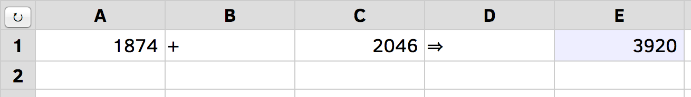
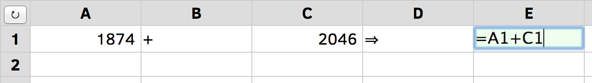
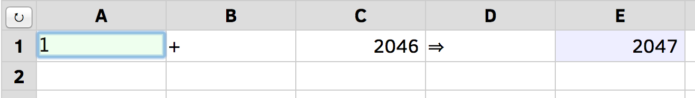
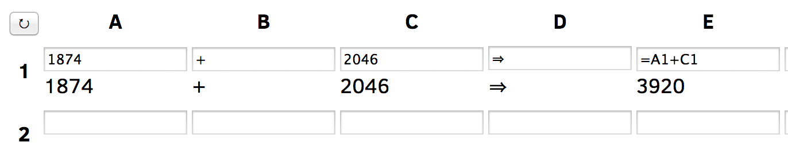
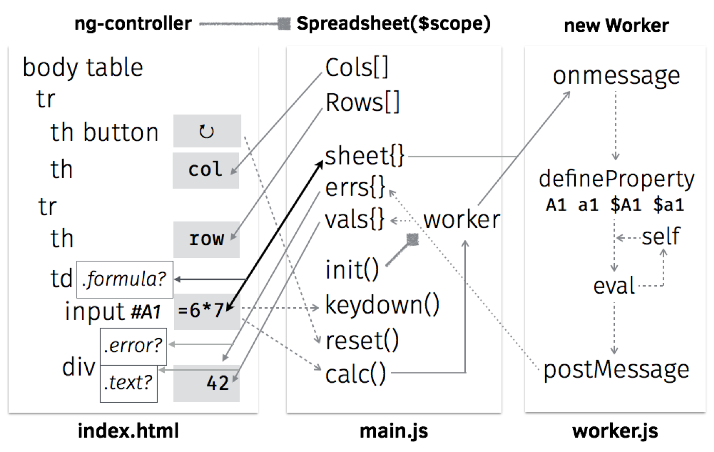

# [Web Spreadsheet](http://audreyt.github.io/500lines/spreadsheet/) in [99 lines](https://github.com/audreyt/500lines/tree/master/spreadsheet)

This chapter introduces a Web spreadsheet written in 99 lines of the three languages natively supported by Web browsers: HTML, JS, and CSS.

## Introduction

When Tim Berners-Lee invented the Web in 1990, _Web pages_ were written in HTML by marking up text with angle-bracketed _tags_, assigning a logical structure to the content. Text marked up within `<a>…</a>` became _hyperlinks_ that would refer the user to other pages on the Web.

In the 1990s, browsers added various presentational tags to the HTML vocabulary, including some notoriously nonstandard tags such as `<blink>…</blink>` from Netscape Navigator and `<marquee>…</marquee>` from Internet Explorer, causing widespread problems in usability and browser compatibility.

In order to keep HTML to its original purpose—describing a document’s logical structure—browser makers eventually agreed to support two additional languages: CSS to describe presentational styles of a page, and JS to describe its dynamic interactions.

Since then, the three languages have become more concise and powerful through twenty years of co-evolution. Today, cross-platform _Web applications_ (such as Web Spreadsheets) are as ubiquitous and popular as platform-specific applications (such as VisiCalc, Lotus 1-2-3 and Excel) from the previous century.

How many features can a Web application offer in 99 lines? Let’s see it in action!

## Overview

The [spreadsheet](https://github.com/audreyt/500lines/tree/master/spreadsheet) directory contains our showcase for late-2014 editions of the three web languages: [HTML5](http://www.w3.org/TR/html5/) for structure, [CSS3](http://www.w3.org/TR/css3-ui/) for presentation, and the JS [ES6 “Harmony”](http://wiki.ecmascript.org/doku.php?id=harmony:specification_drafts) standard for interaction. It also uses [Web Storage](http://www.whatwg.org/specs/web-apps/current-work/multipage/webstorage.html) for data persistence and [Web Worker](http://www.whatwg.org/specs/web-apps/current-work/multipage/workers.html) for running JS code in the background. As of this writing, these web standards are supported by Firefox, Chrome, and Internet Explorer 11+, as well as mobile browsers on iOS 5+ and Android 4+.

Now let’s open http://audreyt.github.io/500lines/spreadsheet/ in a browser:



### Basic Concepts

The spreadsheet spans two dimensions, with _columns_ starting from **A**, and _rows_ starting from **1**. Each _cell_ has a unique _coordinate_ (such as **A1**) and _content_ (`1874`), which belongs to one of four _types_:

* Text: `+` in **B1** and `⇒` in **D1**, aligned to the left.
* Number: `1874` in **A1** and `2046` in **C1**, aligned to the right.
* Formula:  `=A1+C1` in **E1**, which _calculates_ to the _value_ `3920`, displayed with a light blue background.
* Empty: All cells in row **2** are currently empty.

Click `3920` to set _focus_ on **E1**, revealing its formula in an _input box_:



Now let’s set focus on **A1** and _change_ its content to `1`, causing **E1** to _recalculate_ its value to `2047`:



Press **ENTER** to set focus to **A2** and change its content to `=Date()`, then press **TAB**, change the content of **B2** to `=alert()`, then press **TAB** again to set focus to `C2`:


This shows that a formula may calculate to a number (`2047` in **E1**), a text (the current time in **A2**, aligned to the left), or an _error_ (red letters in **B2**, aligned to the center).

Next, let’s try entering `=for(;;){}`, the JS code for an infinite loop that never terminates. The spreadsheet will prevent this by automatically _restoring_ the content of **C2** after an attempted change.

Now reload the page in the browser with **Ctrl-R** or **Cmd-R** to verify that the spreadsheet content is _persistent_, staying the same across browser sessions. To _reset_ the spreadsheet to its original contents, press the `↻` button on the top-left corner.

### Progressive Enhancement

Before we dive into the 99 lines of code, it’s worthwhile to disable JS in the browser, reload the page, and note the differences:

* Instead of a large grid, only a 2x2 table remains onscreen, with a single content cell.
* Row and column labels are replaced by `{{ row }}` and `{{ col }}`.
* Pressing the `↻` button produces no effect.
* Pressing **TAB** or clicking into the first line of content still reveals an editable input box.


When we disable the dynamic interactions (JS), the content structure (HTML) and the presentational styles (CSS) remain in effect. If a website is useful with both JS and CSS disabled, we say it adheres to the _progressive enhancement_ principle, making its content accessible to the largest audience possible.

Because our spreadsheet is a web application with no server-side code, we must rely on JS to provide the required logic. However, it does work correctly when CSS is not fully supported, such as with screen readers and text-mode browsers:



As shown in the screenshot above, if we enable JS in the browser and disable CSS instead, the effects are:

* All background and foreground colors are gone.
* The input box and the cell value are both displayed, instead of just one at a time.
* Otherwise, the application still works the same as the full version.

## Code Walkthrough

The diagram below shows the links between HTML and JS components:



In order to make sense of the diagram, let’s go through the four source code files, in the same sequence as the browser loads them:

* **index.html**: 20 lines
* **main.js**: 36 lines (excluding comments and blank lines)
* **worker.js**: 32 lines (excluding comments and blank lines)
* **styles.css**: 11 lines

### HTML

The first line in `index.html` declares that it’s written in HTML5 (`<!DOCTYPE html>`) with the UTF-8 encoding:

```html
<!DOCTYPE html><html><head><meta charset="UTF-8">
```

Without the `charset` declaration, the browser may display the reset button’s Unicode symbol `↻` as `↻`, an example of _mojibake_ — garbled text caused by decoding issues.

The next four lines are JS declarations, placed within the `head` section as usual:

```html
  <script src="main.js"></script>
  <script>if (!self.Spreadsheet) { location.href = "es5/index.html" }</script>
  <script src="worker.js"></script>
  <script src="lib/angular.js"></script>
```

The `<script src="…">` tags load JS resources from the same path as the HTML page. For example,  if the current URL is `http://audreyt.github.io/500lines/spreadsheet/index.html`, then `lib/angular.js` refers to `http://audreyt.github.io/500lines/spreadsheet/lib/angular.js`.

The `if (!self.Spreadsheet)` line tests if `main.js` is loaded correctly; if not, it tells the browser to navigate to `es5/index.html` instead. This _redirect-based graceful degradation_ technique ensures that for pre-2015 browsers with no ES6 support, we can use the translated-to-ES5 versions of JS programs as a fallback.

The next two lines load the CSS resource, close the `head` section, and begin the `body` section containing the user-visible part:

```html
  <link href="styles.css" rel="stylesheet">
</head><body ng-app ng-cloak ng-controller="Spreadsheet">
```

The `ng-` attributes above tell the AngularJS library to run the `Spreadsheet` JS function to create a _controller_ of this document, which provides a _model_— a set of names available to _bindings_ on the document _view_. The `ng-cloak` attribute hides the document from display until the bindings are in place.

As a concrete example, when the user clicks the `<button>` defined in the next line, its `ng-click` attribute will trigger and call `reset()` and `calc()`, two named functions provided by the JS model:

```html
  <table><tr>
    <th><button type="button" ng-click="reset(); calc()">↻</button></th>
```

The next line uses `ng-repeat` to display the list of column labels on the top row:

```html
    <th ng-repeat="col in Cols">{{ col }}</th>
```

For example, if the JS model defines `Cols` as `["A","B","C"]`, then there will be three heading cells (`th`) labeled accordingly. The `{{ col }}` notation tells AngularJS to _interpolate_ the expression, filling the contents in each `th` with the current value of `col`.

Similarly, the next two lines go through values in `Rows` — `[1,2,3]` and so on — creating a row for each one and labeling the leftmost `th` cell with its number:

```html
  </tr><tr ng-repeat="row in Rows">
    <th>{{ row }}</th>
```

Because the `<tr ng-repeat>` tag is not yet closed by `</tr>` , the `row` variable is still available for expressions. The next line creates a data cell (`td`) in the current row and uses both `col` and `row` variables in its `ng-class` attribute:

```html
    <td ng-repeat="col in Cols" ng-class="{ formula: ('=' === sheet[col+row][0]) }">
```

A few things are going on here. In HTML, the `class` attribute describes a _set of class names_ that  allow CSS to style them differently. The `ng-class` here evaluates the expression `('=' === sheet[col+row][0])`; if it is true, then the `<td>` gets  `formula` as an additional class, which gives the cell a light-blue background as defined in line 8 of **styles.css** with the `.formula` _class selector_.

The expression above checks if the current cell is a formula by testing if `=` is the initial character (`[0]`) of the string in `sheet[col+row]`, where `sheet` is a JS model object with coordinates (such as `"E1"`) as properties, and cell contents (such as `"=A1+C1"`) as values. Note that because `col` is a string and not a number, the `+` in `col+row` means concatenation instead of addition.

Inside the `<td>`, we give the user an input box to edit the cell content stored in `sheet[col+row]`:

```html
       <input id="{{ col+row }}" ng-model="sheet[col+row]" ng-change="calc()"
        ng-model-options="{ debounce: 200 }" ng-keydown="keydown( $event, col, row )">
```

Here, the key attribute is `ng-model`, which enables a _two-way binding_ between the JS model and the input box’s editable content. In practice, this means that whenever the user makes a change in the input box, the JS model will update `sheet[col+row]` to match the content, and trigger its `calc()` function to recalculate values of all formula cells.

To avoid repeated calls to `calc()` when the user presses and holds a key, `ng-model-options` limits the update rate to once every 200 milliseconds.

The `id` attribute here is interpolated with the coordinate `col+row`. The `id` attribute of a HTML element must be different from the `id` of all other elements in the same document. This ensures that the `#A1` _ID selector_ refers to a single element, instead of a set of elements like the class selector `.formula`.  When the user presses the **UP**/**DOWN**/**ENTER** keys, the keyboard-navigation logic in `keydown()` will use ID selectors to determine which input box to focus on.

After the input box, we place a `<div>` to display the calculated value of the current cell, represented in the JS model by objects `errs` and `vals`:

```html
      <div ng-class="{ error: errs[col+row], text: vals[col+row][0] }">
        {{ errs[col+row] || vals[col+row] }}</div>
```

If an error occurs when computing a formula, the text interpolation uses the error message contained in `errs[col+row]`, and `ng-class` applies the `error` class to the element, allowing CSS to style it differently (with red letters, aligned to the center, etc.).

When there is no error, the `vals[col+row]` on the right side of `||` is interpolated instead. If it’s a non-empty string, the initial character (`[0]`) will evaluate to true, applying the `text` class to the element that left-aligns the text.

Because empty strings and numeric values have no initial character, `ng-class` will not assign them any classes, so CSS can style them with right alignment as the default case.

Finally, we close the `ng-repeat` loop in the column level with `</td>`, close the row-level loop with `</tr>`, and end the HTML document with:

```html
    </td>
  </tr></table>
</body></html>
```

### JS: Main Controller

The sole purpose of `main.js` is defining the `Spreadsheet` controller function as required by the `<body>` element, with the JS model `$scope` provided by AngularJS:

```js
function Spreadsheet ($scope, $timeout) {
```

The `$` in `$scope` is part of the variable name. Here we also request the [`$timeout`](https://docs.angularjs.org/api/ng/service/$timeout) service function from AngularJS; later on, we will use it to prevent infinite-looping formulas.

To put `Cols` and `Rows` into the model, simply define them as properties of `$scope`:

```js
  // Begin of $scope properties; start with the column/row labels
  $scope.Cols = [ for (col of range( 'A', 'H' )) col ];
  $scope.Rows = [ for (row of range( 1, 20 )) row ];
```

The ES6 [array comprehension](https://developer.mozilla.org/en-US/docs/Web/JavaScript/Reference/Operators/Array_comprehensions) syntax makes it easy to define arrays from ranges with a start and an end point, with the helper function `range` defined as a [generator](https://developer.mozilla.org/en-US/docs/Web/JavaScript/Reference/Statements/function*):


```js
  function* range(cur, end) { while (cur <= end) { yield cur;
```

The `function*` above means that `range` returns an [iterator](https://developer.mozilla.org/en-US/docs/Web/JavaScript/Guide/The_Iterator_protocol), with a `while` loop that would  [`yield`](https://developer.mozilla.org/en-US/docs/Web/JavaScript/Reference/Operators/yield) a single value at a time. Whenever the `for` loop demands the next value, it will resume execution right after the `yield` line:

```
    // If it’s a number, increase it by one; otherwise move to next letter
    cur = (isNaN( cur ) ? String.fromCodePoint( cur.codePointAt()+1 ) : cur+1);
  } }
```

To generate the next value, we use `isNaN` to see if `cur` is meant as a letter (`NaN` stands for “not a number.”) If so, we get the letter’s [code point value](https://developer.mozilla.org/en-US/docs/Web/JavaScript/Reference/Global_Objects/String/codePointAt), increment it by one, and [convert the codepoint](https://developer.mozilla.org/en-US/docs/Web/JavaScript/Reference/Global_Objects/String/fromCodePoint) back to get its next letter. Otherwise, we simply increase the number by one.

Next up, we define the `keydown()` function that handles keyboard navigation across rows:

```js
  // UP(38) and DOWN(40)/ENTER(13) move focus to the row above (-1) and below (+1).
  $scope.keydown = ({which}, col, row)=>{ switch (which) {
```

The [arrow function](https://developer.mozilla.org/en-US/docs/Web/JavaScript/Reference/arrow_functions) receives the arguments `($event, col, row)` from `<input ng-keydown>`, using [destructuring assignment](https://developer.mozilla.org/en-US/docs/Web/JavaScript/New_in_JavaScript/1.7#Pulling_fields_from_objects_passed_as_function_parameter) to assign `$event.which` into the `which` parameter, and checks if it’s among the three navigational key codes:

```js
    case 38: case 40: case 13: $timeout( ()=>{
```

If it is, we use `$timeout` to schedule an update to the focused cell after the current `ng-keydown` and `ng-change` handler. Because `$timeout` accepts a function as argument, the `()=>{…}` syntax constructs a function to represent the focus-update logic, which starts by checking the direction of movement:

```js
      const direction = (which === 38) ? -1 : +1;
```

The `const` declarator means `direction` will not change during the function’s execution. The direction to move is either upward (`-1`, from **A2** to **A1**) if the key code is **UP** (38), or downward (`+1`, from **A2** to **A3**) otherwise.

Next up, we retrieve the target element using the ID selector syntax (e.g. `"#A3"`), constructed with a [template string](https://developer.mozilla.org/en-US/docs/Web/JavaScript/Reference/template_strings) written in a pair of back-quotes, concatenating the leading `#`, the current `col` and the target `row + direction`:

```js
      const cell = document.querySelector( `#${ col }${ row + direction }` );
      if (cell) { cell.focus(); }
    } )
  } };
```

We put an extra check on the result of `querySelector` because moving upward from **A1** will produce the selector `#A0`, which has no corresponding element, and so will not trigger a focus change — the same goes for pressing **DOWN** at the bottom row.

Next, we define the `reset()` function so the `↻` button can restore the `sheet` its initial contents:

```js
  // Default sheet content, with some data cells and one formula cell.
  $scope.reset = ()=>{ $scope.sheet = { A1: 1874, B1: '+', C1: 2046, D1: '⇒', E1: '=A1+C1' } }
```

The `init()` function first tries restoring the `sheet` content from its previous state from the [localStorage](https://developer.mozilla.org/en-US/docs/Web/Guide/API/DOM/Storage#localStorage), or defaults to the initial content if it’s our first time running the application:

```js
  // Define the initializer, and immediately call it
  ($scope.init = ()=>{
    // Restore the previous .sheet; reset to default if it’s the first run
    $scope.sheet = angular.fromJson( localStorage.getItem( '' ) );
    if (!$scope.sheet) { $scope.reset(); }
    $scope.worker = new Worker( 'worker.js' );
  })();
```

A few things are worth nothing in the `init()` function above:

* We use the `($scope.init = ()=>{…})()` syntax to define the function and immediately call it.
* Because localStorage only stores strings, we _parse_ the `sheet` structure from its [JSON](https://developer.mozilla.org/en-US/docs/Glossary/JSON) representation using `angular.fromJson()`.
* At the last step of `init()`, we create a new [Web Worker](https://developer.mozilla.org/en-US/docs/Web/API/Worker) thread and assign it to the `worker` scope property. Although the worker is not directly used in the view, it’s customary to use `$scope` to share objects used across model functions, in this case between `init()` here and `calc()` below.

While `sheet` holds the user-editable cell content, `errs` and `vals` contain the results of calculations — errors and values — that are read-only to the user:

```js
  // Formula cells may produce errors in .errs; normal cell contents are in .vals
  [$scope.errs, $scope.vals] = [ {}, {} ];
```

With these properties in place, we can define the `calc()` function that triggers whenever the user makes a change to `sheet`:

```js
  // Define the calculation handler, and immediately call it
  ($scope.calc = ()=>{
    const json = angular.toJson( $scope.sheet );
```

Here we first snapshot the state of `sheet` into a JSON string, stored in the constant `json`.

Next up, we construct a `promise` from [$timeout](https://docs.angularjs.org/api/ng/service/$timeout) that cancels the upcoming computation if it takes more than 99 milliseconds:

```js
    const promise = $timeout( ()=>{
      // If the worker has not returned in 99 milliseconds, terminate it
      $scope.worker.terminate();
      // Back up to the previous state and make a new worker
      $scope.init();
      // Redo the calculation using the last-known state
      $scope.calc();
    }, 99 );
```

Since we made sure that  `calc()` is called at most once every 200 milliseconds via the `<input ng-model-options>` attribute in HTML, this arrangement leaves 101 milliseconds for `init()` to restore `sheet` to the last known-good state and make a new Worker.

The Worker’s task is to calculate `errs` and `vals` from the contents of`sheet`. Because **main.js** and **worker.js** communicate by message-passing, we need an `onmessage` handler to receive the results once they are ready:

```js
    // When the worker returns, apply its effect on the scope
    $scope.worker.onmessage = ({data})=>{
      $timeout.cancel( promise );
      localStorage.setItem( '', json );
      $timeout( ()=>{ [$scope.errs, $scope.vals] = data; } );
    }
```

If `onmessage` is called,  we know that the `sheet` snapshot in `json` is stable (i.e. containing no infinite-looping formulas), so we cancel the 99-millisecond timeout, write the snapshot to localStorage, and schedule an UI update with a `$timeout` function that updates `errs` and `vals` to the user-visible view.

With the handler in place, we can post the state of `sheet` to the worker, starting its calculation in the background:

```js
    // Post the current sheet content for the worker to process
    $scope.worker.postMessage( $scope.sheet );
  })();
}
```

### JS: Background Worker

There are three reasons for using a Web Worker to calculate formulas, instead of using the main JS thread for the task:

* While the worker runs in the background, the user is free to continue interacting with the spreadsheet, without getting blocked by computation in the main thread. 
* Because we accept any JS expression in a formula, the worker provides a _sandbox_ that prevents formulas from interfering with the page that contains them, such as by popping out an `alert()` dialog.
* A formula can refer to any coordinates as variables, which may contain yet another formula that possibly ends in a cyclic reference. To solve this problem, we use the Worker’s _global scope_ object `self`, and define these variables as _getter functions_ on `self` to implement the cycle-prevention logic.

With these in mind, let’s take a look at the worker’s code. Because **index.html** pre-loads the worker program with a `<script>` tag, in **worker.js** we first ensure that we’re actually running as a background task:

```js
if (self.importScripts) {
```

This check works because the browser defines `importScripts()` only in a Worker thread.

The Worker’s sole purpose is defining its `onmessage` handler that takes `sheet`, calculates `errs` and `vals`, and posts them back to the main JS thread. We begin by re-initializing the three variables when we receive a message:

```js
  let sheet, errs, vals;
  self.onmessage = ({data})=>{
    [sheet, errs, vals] = [ data, {}, {} ];
```

In order to turn coordinates into global variables, we first iterate over each property in `sheet`, using a `for…in` loop:

```js
    for (const coord in sheet) {
```

We  write `const coord` above so that functions defined in the loop can capture the specific value of `coord` in that iteration. This is because `const` and `let` declare _block scoped_ variables. In contrast, `var coord` would make a _function scoped_ variable, and functions defined in each loop iteration would end up pointing to the same `coord`.

Customarily, formulas variables are case-insensitive and can optionally have a `$` prefix. Because JS variables are case-sensitive, we use a `for…of` loop to go over the four variable names for the same coordinate:

```js
      // Four variable names pointing to the same coordinate: A1, a1, $A1, $a1
      for (const name of [ for (p of [ '', '$' ])
                             for (c of [ coord, coord.toLowerCase() ])
                               p+c ]) {
```

Note the _nested array comprehension_ syntax above, with  two `for`  expressions in the array definition.

For each variable name like `A1` and `$a1`, we define its [accessor property](https://developer.mozilla.org/en-US/docs/Web/JavaScript/Reference/Global_Objects/Object/defineProperty) on `self` that calculates `vals[A1]` whenever they are evaluated in an expression:

```js
        // Worker is reused across calculations, so only define each variable once
        if ((Object.getOwnPropertyDescriptor( self, name ) || {}).get) { continue; }

        // Define self['A1'], which is the same thing as the global variable A1
        Object.defineProperty( self, name, { get() {
```

The `{ get() { … } }` syntax above is shorthand for `{ get: ()=>{ … } }`. Because we define only `get` and not `set`, the variables become  _read-only_ and cannot be modified from user-supplied formulas.

The `get` accessor starts by checking if `vals[coord]` is already calculated, and simply returns it if it’s the same:

```js
          if (coord in vals) { return vals[coord]; }
```

If not, we need to calculate `vals[coord]` from `sheet[coord]`.

First we set it to `NaN`, so self-references like setting **A1*** to `=A1` will end up with `NaN` instead of an infinite loop:

```js
          vals[coord] = NaN;
```

Next we check if `sheet[coord]` is a number by converting it to numeric with prefix `+`, assigning the number to `x`, and comparing its string representation with the original string. If they differ, then we set `x` to the original string:

```js
          // Turn numeric strings into numbers, so =A1+C1 works when both are numbers
          let x = +sheet[coord];
          if (sheet[coord] !== x.toString()) { x = sheet[coord]; }
```

If the initial character of `x` is `=`, then it’s a formula cell. We evaluate the part after `=` with `eval.call()`, using the first argument `null` to tell `eval` to run in the _global scope_, hiding the _lexical scope_ variables like `x` and `sheet` from the evaluation:

```js
          // Evaluate formula cells that begin with =
          try { vals[coord] = (('=' === x[0]) ? eval.call( null, x.slice( 1 ) ) : x);
```

If the evaluation succeeds, the result is stored into `vals[coord]`. For non-formula cells, the value of `vals[coord]` is simply `x`, which may be a number or a string.

If `eval` results in an error, the `catch` block tests if it’s because the formula refers to an empty cell not yet defined in `self`:

```js
          } catch (e) {
            const match = /\$?[A-Za-z]+[1-9][0-9]*\b/.exec( e );
            if (match && !( match[0] in self )) {
```

In that case, we set the missing cell’s default value to `0`, clear `vals[coord]`, and re-run the current computation using `self[coord]`:

```js
              // The formula refers to a uninitialized cell; set it to 0 and retry
              self[match[0]] = 0;
              delete vals[coord];
              return self[coord];
            }
```

 If the user gives the missing cell a content later on in `sheet[coord]`, then `Object.defineProperty` would take over and override the temporary value.

Other kinds of errors are stored to `errs[coord]`:

```js
            // Otherwise, stringify the caught exception in the errs object
            errs[coord] = e.toString();
          }
```

In case of errors, the value of `vals[coord]` will remain `NaN` because the assignment did not complete.

Finally, the `get` accessor returns the calculated value, stored in `vals[coord]`:

```js
          return vals[coord];
        } } )
      }
    }
```

With accessors defined for all coordinates, the worker goes through the coordinates again, invoking each accessor by accessing `self[coord]`, then posts the resulting `errs` and `vals` back to the main JS thread:

```js
    // For each coordinate in the sheet, call the property getter defined above
    for (const coord in sheet) { self[coord]; }
    return [ errs, vals ];
  }
}
```

### CSS

The **styles.css** file contains just a few selectors and their presentational styles. First, we style the table to merge all cell borders together, leaving no spaces between neighboring cells:

```css
table { border-collapse: collapse; }
```

Both the heading and data cells share the same border style, but we can tell them apart by their background colors: Heading cells are light-gray, data cells are white by default, and formula cells get a light-blue background:

```
th, td { border: 1px solid #ccc; }
th { background: #ddd; }
td.formula { background: #eef; }
```

The displayed width is fixed for each cell’s calculated values. Empty cells receive a minimal height, and long lines are clipped with a trailing ellipsis:

```css
td div { text-align: right; width: 120px; min-height: 1.2em;
         overflow: hidden; text-overflow: ellipsis; }
```

The text alignment and decorations are determined by each value’s type, as reflected by the `text` and `error` class selectors:

```css
div.text { text-align: left; }
div.error { text-align: center; color: #800; font-size: 90%; border: solid 1px #800 }
```

As for the user-editable `input` box, we use _absolute positioning_ to overlay it on top of its cell, and make it transparent so the underlying `div` with the cell’s value shows through:

```css
input { position: absolute; border: 0; padding: 0;
        width: 120px; height: 1.3em; font-size: 100%;
        color: transparent; background: transparent; }
```

When the user sets focus on the input box, it springs into the foreground:

```css
input:focus { color: #111; background: #efe; }
```

Furthermore, the underlying `div` is collapsed into a single line, so it’s completely covered by the input box:

```css
input:focus + div { white-space: nowrap; }
```

## Conclusion

Since this book is _500 lines or less_, a web spreadsheet in 99 lines is just a minimal example — please feel free to experiment and extend it in any direction you’d like.

Here are some ideas, all easily reachable in the remaining space of 401 lines:

* A collaborative online editor using [ShareJS](http://sharejs.org/), [AngularFire](http://angularfire.com) or [GoAngular](http://goangular.org/).
* Markdown syntax support for text cells, using [angular-marked](http://ngmodules.org/modules/angular-marked).
* Common formula functions (`SUM`, `TRIM`, etc.) from the [OpenFormula standard](https://en.wikipedia.org/wiki/OpenFormula).
* Interoperate with popular spreadsheet formats, such as CSV and SpreadsheetML via [SheetJS](http://sheetjs.com/)
* Import from and export to online spreadsheet services, such as Google Spreadsheet and [EtherCalc](http://ethercalc.net/).

### A Note on JS versions

This chapter aims to demonstrate new concepts in ES6, so we use the [Traceur compiler](https://github.com/google/traceur-compiler) to translate source code to ES5 to run on pre-2015 browsers.

If you prefer to work directly with the 2010 edition of JS, the [as-javascript-1.8.5](https://audreyt.github.io/500lines/spreadsheet/as-javascript-1.8.5/) directory has **main.js** and **worker.js** written in the style of ES5; the [source code](https://github.com/audreyt/500lines/tree/master/spreadsheet/as-javascript-1.8.5) is line-by-line comparable to the ES6 version with the same line count.

For people preferring a cleaner syntax, the [as-livescript-1.2.0](https://audreyt.github.io/500lines/spreadsheet/as-livescript-1.2.0/) directory uses [LiveScript](http://livescript.net/) instead of ES6 to write **main.ls** and **worker.ls**; the [source code](https://github.com/audreyt/500lines/tree/master/spreadsheet/as-livescript-1.2.0) is 20 lines shorter than the JS version.

If you are interested in translating this example to alternate JS languages, send a [pull request](https://github.com/audreyt/500lines/pulls) — I’d love to hear about it!
